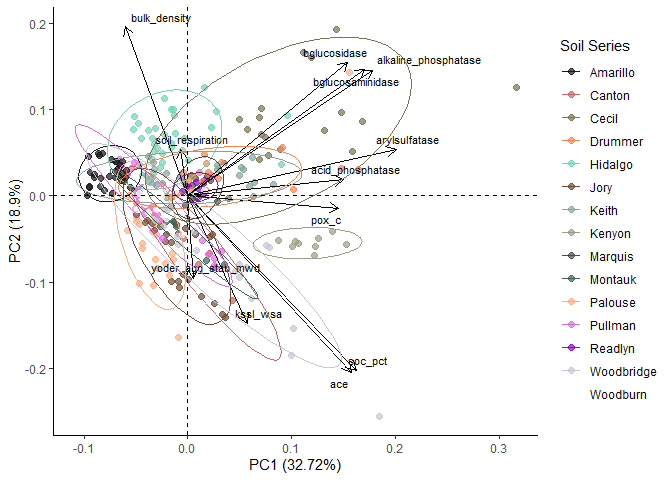
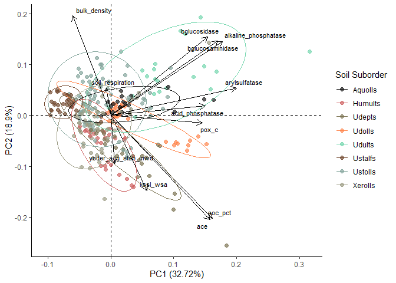
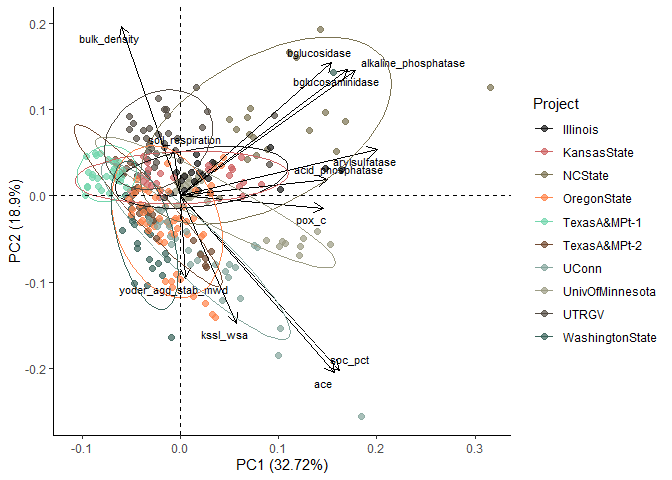
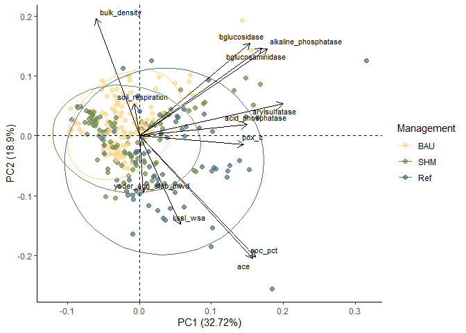
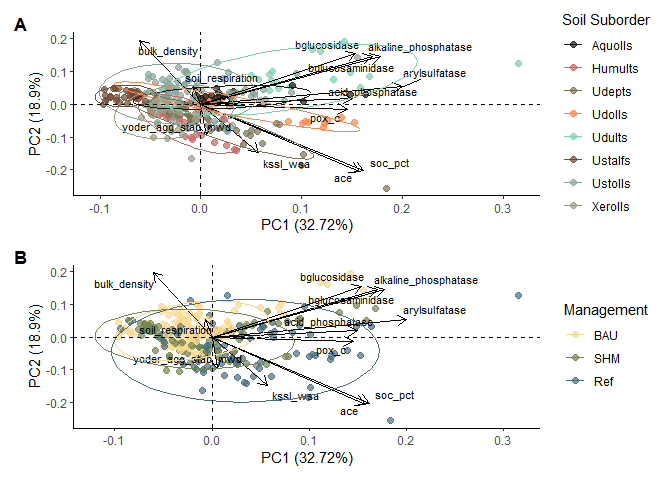
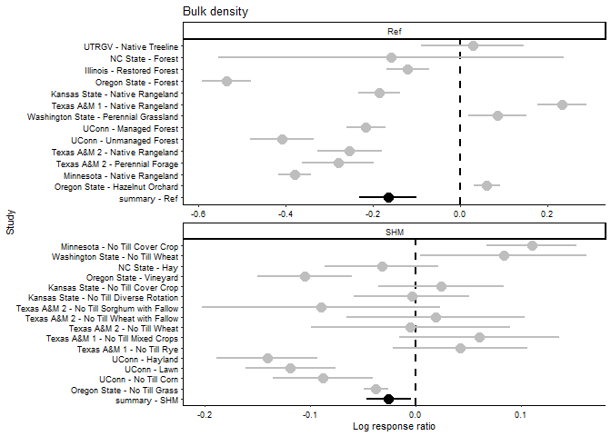
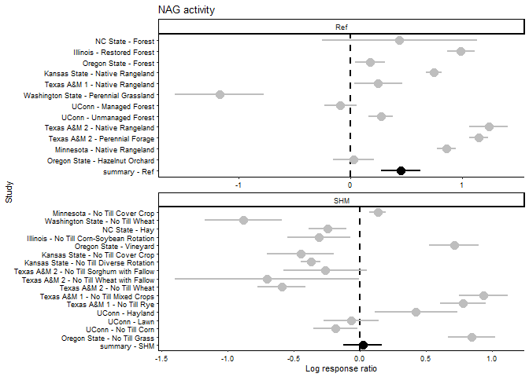
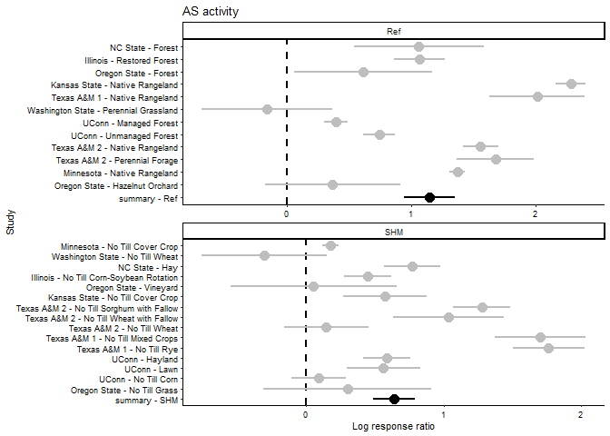
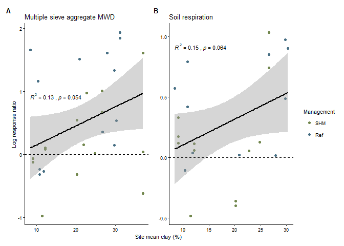
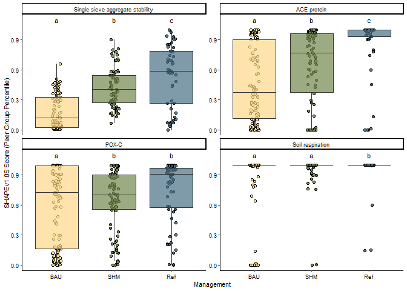

# Project Background Information

## Maps and tables about DSP4SH projects


``` r
# Make dataframe for adding project data annotation to map, with just one point for each project label combination, text label describing project

# Get unique soil series
project_soil <- project %>%
  distinct(project, soil) %>%
  group_by(project) %>%
  mutate(count = paste("soil",seq(n()), sep="_")) %>%
  pivot_wider(names_from=count, values_from=soil) %>%
  unite("soils", soil_1:soil_3, sep=", ", na.rm=TRUE)

# Make annotation dataframe that includes project, soil, and xy coords
project_annotate <- project %>% 
  group_by(project, label) %>%
  mutate(avg_lat = mean(pedon_y, na.rm=TRUE),
         avg_long = mean(pedon_x, na.rm=TRUE)) %>%
  distinct(project, label, avg_lat, avg_long) %>%
  left_join(project_soil, by="project")

# Make a dataframe with only one point per project to make the map labels
project_labs <- project_annotate %>%
  group_by(project) %>%
  filter(label=="BAU") %>%
  mutate(name_long = case_when(project=="Illinois" ~ "University of Illinois",
                               project=="OregonState" ~ "Oregon State University",
                               project=="UConn" ~ "University of Connecticut",
                               project=="UTRGV" ~ "University of Texas - Rio Grande Valley",
                               project=="KansasState" ~ "Kansas State University",
                               project=="NCState" ~ "North Carolina State University",
                               project=="TexasA&MPt-1" ~ "Texas A&M - 1",
                               project=="TexasA&MPt-2" ~ "Texas A&M - 2",
                               project=="UnivOfMinnesota" ~ "University of Minnesota", 
                               project=="WashingtonState" ~ "Washington State University")
         )
```

Make map:


``` r
# Download map of USA from maps() and convert to sf
usa <- st_as_sf(maps::map("state", plot = FALSE, fill = TRUE))

# Make map
ggplot(data=usa) +
  geom_sf(fill=NA) +
  coord_sf(xlim=c(-125.0, -66.93457), ylim=c(23.5, 49.384358)) + # set bounding box around CONUS
  annotation_north_arrow(location="bl", which_north="true", height=unit(.25, "in"), width=unit(.25, "in"),
                         pad_x = unit(0.4, "in"), pad_y = unit(0.25, "in"), style=north_arrow_fancy_orienteering) + # add north arrow
  annotation_scale(location = "bl") +
  geom_point(data=project_annotate, aes(x=avg_long, y=avg_lat, color=project)) +
  geom_label_repel(data=project_labs, aes(x=avg_long, y=avg_lat, label=name_long),
                   min.segment.length = 0, seed = 42, box.padding = 0.5) +
  scale_color_paletteer_d("rcartocolor::Safe") +
  theme_classic() +
  easy_remove_axes() +
  theme(legend.position="none")
```

```
## Scale on map varies by more than 10%, scale bar may be inaccurate
```

<!-- -->

``` r
# ggsave(here("figs", "ms_revision_figs", "fig1_project_map.png"),  width=8, height=5, units="in", dpi=500)
```

Generate overview table of project information:


``` r
# Average climate data - to be added in to project overview table
site_clim_sum <- project %>%
  group_by(project) %>%
  summarize(across(mat:map, ~ mean(.x, na.rm = TRUE))) %>%
  mutate(mat = round(mat, 1),
         map = round(map, 0))

project_table <- project_annotate %>%
  group_by(project) %>%
  dplyr::select(project, soils, label) %>%
  ungroup() %>%
  left_join(site_clim_sum, by="project") %>%
  relocate(label, .after=map) %>%
  arrange(factor(project, levels=project_plotting_order), label)
flextable(project_table)
```

```{=html}
<div class="tabwid"><style>.cl-89309272{}.cl-8925bfd2{font-family:'Arial';font-size:11pt;font-weight:normal;font-style:normal;text-decoration:none;color:rgba(0, 0, 0, 1.00);background-color:transparent;}.cl-892a407a{margin:0;text-align:left;border-bottom: 0 solid rgba(0, 0, 0, 1.00);border-top: 0 solid rgba(0, 0, 0, 1.00);border-left: 0 solid rgba(0, 0, 0, 1.00);border-right: 0 solid rgba(0, 0, 0, 1.00);padding-bottom:5pt;padding-top:5pt;padding-left:5pt;padding-right:5pt;line-height: 1;background-color:transparent;}.cl-892a408e{margin:0;text-align:right;border-bottom: 0 solid rgba(0, 0, 0, 1.00);border-top: 0 solid rgba(0, 0, 0, 1.00);border-left: 0 solid rgba(0, 0, 0, 1.00);border-right: 0 solid rgba(0, 0, 0, 1.00);padding-bottom:5pt;padding-top:5pt;padding-left:5pt;padding-right:5pt;line-height: 1;background-color:transparent;}.cl-892a5fba{width:0.75in;background-color:transparent;vertical-align: middle;border-bottom: 1.5pt solid rgba(102, 102, 102, 1.00);border-top: 1.5pt solid rgba(102, 102, 102, 1.00);border-left: 0 solid rgba(0, 0, 0, 1.00);border-right: 0 solid rgba(0, 0, 0, 1.00);margin-bottom:0;margin-top:0;margin-left:0;margin-right:0;}.cl-892a5fc4{width:0.75in;background-color:transparent;vertical-align: middle;border-bottom: 1.5pt solid rgba(102, 102, 102, 1.00);border-top: 1.5pt solid rgba(102, 102, 102, 1.00);border-left: 0 solid rgba(0, 0, 0, 1.00);border-right: 0 solid rgba(0, 0, 0, 1.00);margin-bottom:0;margin-top:0;margin-left:0;margin-right:0;}.cl-892a5fc5{width:0.75in;background-color:transparent;vertical-align: middle;border-bottom: 0 solid rgba(0, 0, 0, 1.00);border-top: 0 solid rgba(0, 0, 0, 1.00);border-left: 0 solid rgba(0, 0, 0, 1.00);border-right: 0 solid rgba(0, 0, 0, 1.00);margin-bottom:0;margin-top:0;margin-left:0;margin-right:0;}.cl-892a5fce{width:0.75in;background-color:transparent;vertical-align: middle;border-bottom: 0 solid rgba(0, 0, 0, 1.00);border-top: 0 solid rgba(0, 0, 0, 1.00);border-left: 0 solid rgba(0, 0, 0, 1.00);border-right: 0 solid rgba(0, 0, 0, 1.00);margin-bottom:0;margin-top:0;margin-left:0;margin-right:0;}.cl-892a5fcf{width:0.75in;background-color:transparent;vertical-align: middle;border-bottom: 1.5pt solid rgba(102, 102, 102, 1.00);border-top: 0 solid rgba(0, 0, 0, 1.00);border-left: 0 solid rgba(0, 0, 0, 1.00);border-right: 0 solid rgba(0, 0, 0, 1.00);margin-bottom:0;margin-top:0;margin-left:0;margin-right:0;}.cl-892a5fd8{width:0.75in;background-color:transparent;vertical-align: middle;border-bottom: 1.5pt solid rgba(102, 102, 102, 1.00);border-top: 0 solid rgba(0, 0, 0, 1.00);border-left: 0 solid rgba(0, 0, 0, 1.00);border-right: 0 solid rgba(0, 0, 0, 1.00);margin-bottom:0;margin-top:0;margin-left:0;margin-right:0;}</style><table data-quarto-disable-processing='true' class='cl-89309272'><thead><tr style="overflow-wrap:break-word;"><th class="cl-892a5fba"><p class="cl-892a407a"><span class="cl-8925bfd2">project</span></p></th><th class="cl-892a5fba"><p class="cl-892a407a"><span class="cl-8925bfd2">soils</span></p></th><th class="cl-892a5fc4"><p class="cl-892a408e"><span class="cl-8925bfd2">mat</span></p></th><th class="cl-892a5fc4"><p class="cl-892a408e"><span class="cl-8925bfd2">map</span></p></th><th class="cl-892a5fba"><p class="cl-892a407a"><span class="cl-8925bfd2">label</span></p></th></tr></thead><tbody><tr style="overflow-wrap:break-word;"><td class="cl-892a5fc5"><p class="cl-892a407a"><span class="cl-8925bfd2">UConn</span></p></td><td class="cl-892a5fc5"><p class="cl-892a407a"><span class="cl-8925bfd2">Woodbridge, Canton, Montauk</span></p></td><td class="cl-892a5fce"><p class="cl-892a408e"><span class="cl-8925bfd2">9.5</span></p></td><td class="cl-892a5fce"><p class="cl-892a408e"><span class="cl-8925bfd2">1,252</span></p></td><td class="cl-892a5fc5"><p class="cl-892a407a"><span class="cl-8925bfd2">BAU</span></p></td></tr><tr style="overflow-wrap:break-word;"><td class="cl-892a5fc5"><p class="cl-892a407a"><span class="cl-8925bfd2">UConn</span></p></td><td class="cl-892a5fc5"><p class="cl-892a407a"><span class="cl-8925bfd2">Woodbridge, Canton, Montauk</span></p></td><td class="cl-892a5fce"><p class="cl-892a408e"><span class="cl-8925bfd2">9.5</span></p></td><td class="cl-892a5fce"><p class="cl-892a408e"><span class="cl-8925bfd2">1,252</span></p></td><td class="cl-892a5fc5"><p class="cl-892a407a"><span class="cl-8925bfd2">Ref</span></p></td></tr><tr style="overflow-wrap:break-word;"><td class="cl-892a5fc5"><p class="cl-892a407a"><span class="cl-8925bfd2">UConn</span></p></td><td class="cl-892a5fc5"><p class="cl-892a407a"><span class="cl-8925bfd2">Woodbridge, Canton, Montauk</span></p></td><td class="cl-892a5fce"><p class="cl-892a408e"><span class="cl-8925bfd2">9.5</span></p></td><td class="cl-892a5fce"><p class="cl-892a408e"><span class="cl-8925bfd2">1,252</span></p></td><td class="cl-892a5fc5"><p class="cl-892a407a"><span class="cl-8925bfd2">SHM</span></p></td></tr><tr style="overflow-wrap:break-word;"><td class="cl-892a5fc5"><p class="cl-892a407a"><span class="cl-8925bfd2">Illinois</span></p></td><td class="cl-892a5fc5"><p class="cl-892a407a"><span class="cl-8925bfd2">Drummer</span></p></td><td class="cl-892a5fce"><p class="cl-892a408e"><span class="cl-8925bfd2">11.4</span></p></td><td class="cl-892a5fce"><p class="cl-892a408e"><span class="cl-8925bfd2">999</span></p></td><td class="cl-892a5fc5"><p class="cl-892a407a"><span class="cl-8925bfd2">BAU</span></p></td></tr><tr style="overflow-wrap:break-word;"><td class="cl-892a5fc5"><p class="cl-892a407a"><span class="cl-8925bfd2">Illinois</span></p></td><td class="cl-892a5fc5"><p class="cl-892a407a"><span class="cl-8925bfd2">Drummer</span></p></td><td class="cl-892a5fce"><p class="cl-892a408e"><span class="cl-8925bfd2">11.4</span></p></td><td class="cl-892a5fce"><p class="cl-892a408e"><span class="cl-8925bfd2">999</span></p></td><td class="cl-892a5fc5"><p class="cl-892a407a"><span class="cl-8925bfd2">Ref</span></p></td></tr><tr style="overflow-wrap:break-word;"><td class="cl-892a5fc5"><p class="cl-892a407a"><span class="cl-8925bfd2">Illinois</span></p></td><td class="cl-892a5fc5"><p class="cl-892a407a"><span class="cl-8925bfd2">Drummer</span></p></td><td class="cl-892a5fce"><p class="cl-892a408e"><span class="cl-8925bfd2">11.4</span></p></td><td class="cl-892a5fce"><p class="cl-892a408e"><span class="cl-8925bfd2">999</span></p></td><td class="cl-892a5fc5"><p class="cl-892a407a"><span class="cl-8925bfd2">SHM</span></p></td></tr><tr style="overflow-wrap:break-word;"><td class="cl-892a5fc5"><p class="cl-892a407a"><span class="cl-8925bfd2">KansasState</span></p></td><td class="cl-892a5fc5"><p class="cl-892a407a"><span class="cl-8925bfd2">Keith</span></p></td><td class="cl-892a5fce"><p class="cl-892a408e"><span class="cl-8925bfd2">11.1</span></p></td><td class="cl-892a5fce"><p class="cl-892a408e"><span class="cl-8925bfd2">537</span></p></td><td class="cl-892a5fc5"><p class="cl-892a407a"><span class="cl-8925bfd2">BAU</span></p></td></tr><tr style="overflow-wrap:break-word;"><td class="cl-892a5fc5"><p class="cl-892a407a"><span class="cl-8925bfd2">KansasState</span></p></td><td class="cl-892a5fc5"><p class="cl-892a407a"><span class="cl-8925bfd2">Keith</span></p></td><td class="cl-892a5fce"><p class="cl-892a408e"><span class="cl-8925bfd2">11.1</span></p></td><td class="cl-892a5fce"><p class="cl-892a408e"><span class="cl-8925bfd2">537</span></p></td><td class="cl-892a5fc5"><p class="cl-892a407a"><span class="cl-8925bfd2">Ref</span></p></td></tr><tr style="overflow-wrap:break-word;"><td class="cl-892a5fc5"><p class="cl-892a407a"><span class="cl-8925bfd2">KansasState</span></p></td><td class="cl-892a5fc5"><p class="cl-892a407a"><span class="cl-8925bfd2">Keith</span></p></td><td class="cl-892a5fce"><p class="cl-892a408e"><span class="cl-8925bfd2">11.1</span></p></td><td class="cl-892a5fce"><p class="cl-892a408e"><span class="cl-8925bfd2">537</span></p></td><td class="cl-892a5fc5"><p class="cl-892a407a"><span class="cl-8925bfd2">SHM</span></p></td></tr><tr style="overflow-wrap:break-word;"><td class="cl-892a5fc5"><p class="cl-892a407a"><span class="cl-8925bfd2">UnivOfMinnesota</span></p></td><td class="cl-892a5fc5"><p class="cl-892a407a"><span class="cl-8925bfd2">Readlyn, Marquis, Kenyon</span></p></td><td class="cl-892a5fce"><p class="cl-892a408e"><span class="cl-8925bfd2">6.9</span></p></td><td class="cl-892a5fce"><p class="cl-892a408e"><span class="cl-8925bfd2">909</span></p></td><td class="cl-892a5fc5"><p class="cl-892a407a"><span class="cl-8925bfd2">BAU</span></p></td></tr><tr style="overflow-wrap:break-word;"><td class="cl-892a5fc5"><p class="cl-892a407a"><span class="cl-8925bfd2">UnivOfMinnesota</span></p></td><td class="cl-892a5fc5"><p class="cl-892a407a"><span class="cl-8925bfd2">Readlyn, Marquis, Kenyon</span></p></td><td class="cl-892a5fce"><p class="cl-892a408e"><span class="cl-8925bfd2">6.9</span></p></td><td class="cl-892a5fce"><p class="cl-892a408e"><span class="cl-8925bfd2">909</span></p></td><td class="cl-892a5fc5"><p class="cl-892a407a"><span class="cl-8925bfd2">Ref</span></p></td></tr><tr style="overflow-wrap:break-word;"><td class="cl-892a5fc5"><p class="cl-892a407a"><span class="cl-8925bfd2">UnivOfMinnesota</span></p></td><td class="cl-892a5fc5"><p class="cl-892a407a"><span class="cl-8925bfd2">Readlyn, Marquis, Kenyon</span></p></td><td class="cl-892a5fce"><p class="cl-892a408e"><span class="cl-8925bfd2">6.9</span></p></td><td class="cl-892a5fce"><p class="cl-892a408e"><span class="cl-8925bfd2">909</span></p></td><td class="cl-892a5fc5"><p class="cl-892a407a"><span class="cl-8925bfd2">SHM</span></p></td></tr><tr style="overflow-wrap:break-word;"><td class="cl-892a5fc5"><p class="cl-892a407a"><span class="cl-8925bfd2">NCState</span></p></td><td class="cl-892a5fc5"><p class="cl-892a407a"><span class="cl-8925bfd2">Cecil</span></p></td><td class="cl-892a5fce"><p class="cl-892a408e"><span class="cl-8925bfd2">15.7</span></p></td><td class="cl-892a5fce"><p class="cl-892a408e"><span class="cl-8925bfd2">1,223</span></p></td><td class="cl-892a5fc5"><p class="cl-892a407a"><span class="cl-8925bfd2">BAU</span></p></td></tr><tr style="overflow-wrap:break-word;"><td class="cl-892a5fc5"><p class="cl-892a407a"><span class="cl-8925bfd2">NCState</span></p></td><td class="cl-892a5fc5"><p class="cl-892a407a"><span class="cl-8925bfd2">Cecil</span></p></td><td class="cl-892a5fce"><p class="cl-892a408e"><span class="cl-8925bfd2">15.7</span></p></td><td class="cl-892a5fce"><p class="cl-892a408e"><span class="cl-8925bfd2">1,223</span></p></td><td class="cl-892a5fc5"><p class="cl-892a407a"><span class="cl-8925bfd2">Ref</span></p></td></tr><tr style="overflow-wrap:break-word;"><td class="cl-892a5fc5"><p class="cl-892a407a"><span class="cl-8925bfd2">NCState</span></p></td><td class="cl-892a5fc5"><p class="cl-892a407a"><span class="cl-8925bfd2">Cecil</span></p></td><td class="cl-892a5fce"><p class="cl-892a408e"><span class="cl-8925bfd2">15.7</span></p></td><td class="cl-892a5fce"><p class="cl-892a408e"><span class="cl-8925bfd2">1,223</span></p></td><td class="cl-892a5fc5"><p class="cl-892a407a"><span class="cl-8925bfd2">SHM</span></p></td></tr><tr style="overflow-wrap:break-word;"><td class="cl-892a5fc5"><p class="cl-892a407a"><span class="cl-8925bfd2">OregonState</span></p></td><td class="cl-892a5fc5"><p class="cl-892a407a"><span class="cl-8925bfd2">Jory, Woodburn</span></p></td><td class="cl-892a5fce"><p class="cl-892a408e"><span class="cl-8925bfd2">11.5</span></p></td><td class="cl-892a5fce"><p class="cl-892a408e"><span class="cl-8925bfd2">1,198</span></p></td><td class="cl-892a5fc5"><p class="cl-892a407a"><span class="cl-8925bfd2">BAU</span></p></td></tr><tr style="overflow-wrap:break-word;"><td class="cl-892a5fc5"><p class="cl-892a407a"><span class="cl-8925bfd2">OregonState</span></p></td><td class="cl-892a5fc5"><p class="cl-892a407a"><span class="cl-8925bfd2">Jory, Woodburn</span></p></td><td class="cl-892a5fce"><p class="cl-892a408e"><span class="cl-8925bfd2">11.5</span></p></td><td class="cl-892a5fce"><p class="cl-892a408e"><span class="cl-8925bfd2">1,198</span></p></td><td class="cl-892a5fc5"><p class="cl-892a407a"><span class="cl-8925bfd2">Ref</span></p></td></tr><tr style="overflow-wrap:break-word;"><td class="cl-892a5fc5"><p class="cl-892a407a"><span class="cl-8925bfd2">OregonState</span></p></td><td class="cl-892a5fc5"><p class="cl-892a407a"><span class="cl-8925bfd2">Jory, Woodburn</span></p></td><td class="cl-892a5fce"><p class="cl-892a408e"><span class="cl-8925bfd2">11.5</span></p></td><td class="cl-892a5fce"><p class="cl-892a408e"><span class="cl-8925bfd2">1,198</span></p></td><td class="cl-892a5fc5"><p class="cl-892a407a"><span class="cl-8925bfd2">SHM</span></p></td></tr><tr style="overflow-wrap:break-word;"><td class="cl-892a5fc5"><p class="cl-892a407a"><span class="cl-8925bfd2">TexasA&amp;MPt-1</span></p></td><td class="cl-892a5fc5"><p class="cl-892a407a"><span class="cl-8925bfd2">Amarillo</span></p></td><td class="cl-892a5fce"><p class="cl-892a408e"><span class="cl-8925bfd2">16.4</span></p></td><td class="cl-892a5fce"><p class="cl-892a408e"><span class="cl-8925bfd2">439</span></p></td><td class="cl-892a5fc5"><p class="cl-892a407a"><span class="cl-8925bfd2">BAU</span></p></td></tr><tr style="overflow-wrap:break-word;"><td class="cl-892a5fc5"><p class="cl-892a407a"><span class="cl-8925bfd2">TexasA&amp;MPt-1</span></p></td><td class="cl-892a5fc5"><p class="cl-892a407a"><span class="cl-8925bfd2">Amarillo</span></p></td><td class="cl-892a5fce"><p class="cl-892a408e"><span class="cl-8925bfd2">16.4</span></p></td><td class="cl-892a5fce"><p class="cl-892a408e"><span class="cl-8925bfd2">439</span></p></td><td class="cl-892a5fc5"><p class="cl-892a407a"><span class="cl-8925bfd2">Ref</span></p></td></tr><tr style="overflow-wrap:break-word;"><td class="cl-892a5fc5"><p class="cl-892a407a"><span class="cl-8925bfd2">TexasA&amp;MPt-1</span></p></td><td class="cl-892a5fc5"><p class="cl-892a407a"><span class="cl-8925bfd2">Amarillo</span></p></td><td class="cl-892a5fce"><p class="cl-892a408e"><span class="cl-8925bfd2">16.4</span></p></td><td class="cl-892a5fce"><p class="cl-892a408e"><span class="cl-8925bfd2">439</span></p></td><td class="cl-892a5fc5"><p class="cl-892a407a"><span class="cl-8925bfd2">SHM</span></p></td></tr><tr style="overflow-wrap:break-word;"><td class="cl-892a5fc5"><p class="cl-892a407a"><span class="cl-8925bfd2">TexasA&amp;MPt-2</span></p></td><td class="cl-892a5fc5"><p class="cl-892a407a"><span class="cl-8925bfd2">Pullman</span></p></td><td class="cl-892a5fce"><p class="cl-892a408e"><span class="cl-8925bfd2">13.7</span></p></td><td class="cl-892a5fce"><p class="cl-892a408e"><span class="cl-8925bfd2">469</span></p></td><td class="cl-892a5fc5"><p class="cl-892a407a"><span class="cl-8925bfd2">BAU</span></p></td></tr><tr style="overflow-wrap:break-word;"><td class="cl-892a5fc5"><p class="cl-892a407a"><span class="cl-8925bfd2">TexasA&amp;MPt-2</span></p></td><td class="cl-892a5fc5"><p class="cl-892a407a"><span class="cl-8925bfd2">Pullman</span></p></td><td class="cl-892a5fce"><p class="cl-892a408e"><span class="cl-8925bfd2">13.7</span></p></td><td class="cl-892a5fce"><p class="cl-892a408e"><span class="cl-8925bfd2">469</span></p></td><td class="cl-892a5fc5"><p class="cl-892a407a"><span class="cl-8925bfd2">Ref</span></p></td></tr><tr style="overflow-wrap:break-word;"><td class="cl-892a5fc5"><p class="cl-892a407a"><span class="cl-8925bfd2">TexasA&amp;MPt-2</span></p></td><td class="cl-892a5fc5"><p class="cl-892a407a"><span class="cl-8925bfd2">Pullman</span></p></td><td class="cl-892a5fce"><p class="cl-892a408e"><span class="cl-8925bfd2">13.7</span></p></td><td class="cl-892a5fce"><p class="cl-892a408e"><span class="cl-8925bfd2">469</span></p></td><td class="cl-892a5fc5"><p class="cl-892a407a"><span class="cl-8925bfd2">SHM</span></p></td></tr><tr style="overflow-wrap:break-word;"><td class="cl-892a5fc5"><p class="cl-892a407a"><span class="cl-8925bfd2">UTRGV</span></p></td><td class="cl-892a5fc5"><p class="cl-892a407a"><span class="cl-8925bfd2">Hidalgo</span></p></td><td class="cl-892a5fce"><p class="cl-892a408e"><span class="cl-8925bfd2">23.7</span></p></td><td class="cl-892a5fce"><p class="cl-892a408e"><span class="cl-8925bfd2">644</span></p></td><td class="cl-892a5fc5"><p class="cl-892a407a"><span class="cl-8925bfd2">BAU</span></p></td></tr><tr style="overflow-wrap:break-word;"><td class="cl-892a5fc5"><p class="cl-892a407a"><span class="cl-8925bfd2">UTRGV</span></p></td><td class="cl-892a5fc5"><p class="cl-892a407a"><span class="cl-8925bfd2">Hidalgo</span></p></td><td class="cl-892a5fce"><p class="cl-892a408e"><span class="cl-8925bfd2">23.7</span></p></td><td class="cl-892a5fce"><p class="cl-892a408e"><span class="cl-8925bfd2">644</span></p></td><td class="cl-892a5fc5"><p class="cl-892a407a"><span class="cl-8925bfd2">Ref</span></p></td></tr><tr style="overflow-wrap:break-word;"><td class="cl-892a5fc5"><p class="cl-892a407a"><span class="cl-8925bfd2">WashingtonState</span></p></td><td class="cl-892a5fc5"><p class="cl-892a407a"><span class="cl-8925bfd2">Palouse</span></p></td><td class="cl-892a5fce"><p class="cl-892a408e"><span class="cl-8925bfd2">9.0</span></p></td><td class="cl-892a5fce"><p class="cl-892a408e"><span class="cl-8925bfd2">527</span></p></td><td class="cl-892a5fc5"><p class="cl-892a407a"><span class="cl-8925bfd2">BAU</span></p></td></tr><tr style="overflow-wrap:break-word;"><td class="cl-892a5fc5"><p class="cl-892a407a"><span class="cl-8925bfd2">WashingtonState</span></p></td><td class="cl-892a5fc5"><p class="cl-892a407a"><span class="cl-8925bfd2">Palouse</span></p></td><td class="cl-892a5fce"><p class="cl-892a408e"><span class="cl-8925bfd2">9.0</span></p></td><td class="cl-892a5fce"><p class="cl-892a408e"><span class="cl-8925bfd2">527</span></p></td><td class="cl-892a5fc5"><p class="cl-892a407a"><span class="cl-8925bfd2">Ref</span></p></td></tr><tr style="overflow-wrap:break-word;"><td class="cl-892a5fcf"><p class="cl-892a407a"><span class="cl-8925bfd2">WashingtonState</span></p></td><td class="cl-892a5fcf"><p class="cl-892a407a"><span class="cl-8925bfd2">Palouse</span></p></td><td class="cl-892a5fd8"><p class="cl-892a408e"><span class="cl-8925bfd2">9.0</span></p></td><td class="cl-892a5fd8"><p class="cl-892a408e"><span class="cl-8925bfd2">527</span></p></td><td class="cl-892a5fcf"><p class="cl-892a407a"><span class="cl-8925bfd2">SHM</span></p></td></tr></tbody></table></div>
```

``` r
# write_csv(project_table, here("figs", "ms_revision_figs", "table1_project_table.csv"))
```

## Environmental data tables

Table of range in environmental conditions - this is not for a table but is referenced directly in the text:


``` r
site_range_table <- project %>%
  summarize(across(where(is.numeric), min_max)) %>%
  mutate(across(where(is.numeric), ~round(.x, 2))) %>%
  transmute(lat_range= paste(pedon_y_min, pedon_y_max, sep="-"),
         long_range = paste(pedon_x_min, pedon_x_max, sep="-"),
         mat_range = paste(mat_min, mat_max, sep="-"),
         map_range = paste(map_min, map_max, sep="-")) %>%
  pivot_longer(everything())
flextable(site_range_table)
```

```{=html}
<div class="tabwid"><style>.cl-894acdb8{}.cl-89413df2{font-family:'Arial';font-size:11pt;font-weight:normal;font-style:normal;text-decoration:none;color:rgba(0, 0, 0, 1.00);background-color:transparent;}.cl-89448f16{margin:0;text-align:left;border-bottom: 0 solid rgba(0, 0, 0, 1.00);border-top: 0 solid rgba(0, 0, 0, 1.00);border-left: 0 solid rgba(0, 0, 0, 1.00);border-right: 0 solid rgba(0, 0, 0, 1.00);padding-bottom:5pt;padding-top:5pt;padding-left:5pt;padding-right:5pt;line-height: 1;background-color:transparent;}.cl-8944b766{width:0.75in;background-color:transparent;vertical-align: middle;border-bottom: 1.5pt solid rgba(102, 102, 102, 1.00);border-top: 1.5pt solid rgba(102, 102, 102, 1.00);border-left: 0 solid rgba(0, 0, 0, 1.00);border-right: 0 solid rgba(0, 0, 0, 1.00);margin-bottom:0;margin-top:0;margin-left:0;margin-right:0;}.cl-8944b770{width:0.75in;background-color:transparent;vertical-align: middle;border-bottom: 0 solid rgba(0, 0, 0, 1.00);border-top: 0 solid rgba(0, 0, 0, 1.00);border-left: 0 solid rgba(0, 0, 0, 1.00);border-right: 0 solid rgba(0, 0, 0, 1.00);margin-bottom:0;margin-top:0;margin-left:0;margin-right:0;}.cl-8944b77a{width:0.75in;background-color:transparent;vertical-align: middle;border-bottom: 1.5pt solid rgba(102, 102, 102, 1.00);border-top: 0 solid rgba(0, 0, 0, 1.00);border-left: 0 solid rgba(0, 0, 0, 1.00);border-right: 0 solid rgba(0, 0, 0, 1.00);margin-bottom:0;margin-top:0;margin-left:0;margin-right:0;}</style><table data-quarto-disable-processing='true' class='cl-894acdb8'><thead><tr style="overflow-wrap:break-word;"><th class="cl-8944b766"><p class="cl-89448f16"><span class="cl-89413df2">name</span></p></th><th class="cl-8944b766"><p class="cl-89448f16"><span class="cl-89413df2">value</span></p></th></tr></thead><tbody><tr style="overflow-wrap:break-word;"><td class="cl-8944b770"><p class="cl-89448f16"><span class="cl-89413df2">lat_range</span></p></td><td class="cl-8944b770"><p class="cl-89448f16"><span class="cl-89413df2">26.31-46.79</span></p></td></tr><tr style="overflow-wrap:break-word;"><td class="cl-8944b770"><p class="cl-89448f16"><span class="cl-89413df2">long_range</span></p></td><td class="cl-8944b770"><p class="cl-89448f16"><span class="cl-89413df2">-123.42--71.97</span></p></td></tr><tr style="overflow-wrap:break-word;"><td class="cl-8944b770"><p class="cl-89448f16"><span class="cl-89413df2">mat_range</span></p></td><td class="cl-8944b770"><p class="cl-89448f16"><span class="cl-89413df2">6.84-23.89</span></p></td></tr><tr style="overflow-wrap:break-word;"><td class="cl-8944b77a"><p class="cl-89448f16"><span class="cl-89413df2">map_range</span></p></td><td class="cl-8944b77a"><p class="cl-89448f16"><span class="cl-89413df2">354.97-1476.5</span></p></td></tr></tbody></table></div>
```

Range in indicator values across all sites:


``` r
indicator_range_table <- surf_long %>%
  group_by(indicator) %>%
  summarize(across(where(is.numeric), min_max)) %>%
  mutate(across(where(is.numeric), ~round(.x, 2)))
flextable(indicator_range_table)
```

```{=html}
<div class="tabwid"><style>.cl-896ca744{}.cl-895bbb78{font-family:'Arial';font-size:11pt;font-weight:normal;font-style:normal;text-decoration:none;color:rgba(0, 0, 0, 1.00);background-color:transparent;}.cl-8966d616{margin:0;text-align:left;border-bottom: 0 solid rgba(0, 0, 0, 1.00);border-top: 0 solid rgba(0, 0, 0, 1.00);border-left: 0 solid rgba(0, 0, 0, 1.00);border-right: 0 solid rgba(0, 0, 0, 1.00);padding-bottom:5pt;padding-top:5pt;padding-left:5pt;padding-right:5pt;line-height: 1;background-color:transparent;}.cl-8966d620{margin:0;text-align:right;border-bottom: 0 solid rgba(0, 0, 0, 1.00);border-top: 0 solid rgba(0, 0, 0, 1.00);border-left: 0 solid rgba(0, 0, 0, 1.00);border-right: 0 solid rgba(0, 0, 0, 1.00);padding-bottom:5pt;padding-top:5pt;padding-left:5pt;padding-right:5pt;line-height: 1;background-color:transparent;}.cl-8966fac4{width:0.75in;background-color:transparent;vertical-align: middle;border-bottom: 1.5pt solid rgba(102, 102, 102, 1.00);border-top: 1.5pt solid rgba(102, 102, 102, 1.00);border-left: 0 solid rgba(0, 0, 0, 1.00);border-right: 0 solid rgba(0, 0, 0, 1.00);margin-bottom:0;margin-top:0;margin-left:0;margin-right:0;}.cl-8966face{width:0.75in;background-color:transparent;vertical-align: middle;border-bottom: 1.5pt solid rgba(102, 102, 102, 1.00);border-top: 1.5pt solid rgba(102, 102, 102, 1.00);border-left: 0 solid rgba(0, 0, 0, 1.00);border-right: 0 solid rgba(0, 0, 0, 1.00);margin-bottom:0;margin-top:0;margin-left:0;margin-right:0;}.cl-8966facf{width:0.75in;background-color:transparent;vertical-align: middle;border-bottom: 0 solid rgba(0, 0, 0, 1.00);border-top: 0 solid rgba(0, 0, 0, 1.00);border-left: 0 solid rgba(0, 0, 0, 1.00);border-right: 0 solid rgba(0, 0, 0, 1.00);margin-bottom:0;margin-top:0;margin-left:0;margin-right:0;}.cl-8966fad0{width:0.75in;background-color:transparent;vertical-align: middle;border-bottom: 0 solid rgba(0, 0, 0, 1.00);border-top: 0 solid rgba(0, 0, 0, 1.00);border-left: 0 solid rgba(0, 0, 0, 1.00);border-right: 0 solid rgba(0, 0, 0, 1.00);margin-bottom:0;margin-top:0;margin-left:0;margin-right:0;}.cl-8966fad1{width:0.75in;background-color:transparent;vertical-align: middle;border-bottom: 1.5pt solid rgba(102, 102, 102, 1.00);border-top: 0 solid rgba(0, 0, 0, 1.00);border-left: 0 solid rgba(0, 0, 0, 1.00);border-right: 0 solid rgba(0, 0, 0, 1.00);margin-bottom:0;margin-top:0;margin-left:0;margin-right:0;}.cl-8966fad8{width:0.75in;background-color:transparent;vertical-align: middle;border-bottom: 1.5pt solid rgba(102, 102, 102, 1.00);border-top: 0 solid rgba(0, 0, 0, 1.00);border-left: 0 solid rgba(0, 0, 0, 1.00);border-right: 0 solid rgba(0, 0, 0, 1.00);margin-bottom:0;margin-top:0;margin-left:0;margin-right:0;}</style><table data-quarto-disable-processing='true' class='cl-896ca744'><thead><tr style="overflow-wrap:break-word;"><th class="cl-8966fac4"><p class="cl-8966d616"><span class="cl-895bbb78">indicator</span></p></th><th class="cl-8966face"><p class="cl-8966d620"><span class="cl-895bbb78">mat_min</span></p></th><th class="cl-8966face"><p class="cl-8966d620"><span class="cl-895bbb78">mat_max</span></p></th><th class="cl-8966face"><p class="cl-8966d620"><span class="cl-895bbb78">map_min</span></p></th><th class="cl-8966face"><p class="cl-8966d620"><span class="cl-895bbb78">map_max</span></p></th><th class="cl-8966face"><p class="cl-8966d620"><span class="cl-895bbb78">clay_combined_min</span></p></th><th class="cl-8966face"><p class="cl-8966d620"><span class="cl-895bbb78">clay_combined_max</span></p></th><th class="cl-8966face"><p class="cl-8966d620"><span class="cl-895bbb78">value_min</span></p></th><th class="cl-8966face"><p class="cl-8966d620"><span class="cl-895bbb78">value_max</span></p></th></tr></thead><tbody><tr style="overflow-wrap:break-word;"><td class="cl-8966facf"><p class="cl-8966d616"><span class="cl-895bbb78">ace</span></p></td><td class="cl-8966fad0"><p class="cl-8966d620"><span class="cl-895bbb78">6.84</span></p></td><td class="cl-8966fad0"><p class="cl-8966d620"><span class="cl-895bbb78">23.89</span></p></td><td class="cl-8966fad0"><p class="cl-8966d620"><span class="cl-895bbb78">354.97</span></p></td><td class="cl-8966fad0"><p class="cl-8966d620"><span class="cl-895bbb78">1,476.5</span></p></td><td class="cl-8966fad0"><p class="cl-8966d620"><span class="cl-895bbb78">1.49</span></p></td><td class="cl-8966fad0"><p class="cl-8966d620"><span class="cl-895bbb78">52.85</span></p></td><td class="cl-8966fad0"><p class="cl-8966d620"><span class="cl-895bbb78">0.03</span></p></td><td class="cl-8966fad0"><p class="cl-8966d620"><span class="cl-895bbb78">48.09</span></p></td></tr><tr style="overflow-wrap:break-word;"><td class="cl-8966facf"><p class="cl-8966d616"><span class="cl-895bbb78">acid_phosphatase</span></p></td><td class="cl-8966fad0"><p class="cl-8966d620"><span class="cl-895bbb78">6.84</span></p></td><td class="cl-8966fad0"><p class="cl-8966d620"><span class="cl-895bbb78">23.89</span></p></td><td class="cl-8966fad0"><p class="cl-8966d620"><span class="cl-895bbb78">354.97</span></p></td><td class="cl-8966fad0"><p class="cl-8966d620"><span class="cl-895bbb78">1,476.5</span></p></td><td class="cl-8966fad0"><p class="cl-8966d620"><span class="cl-895bbb78">1.49</span></p></td><td class="cl-8966fad0"><p class="cl-8966d620"><span class="cl-895bbb78">52.85</span></p></td><td class="cl-8966fad0"><p class="cl-8966d620"><span class="cl-895bbb78">2.30</span></p></td><td class="cl-8966fad0"><p class="cl-8966d620"><span class="cl-895bbb78">1,330.41</span></p></td></tr><tr style="overflow-wrap:break-word;"><td class="cl-8966facf"><p class="cl-8966d616"><span class="cl-895bbb78">alkaline_phosphatase</span></p></td><td class="cl-8966fad0"><p class="cl-8966d620"><span class="cl-895bbb78">6.84</span></p></td><td class="cl-8966fad0"><p class="cl-8966d620"><span class="cl-895bbb78">23.89</span></p></td><td class="cl-8966fad0"><p class="cl-8966d620"><span class="cl-895bbb78">354.97</span></p></td><td class="cl-8966fad0"><p class="cl-8966d620"><span class="cl-895bbb78">1,476.5</span></p></td><td class="cl-8966fad0"><p class="cl-8966d620"><span class="cl-895bbb78">1.49</span></p></td><td class="cl-8966fad0"><p class="cl-8966d620"><span class="cl-895bbb78">52.85</span></p></td><td class="cl-8966fad0"><p class="cl-8966d620"><span class="cl-895bbb78">-1.47</span></p></td><td class="cl-8966fad0"><p class="cl-8966d620"><span class="cl-895bbb78">1,550.60</span></p></td></tr><tr style="overflow-wrap:break-word;"><td class="cl-8966facf"><p class="cl-8966d616"><span class="cl-895bbb78">arylsulfatase</span></p></td><td class="cl-8966fad0"><p class="cl-8966d620"><span class="cl-895bbb78">6.84</span></p></td><td class="cl-8966fad0"><p class="cl-8966d620"><span class="cl-895bbb78">23.89</span></p></td><td class="cl-8966fad0"><p class="cl-8966d620"><span class="cl-895bbb78">354.97</span></p></td><td class="cl-8966fad0"><p class="cl-8966d620"><span class="cl-895bbb78">1,476.5</span></p></td><td class="cl-8966fad0"><p class="cl-8966d620"><span class="cl-895bbb78">1.49</span></p></td><td class="cl-8966fad0"><p class="cl-8966d620"><span class="cl-895bbb78">52.85</span></p></td><td class="cl-8966fad0"><p class="cl-8966d620"><span class="cl-895bbb78">-2.08</span></p></td><td class="cl-8966fad0"><p class="cl-8966d620"><span class="cl-895bbb78">1,034.16</span></p></td></tr><tr style="overflow-wrap:break-word;"><td class="cl-8966facf"><p class="cl-8966d616"><span class="cl-895bbb78">bglucosaminidase</span></p></td><td class="cl-8966fad0"><p class="cl-8966d620"><span class="cl-895bbb78">6.84</span></p></td><td class="cl-8966fad0"><p class="cl-8966d620"><span class="cl-895bbb78">23.89</span></p></td><td class="cl-8966fad0"><p class="cl-8966d620"><span class="cl-895bbb78">354.97</span></p></td><td class="cl-8966fad0"><p class="cl-8966d620"><span class="cl-895bbb78">1,476.5</span></p></td><td class="cl-8966fad0"><p class="cl-8966d620"><span class="cl-895bbb78">1.49</span></p></td><td class="cl-8966fad0"><p class="cl-8966d620"><span class="cl-895bbb78">52.85</span></p></td><td class="cl-8966fad0"><p class="cl-8966d620"><span class="cl-895bbb78">-0.17</span></p></td><td class="cl-8966fad0"><p class="cl-8966d620"><span class="cl-895bbb78">444.73</span></p></td></tr><tr style="overflow-wrap:break-word;"><td class="cl-8966facf"><p class="cl-8966d616"><span class="cl-895bbb78">bglucosidase</span></p></td><td class="cl-8966fad0"><p class="cl-8966d620"><span class="cl-895bbb78">6.84</span></p></td><td class="cl-8966fad0"><p class="cl-8966d620"><span class="cl-895bbb78">23.89</span></p></td><td class="cl-8966fad0"><p class="cl-8966d620"><span class="cl-895bbb78">354.97</span></p></td><td class="cl-8966fad0"><p class="cl-8966d620"><span class="cl-895bbb78">1,476.5</span></p></td><td class="cl-8966fad0"><p class="cl-8966d620"><span class="cl-895bbb78">1.49</span></p></td><td class="cl-8966fad0"><p class="cl-8966d620"><span class="cl-895bbb78">52.85</span></p></td><td class="cl-8966fad0"><p class="cl-8966d620"><span class="cl-895bbb78">4.91</span></p></td><td class="cl-8966fad0"><p class="cl-8966d620"><span class="cl-895bbb78">952.71</span></p></td></tr><tr style="overflow-wrap:break-word;"><td class="cl-8966facf"><p class="cl-8966d616"><span class="cl-895bbb78">bulk_density</span></p></td><td class="cl-8966fad0"><p class="cl-8966d620"><span class="cl-895bbb78">6.84</span></p></td><td class="cl-8966fad0"><p class="cl-8966d620"><span class="cl-895bbb78">23.89</span></p></td><td class="cl-8966fad0"><p class="cl-8966d620"><span class="cl-895bbb78">354.97</span></p></td><td class="cl-8966fad0"><p class="cl-8966d620"><span class="cl-895bbb78">1,476.5</span></p></td><td class="cl-8966fad0"><p class="cl-8966d620"><span class="cl-895bbb78">1.49</span></p></td><td class="cl-8966fad0"><p class="cl-8966d620"><span class="cl-895bbb78">52.85</span></p></td><td class="cl-8966fad0"><p class="cl-8966d620"><span class="cl-895bbb78">0.58</span></p></td><td class="cl-8966fad0"><p class="cl-8966d620"><span class="cl-895bbb78">2.38</span></p></td></tr><tr style="overflow-wrap:break-word;"><td class="cl-8966facf"><p class="cl-8966d616"><span class="cl-895bbb78">kssl_wsa</span></p></td><td class="cl-8966fad0"><p class="cl-8966d620"><span class="cl-895bbb78">6.84</span></p></td><td class="cl-8966fad0"><p class="cl-8966d620"><span class="cl-895bbb78">23.89</span></p></td><td class="cl-8966fad0"><p class="cl-8966d620"><span class="cl-895bbb78">354.97</span></p></td><td class="cl-8966fad0"><p class="cl-8966d620"><span class="cl-895bbb78">1,476.5</span></p></td><td class="cl-8966fad0"><p class="cl-8966d620"><span class="cl-895bbb78">1.49</span></p></td><td class="cl-8966fad0"><p class="cl-8966d620"><span class="cl-895bbb78">52.85</span></p></td><td class="cl-8966fad0"><p class="cl-8966d620"><span class="cl-895bbb78">0.30</span></p></td><td class="cl-8966fad0"><p class="cl-8966d620"><span class="cl-895bbb78">94.45</span></p></td></tr><tr style="overflow-wrap:break-word;"><td class="cl-8966facf"><p class="cl-8966d616"><span class="cl-895bbb78">pox_c</span></p></td><td class="cl-8966fad0"><p class="cl-8966d620"><span class="cl-895bbb78">6.84</span></p></td><td class="cl-8966fad0"><p class="cl-8966d620"><span class="cl-895bbb78">23.89</span></p></td><td class="cl-8966fad0"><p class="cl-8966d620"><span class="cl-895bbb78">354.97</span></p></td><td class="cl-8966fad0"><p class="cl-8966d620"><span class="cl-895bbb78">1,476.5</span></p></td><td class="cl-8966fad0"><p class="cl-8966d620"><span class="cl-895bbb78">1.49</span></p></td><td class="cl-8966fad0"><p class="cl-8966d620"><span class="cl-895bbb78">52.85</span></p></td><td class="cl-8966fad0"><p class="cl-8966d620"><span class="cl-895bbb78">60.62</span></p></td><td class="cl-8966fad0"><p class="cl-8966d620"><span class="cl-895bbb78">1,082.00</span></p></td></tr><tr style="overflow-wrap:break-word;"><td class="cl-8966facf"><p class="cl-8966d616"><span class="cl-895bbb78">soc_pct</span></p></td><td class="cl-8966fad0"><p class="cl-8966d620"><span class="cl-895bbb78">6.84</span></p></td><td class="cl-8966fad0"><p class="cl-8966d620"><span class="cl-895bbb78">23.89</span></p></td><td class="cl-8966fad0"><p class="cl-8966d620"><span class="cl-895bbb78">354.97</span></p></td><td class="cl-8966fad0"><p class="cl-8966d620"><span class="cl-895bbb78">1,476.5</span></p></td><td class="cl-8966fad0"><p class="cl-8966d620"><span class="cl-895bbb78">1.49</span></p></td><td class="cl-8966fad0"><p class="cl-8966d620"><span class="cl-895bbb78">52.85</span></p></td><td class="cl-8966fad0"><p class="cl-8966d620"><span class="cl-895bbb78">0.15</span></p></td><td class="cl-8966fad0"><p class="cl-8966d620"><span class="cl-895bbb78">12.66</span></p></td></tr><tr style="overflow-wrap:break-word;"><td class="cl-8966facf"><p class="cl-8966d616"><span class="cl-895bbb78">soil_respiration</span></p></td><td class="cl-8966fad0"><p class="cl-8966d620"><span class="cl-895bbb78">6.84</span></p></td><td class="cl-8966fad0"><p class="cl-8966d620"><span class="cl-895bbb78">23.89</span></p></td><td class="cl-8966fad0"><p class="cl-8966d620"><span class="cl-895bbb78">354.97</span></p></td><td class="cl-8966fad0"><p class="cl-8966d620"><span class="cl-895bbb78">1,476.5</span></p></td><td class="cl-8966fad0"><p class="cl-8966d620"><span class="cl-895bbb78">1.49</span></p></td><td class="cl-8966fad0"><p class="cl-8966d620"><span class="cl-895bbb78">52.85</span></p></td><td class="cl-8966fad0"><p class="cl-8966d620"><span class="cl-895bbb78">0.07</span></p></td><td class="cl-8966fad0"><p class="cl-8966d620"><span class="cl-895bbb78">186.50</span></p></td></tr><tr style="overflow-wrap:break-word;"><td class="cl-8966fad1"><p class="cl-8966d616"><span class="cl-895bbb78">yoder_agg_stab_mwd</span></p></td><td class="cl-8966fad8"><p class="cl-8966d620"><span class="cl-895bbb78">6.84</span></p></td><td class="cl-8966fad8"><p class="cl-8966d620"><span class="cl-895bbb78">23.89</span></p></td><td class="cl-8966fad8"><p class="cl-8966d620"><span class="cl-895bbb78">354.97</span></p></td><td class="cl-8966fad8"><p class="cl-8966d620"><span class="cl-895bbb78">1,476.5</span></p></td><td class="cl-8966fad8"><p class="cl-8966d620"><span class="cl-895bbb78">1.49</span></p></td><td class="cl-8966fad8"><p class="cl-8966d620"><span class="cl-895bbb78">52.85</span></p></td><td class="cl-8966fad8"><p class="cl-8966d620"><span class="cl-895bbb78">0.06</span></p></td><td class="cl-8966fad8"><p class="cl-8966d620"><span class="cl-895bbb78">48.57</span></p></td></tr></tbody></table></div>
```

Range in indicator values in reference sites only:


``` r
indicator_range_table_ref <- surf_long %>%
  filter(label=="Ref") %>%
  group_by(indicator) %>%
  summarize(across(where(is.numeric), min_max)) %>%
  mutate(across(where(is.numeric), ~round(.x, 2)))
flextable(indicator_range_table_ref)
```

```{=html}
<div class="tabwid"><style>.cl-898a9c7c{}.cl-897fe0fc{font-family:'Arial';font-size:11pt;font-weight:normal;font-style:normal;text-decoration:none;color:rgba(0, 0, 0, 1.00);background-color:transparent;}.cl-89831826{margin:0;text-align:left;border-bottom: 0 solid rgba(0, 0, 0, 1.00);border-top: 0 solid rgba(0, 0, 0, 1.00);border-left: 0 solid rgba(0, 0, 0, 1.00);border-right: 0 solid rgba(0, 0, 0, 1.00);padding-bottom:5pt;padding-top:5pt;padding-left:5pt;padding-right:5pt;line-height: 1;background-color:transparent;}.cl-8983183a{margin:0;text-align:right;border-bottom: 0 solid rgba(0, 0, 0, 1.00);border-top: 0 solid rgba(0, 0, 0, 1.00);border-left: 0 solid rgba(0, 0, 0, 1.00);border-right: 0 solid rgba(0, 0, 0, 1.00);padding-bottom:5pt;padding-top:5pt;padding-left:5pt;padding-right:5pt;line-height: 1;background-color:transparent;}.cl-89833400{width:0.75in;background-color:transparent;vertical-align: middle;border-bottom: 1.5pt solid rgba(102, 102, 102, 1.00);border-top: 1.5pt solid rgba(102, 102, 102, 1.00);border-left: 0 solid rgba(0, 0, 0, 1.00);border-right: 0 solid rgba(0, 0, 0, 1.00);margin-bottom:0;margin-top:0;margin-left:0;margin-right:0;}.cl-89833401{width:0.75in;background-color:transparent;vertical-align: middle;border-bottom: 1.5pt solid rgba(102, 102, 102, 1.00);border-top: 1.5pt solid rgba(102, 102, 102, 1.00);border-left: 0 solid rgba(0, 0, 0, 1.00);border-right: 0 solid rgba(0, 0, 0, 1.00);margin-bottom:0;margin-top:0;margin-left:0;margin-right:0;}.cl-8983340a{width:0.75in;background-color:transparent;vertical-align: middle;border-bottom: 0 solid rgba(0, 0, 0, 1.00);border-top: 0 solid rgba(0, 0, 0, 1.00);border-left: 0 solid rgba(0, 0, 0, 1.00);border-right: 0 solid rgba(0, 0, 0, 1.00);margin-bottom:0;margin-top:0;margin-left:0;margin-right:0;}.cl-89833414{width:0.75in;background-color:transparent;vertical-align: middle;border-bottom: 0 solid rgba(0, 0, 0, 1.00);border-top: 0 solid rgba(0, 0, 0, 1.00);border-left: 0 solid rgba(0, 0, 0, 1.00);border-right: 0 solid rgba(0, 0, 0, 1.00);margin-bottom:0;margin-top:0;margin-left:0;margin-right:0;}.cl-8983341e{width:0.75in;background-color:transparent;vertical-align: middle;border-bottom: 1.5pt solid rgba(102, 102, 102, 1.00);border-top: 0 solid rgba(0, 0, 0, 1.00);border-left: 0 solid rgba(0, 0, 0, 1.00);border-right: 0 solid rgba(0, 0, 0, 1.00);margin-bottom:0;margin-top:0;margin-left:0;margin-right:0;}.cl-8983341f{width:0.75in;background-color:transparent;vertical-align: middle;border-bottom: 1.5pt solid rgba(102, 102, 102, 1.00);border-top: 0 solid rgba(0, 0, 0, 1.00);border-left: 0 solid rgba(0, 0, 0, 1.00);border-right: 0 solid rgba(0, 0, 0, 1.00);margin-bottom:0;margin-top:0;margin-left:0;margin-right:0;}</style><table data-quarto-disable-processing='true' class='cl-898a9c7c'><thead><tr style="overflow-wrap:break-word;"><th class="cl-89833400"><p class="cl-89831826"><span class="cl-897fe0fc">indicator</span></p></th><th class="cl-89833401"><p class="cl-8983183a"><span class="cl-897fe0fc">mat_min</span></p></th><th class="cl-89833401"><p class="cl-8983183a"><span class="cl-897fe0fc">mat_max</span></p></th><th class="cl-89833401"><p class="cl-8983183a"><span class="cl-897fe0fc">map_min</span></p></th><th class="cl-89833401"><p class="cl-8983183a"><span class="cl-897fe0fc">map_max</span></p></th><th class="cl-89833401"><p class="cl-8983183a"><span class="cl-897fe0fc">clay_combined_min</span></p></th><th class="cl-89833401"><p class="cl-8983183a"><span class="cl-897fe0fc">clay_combined_max</span></p></th><th class="cl-89833401"><p class="cl-8983183a"><span class="cl-897fe0fc">value_min</span></p></th><th class="cl-89833401"><p class="cl-8983183a"><span class="cl-897fe0fc">value_max</span></p></th></tr></thead><tbody><tr style="overflow-wrap:break-word;"><td class="cl-8983340a"><p class="cl-89831826"><span class="cl-897fe0fc">ace</span></p></td><td class="cl-89833414"><p class="cl-8983183a"><span class="cl-897fe0fc">6.84</span></p></td><td class="cl-89833414"><p class="cl-8983183a"><span class="cl-897fe0fc">23.89</span></p></td><td class="cl-89833414"><p class="cl-8983183a"><span class="cl-897fe0fc">354.97</span></p></td><td class="cl-89833414"><p class="cl-8983183a"><span class="cl-897fe0fc">1,476.5</span></p></td><td class="cl-89833414"><p class="cl-8983183a"><span class="cl-897fe0fc">3.46</span></p></td><td class="cl-89833414"><p class="cl-8983183a"><span class="cl-897fe0fc">52.85</span></p></td><td class="cl-89833414"><p class="cl-8983183a"><span class="cl-897fe0fc">0.08</span></p></td><td class="cl-89833414"><p class="cl-8983183a"><span class="cl-897fe0fc">48.09</span></p></td></tr><tr style="overflow-wrap:break-word;"><td class="cl-8983340a"><p class="cl-89831826"><span class="cl-897fe0fc">acid_phosphatase</span></p></td><td class="cl-89833414"><p class="cl-8983183a"><span class="cl-897fe0fc">6.84</span></p></td><td class="cl-89833414"><p class="cl-8983183a"><span class="cl-897fe0fc">23.89</span></p></td><td class="cl-89833414"><p class="cl-8983183a"><span class="cl-897fe0fc">354.97</span></p></td><td class="cl-89833414"><p class="cl-8983183a"><span class="cl-897fe0fc">1,476.5</span></p></td><td class="cl-89833414"><p class="cl-8983183a"><span class="cl-897fe0fc">3.46</span></p></td><td class="cl-89833414"><p class="cl-8983183a"><span class="cl-897fe0fc">52.85</span></p></td><td class="cl-89833414"><p class="cl-8983183a"><span class="cl-897fe0fc">8.22</span></p></td><td class="cl-89833414"><p class="cl-8983183a"><span class="cl-897fe0fc">1,053.14</span></p></td></tr><tr style="overflow-wrap:break-word;"><td class="cl-8983340a"><p class="cl-89831826"><span class="cl-897fe0fc">alkaline_phosphatase</span></p></td><td class="cl-89833414"><p class="cl-8983183a"><span class="cl-897fe0fc">6.84</span></p></td><td class="cl-89833414"><p class="cl-8983183a"><span class="cl-897fe0fc">23.89</span></p></td><td class="cl-89833414"><p class="cl-8983183a"><span class="cl-897fe0fc">354.97</span></p></td><td class="cl-89833414"><p class="cl-8983183a"><span class="cl-897fe0fc">1,476.5</span></p></td><td class="cl-89833414"><p class="cl-8983183a"><span class="cl-897fe0fc">3.46</span></p></td><td class="cl-89833414"><p class="cl-8983183a"><span class="cl-897fe0fc">52.85</span></p></td><td class="cl-89833414"><p class="cl-8983183a"><span class="cl-897fe0fc">-1.47</span></p></td><td class="cl-89833414"><p class="cl-8983183a"><span class="cl-897fe0fc">1,300.02</span></p></td></tr><tr style="overflow-wrap:break-word;"><td class="cl-8983340a"><p class="cl-89831826"><span class="cl-897fe0fc">arylsulfatase</span></p></td><td class="cl-89833414"><p class="cl-8983183a"><span class="cl-897fe0fc">6.84</span></p></td><td class="cl-89833414"><p class="cl-8983183a"><span class="cl-897fe0fc">23.89</span></p></td><td class="cl-89833414"><p class="cl-8983183a"><span class="cl-897fe0fc">354.97</span></p></td><td class="cl-89833414"><p class="cl-8983183a"><span class="cl-897fe0fc">1,476.5</span></p></td><td class="cl-89833414"><p class="cl-8983183a"><span class="cl-897fe0fc">3.46</span></p></td><td class="cl-89833414"><p class="cl-8983183a"><span class="cl-897fe0fc">52.85</span></p></td><td class="cl-89833414"><p class="cl-8983183a"><span class="cl-897fe0fc">2.33</span></p></td><td class="cl-89833414"><p class="cl-8983183a"><span class="cl-897fe0fc">1,034.16</span></p></td></tr><tr style="overflow-wrap:break-word;"><td class="cl-8983340a"><p class="cl-89831826"><span class="cl-897fe0fc">bglucosaminidase</span></p></td><td class="cl-89833414"><p class="cl-8983183a"><span class="cl-897fe0fc">6.84</span></p></td><td class="cl-89833414"><p class="cl-8983183a"><span class="cl-897fe0fc">23.89</span></p></td><td class="cl-89833414"><p class="cl-8983183a"><span class="cl-897fe0fc">354.97</span></p></td><td class="cl-89833414"><p class="cl-8983183a"><span class="cl-897fe0fc">1,476.5</span></p></td><td class="cl-89833414"><p class="cl-8983183a"><span class="cl-897fe0fc">3.46</span></p></td><td class="cl-89833414"><p class="cl-8983183a"><span class="cl-897fe0fc">52.85</span></p></td><td class="cl-89833414"><p class="cl-8983183a"><span class="cl-897fe0fc">1.35</span></p></td><td class="cl-89833414"><p class="cl-8983183a"><span class="cl-897fe0fc">444.73</span></p></td></tr><tr style="overflow-wrap:break-word;"><td class="cl-8983340a"><p class="cl-89831826"><span class="cl-897fe0fc">bglucosidase</span></p></td><td class="cl-89833414"><p class="cl-8983183a"><span class="cl-897fe0fc">6.84</span></p></td><td class="cl-89833414"><p class="cl-8983183a"><span class="cl-897fe0fc">23.89</span></p></td><td class="cl-89833414"><p class="cl-8983183a"><span class="cl-897fe0fc">354.97</span></p></td><td class="cl-89833414"><p class="cl-8983183a"><span class="cl-897fe0fc">1,476.5</span></p></td><td class="cl-89833414"><p class="cl-8983183a"><span class="cl-897fe0fc">3.46</span></p></td><td class="cl-89833414"><p class="cl-8983183a"><span class="cl-897fe0fc">52.85</span></p></td><td class="cl-89833414"><p class="cl-8983183a"><span class="cl-897fe0fc">14.34</span></p></td><td class="cl-89833414"><p class="cl-8983183a"><span class="cl-897fe0fc">468.69</span></p></td></tr><tr style="overflow-wrap:break-word;"><td class="cl-8983340a"><p class="cl-89831826"><span class="cl-897fe0fc">bulk_density</span></p></td><td class="cl-89833414"><p class="cl-8983183a"><span class="cl-897fe0fc">6.84</span></p></td><td class="cl-89833414"><p class="cl-8983183a"><span class="cl-897fe0fc">23.89</span></p></td><td class="cl-89833414"><p class="cl-8983183a"><span class="cl-897fe0fc">354.97</span></p></td><td class="cl-89833414"><p class="cl-8983183a"><span class="cl-897fe0fc">1,476.5</span></p></td><td class="cl-89833414"><p class="cl-8983183a"><span class="cl-897fe0fc">3.46</span></p></td><td class="cl-89833414"><p class="cl-8983183a"><span class="cl-897fe0fc">52.85</span></p></td><td class="cl-89833414"><p class="cl-8983183a"><span class="cl-897fe0fc">0.68</span></p></td><td class="cl-89833414"><p class="cl-8983183a"><span class="cl-897fe0fc">2.38</span></p></td></tr><tr style="overflow-wrap:break-word;"><td class="cl-8983340a"><p class="cl-89831826"><span class="cl-897fe0fc">kssl_wsa</span></p></td><td class="cl-89833414"><p class="cl-8983183a"><span class="cl-897fe0fc">6.84</span></p></td><td class="cl-89833414"><p class="cl-8983183a"><span class="cl-897fe0fc">23.89</span></p></td><td class="cl-89833414"><p class="cl-8983183a"><span class="cl-897fe0fc">354.97</span></p></td><td class="cl-89833414"><p class="cl-8983183a"><span class="cl-897fe0fc">1,476.5</span></p></td><td class="cl-89833414"><p class="cl-8983183a"><span class="cl-897fe0fc">3.46</span></p></td><td class="cl-89833414"><p class="cl-8983183a"><span class="cl-897fe0fc">52.85</span></p></td><td class="cl-89833414"><p class="cl-8983183a"><span class="cl-897fe0fc">0.30</span></p></td><td class="cl-89833414"><p class="cl-8983183a"><span class="cl-897fe0fc">90.96</span></p></td></tr><tr style="overflow-wrap:break-word;"><td class="cl-8983340a"><p class="cl-89831826"><span class="cl-897fe0fc">pox_c</span></p></td><td class="cl-89833414"><p class="cl-8983183a"><span class="cl-897fe0fc">6.84</span></p></td><td class="cl-89833414"><p class="cl-8983183a"><span class="cl-897fe0fc">23.89</span></p></td><td class="cl-89833414"><p class="cl-8983183a"><span class="cl-897fe0fc">354.97</span></p></td><td class="cl-89833414"><p class="cl-8983183a"><span class="cl-897fe0fc">1,476.5</span></p></td><td class="cl-89833414"><p class="cl-8983183a"><span class="cl-897fe0fc">3.46</span></p></td><td class="cl-89833414"><p class="cl-8983183a"><span class="cl-897fe0fc">52.85</span></p></td><td class="cl-89833414"><p class="cl-8983183a"><span class="cl-897fe0fc">155.43</span></p></td><td class="cl-89833414"><p class="cl-8983183a"><span class="cl-897fe0fc">1,082.00</span></p></td></tr><tr style="overflow-wrap:break-word;"><td class="cl-8983340a"><p class="cl-89831826"><span class="cl-897fe0fc">soc_pct</span></p></td><td class="cl-89833414"><p class="cl-8983183a"><span class="cl-897fe0fc">6.84</span></p></td><td class="cl-89833414"><p class="cl-8983183a"><span class="cl-897fe0fc">23.89</span></p></td><td class="cl-89833414"><p class="cl-8983183a"><span class="cl-897fe0fc">354.97</span></p></td><td class="cl-89833414"><p class="cl-8983183a"><span class="cl-897fe0fc">1,476.5</span></p></td><td class="cl-89833414"><p class="cl-8983183a"><span class="cl-897fe0fc">3.46</span></p></td><td class="cl-89833414"><p class="cl-8983183a"><span class="cl-897fe0fc">52.85</span></p></td><td class="cl-89833414"><p class="cl-8983183a"><span class="cl-897fe0fc">0.33</span></p></td><td class="cl-89833414"><p class="cl-8983183a"><span class="cl-897fe0fc">12.66</span></p></td></tr><tr style="overflow-wrap:break-word;"><td class="cl-8983340a"><p class="cl-89831826"><span class="cl-897fe0fc">soil_respiration</span></p></td><td class="cl-89833414"><p class="cl-8983183a"><span class="cl-897fe0fc">6.84</span></p></td><td class="cl-89833414"><p class="cl-8983183a"><span class="cl-897fe0fc">23.89</span></p></td><td class="cl-89833414"><p class="cl-8983183a"><span class="cl-897fe0fc">354.97</span></p></td><td class="cl-89833414"><p class="cl-8983183a"><span class="cl-897fe0fc">1,476.5</span></p></td><td class="cl-89833414"><p class="cl-8983183a"><span class="cl-897fe0fc">3.46</span></p></td><td class="cl-89833414"><p class="cl-8983183a"><span class="cl-897fe0fc">52.85</span></p></td><td class="cl-89833414"><p class="cl-8983183a"><span class="cl-897fe0fc">0.34</span></p></td><td class="cl-89833414"><p class="cl-8983183a"><span class="cl-897fe0fc">186.50</span></p></td></tr><tr style="overflow-wrap:break-word;"><td class="cl-8983341e"><p class="cl-89831826"><span class="cl-897fe0fc">yoder_agg_stab_mwd</span></p></td><td class="cl-8983341f"><p class="cl-8983183a"><span class="cl-897fe0fc">6.84</span></p></td><td class="cl-8983341f"><p class="cl-8983183a"><span class="cl-897fe0fc">23.89</span></p></td><td class="cl-8983341f"><p class="cl-8983183a"><span class="cl-897fe0fc">354.97</span></p></td><td class="cl-8983341f"><p class="cl-8983183a"><span class="cl-897fe0fc">1,476.5</span></p></td><td class="cl-8983341f"><p class="cl-8983183a"><span class="cl-897fe0fc">3.46</span></p></td><td class="cl-8983341f"><p class="cl-8983183a"><span class="cl-897fe0fc">52.85</span></p></td><td class="cl-8983341f"><p class="cl-8983183a"><span class="cl-897fe0fc">0.06</span></p></td><td class="cl-8983341f"><p class="cl-8983183a"><span class="cl-897fe0fc">47.50</span></p></td></tr></tbody></table></div>
```


``` r
# How many projects had clay data?
clay_n <- surf %>%
  group_by(project, label) %>%
  dplyr::select(project, label, clay_combined) %>%
  na.omit() %>%
  count()

# Calculate site mean clay%
site_clay <- surf %>%
  group_by(project, label) %>%
  summarize(clay_mean = mean(clay_combined, na.rm=TRUE))
```

```
## `summarise()` has grouped output by 'project'. You can override using the
## `.groups` argument.
```

``` r
clay_min_max <- site_clay %>%
  ungroup() %>%
  na.omit() %>%
  summarize(across(where(is.numeric), min_max)) %>%
  mutate(across(where(is.numeric), ~round(.x, 2)))
flextable(clay_min_max)
```

```{=html}
<div class="tabwid"><style>.cl-89a7812a{}.cl-89a02e5c{font-family:'Arial';font-size:11pt;font-weight:normal;font-style:normal;text-decoration:none;color:rgba(0, 0, 0, 1.00);background-color:transparent;}.cl-89a33d5e{margin:0;text-align:right;border-bottom: 0 solid rgba(0, 0, 0, 1.00);border-top: 0 solid rgba(0, 0, 0, 1.00);border-left: 0 solid rgba(0, 0, 0, 1.00);border-right: 0 solid rgba(0, 0, 0, 1.00);padding-bottom:5pt;padding-top:5pt;padding-left:5pt;padding-right:5pt;line-height: 1;background-color:transparent;}.cl-89a354a6{width:0.75in;background-color:transparent;vertical-align: middle;border-bottom: 1.5pt solid rgba(102, 102, 102, 1.00);border-top: 1.5pt solid rgba(102, 102, 102, 1.00);border-left: 0 solid rgba(0, 0, 0, 1.00);border-right: 0 solid rgba(0, 0, 0, 1.00);margin-bottom:0;margin-top:0;margin-left:0;margin-right:0;}.cl-89a354ba{width:0.75in;background-color:transparent;vertical-align: middle;border-bottom: 1.5pt solid rgba(102, 102, 102, 1.00);border-top: 0 solid rgba(0, 0, 0, 1.00);border-left: 0 solid rgba(0, 0, 0, 1.00);border-right: 0 solid rgba(0, 0, 0, 1.00);margin-bottom:0;margin-top:0;margin-left:0;margin-right:0;}</style><table data-quarto-disable-processing='true' class='cl-89a7812a'><thead><tr style="overflow-wrap:break-word;"><th class="cl-89a354a6"><p class="cl-89a33d5e"><span class="cl-89a02e5c">clay_mean_min</span></p></th><th class="cl-89a354a6"><p class="cl-89a33d5e"><span class="cl-89a02e5c">clay_mean_max</span></p></th></tr></thead><tbody><tr style="overflow-wrap:break-word;"><td class="cl-89a354ba"><p class="cl-89a33d5e"><span class="cl-89a02e5c">7.9</span></p></td><td class="cl-89a354ba"><p class="cl-89a33d5e"><span class="cl-89a02e5c">38.41</span></p></td></tr></tbody></table></div>
```

``` r
site_bd <- surf %>%
  group_by(project, label) %>%
  summarize(bd_mean = mean(bulk_density, na.rm=TRUE)) %>%
  arrange(bd_mean)
```

```
## `summarise()` has grouped output by 'project'. You can override using the
## `.groups` argument.
```

``` r
bd_min_max <- site_bd %>%
  ungroup() %>%
  na.omit() %>%
  summarize(across(where(is.numeric), min_max)) %>%
  mutate(across(where(is.numeric), ~round(.x, 2)))
flextable(bd_min_max)
```

```{=html}
<div class="tabwid"><style>.cl-89b9e842{}.cl-89b3059a{font-family:'Arial';font-size:11pt;font-weight:normal;font-style:normal;text-decoration:none;color:rgba(0, 0, 0, 1.00);background-color:transparent;}.cl-89b5e2f6{margin:0;text-align:right;border-bottom: 0 solid rgba(0, 0, 0, 1.00);border-top: 0 solid rgba(0, 0, 0, 1.00);border-left: 0 solid rgba(0, 0, 0, 1.00);border-right: 0 solid rgba(0, 0, 0, 1.00);padding-bottom:5pt;padding-top:5pt;padding-left:5pt;padding-right:5pt;line-height: 1;background-color:transparent;}.cl-89b5f872{width:0.75in;background-color:transparent;vertical-align: middle;border-bottom: 1.5pt solid rgba(102, 102, 102, 1.00);border-top: 1.5pt solid rgba(102, 102, 102, 1.00);border-left: 0 solid rgba(0, 0, 0, 1.00);border-right: 0 solid rgba(0, 0, 0, 1.00);margin-bottom:0;margin-top:0;margin-left:0;margin-right:0;}.cl-89b5f87c{width:0.75in;background-color:transparent;vertical-align: middle;border-bottom: 1.5pt solid rgba(102, 102, 102, 1.00);border-top: 0 solid rgba(0, 0, 0, 1.00);border-left: 0 solid rgba(0, 0, 0, 1.00);border-right: 0 solid rgba(0, 0, 0, 1.00);margin-bottom:0;margin-top:0;margin-left:0;margin-right:0;}</style><table data-quarto-disable-processing='true' class='cl-89b9e842'><thead><tr style="overflow-wrap:break-word;"><th class="cl-89b5f872"><p class="cl-89b5e2f6"><span class="cl-89b3059a">bd_mean_min</span></p></th><th class="cl-89b5f872"><p class="cl-89b5e2f6"><span class="cl-89b3059a">bd_mean_max</span></p></th></tr></thead><tbody><tr style="overflow-wrap:break-word;"><td class="cl-89b5f87c"><p class="cl-89b5e2f6"><span class="cl-89b3059a">0.77</span></p></td><td class="cl-89b5f87c"><p class="cl-89b5e2f6"><span class="cl-89b3059a">1.73</span></p></td></tr></tbody></table></div>
```

# Analysis of soil health indicator variability across DSP4SH projects

For most of the analyses here, I will be looking at indicator values in the 0-10 cm depth increment only (0-5 cm and 5-10 cm values were averaged to get 0-10 cm values).

## Summary tables of indicator values

Mean indicator values in Reference, SHM, and BAU systems:


``` r
indicator_summary_wide <- surf_long %>%
  group_by(project, label, indicator) %>%
  summarize(across(value, mean_sd_cv)) %>%
  na.omit() %>%
  unite("summary", value_mean:value_sd)  %>%
  pivot_wider(names_from=indicator, values_from=summary:value_cv) %>%
  arrange(factor(project, levels=project_plotting_order), label) %>%
  relocate(project, label, summary_bulk_density, summary_kssl_wsa, summary_yoder_agg_stab_mwd, summary_soc_pct, summary_ace, summary_pox_c, summary_soil_respiration, summary_bglucosidase, summary_bglucosaminidase, summary_acid_phosphatase, summary_alkaline_phosphatase, summary_arylsulfatase)
```

```
## `summarise()` has grouped output by 'project', 'label'. You can override using
## the `.groups` argument.
```

``` r
flextable(indicator_summary_wide)
```

```{=html}
<div class="tabwid"><style>.cl-8a215018{}.cl-8a16715c{font-family:'Arial';font-size:11pt;font-weight:normal;font-style:normal;text-decoration:none;color:rgba(0, 0, 0, 1.00);background-color:transparent;}.cl-8a19d662{margin:0;text-align:left;border-bottom: 0 solid rgba(0, 0, 0, 1.00);border-top: 0 solid rgba(0, 0, 0, 1.00);border-left: 0 solid rgba(0, 0, 0, 1.00);border-right: 0 solid rgba(0, 0, 0, 1.00);padding-bottom:5pt;padding-top:5pt;padding-left:5pt;padding-right:5pt;line-height: 1;background-color:transparent;}.cl-8a19d676{margin:0;text-align:right;border-bottom: 0 solid rgba(0, 0, 0, 1.00);border-top: 0 solid rgba(0, 0, 0, 1.00);border-left: 0 solid rgba(0, 0, 0, 1.00);border-right: 0 solid rgba(0, 0, 0, 1.00);padding-bottom:5pt;padding-top:5pt;padding-left:5pt;padding-right:5pt;line-height: 1;background-color:transparent;}.cl-8a19f1ec{width:0.75in;background-color:transparent;vertical-align: middle;border-bottom: 1.5pt solid rgba(102, 102, 102, 1.00);border-top: 1.5pt solid rgba(102, 102, 102, 1.00);border-left: 0 solid rgba(0, 0, 0, 1.00);border-right: 0 solid rgba(0, 0, 0, 1.00);margin-bottom:0;margin-top:0;margin-left:0;margin-right:0;}.cl-8a19f1f6{width:0.75in;background-color:transparent;vertical-align: middle;border-bottom: 1.5pt solid rgba(102, 102, 102, 1.00);border-top: 1.5pt solid rgba(102, 102, 102, 1.00);border-left: 0 solid rgba(0, 0, 0, 1.00);border-right: 0 solid rgba(0, 0, 0, 1.00);margin-bottom:0;margin-top:0;margin-left:0;margin-right:0;}.cl-8a19f1f7{width:0.75in;background-color:transparent;vertical-align: middle;border-bottom: 0 solid rgba(0, 0, 0, 1.00);border-top: 0 solid rgba(0, 0, 0, 1.00);border-left: 0 solid rgba(0, 0, 0, 1.00);border-right: 0 solid rgba(0, 0, 0, 1.00);margin-bottom:0;margin-top:0;margin-left:0;margin-right:0;}.cl-8a19f200{width:0.75in;background-color:transparent;vertical-align: middle;border-bottom: 0 solid rgba(0, 0, 0, 1.00);border-top: 0 solid rgba(0, 0, 0, 1.00);border-left: 0 solid rgba(0, 0, 0, 1.00);border-right: 0 solid rgba(0, 0, 0, 1.00);margin-bottom:0;margin-top:0;margin-left:0;margin-right:0;}.cl-8a19f201{width:0.75in;background-color:transparent;vertical-align: middle;border-bottom: 1.5pt solid rgba(102, 102, 102, 1.00);border-top: 0 solid rgba(0, 0, 0, 1.00);border-left: 0 solid rgba(0, 0, 0, 1.00);border-right: 0 solid rgba(0, 0, 0, 1.00);margin-bottom:0;margin-top:0;margin-left:0;margin-right:0;}.cl-8a19f202{width:0.75in;background-color:transparent;vertical-align: middle;border-bottom: 1.5pt solid rgba(102, 102, 102, 1.00);border-top: 0 solid rgba(0, 0, 0, 1.00);border-left: 0 solid rgba(0, 0, 0, 1.00);border-right: 0 solid rgba(0, 0, 0, 1.00);margin-bottom:0;margin-top:0;margin-left:0;margin-right:0;}</style><table data-quarto-disable-processing='true' class='cl-8a215018'><thead><tr style="overflow-wrap:break-word;"><th class="cl-8a19f1ec"><p class="cl-8a19d662"><span class="cl-8a16715c">project</span></p></th><th class="cl-8a19f1ec"><p class="cl-8a19d662"><span class="cl-8a16715c">label</span></p></th><th class="cl-8a19f1ec"><p class="cl-8a19d662"><span class="cl-8a16715c">summary_bulk_density</span></p></th><th class="cl-8a19f1ec"><p class="cl-8a19d662"><span class="cl-8a16715c">summary_kssl_wsa</span></p></th><th class="cl-8a19f1ec"><p class="cl-8a19d662"><span class="cl-8a16715c">summary_yoder_agg_stab_mwd</span></p></th><th class="cl-8a19f1ec"><p class="cl-8a19d662"><span class="cl-8a16715c">summary_soc_pct</span></p></th><th class="cl-8a19f1ec"><p class="cl-8a19d662"><span class="cl-8a16715c">summary_ace</span></p></th><th class="cl-8a19f1ec"><p class="cl-8a19d662"><span class="cl-8a16715c">summary_pox_c</span></p></th><th class="cl-8a19f1ec"><p class="cl-8a19d662"><span class="cl-8a16715c">summary_soil_respiration</span></p></th><th class="cl-8a19f1ec"><p class="cl-8a19d662"><span class="cl-8a16715c">summary_bglucosidase</span></p></th><th class="cl-8a19f1ec"><p class="cl-8a19d662"><span class="cl-8a16715c">summary_bglucosaminidase</span></p></th><th class="cl-8a19f1ec"><p class="cl-8a19d662"><span class="cl-8a16715c">summary_acid_phosphatase</span></p></th><th class="cl-8a19f1ec"><p class="cl-8a19d662"><span class="cl-8a16715c">summary_alkaline_phosphatase</span></p></th><th class="cl-8a19f1ec"><p class="cl-8a19d662"><span class="cl-8a16715c">summary_arylsulfatase</span></p></th><th class="cl-8a19f1f6"><p class="cl-8a19d676"><span class="cl-8a16715c">value_cv_ace</span></p></th><th class="cl-8a19f1f6"><p class="cl-8a19d676"><span class="cl-8a16715c">value_cv_acid_phosphatase</span></p></th><th class="cl-8a19f1f6"><p class="cl-8a19d676"><span class="cl-8a16715c">value_cv_alkaline_phosphatase</span></p></th><th class="cl-8a19f1f6"><p class="cl-8a19d676"><span class="cl-8a16715c">value_cv_arylsulfatase</span></p></th><th class="cl-8a19f1f6"><p class="cl-8a19d676"><span class="cl-8a16715c">value_cv_bglucosaminidase</span></p></th><th class="cl-8a19f1f6"><p class="cl-8a19d676"><span class="cl-8a16715c">value_cv_bglucosidase</span></p></th><th class="cl-8a19f1f6"><p class="cl-8a19d676"><span class="cl-8a16715c">value_cv_bulk_density</span></p></th><th class="cl-8a19f1f6"><p class="cl-8a19d676"><span class="cl-8a16715c">value_cv_pox_c</span></p></th><th class="cl-8a19f1f6"><p class="cl-8a19d676"><span class="cl-8a16715c">value_cv_soc_pct</span></p></th><th class="cl-8a19f1f6"><p class="cl-8a19d676"><span class="cl-8a16715c">value_cv_soil_respiration</span></p></th><th class="cl-8a19f1f6"><p class="cl-8a19d676"><span class="cl-8a16715c">value_cv_yoder_agg_stab_mwd</span></p></th><th class="cl-8a19f1f6"><p class="cl-8a19d676"><span class="cl-8a16715c">value_cv_kssl_wsa</span></p></th></tr></thead><tbody><tr style="overflow-wrap:break-word;"><td class="cl-8a19f1f7"><p class="cl-8a19d662"><span class="cl-8a16715c">UConn</span></p></td><td class="cl-8a19f1f7"><p class="cl-8a19d662"><span class="cl-8a16715c">BAU</span></p></td><td class="cl-8a19f1f7"><p class="cl-8a19d662"><span class="cl-8a16715c">1.46_0.12</span></p></td><td class="cl-8a19f1f7"><p class="cl-8a19d662"><span class="cl-8a16715c">71.81_3.7</span></p></td><td class="cl-8a19f1f7"><p class="cl-8a19d662"><span class="cl-8a16715c">3.16_0.5</span></p></td><td class="cl-8a19f1f7"><p class="cl-8a19d662"><span class="cl-8a16715c">2.48_0.29</span></p></td><td class="cl-8a19f1f7"><p class="cl-8a19d662"><span class="cl-8a16715c">6.71_1.35</span></p></td><td class="cl-8a19f1f7"><p class="cl-8a19d662"><span class="cl-8a16715c">520.82_66.45</span></p></td><td class="cl-8a19f1f7"><p class="cl-8a19d662"><span class="cl-8a16715c">23.7_6.93</span></p></td><td class="cl-8a19f1f7"><p class="cl-8a19d662"><span class="cl-8a16715c">58.94_11.89</span></p></td><td class="cl-8a19f1f7"><p class="cl-8a19d662"><span class="cl-8a16715c">17.3_3.5</span></p></td><td class="cl-8a19f1f7"><p class="cl-8a19d662"><span class="cl-8a16715c">100.62_15.34</span></p></td><td class="cl-8a19f1f7"><p class="cl-8a19d662"><span class="cl-8a16715c">75.33_38.95</span></p></td><td class="cl-8a19f1f7"><p class="cl-8a19d662"><span class="cl-8a16715c">97.91_17.79</span></p></td><td class="cl-8a19f200"><p class="cl-8a19d676"><span class="cl-8a16715c">20.12</span></p></td><td class="cl-8a19f200"><p class="cl-8a19d676"><span class="cl-8a16715c">15.24</span></p></td><td class="cl-8a19f200"><p class="cl-8a19d676"><span class="cl-8a16715c">51.70</span></p></td><td class="cl-8a19f200"><p class="cl-8a19d676"><span class="cl-8a16715c">18.17</span></p></td><td class="cl-8a19f200"><p class="cl-8a19d676"><span class="cl-8a16715c">20.20</span></p></td><td class="cl-8a19f200"><p class="cl-8a19d676"><span class="cl-8a16715c">20.17</span></p></td><td class="cl-8a19f200"><p class="cl-8a19d676"><span class="cl-8a16715c">8.03</span></p></td><td class="cl-8a19f200"><p class="cl-8a19d676"><span class="cl-8a16715c">12.76</span></p></td><td class="cl-8a19f200"><p class="cl-8a19d676"><span class="cl-8a16715c">11.76</span></p></td><td class="cl-8a19f200"><p class="cl-8a19d676"><span class="cl-8a16715c">29.24</span></p></td><td class="cl-8a19f200"><p class="cl-8a19d676"><span class="cl-8a16715c">15.89</span></p></td><td class="cl-8a19f200"><p class="cl-8a19d676"><span class="cl-8a16715c">5.16</span></p></td></tr><tr style="overflow-wrap:break-word;"><td class="cl-8a19f1f7"><p class="cl-8a19d662"><span class="cl-8a16715c">UConn</span></p></td><td class="cl-8a19f1f7"><p class="cl-8a19d662"><span class="cl-8a16715c">SHM</span></p></td><td class="cl-8a19f1f7"><p class="cl-8a19d662"><span class="cl-8a16715c">1.31_0.09</span></p></td><td class="cl-8a19f1f7"><p class="cl-8a19d662"><span class="cl-8a16715c">71.97_9</span></p></td><td class="cl-8a19f1f7"><p class="cl-8a19d662"><span class="cl-8a16715c">2.84_0.76</span></p></td><td class="cl-8a19f1f7"><p class="cl-8a19d662"><span class="cl-8a16715c">3.7_1.07</span></p></td><td class="cl-8a19f1f7"><p class="cl-8a19d662"><span class="cl-8a16715c">12.73_3.76</span></p></td><td class="cl-8a19f1f7"><p class="cl-8a19d662"><span class="cl-8a16715c">714.41_142.75</span></p></td><td class="cl-8a19f1f7"><p class="cl-8a19d662"><span class="cl-8a16715c">28.91_10.76</span></p></td><td class="cl-8a19f1f7"><p class="cl-8a19d662"><span class="cl-8a16715c">91.38_61.57</span></p></td><td class="cl-8a19f1f7"><p class="cl-8a19d662"><span class="cl-8a16715c">18.38_10.33</span></p></td><td class="cl-8a19f1f7"><p class="cl-8a19d662"><span class="cl-8a16715c">209.69_104.22</span></p></td><td class="cl-8a19f1f7"><p class="cl-8a19d662"><span class="cl-8a16715c">98.39_70.14</span></p></td><td class="cl-8a19f1f7"><p class="cl-8a19d662"><span class="cl-8a16715c">145.63_67.14</span></p></td><td class="cl-8a19f200"><p class="cl-8a19d676"><span class="cl-8a16715c">29.52</span></p></td><td class="cl-8a19f200"><p class="cl-8a19d676"><span class="cl-8a16715c">49.70</span></p></td><td class="cl-8a19f200"><p class="cl-8a19d676"><span class="cl-8a16715c">71.28</span></p></td><td class="cl-8a19f200"><p class="cl-8a19d676"><span class="cl-8a16715c">46.10</span></p></td><td class="cl-8a19f200"><p class="cl-8a19d676"><span class="cl-8a16715c">56.20</span></p></td><td class="cl-8a19f200"><p class="cl-8a19d676"><span class="cl-8a16715c">67.37</span></p></td><td class="cl-8a19f200"><p class="cl-8a19d676"><span class="cl-8a16715c">6.97</span></p></td><td class="cl-8a19f200"><p class="cl-8a19d676"><span class="cl-8a16715c">19.98</span></p></td><td class="cl-8a19f200"><p class="cl-8a19d676"><span class="cl-8a16715c">28.81</span></p></td><td class="cl-8a19f200"><p class="cl-8a19d676"><span class="cl-8a16715c">37.21</span></p></td><td class="cl-8a19f200"><p class="cl-8a19d676"><span class="cl-8a16715c">26.76</span></p></td><td class="cl-8a19f200"><p class="cl-8a19d676"><span class="cl-8a16715c">12.50</span></p></td></tr><tr style="overflow-wrap:break-word;"><td class="cl-8a19f1f7"><p class="cl-8a19d662"><span class="cl-8a16715c">UConn</span></p></td><td class="cl-8a19f1f7"><p class="cl-8a19d662"><span class="cl-8a16715c">Ref</span></p></td><td class="cl-8a19f1f7"><p class="cl-8a19d662"><span class="cl-8a16715c">1.07_0.15</span></p></td><td class="cl-8a19f1f7"><p class="cl-8a19d662"><span class="cl-8a16715c">70.82_6.5</span></p></td><td class="cl-8a19f1f7"><p class="cl-8a19d662"><span class="cl-8a16715c">2.39_0.55</span></p></td><td class="cl-8a19f1f7"><p class="cl-8a19d662"><span class="cl-8a16715c">7.13_2.7</span></p></td><td class="cl-8a19f1f7"><p class="cl-8a19d662"><span class="cl-8a16715c">25.75_10.81</span></p></td><td class="cl-8a19f1f7"><p class="cl-8a19d662"><span class="cl-8a16715c">694.99_146.04</span></p></td><td class="cl-8a19f1f7"><p class="cl-8a19d662"><span class="cl-8a16715c">44.25_15.17</span></p></td><td class="cl-8a19f1f7"><p class="cl-8a19d662"><span class="cl-8a16715c">87.85_32.34</span></p></td><td class="cl-8a19f1f7"><p class="cl-8a19d662"><span class="cl-8a16715c">19.3_4.91</span></p></td><td class="cl-8a19f1f7"><p class="cl-8a19d662"><span class="cl-8a16715c">264.71_79.42</span></p></td><td class="cl-8a19f1f7"><p class="cl-8a19d662"><span class="cl-8a16715c">161.69_76.01</span></p></td><td class="cl-8a19f1f7"><p class="cl-8a19d662"><span class="cl-8a16715c">175.58_44.75</span></p></td><td class="cl-8a19f200"><p class="cl-8a19d676"><span class="cl-8a16715c">42.00</span></p></td><td class="cl-8a19f200"><p class="cl-8a19d676"><span class="cl-8a16715c">30.00</span></p></td><td class="cl-8a19f200"><p class="cl-8a19d676"><span class="cl-8a16715c">47.01</span></p></td><td class="cl-8a19f200"><p class="cl-8a19d676"><span class="cl-8a16715c">25.49</span></p></td><td class="cl-8a19f200"><p class="cl-8a19d676"><span class="cl-8a16715c">25.43</span></p></td><td class="cl-8a19f200"><p class="cl-8a19d676"><span class="cl-8a16715c">36.81</span></p></td><td class="cl-8a19f200"><p class="cl-8a19d676"><span class="cl-8a16715c">13.55</span></p></td><td class="cl-8a19f200"><p class="cl-8a19d676"><span class="cl-8a16715c">21.01</span></p></td><td class="cl-8a19f200"><p class="cl-8a19d676"><span class="cl-8a16715c">37.86</span></p></td><td class="cl-8a19f200"><p class="cl-8a19d676"><span class="cl-8a16715c">34.28</span></p></td><td class="cl-8a19f200"><p class="cl-8a19d676"><span class="cl-8a16715c">22.80</span></p></td><td class="cl-8a19f200"><p class="cl-8a19d676"><span class="cl-8a16715c">9.18</span></p></td></tr><tr style="overflow-wrap:break-word;"><td class="cl-8a19f1f7"><p class="cl-8a19d662"><span class="cl-8a16715c">Illinois</span></p></td><td class="cl-8a19f1f7"><p class="cl-8a19d662"><span class="cl-8a16715c">BAU</span></p></td><td class="cl-8a19f1f7"><p class="cl-8a19d662"><span class="cl-8a16715c">1.33_0.13</span></p></td><td class="cl-8a19f1f7"><p class="cl-8a19d662"><span class="cl-8a16715c"></span></p></td><td class="cl-8a19f1f7"><p class="cl-8a19d662"><span class="cl-8a16715c">1.2_0.25</span></p></td><td class="cl-8a19f1f7"><p class="cl-8a19d662"><span class="cl-8a16715c">2.59_0.33</span></p></td><td class="cl-8a19f1f7"><p class="cl-8a19d662"><span class="cl-8a16715c">6.75_0.59</span></p></td><td class="cl-8a19f1f7"><p class="cl-8a19d662"><span class="cl-8a16715c">424.38_37.7</span></p></td><td class="cl-8a19f1f7"><p class="cl-8a19d662"><span class="cl-8a16715c">0.16_0.07</span></p></td><td class="cl-8a19f1f7"><p class="cl-8a19d662"><span class="cl-8a16715c">202.04_74.21</span></p></td><td class="cl-8a19f1f7"><p class="cl-8a19d662"><span class="cl-8a16715c">81.28_28.26</span></p></td><td class="cl-8a19f1f7"><p class="cl-8a19d662"><span class="cl-8a16715c">213.23_114.23</span></p></td><td class="cl-8a19f1f7"><p class="cl-8a19d662"><span class="cl-8a16715c">220.4_89.15</span></p></td><td class="cl-8a19f1f7"><p class="cl-8a19d662"><span class="cl-8a16715c">133.94_34.94</span></p></td><td class="cl-8a19f200"><p class="cl-8a19d676"><span class="cl-8a16715c">8.71</span></p></td><td class="cl-8a19f200"><p class="cl-8a19d676"><span class="cl-8a16715c">53.57</span></p></td><td class="cl-8a19f200"><p class="cl-8a19d676"><span class="cl-8a16715c">40.45</span></p></td><td class="cl-8a19f200"><p class="cl-8a19d676"><span class="cl-8a16715c">26.08</span></p></td><td class="cl-8a19f200"><p class="cl-8a19d676"><span class="cl-8a16715c">34.76</span></p></td><td class="cl-8a19f200"><p class="cl-8a19d676"><span class="cl-8a16715c">36.73</span></p></td><td class="cl-8a19f200"><p class="cl-8a19d676"><span class="cl-8a16715c">9.61</span></p></td><td class="cl-8a19f200"><p class="cl-8a19d676"><span class="cl-8a16715c">8.88</span></p></td><td class="cl-8a19f200"><p class="cl-8a19d676"><span class="cl-8a16715c">12.64</span></p></td><td class="cl-8a19f200"><p class="cl-8a19d676"><span class="cl-8a16715c">43.70</span></p></td><td class="cl-8a19f200"><p class="cl-8a19d676"><span class="cl-8a16715c">20.69</span></p></td><td class="cl-8a19f200"><p class="cl-8a19d676"><span class="cl-8a16715c"></span></p></td></tr><tr style="overflow-wrap:break-word;"><td class="cl-8a19f1f7"><p class="cl-8a19d662"><span class="cl-8a16715c">Illinois</span></p></td><td class="cl-8a19f1f7"><p class="cl-8a19d662"><span class="cl-8a16715c">SHM</span></p></td><td class="cl-8a19f1f7"><p class="cl-8a19d662"><span class="cl-8a16715c"></span></p></td><td class="cl-8a19f1f7"><p class="cl-8a19d662"><span class="cl-8a16715c"></span></p></td><td class="cl-8a19f1f7"><p class="cl-8a19d662"><span class="cl-8a16715c">1.4_0.23</span></p></td><td class="cl-8a19f1f7"><p class="cl-8a19d662"><span class="cl-8a16715c">2.85_0.57</span></p></td><td class="cl-8a19f1f7"><p class="cl-8a19d662"><span class="cl-8a16715c">7.6_2.37</span></p></td><td class="cl-8a19f1f7"><p class="cl-8a19d662"><span class="cl-8a16715c">542.1_240.32</span></p></td><td class="cl-8a19f1f7"><p class="cl-8a19d662"><span class="cl-8a16715c"></span></p></td><td class="cl-8a19f1f7"><p class="cl-8a19d662"><span class="cl-8a16715c">279.74_86.09</span></p></td><td class="cl-8a19f1f7"><p class="cl-8a19d662"><span class="cl-8a16715c">59.72_29</span></p></td><td class="cl-8a19f1f7"><p class="cl-8a19d662"><span class="cl-8a16715c">217.55_120.87</span></p></td><td class="cl-8a19f1f7"><p class="cl-8a19d662"><span class="cl-8a16715c">236.01_173.15</span></p></td><td class="cl-8a19f1f7"><p class="cl-8a19d662"><span class="cl-8a16715c">209.87_73.32</span></p></td><td class="cl-8a19f200"><p class="cl-8a19d676"><span class="cl-8a16715c">31.13</span></p></td><td class="cl-8a19f200"><p class="cl-8a19d676"><span class="cl-8a16715c">55.56</span></p></td><td class="cl-8a19f200"><p class="cl-8a19d676"><span class="cl-8a16715c">73.36</span></p></td><td class="cl-8a19f200"><p class="cl-8a19d676"><span class="cl-8a16715c">34.94</span></p></td><td class="cl-8a19f200"><p class="cl-8a19d676"><span class="cl-8a16715c">48.57</span></p></td><td class="cl-8a19f200"><p class="cl-8a19d676"><span class="cl-8a16715c">30.78</span></p></td><td class="cl-8a19f200"><p class="cl-8a19d676"><span class="cl-8a16715c"></span></p></td><td class="cl-8a19f200"><p class="cl-8a19d676"><span class="cl-8a16715c">44.33</span></p></td><td class="cl-8a19f200"><p class="cl-8a19d676"><span class="cl-8a16715c">19.88</span></p></td><td class="cl-8a19f200"><p class="cl-8a19d676"><span class="cl-8a16715c"></span></p></td><td class="cl-8a19f200"><p class="cl-8a19d676"><span class="cl-8a16715c">16.75</span></p></td><td class="cl-8a19f200"><p class="cl-8a19d676"><span class="cl-8a16715c"></span></p></td></tr><tr style="overflow-wrap:break-word;"><td class="cl-8a19f1f7"><p class="cl-8a19d662"><span class="cl-8a16715c">Illinois</span></p></td><td class="cl-8a19f1f7"><p class="cl-8a19d662"><span class="cl-8a16715c">Ref</span></p></td><td class="cl-8a19f1f7"><p class="cl-8a19d662"><span class="cl-8a16715c">1.18_0.08</span></p></td><td class="cl-8a19f1f7"><p class="cl-8a19d662"><span class="cl-8a16715c"></span></p></td><td class="cl-8a19f1f7"><p class="cl-8a19d662"><span class="cl-8a16715c">1.72_0.31</span></p></td><td class="cl-8a19f1f7"><p class="cl-8a19d662"><span class="cl-8a16715c">5.1_0.31</span></p></td><td class="cl-8a19f1f7"><p class="cl-8a19d662"><span class="cl-8a16715c">14.61_2.4</span></p></td><td class="cl-8a19f1f7"><p class="cl-8a19d662"><span class="cl-8a16715c">826.53_81.21</span></p></td><td class="cl-8a19f1f7"><p class="cl-8a19d662"><span class="cl-8a16715c">0.38_0.08</span></p></td><td class="cl-8a19f1f7"><p class="cl-8a19d662"><span class="cl-8a16715c">379.83_101.26</span></p></td><td class="cl-8a19f1f7"><p class="cl-8a19d662"><span class="cl-8a16715c">218.15_26.79</span></p></td><td class="cl-8a19f1f7"><p class="cl-8a19d662"><span class="cl-8a16715c">278.68_55.73</span></p></td><td class="cl-8a19f1f7"><p class="cl-8a19d662"><span class="cl-8a16715c">440.63_55.37</span></p></td><td class="cl-8a19f1f7"><p class="cl-8a19d662"><span class="cl-8a16715c">388.48_126.77</span></p></td><td class="cl-8a19f200"><p class="cl-8a19d676"><span class="cl-8a16715c">16.42</span></p></td><td class="cl-8a19f200"><p class="cl-8a19d676"><span class="cl-8a16715c">20.00</span></p></td><td class="cl-8a19f200"><p class="cl-8a19d676"><span class="cl-8a16715c">12.57</span></p></td><td class="cl-8a19f200"><p class="cl-8a19d676"><span class="cl-8a16715c">32.63</span></p></td><td class="cl-8a19f200"><p class="cl-8a19d676"><span class="cl-8a16715c">12.28</span></p></td><td class="cl-8a19f200"><p class="cl-8a19d676"><span class="cl-8a16715c">26.66</span></p></td><td class="cl-8a19f200"><p class="cl-8a19d676"><span class="cl-8a16715c">7.05</span></p></td><td class="cl-8a19f200"><p class="cl-8a19d676"><span class="cl-8a16715c">9.83</span></p></td><td class="cl-8a19f200"><p class="cl-8a19d676"><span class="cl-8a16715c">6.11</span></p></td><td class="cl-8a19f200"><p class="cl-8a19d676"><span class="cl-8a16715c">19.96</span></p></td><td class="cl-8a19f200"><p class="cl-8a19d676"><span class="cl-8a16715c">17.90</span></p></td><td class="cl-8a19f200"><p class="cl-8a19d676"><span class="cl-8a16715c"></span></p></td></tr><tr style="overflow-wrap:break-word;"><td class="cl-8a19f1f7"><p class="cl-8a19d662"><span class="cl-8a16715c">KansasState</span></p></td><td class="cl-8a19f1f7"><p class="cl-8a19d662"><span class="cl-8a16715c">BAU</span></p></td><td class="cl-8a19f1f7"><p class="cl-8a19d662"><span class="cl-8a16715c">1.25_0.12</span></p></td><td class="cl-8a19f1f7"><p class="cl-8a19d662"><span class="cl-8a16715c">7.46_3.09</span></p></td><td class="cl-8a19f1f7"><p class="cl-8a19d662"><span class="cl-8a16715c">0.43_0.11</span></p></td><td class="cl-8a19f1f7"><p class="cl-8a19d662"><span class="cl-8a16715c">1.96_0.77</span></p></td><td class="cl-8a19f1f7"><p class="cl-8a19d662"><span class="cl-8a16715c">5.51_1.81</span></p></td><td class="cl-8a19f1f7"><p class="cl-8a19d662"><span class="cl-8a16715c">407.16_80.15</span></p></td><td class="cl-8a19f1f7"><p class="cl-8a19d662"><span class="cl-8a16715c">26.65_22.66</span></p></td><td class="cl-8a19f1f7"><p class="cl-8a19d662"><span class="cl-8a16715c">100.66_30.69</span></p></td><td class="cl-8a19f1f7"><p class="cl-8a19d662"><span class="cl-8a16715c">75.82_13.9</span></p></td><td class="cl-8a19f1f7"><p class="cl-8a19d662"><span class="cl-8a16715c">345.3_127.54</span></p></td><td class="cl-8a19f1f7"><p class="cl-8a19d662"><span class="cl-8a16715c">72.14_76.99</span></p></td><td class="cl-8a19f1f7"><p class="cl-8a19d662"><span class="cl-8a16715c">6.92_1</span></p></td><td class="cl-8a19f200"><p class="cl-8a19d676"><span class="cl-8a16715c">32.91</span></p></td><td class="cl-8a19f200"><p class="cl-8a19d676"><span class="cl-8a16715c">36.94</span></p></td><td class="cl-8a19f200"><p class="cl-8a19d676"><span class="cl-8a16715c">106.72</span></p></td><td class="cl-8a19f200"><p class="cl-8a19d676"><span class="cl-8a16715c">14.48</span></p></td><td class="cl-8a19f200"><p class="cl-8a19d676"><span class="cl-8a16715c">18.33</span></p></td><td class="cl-8a19f200"><p class="cl-8a19d676"><span class="cl-8a16715c">30.48</span></p></td><td class="cl-8a19f200"><p class="cl-8a19d676"><span class="cl-8a16715c">9.75</span></p></td><td class="cl-8a19f200"><p class="cl-8a19d676"><span class="cl-8a16715c">19.68</span></p></td><td class="cl-8a19f200"><p class="cl-8a19d676"><span class="cl-8a16715c">39.11</span></p></td><td class="cl-8a19f200"><p class="cl-8a19d676"><span class="cl-8a16715c">85.04</span></p></td><td class="cl-8a19f200"><p class="cl-8a19d676"><span class="cl-8a16715c">26.50</span></p></td><td class="cl-8a19f200"><p class="cl-8a19d676"><span class="cl-8a16715c">41.40</span></p></td></tr><tr style="overflow-wrap:break-word;"><td class="cl-8a19f1f7"><p class="cl-8a19d662"><span class="cl-8a16715c">KansasState</span></p></td><td class="cl-8a19f1f7"><p class="cl-8a19d662"><span class="cl-8a16715c">SHM</span></p></td><td class="cl-8a19f1f7"><p class="cl-8a19d662"><span class="cl-8a16715c">1.27_0.1</span></p></td><td class="cl-8a19f1f7"><p class="cl-8a19d662"><span class="cl-8a16715c">5.31_2.23</span></p></td><td class="cl-8a19f1f7"><p class="cl-8a19d662"><span class="cl-8a16715c">0.52_0.24</span></p></td><td class="cl-8a19f1f7"><p class="cl-8a19d662"><span class="cl-8a16715c">1.44_0.09</span></p></td><td class="cl-8a19f1f7"><p class="cl-8a19d662"><span class="cl-8a16715c">4.95_0.92</span></p></td><td class="cl-8a19f1f7"><p class="cl-8a19d662"><span class="cl-8a16715c">358.13_29.48</span></p></td><td class="cl-8a19f1f7"><p class="cl-8a19d662"><span class="cl-8a16715c">18.24_0.89</span></p></td><td class="cl-8a19f1f7"><p class="cl-8a19d662"><span class="cl-8a16715c">78_29.65</span></p></td><td class="cl-8a19f1f7"><p class="cl-8a19d662"><span class="cl-8a16715c">50.41_13.36</span></p></td><td class="cl-8a19f1f7"><p class="cl-8a19d662"><span class="cl-8a16715c">253.89_31.52</span></p></td><td class="cl-8a19f1f7"><p class="cl-8a19d662"><span class="cl-8a16715c">38.37_13.73</span></p></td><td class="cl-8a19f1f7"><p class="cl-8a19d662"><span class="cl-8a16715c">12.31_6.31</span></p></td><td class="cl-8a19f200"><p class="cl-8a19d676"><span class="cl-8a16715c">18.51</span></p></td><td class="cl-8a19f200"><p class="cl-8a19d676"><span class="cl-8a16715c">12.41</span></p></td><td class="cl-8a19f200"><p class="cl-8a19d676"><span class="cl-8a16715c">35.79</span></p></td><td class="cl-8a19f200"><p class="cl-8a19d676"><span class="cl-8a16715c">51.30</span></p></td><td class="cl-8a19f200"><p class="cl-8a19d676"><span class="cl-8a16715c">26.50</span></p></td><td class="cl-8a19f200"><p class="cl-8a19d676"><span class="cl-8a16715c">38.01</span></p></td><td class="cl-8a19f200"><p class="cl-8a19d676"><span class="cl-8a16715c">7.51</span></p></td><td class="cl-8a19f200"><p class="cl-8a19d676"><span class="cl-8a16715c">8.23</span></p></td><td class="cl-8a19f200"><p class="cl-8a19d676"><span class="cl-8a16715c">6.35</span></p></td><td class="cl-8a19f200"><p class="cl-8a19d676"><span class="cl-8a16715c">4.87</span></p></td><td class="cl-8a19f200"><p class="cl-8a19d676"><span class="cl-8a16715c">45.21</span></p></td><td class="cl-8a19f200"><p class="cl-8a19d676"><span class="cl-8a16715c">41.96</span></p></td></tr><tr style="overflow-wrap:break-word;"><td class="cl-8a19f1f7"><p class="cl-8a19d662"><span class="cl-8a16715c">KansasState</span></p></td><td class="cl-8a19f1f7"><p class="cl-8a19d662"><span class="cl-8a16715c">Ref</span></p></td><td class="cl-8a19f1f7"><p class="cl-8a19d662"><span class="cl-8a16715c">1.04_0.11</span></p></td><td class="cl-8a19f1f7"><p class="cl-8a19d662"><span class="cl-8a16715c">67.35_11.8</span></p></td><td class="cl-8a19f1f7"><p class="cl-8a19d662"><span class="cl-8a16715c">2.15_0.78</span></p></td><td class="cl-8a19f1f7"><p class="cl-8a19d662"><span class="cl-8a16715c">2.46_0.56</span></p></td><td class="cl-8a19f1f7"><p class="cl-8a19d662"><span class="cl-8a16715c">5.29_1.33</span></p></td><td class="cl-8a19f1f7"><p class="cl-8a19d662"><span class="cl-8a16715c">546.85_101.24</span></p></td><td class="cl-8a19f1f7"><p class="cl-8a19d662"><span class="cl-8a16715c">27.14_3.67</span></p></td><td class="cl-8a19f1f7"><p class="cl-8a19d662"><span class="cl-8a16715c">222.04_25.55</span></p></td><td class="cl-8a19f1f7"><p class="cl-8a19d662"><span class="cl-8a16715c">160.04_19.38</span></p></td><td class="cl-8a19f1f7"><p class="cl-8a19d662"><span class="cl-8a16715c">638.13_321.41</span></p></td><td class="cl-8a19f1f7"><p class="cl-8a19d662"><span class="cl-8a16715c">260.23_103.04</span></p></td><td class="cl-8a19f1f7"><p class="cl-8a19d662"><span class="cl-8a16715c">67.78_17.41</span></p></td><td class="cl-8a19f200"><p class="cl-8a19d676"><span class="cl-8a16715c">25.19</span></p></td><td class="cl-8a19f200"><p class="cl-8a19d676"><span class="cl-8a16715c">50.37</span></p></td><td class="cl-8a19f200"><p class="cl-8a19d676"><span class="cl-8a16715c">39.60</span></p></td><td class="cl-8a19f200"><p class="cl-8a19d676"><span class="cl-8a16715c">25.69</span></p></td><td class="cl-8a19f200"><p class="cl-8a19d676"><span class="cl-8a16715c">12.11</span></p></td><td class="cl-8a19f200"><p class="cl-8a19d676"><span class="cl-8a16715c">11.51</span></p></td><td class="cl-8a19f200"><p class="cl-8a19d676"><span class="cl-8a16715c">10.64</span></p></td><td class="cl-8a19f200"><p class="cl-8a19d676"><span class="cl-8a16715c">18.51</span></p></td><td class="cl-8a19f200"><p class="cl-8a19d676"><span class="cl-8a16715c">22.62</span></p></td><td class="cl-8a19f200"><p class="cl-8a19d676"><span class="cl-8a16715c">13.52</span></p></td><td class="cl-8a19f200"><p class="cl-8a19d676"><span class="cl-8a16715c">36.24</span></p></td><td class="cl-8a19f200"><p class="cl-8a19d676"><span class="cl-8a16715c">17.53</span></p></td></tr><tr style="overflow-wrap:break-word;"><td class="cl-8a19f1f7"><p class="cl-8a19d662"><span class="cl-8a16715c">UnivOfMinnesota</span></p></td><td class="cl-8a19f1f7"><p class="cl-8a19d662"><span class="cl-8a16715c">BAU</span></p></td><td class="cl-8a19f1f7"><p class="cl-8a19d662"><span class="cl-8a16715c">1.19_0.1</span></p></td><td class="cl-8a19f1f7"><p class="cl-8a19d662"><span class="cl-8a16715c">10.47_6.36</span></p></td><td class="cl-8a19f1f7"><p class="cl-8a19d662"><span class="cl-8a16715c">1.99_0.37</span></p></td><td class="cl-8a19f1f7"><p class="cl-8a19d662"><span class="cl-8a16715c">2.9_0.19</span></p></td><td class="cl-8a19f1f7"><p class="cl-8a19d662"><span class="cl-8a16715c">5.67_0.61</span></p></td><td class="cl-8a19f1f7"><p class="cl-8a19d662"><span class="cl-8a16715c">637.84_69.12</span></p></td><td class="cl-8a19f1f7"><p class="cl-8a19d662"><span class="cl-8a16715c">13.72_1.1</span></p></td><td class="cl-8a19f1f7"><p class="cl-8a19d662"><span class="cl-8a16715c">194.24_15.38</span></p></td><td class="cl-8a19f1f7"><p class="cl-8a19d662"><span class="cl-8a16715c">33.36_3.93</span></p></td><td class="cl-8a19f1f7"><p class="cl-8a19d662"><span class="cl-8a16715c">245.46_30.04</span></p></td><td class="cl-8a19f1f7"><p class="cl-8a19d662"><span class="cl-8a16715c">173.87_24.24</span></p></td><td class="cl-8a19f1f7"><p class="cl-8a19d662"><span class="cl-8a16715c">123.27_16.01</span></p></td><td class="cl-8a19f200"><p class="cl-8a19d676"><span class="cl-8a16715c">10.69</span></p></td><td class="cl-8a19f200"><p class="cl-8a19d676"><span class="cl-8a16715c">12.24</span></p></td><td class="cl-8a19f200"><p class="cl-8a19d676"><span class="cl-8a16715c">13.94</span></p></td><td class="cl-8a19f200"><p class="cl-8a19d676"><span class="cl-8a16715c">12.99</span></p></td><td class="cl-8a19f200"><p class="cl-8a19d676"><span class="cl-8a16715c">11.77</span></p></td><td class="cl-8a19f200"><p class="cl-8a19d676"><span class="cl-8a16715c">7.92</span></p></td><td class="cl-8a19f200"><p class="cl-8a19d676"><span class="cl-8a16715c">8.08</span></p></td><td class="cl-8a19f200"><p class="cl-8a19d676"><span class="cl-8a16715c">10.84</span></p></td><td class="cl-8a19f200"><p class="cl-8a19d676"><span class="cl-8a16715c">6.57</span></p></td><td class="cl-8a19f200"><p class="cl-8a19d676"><span class="cl-8a16715c">8.03</span></p></td><td class="cl-8a19f200"><p class="cl-8a19d676"><span class="cl-8a16715c">18.52</span></p></td><td class="cl-8a19f200"><p class="cl-8a19d676"><span class="cl-8a16715c">60.75</span></p></td></tr><tr style="overflow-wrap:break-word;"><td class="cl-8a19f1f7"><p class="cl-8a19d662"><span class="cl-8a16715c">UnivOfMinnesota</span></p></td><td class="cl-8a19f1f7"><p class="cl-8a19d662"><span class="cl-8a16715c">SHM</span></p></td><td class="cl-8a19f1f7"><p class="cl-8a19d662"><span class="cl-8a16715c">1.32_0.13</span></p></td><td class="cl-8a19f1f7"><p class="cl-8a19d662"><span class="cl-8a16715c">15.89_11.02</span></p></td><td class="cl-8a19f1f7"><p class="cl-8a19d662"><span class="cl-8a16715c">2.02_0.16</span></p></td><td class="cl-8a19f1f7"><p class="cl-8a19d662"><span class="cl-8a16715c">3.15_0.33</span></p></td><td class="cl-8a19f1f7"><p class="cl-8a19d662"><span class="cl-8a16715c">6.23_0.49</span></p></td><td class="cl-8a19f1f7"><p class="cl-8a19d662"><span class="cl-8a16715c">626.42_91.24</span></p></td><td class="cl-8a19f1f7"><p class="cl-8a19d662"><span class="cl-8a16715c">15.61_2.08</span></p></td><td class="cl-8a19f1f7"><p class="cl-8a19d662"><span class="cl-8a16715c">177.45_20.3</span></p></td><td class="cl-8a19f1f7"><p class="cl-8a19d662"><span class="cl-8a16715c">38.21_5.88</span></p></td><td class="cl-8a19f1f7"><p class="cl-8a19d662"><span class="cl-8a16715c">305.11_21.49</span></p></td><td class="cl-8a19f1f7"><p class="cl-8a19d662"><span class="cl-8a16715c">136.97_31.63</span></p></td><td class="cl-8a19f1f7"><p class="cl-8a19d662"><span class="cl-8a16715c">147.62_16.8</span></p></td><td class="cl-8a19f200"><p class="cl-8a19d676"><span class="cl-8a16715c">7.82</span></p></td><td class="cl-8a19f200"><p class="cl-8a19d676"><span class="cl-8a16715c">7.04</span></p></td><td class="cl-8a19f200"><p class="cl-8a19d676"><span class="cl-8a16715c">23.09</span></p></td><td class="cl-8a19f200"><p class="cl-8a19d676"><span class="cl-8a16715c">11.38</span></p></td><td class="cl-8a19f200"><p class="cl-8a19d676"><span class="cl-8a16715c">15.39</span></p></td><td class="cl-8a19f200"><p class="cl-8a19d676"><span class="cl-8a16715c">11.44</span></p></td><td class="cl-8a19f200"><p class="cl-8a19d676"><span class="cl-8a16715c">9.89</span></p></td><td class="cl-8a19f200"><p class="cl-8a19d676"><span class="cl-8a16715c">14.57</span></p></td><td class="cl-8a19f200"><p class="cl-8a19d676"><span class="cl-8a16715c">10.61</span></p></td><td class="cl-8a19f200"><p class="cl-8a19d676"><span class="cl-8a16715c">13.30</span></p></td><td class="cl-8a19f200"><p class="cl-8a19d676"><span class="cl-8a16715c">7.66</span></p></td><td class="cl-8a19f200"><p class="cl-8a19d676"><span class="cl-8a16715c">69.38</span></p></td></tr><tr style="overflow-wrap:break-word;"><td class="cl-8a19f1f7"><p class="cl-8a19d662"><span class="cl-8a16715c">UnivOfMinnesota</span></p></td><td class="cl-8a19f1f7"><p class="cl-8a19d662"><span class="cl-8a16715c">Ref</span></p></td><td class="cl-8a19f1f7"><p class="cl-8a19d662"><span class="cl-8a16715c">0.81_0.06</span></p></td><td class="cl-8a19f1f7"><p class="cl-8a19d662"><span class="cl-8a16715c">47.52_24.15</span></p></td><td class="cl-8a19f1f7"><p class="cl-8a19d662"><span class="cl-8a16715c">3.41_0.43</span></p></td><td class="cl-8a19f1f7"><p class="cl-8a19d662"><span class="cl-8a16715c">5.76_0.38</span></p></td><td class="cl-8a19f1f7"><p class="cl-8a19d662"><span class="cl-8a16715c">15.28_1.99</span></p></td><td class="cl-8a19f1f7"><p class="cl-8a19d662"><span class="cl-8a16715c">777.96_73.2</span></p></td><td class="cl-8a19f1f7"><p class="cl-8a19d662"><span class="cl-8a16715c">33.97_6.35</span></p></td><td class="cl-8a19f1f7"><p class="cl-8a19d662"><span class="cl-8a16715c">243.62_29.96</span></p></td><td class="cl-8a19f1f7"><p class="cl-8a19d662"><span class="cl-8a16715c">78.89_18.31</span></p></td><td class="cl-8a19f1f7"><p class="cl-8a19d662"><span class="cl-8a16715c">634.21_78.79</span></p></td><td class="cl-8a19f1f7"><p class="cl-8a19d662"><span class="cl-8a16715c">225.99_62.89</span></p></td><td class="cl-8a19f1f7"><p class="cl-8a19d662"><span class="cl-8a16715c">485.52_63.64</span></p></td><td class="cl-8a19f200"><p class="cl-8a19d676"><span class="cl-8a16715c">13.05</span></p></td><td class="cl-8a19f200"><p class="cl-8a19d676"><span class="cl-8a16715c">12.42</span></p></td><td class="cl-8a19f200"><p class="cl-8a19d676"><span class="cl-8a16715c">27.83</span></p></td><td class="cl-8a19f200"><p class="cl-8a19d676"><span class="cl-8a16715c">13.11</span></p></td><td class="cl-8a19f200"><p class="cl-8a19d676"><span class="cl-8a16715c">23.21</span></p></td><td class="cl-8a19f200"><p class="cl-8a19d676"><span class="cl-8a16715c">12.30</span></p></td><td class="cl-8a19f200"><p class="cl-8a19d676"><span class="cl-8a16715c">7.88</span></p></td><td class="cl-8a19f200"><p class="cl-8a19d676"><span class="cl-8a16715c">9.41</span></p></td><td class="cl-8a19f200"><p class="cl-8a19d676"><span class="cl-8a16715c">6.53</span></p></td><td class="cl-8a19f200"><p class="cl-8a19d676"><span class="cl-8a16715c">18.69</span></p></td><td class="cl-8a19f200"><p class="cl-8a19d676"><span class="cl-8a16715c">12.55</span></p></td><td class="cl-8a19f200"><p class="cl-8a19d676"><span class="cl-8a16715c">50.82</span></p></td></tr><tr style="overflow-wrap:break-word;"><td class="cl-8a19f1f7"><p class="cl-8a19d662"><span class="cl-8a16715c">NCState</span></p></td><td class="cl-8a19f1f7"><p class="cl-8a19d662"><span class="cl-8a16715c">BAU</span></p></td><td class="cl-8a19f1f7"><p class="cl-8a19d662"><span class="cl-8a16715c">1.54_0.19</span></p></td><td class="cl-8a19f1f7"><p class="cl-8a19d662"><span class="cl-8a16715c">32.21_15.95</span></p></td><td class="cl-8a19f1f7"><p class="cl-8a19d662"><span class="cl-8a16715c">5.82_8.84</span></p></td><td class="cl-8a19f1f7"><p class="cl-8a19d662"><span class="cl-8a16715c">1.69_0.29</span></p></td><td class="cl-8a19f1f7"><p class="cl-8a19d662"><span class="cl-8a16715c">7.72_2.03</span></p></td><td class="cl-8a19f1f7"><p class="cl-8a19d662"><span class="cl-8a16715c">717.02_0.62</span></p></td><td class="cl-8a19f1f7"><p class="cl-8a19d662"><span class="cl-8a16715c">80.2_11.84</span></p></td><td class="cl-8a19f1f7"><p class="cl-8a19d662"><span class="cl-8a16715c">382.13_102.84</span></p></td><td class="cl-8a19f1f7"><p class="cl-8a19d662"><span class="cl-8a16715c">170_52.88</span></p></td><td class="cl-8a19f1f7"><p class="cl-8a19d662"><span class="cl-8a16715c">228.59_77.8</span></p></td><td class="cl-8a19f1f7"><p class="cl-8a19d662"><span class="cl-8a16715c">587.42_442.52</span></p></td><td class="cl-8a19f1f7"><p class="cl-8a19d662"><span class="cl-8a16715c">238.09_105.95</span></p></td><td class="cl-8a19f200"><p class="cl-8a19d676"><span class="cl-8a16715c">26.28</span></p></td><td class="cl-8a19f200"><p class="cl-8a19d676"><span class="cl-8a16715c">34.03</span></p></td><td class="cl-8a19f200"><p class="cl-8a19d676"><span class="cl-8a16715c">75.33</span></p></td><td class="cl-8a19f200"><p class="cl-8a19d676"><span class="cl-8a16715c">44.50</span></p></td><td class="cl-8a19f200"><p class="cl-8a19d676"><span class="cl-8a16715c">31.10</span></p></td><td class="cl-8a19f200"><p class="cl-8a19d676"><span class="cl-8a16715c">26.91</span></p></td><td class="cl-8a19f200"><p class="cl-8a19d676"><span class="cl-8a16715c">12.60</span></p></td><td class="cl-8a19f200"><p class="cl-8a19d676"><span class="cl-8a16715c">0.09</span></p></td><td class="cl-8a19f200"><p class="cl-8a19d676"><span class="cl-8a16715c">16.87</span></p></td><td class="cl-8a19f200"><p class="cl-8a19d676"><span class="cl-8a16715c">14.76</span></p></td><td class="cl-8a19f200"><p class="cl-8a19d676"><span class="cl-8a16715c">151.88</span></p></td><td class="cl-8a19f200"><p class="cl-8a19d676"><span class="cl-8a16715c">49.52</span></p></td></tr><tr style="overflow-wrap:break-word;"><td class="cl-8a19f1f7"><p class="cl-8a19d662"><span class="cl-8a16715c">NCState</span></p></td><td class="cl-8a19f1f7"><p class="cl-8a19d662"><span class="cl-8a16715c">SHM</span></p></td><td class="cl-8a19f1f7"><p class="cl-8a19d662"><span class="cl-8a16715c">1.49_0.15</span></p></td><td class="cl-8a19f1f7"><p class="cl-8a19d662"><span class="cl-8a16715c">78.8_13.12</span></p></td><td class="cl-8a19f1f7"><p class="cl-8a19d662"><span class="cl-8a16715c">2.2_0.45</span></p></td><td class="cl-8a19f1f7"><p class="cl-8a19d662"><span class="cl-8a16715c">2.16_0.82</span></p></td><td class="cl-8a19f1f7"><p class="cl-8a19d662"><span class="cl-8a16715c">10.91_2.87</span></p></td><td class="cl-8a19f1f7"><p class="cl-8a19d662"><span class="cl-8a16715c">716.45_0.55</span></p></td><td class="cl-8a19f1f7"><p class="cl-8a19d662"><span class="cl-8a16715c">49.49_19.27</span></p></td><td class="cl-8a19f1f7"><p class="cl-8a19d662"><span class="cl-8a16715c">415.34_73.19</span></p></td><td class="cl-8a19f1f7"><p class="cl-8a19d662"><span class="cl-8a16715c">133.26_37.81</span></p></td><td class="cl-8a19f1f7"><p class="cl-8a19d662"><span class="cl-8a16715c">262.59_74.04</span></p></td><td class="cl-8a19f1f7"><p class="cl-8a19d662"><span class="cl-8a16715c">443.89_199.95</span></p></td><td class="cl-8a19f1f7"><p class="cl-8a19d662"><span class="cl-8a16715c">517.01_217.86</span></p></td><td class="cl-8a19f200"><p class="cl-8a19d676"><span class="cl-8a16715c">26.31</span></p></td><td class="cl-8a19f200"><p class="cl-8a19d676"><span class="cl-8a16715c">28.20</span></p></td><td class="cl-8a19f200"><p class="cl-8a19d676"><span class="cl-8a16715c">45.04</span></p></td><td class="cl-8a19f200"><p class="cl-8a19d676"><span class="cl-8a16715c">42.14</span></p></td><td class="cl-8a19f200"><p class="cl-8a19d676"><span class="cl-8a16715c">28.38</span></p></td><td class="cl-8a19f200"><p class="cl-8a19d676"><span class="cl-8a16715c">17.62</span></p></td><td class="cl-8a19f200"><p class="cl-8a19d676"><span class="cl-8a16715c">10.29</span></p></td><td class="cl-8a19f200"><p class="cl-8a19d676"><span class="cl-8a16715c">0.08</span></p></td><td class="cl-8a19f200"><p class="cl-8a19d676"><span class="cl-8a16715c">38.10</span></p></td><td class="cl-8a19f200"><p class="cl-8a19d676"><span class="cl-8a16715c">38.94</span></p></td><td class="cl-8a19f200"><p class="cl-8a19d676"><span class="cl-8a16715c">20.72</span></p></td><td class="cl-8a19f200"><p class="cl-8a19d676"><span class="cl-8a16715c">16.65</span></p></td></tr><tr style="overflow-wrap:break-word;"><td class="cl-8a19f1f7"><p class="cl-8a19d662"><span class="cl-8a16715c">NCState</span></p></td><td class="cl-8a19f1f7"><p class="cl-8a19d662"><span class="cl-8a16715c">Ref</span></p></td><td class="cl-8a19f1f7"><p class="cl-8a19d662"><span class="cl-8a16715c">1.31_0.73</span></p></td><td class="cl-8a19f1f7"><p class="cl-8a19d662"><span class="cl-8a16715c">70.01_25.59</span></p></td><td class="cl-8a19f1f7"><p class="cl-8a19d662"><span class="cl-8a16715c">18.63_22.72</span></p></td><td class="cl-8a19f1f7"><p class="cl-8a19d662"><span class="cl-8a16715c">3.57_2.84</span></p></td><td class="cl-8a19f1f7"><p class="cl-8a19d662"><span class="cl-8a16715c">13.2_0.17</span></p></td><td class="cl-8a19f1f7"><p class="cl-8a19d662"><span class="cl-8a16715c">718.17_1.53</span></p></td><td class="cl-8a19f1f7"><p class="cl-8a19d662"><span class="cl-8a16715c">72.15_2.6</span></p></td><td class="cl-8a19f1f7"><p class="cl-8a19d662"><span class="cl-8a16715c">345.23_106.17</span></p></td><td class="cl-8a19f1f7"><p class="cl-8a19d662"><span class="cl-8a16715c">263.54_256.23</span></p></td><td class="cl-8a19f1f7"><p class="cl-8a19d662"><span class="cl-8a16715c">496.27_477.1</span></p></td><td class="cl-8a19f1f7"><p class="cl-8a19d662"><span class="cl-8a16715c">704.74_841.85</span></p></td><td class="cl-8a19f1f7"><p class="cl-8a19d662"><span class="cl-8a16715c">688.64_488.64</span></p></td><td class="cl-8a19f200"><p class="cl-8a19d676"><span class="cl-8a16715c">1.28</span></p></td><td class="cl-8a19f200"><p class="cl-8a19d676"><span class="cl-8a16715c">96.14</span></p></td><td class="cl-8a19f200"><p class="cl-8a19d676"><span class="cl-8a16715c">119.45</span></p></td><td class="cl-8a19f200"><p class="cl-8a19d676"><span class="cl-8a16715c">70.96</span></p></td><td class="cl-8a19f200"><p class="cl-8a19d676"><span class="cl-8a16715c">97.23</span></p></td><td class="cl-8a19f200"><p class="cl-8a19d676"><span class="cl-8a16715c">30.75</span></p></td><td class="cl-8a19f200"><p class="cl-8a19d676"><span class="cl-8a16715c">55.72</span></p></td><td class="cl-8a19f200"><p class="cl-8a19d676"><span class="cl-8a16715c">0.21</span></p></td><td class="cl-8a19f200"><p class="cl-8a19d676"><span class="cl-8a16715c">79.43</span></p></td><td class="cl-8a19f200"><p class="cl-8a19d676"><span class="cl-8a16715c">3.60</span></p></td><td class="cl-8a19f200"><p class="cl-8a19d676"><span class="cl-8a16715c">121.96</span></p></td><td class="cl-8a19f200"><p class="cl-8a19d676"><span class="cl-8a16715c">36.56</span></p></td></tr><tr style="overflow-wrap:break-word;"><td class="cl-8a19f1f7"><p class="cl-8a19d662"><span class="cl-8a16715c">OregonState</span></p></td><td class="cl-8a19f1f7"><p class="cl-8a19d662"><span class="cl-8a16715c">BAU</span></p></td><td class="cl-8a19f1f7"><p class="cl-8a19d662"><span class="cl-8a16715c">1.32_0.05</span></p></td><td class="cl-8a19f1f7"><p class="cl-8a19d662"><span class="cl-8a16715c">29.08_21.29</span></p></td><td class="cl-8a19f1f7"><p class="cl-8a19d662"><span class="cl-8a16715c">0.21_0.13</span></p></td><td class="cl-8a19f1f7"><p class="cl-8a19d662"><span class="cl-8a16715c">2.35_0.61</span></p></td><td class="cl-8a19f1f7"><p class="cl-8a19d662"><span class="cl-8a16715c">6.11_1.4</span></p></td><td class="cl-8a19f1f7"><p class="cl-8a19d662"><span class="cl-8a16715c">484.66_97.85</span></p></td><td class="cl-8a19f1f7"><p class="cl-8a19d662"><span class="cl-8a16715c">8.06_2.64</span></p></td><td class="cl-8a19f1f7"><p class="cl-8a19d662"><span class="cl-8a16715c">74.32_90.3</span></p></td><td class="cl-8a19f1f7"><p class="cl-8a19d662"><span class="cl-8a16715c">13.32_5.2</span></p></td><td class="cl-8a19f1f7"><p class="cl-8a19d662"><span class="cl-8a16715c">298.02_321.09</span></p></td><td class="cl-8a19f1f7"><p class="cl-8a19d662"><span class="cl-8a16715c">40.39_32.23</span></p></td><td class="cl-8a19f1f7"><p class="cl-8a19d662"><span class="cl-8a16715c">11.9_23.61</span></p></td><td class="cl-8a19f200"><p class="cl-8a19d676"><span class="cl-8a16715c">22.84</span></p></td><td class="cl-8a19f200"><p class="cl-8a19d676"><span class="cl-8a16715c">107.74</span></p></td><td class="cl-8a19f200"><p class="cl-8a19d676"><span class="cl-8a16715c">79.80</span></p></td><td class="cl-8a19f200"><p class="cl-8a19d676"><span class="cl-8a16715c">198.45</span></p></td><td class="cl-8a19f200"><p class="cl-8a19d676"><span class="cl-8a16715c">39.02</span></p></td><td class="cl-8a19f200"><p class="cl-8a19d676"><span class="cl-8a16715c">121.50</span></p></td><td class="cl-8a19f200"><p class="cl-8a19d676"><span class="cl-8a16715c">4.03</span></p></td><td class="cl-8a19f200"><p class="cl-8a19d676"><span class="cl-8a16715c">20.19</span></p></td><td class="cl-8a19f200"><p class="cl-8a19d676"><span class="cl-8a16715c">25.90</span></p></td><td class="cl-8a19f200"><p class="cl-8a19d676"><span class="cl-8a16715c">32.72</span></p></td><td class="cl-8a19f200"><p class="cl-8a19d676"><span class="cl-8a16715c">62.33</span></p></td><td class="cl-8a19f200"><p class="cl-8a19d676"><span class="cl-8a16715c">73.21</span></p></td></tr><tr style="overflow-wrap:break-word;"><td class="cl-8a19f1f7"><p class="cl-8a19d662"><span class="cl-8a16715c">OregonState</span></p></td><td class="cl-8a19f1f7"><p class="cl-8a19d662"><span class="cl-8a16715c">SHM</span></p></td><td class="cl-8a19f1f7"><p class="cl-8a19d662"><span class="cl-8a16715c">1.23_0.12</span></p></td><td class="cl-8a19f1f7"><p class="cl-8a19d662"><span class="cl-8a16715c">52.5_21.24</span></p></td><td class="cl-8a19f1f7"><p class="cl-8a19d662"><span class="cl-8a16715c">0.48_0.25</span></p></td><td class="cl-8a19f1f7"><p class="cl-8a19d662"><span class="cl-8a16715c">2.72_0.51</span></p></td><td class="cl-8a19f1f7"><p class="cl-8a19d662"><span class="cl-8a16715c">8.4_1.3</span></p></td><td class="cl-8a19f1f7"><p class="cl-8a19d662"><span class="cl-8a16715c">547.92_119.04</span></p></td><td class="cl-8a19f1f7"><p class="cl-8a19d662"><span class="cl-8a16715c">19.83_8.81</span></p></td><td class="cl-8a19f1f7"><p class="cl-8a19d662"><span class="cl-8a16715c">276.84_251.52</span></p></td><td class="cl-8a19f1f7"><p class="cl-8a19d662"><span class="cl-8a16715c">29.18_13.63</span></p></td><td class="cl-8a19f1f7"><p class="cl-8a19d662"><span class="cl-8a16715c">276.14_213</span></p></td><td class="cl-8a19f1f7"><p class="cl-8a19d662"><span class="cl-8a16715c">39.92_42.18</span></p></td><td class="cl-8a19f1f7"><p class="cl-8a19d662"><span class="cl-8a16715c">14.34_16.45</span></p></td><td class="cl-8a19f200"><p class="cl-8a19d676"><span class="cl-8a16715c">15.53</span></p></td><td class="cl-8a19f200"><p class="cl-8a19d676"><span class="cl-8a16715c">77.14</span></p></td><td class="cl-8a19f200"><p class="cl-8a19d676"><span class="cl-8a16715c">105.67</span></p></td><td class="cl-8a19f200"><p class="cl-8a19d676"><span class="cl-8a16715c">114.76</span></p></td><td class="cl-8a19f200"><p class="cl-8a19d676"><span class="cl-8a16715c">46.72</span></p></td><td class="cl-8a19f200"><p class="cl-8a19d676"><span class="cl-8a16715c">90.85</span></p></td><td class="cl-8a19f200"><p class="cl-8a19d676"><span class="cl-8a16715c">9.46</span></p></td><td class="cl-8a19f200"><p class="cl-8a19d676"><span class="cl-8a16715c">21.73</span></p></td><td class="cl-8a19f200"><p class="cl-8a19d676"><span class="cl-8a16715c">18.85</span></p></td><td class="cl-8a19f200"><p class="cl-8a19d676"><span class="cl-8a16715c">44.44</span></p></td><td class="cl-8a19f200"><p class="cl-8a19d676"><span class="cl-8a16715c">52.00</span></p></td><td class="cl-8a19f200"><p class="cl-8a19d676"><span class="cl-8a16715c">40.45</span></p></td></tr><tr style="overflow-wrap:break-word;"><td class="cl-8a19f1f7"><p class="cl-8a19d662"><span class="cl-8a16715c">OregonState</span></p></td><td class="cl-8a19f1f7"><p class="cl-8a19d662"><span class="cl-8a16715c">Ref</span></p></td><td class="cl-8a19f1f7"><p class="cl-8a19d662"><span class="cl-8a16715c">1.09_0.35</span></p></td><td class="cl-8a19f1f7"><p class="cl-8a19d662"><span class="cl-8a16715c">54.58_32.12</span></p></td><td class="cl-8a19f1f7"><p class="cl-8a19d662"><span class="cl-8a16715c">0.58_0.34</span></p></td><td class="cl-8a19f1f7"><p class="cl-8a19d662"><span class="cl-8a16715c">3.68_1.12</span></p></td><td class="cl-8a19f1f7"><p class="cl-8a19d662"><span class="cl-8a16715c">11.62_2.78</span></p></td><td class="cl-8a19f1f7"><p class="cl-8a19d662"><span class="cl-8a16715c">544.34_246.92</span></p></td><td class="cl-8a19f1f7"><p class="cl-8a19d662"><span class="cl-8a16715c">17.27_7.41</span></p></td><td class="cl-8a19f1f7"><p class="cl-8a19d662"><span class="cl-8a16715c">66.96_79.02</span></p></td><td class="cl-8a19f1f7"><p class="cl-8a19d662"><span class="cl-8a16715c">14.82_5.6</span></p></td><td class="cl-8a19f1f7"><p class="cl-8a19d662"><span class="cl-8a16715c">272.18_252.69</span></p></td><td class="cl-8a19f1f7"><p class="cl-8a19d662"><span class="cl-8a16715c">49.41_29.34</span></p></td><td class="cl-8a19f1f7"><p class="cl-8a19d662"><span class="cl-8a16715c">19.6_16.86</span></p></td><td class="cl-8a19f200"><p class="cl-8a19d676"><span class="cl-8a16715c">23.92</span></p></td><td class="cl-8a19f200"><p class="cl-8a19d676"><span class="cl-8a16715c">92.84</span></p></td><td class="cl-8a19f200"><p class="cl-8a19d676"><span class="cl-8a16715c">59.37</span></p></td><td class="cl-8a19f200"><p class="cl-8a19d676"><span class="cl-8a16715c">85.99</span></p></td><td class="cl-8a19f200"><p class="cl-8a19d676"><span class="cl-8a16715c">37.78</span></p></td><td class="cl-8a19f200"><p class="cl-8a19d676"><span class="cl-8a16715c">118.02</span></p></td><td class="cl-8a19f200"><p class="cl-8a19d676"><span class="cl-8a16715c">31.88</span></p></td><td class="cl-8a19f200"><p class="cl-8a19d676"><span class="cl-8a16715c">45.36</span></p></td><td class="cl-8a19f200"><p class="cl-8a19d676"><span class="cl-8a16715c">30.44</span></p></td><td class="cl-8a19f200"><p class="cl-8a19d676"><span class="cl-8a16715c">42.88</span></p></td><td class="cl-8a19f200"><p class="cl-8a19d676"><span class="cl-8a16715c">58.73</span></p></td><td class="cl-8a19f200"><p class="cl-8a19d676"><span class="cl-8a16715c">58.85</span></p></td></tr><tr style="overflow-wrap:break-word;"><td class="cl-8a19f1f7"><p class="cl-8a19d662"><span class="cl-8a16715c">TexasA&amp;MPt-1</span></p></td><td class="cl-8a19f1f7"><p class="cl-8a19d662"><span class="cl-8a16715c">BAU</span></p></td><td class="cl-8a19f1f7"><p class="cl-8a19d662"><span class="cl-8a16715c">1.29_0.2</span></p></td><td class="cl-8a19f1f7"><p class="cl-8a19d662"><span class="cl-8a16715c"></span></p></td><td class="cl-8a19f1f7"><p class="cl-8a19d662"><span class="cl-8a16715c">0.79_0.07</span></p></td><td class="cl-8a19f1f7"><p class="cl-8a19d662"><span class="cl-8a16715c">0.21_0.05</span></p></td><td class="cl-8a19f1f7"><p class="cl-8a19d662"><span class="cl-8a16715c">0.11_0.06</span></p></td><td class="cl-8a19f1f7"><p class="cl-8a19d662"><span class="cl-8a16715c">138.22_53.52</span></p></td><td class="cl-8a19f1f7"><p class="cl-8a19d662"><span class="cl-8a16715c">85.83_30.07</span></p></td><td class="cl-8a19f1f7"><p class="cl-8a19d662"><span class="cl-8a16715c">34.95_25.56</span></p></td><td class="cl-8a19f1f7"><p class="cl-8a19d662"><span class="cl-8a16715c">9.59_4.65</span></p></td><td class="cl-8a19f1f7"><p class="cl-8a19d662"><span class="cl-8a16715c"></span></p></td><td class="cl-8a19f1f7"><p class="cl-8a19d662"><span class="cl-8a16715c">3.36_1.48</span></p></td><td class="cl-8a19f1f7"><p class="cl-8a19d662"><span class="cl-8a16715c">1.33_0.99</span></p></td><td class="cl-8a19f200"><p class="cl-8a19d676"><span class="cl-8a16715c">49.79</span></p></td><td class="cl-8a19f200"><p class="cl-8a19d676"><span class="cl-8a16715c"></span></p></td><td class="cl-8a19f200"><p class="cl-8a19d676"><span class="cl-8a16715c">43.87</span></p></td><td class="cl-8a19f200"><p class="cl-8a19d676"><span class="cl-8a16715c">74.11</span></p></td><td class="cl-8a19f200"><p class="cl-8a19d676"><span class="cl-8a16715c">48.44</span></p></td><td class="cl-8a19f200"><p class="cl-8a19d676"><span class="cl-8a16715c">73.14</span></p></td><td class="cl-8a19f200"><p class="cl-8a19d676"><span class="cl-8a16715c">15.56</span></p></td><td class="cl-8a19f200"><p class="cl-8a19d676"><span class="cl-8a16715c">38.72</span></p></td><td class="cl-8a19f200"><p class="cl-8a19d676"><span class="cl-8a16715c">25.67</span></p></td><td class="cl-8a19f200"><p class="cl-8a19d676"><span class="cl-8a16715c">35.04</span></p></td><td class="cl-8a19f200"><p class="cl-8a19d676"><span class="cl-8a16715c">8.51</span></p></td><td class="cl-8a19f200"><p class="cl-8a19d676"><span class="cl-8a16715c"></span></p></td></tr><tr style="overflow-wrap:break-word;"><td class="cl-8a19f1f7"><p class="cl-8a19d662"><span class="cl-8a16715c">TexasA&amp;MPt-1</span></p></td><td class="cl-8a19f1f7"><p class="cl-8a19d662"><span class="cl-8a16715c">SHM</span></p></td><td class="cl-8a19f1f7"><p class="cl-8a19d662"><span class="cl-8a16715c">1.36_0.19</span></p></td><td class="cl-8a19f1f7"><p class="cl-8a19d662"><span class="cl-8a16715c"></span></p></td><td class="cl-8a19f1f7"><p class="cl-8a19d662"><span class="cl-8a16715c">0.86_0.05</span></p></td><td class="cl-8a19f1f7"><p class="cl-8a19d662"><span class="cl-8a16715c">0.55_0.12</span></p></td><td class="cl-8a19f1f7"><p class="cl-8a19d662"><span class="cl-8a16715c">0.35_0.18</span></p></td><td class="cl-8a19f1f7"><p class="cl-8a19d662"><span class="cl-8a16715c">357.45_60.08</span></p></td><td class="cl-8a19f1f7"><p class="cl-8a19d662"><span class="cl-8a16715c">93.61_39.36</span></p></td><td class="cl-8a19f1f7"><p class="cl-8a19d662"><span class="cl-8a16715c">131.33_42.97</span></p></td><td class="cl-8a19f1f7"><p class="cl-8a19d662"><span class="cl-8a16715c">22.71_5.63</span></p></td><td class="cl-8a19f1f7"><p class="cl-8a19d662"><span class="cl-8a16715c"></span></p></td><td class="cl-8a19f1f7"><p class="cl-8a19d662"><span class="cl-8a16715c">2.2_1.19</span></p></td><td class="cl-8a19f1f7"><p class="cl-8a19d662"><span class="cl-8a16715c">7.54_3.51</span></p></td><td class="cl-8a19f200"><p class="cl-8a19d676"><span class="cl-8a16715c">51.16</span></p></td><td class="cl-8a19f200"><p class="cl-8a19d676"><span class="cl-8a16715c"></span></p></td><td class="cl-8a19f200"><p class="cl-8a19d676"><span class="cl-8a16715c">53.84</span></p></td><td class="cl-8a19f200"><p class="cl-8a19d676"><span class="cl-8a16715c">46.51</span></p></td><td class="cl-8a19f200"><p class="cl-8a19d676"><span class="cl-8a16715c">24.78</span></p></td><td class="cl-8a19f200"><p class="cl-8a19d676"><span class="cl-8a16715c">32.72</span></p></td><td class="cl-8a19f200"><p class="cl-8a19d676"><span class="cl-8a16715c">13.82</span></p></td><td class="cl-8a19f200"><p class="cl-8a19d676"><span class="cl-8a16715c">16.81</span></p></td><td class="cl-8a19f200"><p class="cl-8a19d676"><span class="cl-8a16715c">21.35</span></p></td><td class="cl-8a19f200"><p class="cl-8a19d676"><span class="cl-8a16715c">42.05</span></p></td><td class="cl-8a19f200"><p class="cl-8a19d676"><span class="cl-8a16715c">5.86</span></p></td><td class="cl-8a19f200"><p class="cl-8a19d676"><span class="cl-8a16715c"></span></p></td></tr><tr style="overflow-wrap:break-word;"><td class="cl-8a19f1f7"><p class="cl-8a19d662"><span class="cl-8a16715c">TexasA&amp;MPt-1</span></p></td><td class="cl-8a19f1f7"><p class="cl-8a19d662"><span class="cl-8a16715c">Ref</span></p></td><td class="cl-8a19f1f7"><p class="cl-8a19d662"><span class="cl-8a16715c">1.64_0.06</span></p></td><td class="cl-8a19f1f7"><p class="cl-8a19d662"><span class="cl-8a16715c"></span></p></td><td class="cl-8a19f1f7"><p class="cl-8a19d662"><span class="cl-8a16715c">0.6_0.07</span></p></td><td class="cl-8a19f1f7"><p class="cl-8a19d662"><span class="cl-8a16715c">0.38_0.04</span></p></td><td class="cl-8a19f1f7"><p class="cl-8a19d662"><span class="cl-8a16715c">0.17_0.08</span></p></td><td class="cl-8a19f1f7"><p class="cl-8a19d662"><span class="cl-8a16715c">169.08_11.96</span></p></td><td class="cl-8a19f1f7"><p class="cl-8a19d662"><span class="cl-8a16715c">89_85.55</span></p></td><td class="cl-8a19f1f7"><p class="cl-8a19d662"><span class="cl-8a16715c">91.71_23.09</span></p></td><td class="cl-8a19f1f7"><p class="cl-8a19d662"><span class="cl-8a16715c">12.29_3.04</span></p></td><td class="cl-8a19f1f7"><p class="cl-8a19d662"><span class="cl-8a16715c"></span></p></td><td class="cl-8a19f1f7"><p class="cl-8a19d662"><span class="cl-8a16715c">3.35_1.21</span></p></td><td class="cl-8a19f1f7"><p class="cl-8a19d662"><span class="cl-8a16715c">9.97_5.02</span></p></td><td class="cl-8a19f200"><p class="cl-8a19d676"><span class="cl-8a16715c">47.62</span></p></td><td class="cl-8a19f200"><p class="cl-8a19d676"><span class="cl-8a16715c"></span></p></td><td class="cl-8a19f200"><p class="cl-8a19d676"><span class="cl-8a16715c">36.23</span></p></td><td class="cl-8a19f200"><p class="cl-8a19d676"><span class="cl-8a16715c">50.32</span></p></td><td class="cl-8a19f200"><p class="cl-8a19d676"><span class="cl-8a16715c">24.71</span></p></td><td class="cl-8a19f200"><p class="cl-8a19d676"><span class="cl-8a16715c">25.17</span></p></td><td class="cl-8a19f200"><p class="cl-8a19d676"><span class="cl-8a16715c">3.98</span></p></td><td class="cl-8a19f200"><p class="cl-8a19d676"><span class="cl-8a16715c">7.07</span></p></td><td class="cl-8a19f200"><p class="cl-8a19d676"><span class="cl-8a16715c">11.25</span></p></td><td class="cl-8a19f200"><p class="cl-8a19d676"><span class="cl-8a16715c">96.12</span></p></td><td class="cl-8a19f200"><p class="cl-8a19d676"><span class="cl-8a16715c">11.00</span></p></td><td class="cl-8a19f200"><p class="cl-8a19d676"><span class="cl-8a16715c"></span></p></td></tr><tr style="overflow-wrap:break-word;"><td class="cl-8a19f1f7"><p class="cl-8a19d662"><span class="cl-8a16715c">TexasA&amp;MPt-2</span></p></td><td class="cl-8a19f1f7"><p class="cl-8a19d662"><span class="cl-8a16715c">BAU</span></p></td><td class="cl-8a19f1f7"><p class="cl-8a19d662"><span class="cl-8a16715c">1.46_0.26</span></p></td><td class="cl-8a19f1f7"><p class="cl-8a19d662"><span class="cl-8a16715c"></span></p></td><td class="cl-8a19f1f7"><p class="cl-8a19d662"><span class="cl-8a16715c">0.37_0.35</span></p></td><td class="cl-8a19f1f7"><p class="cl-8a19d662"><span class="cl-8a16715c"></span></p></td><td class="cl-8a19f1f7"><p class="cl-8a19d662"><span class="cl-8a16715c"></span></p></td><td class="cl-8a19f1f7"><p class="cl-8a19d662"><span class="cl-8a16715c">483.94_55.63</span></p></td><td class="cl-8a19f1f7"><p class="cl-8a19d662"><span class="cl-8a16715c"></span></p></td><td class="cl-8a19f1f7"><p class="cl-8a19d662"><span class="cl-8a16715c">11.35_3.93</span></p></td><td class="cl-8a19f1f7"><p class="cl-8a19d662"><span class="cl-8a16715c">11.74_2.95</span></p></td><td class="cl-8a19f1f7"><p class="cl-8a19d662"><span class="cl-8a16715c">12.6_7.55</span></p></td><td class="cl-8a19f1f7"><p class="cl-8a19d662"><span class="cl-8a16715c">150.14_37.12</span></p></td><td class="cl-8a19f1f7"><p class="cl-8a19d662"><span class="cl-8a16715c">3.72_1.43</span></p></td><td class="cl-8a19f200"><p class="cl-8a19d676"><span class="cl-8a16715c"></span></p></td><td class="cl-8a19f200"><p class="cl-8a19d676"><span class="cl-8a16715c">59.92</span></p></td><td class="cl-8a19f200"><p class="cl-8a19d676"><span class="cl-8a16715c">24.72</span></p></td><td class="cl-8a19f200"><p class="cl-8a19d676"><span class="cl-8a16715c">38.57</span></p></td><td class="cl-8a19f200"><p class="cl-8a19d676"><span class="cl-8a16715c">25.14</span></p></td><td class="cl-8a19f200"><p class="cl-8a19d676"><span class="cl-8a16715c">34.59</span></p></td><td class="cl-8a19f200"><p class="cl-8a19d676"><span class="cl-8a16715c">17.56</span></p></td><td class="cl-8a19f200"><p class="cl-8a19d676"><span class="cl-8a16715c">11.49</span></p></td><td class="cl-8a19f200"><p class="cl-8a19d676"><span class="cl-8a16715c"></span></p></td><td class="cl-8a19f200"><p class="cl-8a19d676"><span class="cl-8a16715c"></span></p></td><td class="cl-8a19f200"><p class="cl-8a19d676"><span class="cl-8a16715c">94.26</span></p></td><td class="cl-8a19f200"><p class="cl-8a19d676"><span class="cl-8a16715c"></span></p></td></tr><tr style="overflow-wrap:break-word;"><td class="cl-8a19f1f7"><p class="cl-8a19d662"><span class="cl-8a16715c">TexasA&amp;MPt-2</span></p></td><td class="cl-8a19f1f7"><p class="cl-8a19d662"><span class="cl-8a16715c">SHM</span></p></td><td class="cl-8a19f1f7"><p class="cl-8a19d662"><span class="cl-8a16715c">1.43_0.18</span></p></td><td class="cl-8a19f1f7"><p class="cl-8a19d662"><span class="cl-8a16715c"></span></p></td><td class="cl-8a19f1f7"><p class="cl-8a19d662"><span class="cl-8a16715c">0.82_1.13</span></p></td><td class="cl-8a19f1f7"><p class="cl-8a19d662"><span class="cl-8a16715c"></span></p></td><td class="cl-8a19f1f7"><p class="cl-8a19d662"><span class="cl-8a16715c"></span></p></td><td class="cl-8a19f1f7"><p class="cl-8a19d662"><span class="cl-8a16715c">460.72_68.77</span></p></td><td class="cl-8a19f1f7"><p class="cl-8a19d662"><span class="cl-8a16715c"></span></p></td><td class="cl-8a19f1f7"><p class="cl-8a19d662"><span class="cl-8a16715c">14.2_6.94</span></p></td><td class="cl-8a19f1f7"><p class="cl-8a19d662"><span class="cl-8a16715c">7.11_4.54</span></p></td><td class="cl-8a19f1f7"><p class="cl-8a19d662"><span class="cl-8a16715c">9.5_5.24</span></p></td><td class="cl-8a19f1f7"><p class="cl-8a19d662"><span class="cl-8a16715c">155.15_38.54</span></p></td><td class="cl-8a19f1f7"><p class="cl-8a19d662"><span class="cl-8a16715c">9.37_5.69</span></p></td><td class="cl-8a19f200"><p class="cl-8a19d676"><span class="cl-8a16715c"></span></p></td><td class="cl-8a19f200"><p class="cl-8a19d676"><span class="cl-8a16715c">55.10</span></p></td><td class="cl-8a19f200"><p class="cl-8a19d676"><span class="cl-8a16715c">24.84</span></p></td><td class="cl-8a19f200"><p class="cl-8a19d676"><span class="cl-8a16715c">60.72</span></p></td><td class="cl-8a19f200"><p class="cl-8a19d676"><span class="cl-8a16715c">63.93</span></p></td><td class="cl-8a19f200"><p class="cl-8a19d676"><span class="cl-8a16715c">48.84</span></p></td><td class="cl-8a19f200"><p class="cl-8a19d676"><span class="cl-8a16715c">12.57</span></p></td><td class="cl-8a19f200"><p class="cl-8a19d676"><span class="cl-8a16715c">14.93</span></p></td><td class="cl-8a19f200"><p class="cl-8a19d676"><span class="cl-8a16715c"></span></p></td><td class="cl-8a19f200"><p class="cl-8a19d676"><span class="cl-8a16715c"></span></p></td><td class="cl-8a19f200"><p class="cl-8a19d676"><span class="cl-8a16715c">138.04</span></p></td><td class="cl-8a19f200"><p class="cl-8a19d676"><span class="cl-8a16715c"></span></p></td></tr><tr style="overflow-wrap:break-word;"><td class="cl-8a19f1f7"><p class="cl-8a19d662"><span class="cl-8a16715c">TexasA&amp;MPt-2</span></p></td><td class="cl-8a19f1f7"><p class="cl-8a19d662"><span class="cl-8a16715c">Ref</span></p></td><td class="cl-8a19f1f7"><p class="cl-8a19d662"><span class="cl-8a16715c">1.12_0.09</span></p></td><td class="cl-8a19f1f7"><p class="cl-8a19d662"><span class="cl-8a16715c"></span></p></td><td class="cl-8a19f1f7"><p class="cl-8a19d662"><span class="cl-8a16715c">2.48_1.59</span></p></td><td class="cl-8a19f1f7"><p class="cl-8a19d662"><span class="cl-8a16715c"></span></p></td><td class="cl-8a19f1f7"><p class="cl-8a19d662"><span class="cl-8a16715c"></span></p></td><td class="cl-8a19f1f7"><p class="cl-8a19d662"><span class="cl-8a16715c">978.75_72.15</span></p></td><td class="cl-8a19f1f7"><p class="cl-8a19d662"><span class="cl-8a16715c"></span></p></td><td class="cl-8a19f1f7"><p class="cl-8a19d662"><span class="cl-8a16715c">55.57_12.57</span></p></td><td class="cl-8a19f1f7"><p class="cl-8a19d662"><span class="cl-8a16715c">38.77_6.9</span></p></td><td class="cl-8a19f1f7"><p class="cl-8a19d662"><span class="cl-8a16715c">45.78_4.85</span></p></td><td class="cl-8a19f1f7"><p class="cl-8a19d662"><span class="cl-8a16715c">141.14_12.58</span></p></td><td class="cl-8a19f1f7"><p class="cl-8a19d662"><span class="cl-8a16715c">18.75_6.41</span></p></td><td class="cl-8a19f200"><p class="cl-8a19d676"><span class="cl-8a16715c"></span></p></td><td class="cl-8a19f200"><p class="cl-8a19d676"><span class="cl-8a16715c">10.58</span></p></td><td class="cl-8a19f200"><p class="cl-8a19d676"><span class="cl-8a16715c">8.92</span></p></td><td class="cl-8a19f200"><p class="cl-8a19d676"><span class="cl-8a16715c">34.17</span></p></td><td class="cl-8a19f200"><p class="cl-8a19d676"><span class="cl-8a16715c">17.80</span></p></td><td class="cl-8a19f200"><p class="cl-8a19d676"><span class="cl-8a16715c">22.63</span></p></td><td class="cl-8a19f200"><p class="cl-8a19d676"><span class="cl-8a16715c">8.31</span></p></td><td class="cl-8a19f200"><p class="cl-8a19d676"><span class="cl-8a16715c">7.37</span></p></td><td class="cl-8a19f200"><p class="cl-8a19d676"><span class="cl-8a16715c"></span></p></td><td class="cl-8a19f200"><p class="cl-8a19d676"><span class="cl-8a16715c"></span></p></td><td class="cl-8a19f200"><p class="cl-8a19d676"><span class="cl-8a16715c">64.00</span></p></td><td class="cl-8a19f200"><p class="cl-8a19d676"><span class="cl-8a16715c"></span></p></td></tr><tr style="overflow-wrap:break-word;"><td class="cl-8a19f1f7"><p class="cl-8a19d662"><span class="cl-8a16715c">UTRGV</span></p></td><td class="cl-8a19f1f7"><p class="cl-8a19d662"><span class="cl-8a16715c">BAU</span></p></td><td class="cl-8a19f1f7"><p class="cl-8a19d662"><span class="cl-8a16715c">1.68_0.33</span></p></td><td class="cl-8a19f1f7"><p class="cl-8a19d662"><span class="cl-8a16715c">1.48_0.96</span></p></td><td class="cl-8a19f1f7"><p class="cl-8a19d662"><span class="cl-8a16715c">0.3_0.15</span></p></td><td class="cl-8a19f1f7"><p class="cl-8a19d662"><span class="cl-8a16715c">1.18_0.36</span></p></td><td class="cl-8a19f1f7"><p class="cl-8a19d662"><span class="cl-8a16715c">1.33_0.34</span></p></td><td class="cl-8a19f1f7"><p class="cl-8a19d662"><span class="cl-8a16715c">714.96_1.36</span></p></td><td class="cl-8a19f1f7"><p class="cl-8a19d662"><span class="cl-8a16715c">11.21_2.82</span></p></td><td class="cl-8a19f1f7"><p class="cl-8a19d662"><span class="cl-8a16715c">144.69_67.24</span></p></td><td class="cl-8a19f1f7"><p class="cl-8a19d662"><span class="cl-8a16715c"></span></p></td><td class="cl-8a19f1f7"><p class="cl-8a19d662"><span class="cl-8a16715c"></span></p></td><td class="cl-8a19f1f7"><p class="cl-8a19d662"><span class="cl-8a16715c"></span></p></td><td class="cl-8a19f1f7"><p class="cl-8a19d662"><span class="cl-8a16715c"></span></p></td><td class="cl-8a19f200"><p class="cl-8a19d676"><span class="cl-8a16715c">25.62</span></p></td><td class="cl-8a19f200"><p class="cl-8a19d676"><span class="cl-8a16715c"></span></p></td><td class="cl-8a19f200"><p class="cl-8a19d676"><span class="cl-8a16715c"></span></p></td><td class="cl-8a19f200"><p class="cl-8a19d676"><span class="cl-8a16715c"></span></p></td><td class="cl-8a19f200"><p class="cl-8a19d676"><span class="cl-8a16715c"></span></p></td><td class="cl-8a19f200"><p class="cl-8a19d676"><span class="cl-8a16715c">46.47</span></p></td><td class="cl-8a19f200"><p class="cl-8a19d676"><span class="cl-8a16715c">19.74</span></p></td><td class="cl-8a19f200"><p class="cl-8a19d676"><span class="cl-8a16715c">0.19</span></p></td><td class="cl-8a19f200"><p class="cl-8a19d676"><span class="cl-8a16715c">30.44</span></p></td><td class="cl-8a19f200"><p class="cl-8a19d676"><span class="cl-8a16715c">25.15</span></p></td><td class="cl-8a19f200"><p class="cl-8a19d676"><span class="cl-8a16715c">51.73</span></p></td><td class="cl-8a19f200"><p class="cl-8a19d676"><span class="cl-8a16715c">64.97</span></p></td></tr><tr style="overflow-wrap:break-word;"><td class="cl-8a19f1f7"><p class="cl-8a19d662"><span class="cl-8a16715c">UTRGV</span></p></td><td class="cl-8a19f1f7"><p class="cl-8a19d662"><span class="cl-8a16715c">Ref</span></p></td><td class="cl-8a19f1f7"><p class="cl-8a19d662"><span class="cl-8a16715c">1.73_0.47</span></p></td><td class="cl-8a19f1f7"><p class="cl-8a19d662"><span class="cl-8a16715c">3.66_2.28</span></p></td><td class="cl-8a19f1f7"><p class="cl-8a19d662"><span class="cl-8a16715c">1.56_0.96</span></p></td><td class="cl-8a19f1f7"><p class="cl-8a19d662"><span class="cl-8a16715c">2.64_1.75</span></p></td><td class="cl-8a19f1f7"><p class="cl-8a19d662"><span class="cl-8a16715c">3.94_2.46</span></p></td><td class="cl-8a19f1f7"><p class="cl-8a19d662"><span class="cl-8a16715c">717.35_0.75</span></p></td><td class="cl-8a19f1f7"><p class="cl-8a19d662"><span class="cl-8a16715c">19.89_4.24</span></p></td><td class="cl-8a19f1f7"><p class="cl-8a19d662"><span class="cl-8a16715c">293.81_115.26</span></p></td><td class="cl-8a19f1f7"><p class="cl-8a19d662"><span class="cl-8a16715c"></span></p></td><td class="cl-8a19f1f7"><p class="cl-8a19d662"><span class="cl-8a16715c"></span></p></td><td class="cl-8a19f1f7"><p class="cl-8a19d662"><span class="cl-8a16715c"></span></p></td><td class="cl-8a19f1f7"><p class="cl-8a19d662"><span class="cl-8a16715c"></span></p></td><td class="cl-8a19f200"><p class="cl-8a19d676"><span class="cl-8a16715c">62.36</span></p></td><td class="cl-8a19f200"><p class="cl-8a19d676"><span class="cl-8a16715c"></span></p></td><td class="cl-8a19f200"><p class="cl-8a19d676"><span class="cl-8a16715c"></span></p></td><td class="cl-8a19f200"><p class="cl-8a19d676"><span class="cl-8a16715c"></span></p></td><td class="cl-8a19f200"><p class="cl-8a19d676"><span class="cl-8a16715c"></span></p></td><td class="cl-8a19f200"><p class="cl-8a19d676"><span class="cl-8a16715c">39.23</span></p></td><td class="cl-8a19f200"><p class="cl-8a19d676"><span class="cl-8a16715c">27.36</span></p></td><td class="cl-8a19f200"><p class="cl-8a19d676"><span class="cl-8a16715c">0.10</span></p></td><td class="cl-8a19f200"><p class="cl-8a19d676"><span class="cl-8a16715c">66.22</span></p></td><td class="cl-8a19f200"><p class="cl-8a19d676"><span class="cl-8a16715c">21.31</span></p></td><td class="cl-8a19f200"><p class="cl-8a19d676"><span class="cl-8a16715c">61.73</span></p></td><td class="cl-8a19f200"><p class="cl-8a19d676"><span class="cl-8a16715c">62.19</span></p></td></tr><tr style="overflow-wrap:break-word;"><td class="cl-8a19f1f7"><p class="cl-8a19d662"><span class="cl-8a16715c">WashingtonState</span></p></td><td class="cl-8a19f1f7"><p class="cl-8a19d662"><span class="cl-8a16715c">BAU</span></p></td><td class="cl-8a19f1f7"><p class="cl-8a19d662"><span class="cl-8a16715c">0.77_0.08</span></p></td><td class="cl-8a19f1f7"><p class="cl-8a19d662"><span class="cl-8a16715c">25.09_10.35</span></p></td><td class="cl-8a19f1f7"><p class="cl-8a19d662"><span class="cl-8a16715c">4.15_3.64</span></p></td><td class="cl-8a19f1f7"><p class="cl-8a19d662"><span class="cl-8a16715c">1.78_0.3</span></p></td><td class="cl-8a19f1f7"><p class="cl-8a19d662"><span class="cl-8a16715c">5.79_3.18</span></p></td><td class="cl-8a19f1f7"><p class="cl-8a19d662"><span class="cl-8a16715c">154.73_52.47</span></p></td><td class="cl-8a19f1f7"><p class="cl-8a19d662"><span class="cl-8a16715c">1.4_0.37</span></p></td><td class="cl-8a19f1f7"><p class="cl-8a19d662"><span class="cl-8a16715c">120.3_170.23</span></p></td><td class="cl-8a19f1f7"><p class="cl-8a19d662"><span class="cl-8a16715c">81_28.54</span></p></td><td class="cl-8a19f1f7"><p class="cl-8a19d662"><span class="cl-8a16715c">91.35_200.33</span></p></td><td class="cl-8a19f1f7"><p class="cl-8a19d662"><span class="cl-8a16715c">14.67_14.23</span></p></td><td class="cl-8a19f1f7"><p class="cl-8a19d662"><span class="cl-8a16715c">131.14_274.1</span></p></td><td class="cl-8a19f200"><p class="cl-8a19d676"><span class="cl-8a16715c">54.95</span></p></td><td class="cl-8a19f200"><p class="cl-8a19d676"><span class="cl-8a16715c">219.30</span></p></td><td class="cl-8a19f200"><p class="cl-8a19d676"><span class="cl-8a16715c">96.98</span></p></td><td class="cl-8a19f200"><p class="cl-8a19d676"><span class="cl-8a16715c">209.02</span></p></td><td class="cl-8a19f200"><p class="cl-8a19d676"><span class="cl-8a16715c">35.24</span></p></td><td class="cl-8a19f200"><p class="cl-8a19d676"><span class="cl-8a16715c">141.50</span></p></td><td class="cl-8a19f200"><p class="cl-8a19d676"><span class="cl-8a16715c">10.89</span></p></td><td class="cl-8a19f200"><p class="cl-8a19d676"><span class="cl-8a16715c">33.91</span></p></td><td class="cl-8a19f200"><p class="cl-8a19d676"><span class="cl-8a16715c">16.70</span></p></td><td class="cl-8a19f200"><p class="cl-8a19d676"><span class="cl-8a16715c">26.11</span></p></td><td class="cl-8a19f200"><p class="cl-8a19d676"><span class="cl-8a16715c">87.79</span></p></td><td class="cl-8a19f200"><p class="cl-8a19d676"><span class="cl-8a16715c">41.25</span></p></td></tr><tr style="overflow-wrap:break-word;"><td class="cl-8a19f1f7"><p class="cl-8a19d662"><span class="cl-8a16715c">WashingtonState</span></p></td><td class="cl-8a19f1f7"><p class="cl-8a19d662"><span class="cl-8a16715c">SHM</span></p></td><td class="cl-8a19f1f7"><p class="cl-8a19d662"><span class="cl-8a16715c">0.84_0.14</span></p></td><td class="cl-8a19f1f7"><p class="cl-8a19d662"><span class="cl-8a16715c">32.83_15.01</span></p></td><td class="cl-8a19f1f7"><p class="cl-8a19d662"><span class="cl-8a16715c">11.68_14.63</span></p></td><td class="cl-8a19f1f7"><p class="cl-8a19d662"><span class="cl-8a16715c">2.16_0.59</span></p></td><td class="cl-8a19f1f7"><p class="cl-8a19d662"><span class="cl-8a16715c">5.38_1.9</span></p></td><td class="cl-8a19f1f7"><p class="cl-8a19d662"><span class="cl-8a16715c">332.17_181.38</span></p></td><td class="cl-8a19f1f7"><p class="cl-8a19d662"><span class="cl-8a16715c">1.43_0.45</span></p></td><td class="cl-8a19f1f7"><p class="cl-8a19d662"><span class="cl-8a16715c">44.23_21.74</span></p></td><td class="cl-8a19f1f7"><p class="cl-8a19d662"><span class="cl-8a16715c">33.53_30.9</span></p></td><td class="cl-8a19f1f7"><p class="cl-8a19d662"><span class="cl-8a16715c">47.14_30.61</span></p></td><td class="cl-8a19f1f7"><p class="cl-8a19d662"><span class="cl-8a16715c">11.29_8.3</span></p></td><td class="cl-8a19f1f7"><p class="cl-8a19d662"><span class="cl-8a16715c">30.27_26.56</span></p></td><td class="cl-8a19f200"><p class="cl-8a19d676"><span class="cl-8a16715c">35.40</span></p></td><td class="cl-8a19f200"><p class="cl-8a19d676"><span class="cl-8a16715c">64.93</span></p></td><td class="cl-8a19f200"><p class="cl-8a19d676"><span class="cl-8a16715c">73.52</span></p></td><td class="cl-8a19f200"><p class="cl-8a19d676"><span class="cl-8a16715c">87.77</span></p></td><td class="cl-8a19f200"><p class="cl-8a19d676"><span class="cl-8a16715c">92.16</span></p></td><td class="cl-8a19f200"><p class="cl-8a19d676"><span class="cl-8a16715c">49.15</span></p></td><td class="cl-8a19f200"><p class="cl-8a19d676"><span class="cl-8a16715c">17.15</span></p></td><td class="cl-8a19f200"><p class="cl-8a19d676"><span class="cl-8a16715c">54.60</span></p></td><td class="cl-8a19f200"><p class="cl-8a19d676"><span class="cl-8a16715c">27.28</span></p></td><td class="cl-8a19f200"><p class="cl-8a19d676"><span class="cl-8a16715c">31.64</span></p></td><td class="cl-8a19f200"><p class="cl-8a19d676"><span class="cl-8a16715c">125.28</span></p></td><td class="cl-8a19f200"><p class="cl-8a19d676"><span class="cl-8a16715c">45.73</span></p></td></tr><tr style="overflow-wrap:break-word;"><td class="cl-8a19f201"><p class="cl-8a19d662"><span class="cl-8a16715c">WashingtonState</span></p></td><td class="cl-8a19f201"><p class="cl-8a19d662"><span class="cl-8a16715c">Ref</span></p></td><td class="cl-8a19f201"><p class="cl-8a19d662"><span class="cl-8a16715c">0.84_0.07</span></p></td><td class="cl-8a19f201"><p class="cl-8a19d662"><span class="cl-8a16715c">50.91_8.66</span></p></td><td class="cl-8a19f201"><p class="cl-8a19d662"><span class="cl-8a16715c">20.04_14.58</span></p></td><td class="cl-8a19f201"><p class="cl-8a19d662"><span class="cl-8a16715c">2.34_0.32</span></p></td><td class="cl-8a19f201"><p class="cl-8a19d662"><span class="cl-8a16715c">11.38_4.05</span></p></td><td class="cl-8a19f201"><p class="cl-8a19d662"><span class="cl-8a16715c">474.85_136.9</span></p></td><td class="cl-8a19f201"><p class="cl-8a19d662"><span class="cl-8a16715c">1.38_0.26</span></p></td><td class="cl-8a19f201"><p class="cl-8a19d662"><span class="cl-8a16715c">40.92_29.05</span></p></td><td class="cl-8a19f201"><p class="cl-8a19d662"><span class="cl-8a16715c">25.1_23.15</span></p></td><td class="cl-8a19f201"><p class="cl-8a19d662"><span class="cl-8a16715c">33.82_24.96</span></p></td><td class="cl-8a19f201"><p class="cl-8a19d662"><span class="cl-8a16715c">5.3_9.11</span></p></td><td class="cl-8a19f201"><p class="cl-8a19d662"><span class="cl-8a16715c">34.83_30.91</span></p></td><td class="cl-8a19f202"><p class="cl-8a19d676"><span class="cl-8a16715c">35.56</span></p></td><td class="cl-8a19f202"><p class="cl-8a19d676"><span class="cl-8a16715c">73.81</span></p></td><td class="cl-8a19f202"><p class="cl-8a19d676"><span class="cl-8a16715c">171.81</span></p></td><td class="cl-8a19f202"><p class="cl-8a19d676"><span class="cl-8a16715c">88.73</span></p></td><td class="cl-8a19f202"><p class="cl-8a19d676"><span class="cl-8a16715c">92.24</span></p></td><td class="cl-8a19f202"><p class="cl-8a19d676"><span class="cl-8a16715c">70.99</span></p></td><td class="cl-8a19f202"><p class="cl-8a19d676"><span class="cl-8a16715c">8.39</span></p></td><td class="cl-8a19f202"><p class="cl-8a19d676"><span class="cl-8a16715c">28.83</span></p></td><td class="cl-8a19f202"><p class="cl-8a19d676"><span class="cl-8a16715c">13.65</span></p></td><td class="cl-8a19f202"><p class="cl-8a19d676"><span class="cl-8a16715c">19.03</span></p></td><td class="cl-8a19f202"><p class="cl-8a19d676"><span class="cl-8a16715c">72.74</span></p></td><td class="cl-8a19f202"><p class="cl-8a19d676"><span class="cl-8a16715c">17.01</span></p></td></tr></tbody></table></div>
```

``` r
# write_csv(indicator_summary_wide, here("figs", "ms_revision_figs", "tablesupp1_indicator_summary.csv"))
```

Range in mean indicator values across projects (which indicators were the most variable?):


``` r
indicator_mean_range <- surf_long %>%
  group_by(project, label, indicator) %>%
  summarize(across(value, mean_sd)) %>%
  na.omit() %>%
  ungroup() %>%
  group_by(indicator) %>%
  summarize(across(value_mean, min_max)) %>%
  mutate(fold = value_mean_max/value_mean_min)
```

```
## `summarise()` has grouped output by 'project', 'label'. You can override using
## the `.groups` argument.
```

``` r
flextable(indicator_mean_range)
```

```{=html}
<div class="tabwid"><style>.cl-8a3f2750{}.cl-8a37af8e{font-family:'Arial';font-size:11pt;font-weight:normal;font-style:normal;text-decoration:none;color:rgba(0, 0, 0, 1.00);background-color:transparent;}.cl-8a3aaffe{margin:0;text-align:left;border-bottom: 0 solid rgba(0, 0, 0, 1.00);border-top: 0 solid rgba(0, 0, 0, 1.00);border-left: 0 solid rgba(0, 0, 0, 1.00);border-right: 0 solid rgba(0, 0, 0, 1.00);padding-bottom:5pt;padding-top:5pt;padding-left:5pt;padding-right:5pt;line-height: 1;background-color:transparent;}.cl-8a3ab008{margin:0;text-align:right;border-bottom: 0 solid rgba(0, 0, 0, 1.00);border-top: 0 solid rgba(0, 0, 0, 1.00);border-left: 0 solid rgba(0, 0, 0, 1.00);border-right: 0 solid rgba(0, 0, 0, 1.00);padding-bottom:5pt;padding-top:5pt;padding-left:5pt;padding-right:5pt;line-height: 1;background-color:transparent;}.cl-8a3ac96c{width:0.75in;background-color:transparent;vertical-align: middle;border-bottom: 1.5pt solid rgba(102, 102, 102, 1.00);border-top: 1.5pt solid rgba(102, 102, 102, 1.00);border-left: 0 solid rgba(0, 0, 0, 1.00);border-right: 0 solid rgba(0, 0, 0, 1.00);margin-bottom:0;margin-top:0;margin-left:0;margin-right:0;}.cl-8a3ac96d{width:0.75in;background-color:transparent;vertical-align: middle;border-bottom: 1.5pt solid rgba(102, 102, 102, 1.00);border-top: 1.5pt solid rgba(102, 102, 102, 1.00);border-left: 0 solid rgba(0, 0, 0, 1.00);border-right: 0 solid rgba(0, 0, 0, 1.00);margin-bottom:0;margin-top:0;margin-left:0;margin-right:0;}.cl-8a3ac980{width:0.75in;background-color:transparent;vertical-align: middle;border-bottom: 0 solid rgba(0, 0, 0, 1.00);border-top: 0 solid rgba(0, 0, 0, 1.00);border-left: 0 solid rgba(0, 0, 0, 1.00);border-right: 0 solid rgba(0, 0, 0, 1.00);margin-bottom:0;margin-top:0;margin-left:0;margin-right:0;}.cl-8a3ac981{width:0.75in;background-color:transparent;vertical-align: middle;border-bottom: 0 solid rgba(0, 0, 0, 1.00);border-top: 0 solid rgba(0, 0, 0, 1.00);border-left: 0 solid rgba(0, 0, 0, 1.00);border-right: 0 solid rgba(0, 0, 0, 1.00);margin-bottom:0;margin-top:0;margin-left:0;margin-right:0;}.cl-8a3ac98a{width:0.75in;background-color:transparent;vertical-align: middle;border-bottom: 1.5pt solid rgba(102, 102, 102, 1.00);border-top: 0 solid rgba(0, 0, 0, 1.00);border-left: 0 solid rgba(0, 0, 0, 1.00);border-right: 0 solid rgba(0, 0, 0, 1.00);margin-bottom:0;margin-top:0;margin-left:0;margin-right:0;}.cl-8a3ac98b{width:0.75in;background-color:transparent;vertical-align: middle;border-bottom: 1.5pt solid rgba(102, 102, 102, 1.00);border-top: 0 solid rgba(0, 0, 0, 1.00);border-left: 0 solid rgba(0, 0, 0, 1.00);border-right: 0 solid rgba(0, 0, 0, 1.00);margin-bottom:0;margin-top:0;margin-left:0;margin-right:0;}</style><table data-quarto-disable-processing='true' class='cl-8a3f2750'><thead><tr style="overflow-wrap:break-word;"><th class="cl-8a3ac96c"><p class="cl-8a3aaffe"><span class="cl-8a37af8e">indicator</span></p></th><th class="cl-8a3ac96d"><p class="cl-8a3ab008"><span class="cl-8a37af8e">value_mean_min</span></p></th><th class="cl-8a3ac96d"><p class="cl-8a3ab008"><span class="cl-8a37af8e">value_mean_max</span></p></th><th class="cl-8a3ac96d"><p class="cl-8a3ab008"><span class="cl-8a37af8e">fold</span></p></th></tr></thead><tbody><tr style="overflow-wrap:break-word;"><td class="cl-8a3ac980"><p class="cl-8a3aaffe"><span class="cl-8a37af8e">ace</span></p></td><td class="cl-8a3ac981"><p class="cl-8a3ab008"><span class="cl-8a37af8e">0.11</span></p></td><td class="cl-8a3ac981"><p class="cl-8a3ab008"><span class="cl-8a37af8e">25.75</span></p></td><td class="cl-8a3ac981"><p class="cl-8a3ab008"><span class="cl-8a37af8e">234.090909</span></p></td></tr><tr style="overflow-wrap:break-word;"><td class="cl-8a3ac980"><p class="cl-8a3aaffe"><span class="cl-8a37af8e">acid_phosphatase</span></p></td><td class="cl-8a3ac981"><p class="cl-8a3ab008"><span class="cl-8a37af8e">9.50</span></p></td><td class="cl-8a3ac981"><p class="cl-8a3ab008"><span class="cl-8a37af8e">638.13</span></p></td><td class="cl-8a3ac981"><p class="cl-8a3ab008"><span class="cl-8a37af8e">67.171579</span></p></td></tr><tr style="overflow-wrap:break-word;"><td class="cl-8a3ac980"><p class="cl-8a3aaffe"><span class="cl-8a37af8e">alkaline_phosphatase</span></p></td><td class="cl-8a3ac981"><p class="cl-8a3ab008"><span class="cl-8a37af8e">2.20</span></p></td><td class="cl-8a3ac981"><p class="cl-8a3ab008"><span class="cl-8a37af8e">704.74</span></p></td><td class="cl-8a3ac981"><p class="cl-8a3ab008"><span class="cl-8a37af8e">320.336364</span></p></td></tr><tr style="overflow-wrap:break-word;"><td class="cl-8a3ac980"><p class="cl-8a3aaffe"><span class="cl-8a37af8e">arylsulfatase</span></p></td><td class="cl-8a3ac981"><p class="cl-8a3ab008"><span class="cl-8a37af8e">1.33</span></p></td><td class="cl-8a3ac981"><p class="cl-8a3ab008"><span class="cl-8a37af8e">688.64</span></p></td><td class="cl-8a3ac981"><p class="cl-8a3ab008"><span class="cl-8a37af8e">517.774436</span></p></td></tr><tr style="overflow-wrap:break-word;"><td class="cl-8a3ac980"><p class="cl-8a3aaffe"><span class="cl-8a37af8e">bglucosaminidase</span></p></td><td class="cl-8a3ac981"><p class="cl-8a3ab008"><span class="cl-8a37af8e">7.11</span></p></td><td class="cl-8a3ac981"><p class="cl-8a3ab008"><span class="cl-8a37af8e">263.54</span></p></td><td class="cl-8a3ac981"><p class="cl-8a3ab008"><span class="cl-8a37af8e">37.066104</span></p></td></tr><tr style="overflow-wrap:break-word;"><td class="cl-8a3ac980"><p class="cl-8a3aaffe"><span class="cl-8a37af8e">bglucosidase</span></p></td><td class="cl-8a3ac981"><p class="cl-8a3ab008"><span class="cl-8a37af8e">11.35</span></p></td><td class="cl-8a3ac981"><p class="cl-8a3ab008"><span class="cl-8a37af8e">415.34</span></p></td><td class="cl-8a3ac981"><p class="cl-8a3ab008"><span class="cl-8a37af8e">36.593833</span></p></td></tr><tr style="overflow-wrap:break-word;"><td class="cl-8a3ac980"><p class="cl-8a3aaffe"><span class="cl-8a37af8e">bulk_density</span></p></td><td class="cl-8a3ac981"><p class="cl-8a3ab008"><span class="cl-8a37af8e">0.77</span></p></td><td class="cl-8a3ac981"><p class="cl-8a3ab008"><span class="cl-8a37af8e">1.73</span></p></td><td class="cl-8a3ac981"><p class="cl-8a3ab008"><span class="cl-8a37af8e">2.246753</span></p></td></tr><tr style="overflow-wrap:break-word;"><td class="cl-8a3ac980"><p class="cl-8a3aaffe"><span class="cl-8a37af8e">kssl_wsa</span></p></td><td class="cl-8a3ac981"><p class="cl-8a3ab008"><span class="cl-8a37af8e">1.48</span></p></td><td class="cl-8a3ac981"><p class="cl-8a3ab008"><span class="cl-8a37af8e">78.80</span></p></td><td class="cl-8a3ac981"><p class="cl-8a3ab008"><span class="cl-8a37af8e">53.243243</span></p></td></tr><tr style="overflow-wrap:break-word;"><td class="cl-8a3ac980"><p class="cl-8a3aaffe"><span class="cl-8a37af8e">pox_c</span></p></td><td class="cl-8a3ac981"><p class="cl-8a3ab008"><span class="cl-8a37af8e">138.22</span></p></td><td class="cl-8a3ac981"><p class="cl-8a3ab008"><span class="cl-8a37af8e">978.75</span></p></td><td class="cl-8a3ac981"><p class="cl-8a3ab008"><span class="cl-8a37af8e">7.081103</span></p></td></tr><tr style="overflow-wrap:break-word;"><td class="cl-8a3ac980"><p class="cl-8a3aaffe"><span class="cl-8a37af8e">soc_pct</span></p></td><td class="cl-8a3ac981"><p class="cl-8a3ab008"><span class="cl-8a37af8e">0.21</span></p></td><td class="cl-8a3ac981"><p class="cl-8a3ab008"><span class="cl-8a37af8e">7.13</span></p></td><td class="cl-8a3ac981"><p class="cl-8a3ab008"><span class="cl-8a37af8e">33.952381</span></p></td></tr><tr style="overflow-wrap:break-word;"><td class="cl-8a3ac980"><p class="cl-8a3aaffe"><span class="cl-8a37af8e">soil_respiration</span></p></td><td class="cl-8a3ac981"><p class="cl-8a3ab008"><span class="cl-8a37af8e">0.16</span></p></td><td class="cl-8a3ac981"><p class="cl-8a3ab008"><span class="cl-8a37af8e">93.61</span></p></td><td class="cl-8a3ac981"><p class="cl-8a3ab008"><span class="cl-8a37af8e">585.062500</span></p></td></tr><tr style="overflow-wrap:break-word;"><td class="cl-8a3ac98a"><p class="cl-8a3aaffe"><span class="cl-8a37af8e">yoder_agg_stab_mwd</span></p></td><td class="cl-8a3ac98b"><p class="cl-8a3ab008"><span class="cl-8a37af8e">0.21</span></p></td><td class="cl-8a3ac98b"><p class="cl-8a3ab008"><span class="cl-8a37af8e">20.04</span></p></td><td class="cl-8a3ac98b"><p class="cl-8a3ab008"><span class="cl-8a37af8e">95.428571</span></p></td></tr></tbody></table></div>
```

Calculate the CV for overall dataset (group only by indicator, not by project or treatment):


``` r
indicator_cv_range <- surf_long %>%
  group_by(indicator, label) %>%
  summarize(across(value, mean_sd_cv)) %>%
  mutate(indicator=factor(indicator, levels=indicator_plotting_order),
         value_cv=round(value_cv, 0)) %>%
  arrange(indicator)
```

```
## `summarise()` has grouped output by 'indicator'. You can override using the
## `.groups` argument.
```

``` r
flextable(indicator_cv_range)
```

```{=html}
<div class="tabwid"><style>.cl-8a60158c{}.cl-8a571c2a{font-family:'Arial';font-size:11pt;font-weight:normal;font-style:normal;text-decoration:none;color:rgba(0, 0, 0, 1.00);background-color:transparent;}.cl-8a5a08d6{margin:0;text-align:left;border-bottom: 0 solid rgba(0, 0, 0, 1.00);border-top: 0 solid rgba(0, 0, 0, 1.00);border-left: 0 solid rgba(0, 0, 0, 1.00);border-right: 0 solid rgba(0, 0, 0, 1.00);padding-bottom:5pt;padding-top:5pt;padding-left:5pt;padding-right:5pt;line-height: 1;background-color:transparent;}.cl-8a5a08e0{margin:0;text-align:right;border-bottom: 0 solid rgba(0, 0, 0, 1.00);border-top: 0 solid rgba(0, 0, 0, 1.00);border-left: 0 solid rgba(0, 0, 0, 1.00);border-right: 0 solid rgba(0, 0, 0, 1.00);padding-bottom:5pt;padding-top:5pt;padding-left:5pt;padding-right:5pt;line-height: 1;background-color:transparent;}.cl-8a5a3112{width:0.75in;background-color:transparent;vertical-align: middle;border-bottom: 1.5pt solid rgba(102, 102, 102, 1.00);border-top: 1.5pt solid rgba(102, 102, 102, 1.00);border-left: 0 solid rgba(0, 0, 0, 1.00);border-right: 0 solid rgba(0, 0, 0, 1.00);margin-bottom:0;margin-top:0;margin-left:0;margin-right:0;}.cl-8a5a3113{width:0.75in;background-color:transparent;vertical-align: middle;border-bottom: 1.5pt solid rgba(102, 102, 102, 1.00);border-top: 1.5pt solid rgba(102, 102, 102, 1.00);border-left: 0 solid rgba(0, 0, 0, 1.00);border-right: 0 solid rgba(0, 0, 0, 1.00);margin-bottom:0;margin-top:0;margin-left:0;margin-right:0;}.cl-8a5a311c{width:0.75in;background-color:transparent;vertical-align: middle;border-bottom: 0 solid rgba(0, 0, 0, 1.00);border-top: 0 solid rgba(0, 0, 0, 1.00);border-left: 0 solid rgba(0, 0, 0, 1.00);border-right: 0 solid rgba(0, 0, 0, 1.00);margin-bottom:0;margin-top:0;margin-left:0;margin-right:0;}.cl-8a5a311d{width:0.75in;background-color:transparent;vertical-align: middle;border-bottom: 0 solid rgba(0, 0, 0, 1.00);border-top: 0 solid rgba(0, 0, 0, 1.00);border-left: 0 solid rgba(0, 0, 0, 1.00);border-right: 0 solid rgba(0, 0, 0, 1.00);margin-bottom:0;margin-top:0;margin-left:0;margin-right:0;}.cl-8a5a3130{width:0.75in;background-color:transparent;vertical-align: middle;border-bottom: 1.5pt solid rgba(102, 102, 102, 1.00);border-top: 0 solid rgba(0, 0, 0, 1.00);border-left: 0 solid rgba(0, 0, 0, 1.00);border-right: 0 solid rgba(0, 0, 0, 1.00);margin-bottom:0;margin-top:0;margin-left:0;margin-right:0;}.cl-8a5a3131{width:0.75in;background-color:transparent;vertical-align: middle;border-bottom: 1.5pt solid rgba(102, 102, 102, 1.00);border-top: 0 solid rgba(0, 0, 0, 1.00);border-left: 0 solid rgba(0, 0, 0, 1.00);border-right: 0 solid rgba(0, 0, 0, 1.00);margin-bottom:0;margin-top:0;margin-left:0;margin-right:0;}</style><table data-quarto-disable-processing='true' class='cl-8a60158c'><thead><tr style="overflow-wrap:break-word;"><th class="cl-8a5a3112"><p class="cl-8a5a08d6"><span class="cl-8a571c2a">indicator</span></p></th><th class="cl-8a5a3112"><p class="cl-8a5a08d6"><span class="cl-8a571c2a">label</span></p></th><th class="cl-8a5a3113"><p class="cl-8a5a08e0"><span class="cl-8a571c2a">value_mean</span></p></th><th class="cl-8a5a3113"><p class="cl-8a5a08e0"><span class="cl-8a571c2a">value_sd</span></p></th><th class="cl-8a5a3113"><p class="cl-8a5a08e0"><span class="cl-8a571c2a">value_cv</span></p></th></tr></thead><tbody><tr style="overflow-wrap:break-word;"><td class="cl-8a5a311c"><p class="cl-8a5a08d6"><span class="cl-8a571c2a">bulk_density</span></p></td><td class="cl-8a5a311c"><p class="cl-8a5a08d6"><span class="cl-8a571c2a">BAU</span></p></td><td class="cl-8a5a311d"><p class="cl-8a5a08e0"><span class="cl-8a571c2a">1.40</span></p></td><td class="cl-8a5a311d"><p class="cl-8a5a08e0"><span class="cl-8a571c2a">0.30</span></p></td><td class="cl-8a5a311d"><p class="cl-8a5a08e0"><span class="cl-8a571c2a">21</span></p></td></tr><tr style="overflow-wrap:break-word;"><td class="cl-8a5a311c"><p class="cl-8a5a08d6"><span class="cl-8a571c2a">bulk_density</span></p></td><td class="cl-8a5a311c"><p class="cl-8a5a08d6"><span class="cl-8a571c2a">SHM</span></p></td><td class="cl-8a5a311d"><p class="cl-8a5a08e0"><span class="cl-8a571c2a">1.29</span></p></td><td class="cl-8a5a311d"><p class="cl-8a5a08e0"><span class="cl-8a571c2a">0.22</span></p></td><td class="cl-8a5a311d"><p class="cl-8a5a08e0"><span class="cl-8a571c2a">17</span></p></td></tr><tr style="overflow-wrap:break-word;"><td class="cl-8a5a311c"><p class="cl-8a5a08d6"><span class="cl-8a571c2a">bulk_density</span></p></td><td class="cl-8a5a311c"><p class="cl-8a5a08d6"><span class="cl-8a571c2a">Ref</span></p></td><td class="cl-8a5a311d"><p class="cl-8a5a08e0"><span class="cl-8a571c2a">1.12</span></p></td><td class="cl-8a5a311d"><p class="cl-8a5a08e0"><span class="cl-8a571c2a">0.35</span></p></td><td class="cl-8a5a311d"><p class="cl-8a5a08e0"><span class="cl-8a571c2a">32</span></p></td></tr><tr style="overflow-wrap:break-word;"><td class="cl-8a5a311c"><p class="cl-8a5a08d6"><span class="cl-8a571c2a">kssl_wsa</span></p></td><td class="cl-8a5a311c"><p class="cl-8a5a08d6"><span class="cl-8a571c2a">BAU</span></p></td><td class="cl-8a5a311d"><p class="cl-8a5a08e0"><span class="cl-8a571c2a">19.21</span></p></td><td class="cl-8a5a311d"><p class="cl-8a5a08e0"><span class="cl-8a571c2a">22.02</span></p></td><td class="cl-8a5a311d"><p class="cl-8a5a08e0"><span class="cl-8a571c2a">115</span></p></td></tr><tr style="overflow-wrap:break-word;"><td class="cl-8a5a311c"><p class="cl-8a5a08d6"><span class="cl-8a571c2a">kssl_wsa</span></p></td><td class="cl-8a5a311c"><p class="cl-8a5a08d6"><span class="cl-8a571c2a">SHM</span></p></td><td class="cl-8a5a311d"><p class="cl-8a5a08e0"><span class="cl-8a571c2a">47.51</span></p></td><td class="cl-8a5a311d"><p class="cl-8a5a08e0"><span class="cl-8a571c2a">28.25</span></p></td><td class="cl-8a5a311d"><p class="cl-8a5a08e0"><span class="cl-8a571c2a">59</span></p></td></tr><tr style="overflow-wrap:break-word;"><td class="cl-8a5a311c"><p class="cl-8a5a08d6"><span class="cl-8a571c2a">kssl_wsa</span></p></td><td class="cl-8a5a311c"><p class="cl-8a5a08d6"><span class="cl-8a571c2a">Ref</span></p></td><td class="cl-8a5a311d"><p class="cl-8a5a08e0"><span class="cl-8a571c2a">52.59</span></p></td><td class="cl-8a5a311d"><p class="cl-8a5a08e0"><span class="cl-8a571c2a">27.97</span></p></td><td class="cl-8a5a311d"><p class="cl-8a5a08e0"><span class="cl-8a571c2a">53</span></p></td></tr><tr style="overflow-wrap:break-word;"><td class="cl-8a5a311c"><p class="cl-8a5a08d6"><span class="cl-8a571c2a">yoder_agg_stab_mwd</span></p></td><td class="cl-8a5a311c"><p class="cl-8a5a08d6"><span class="cl-8a571c2a">BAU</span></p></td><td class="cl-8a5a311d"><p class="cl-8a5a08e0"><span class="cl-8a571c2a">1.57</span></p></td><td class="cl-8a5a311d"><p class="cl-8a5a08e0"><span class="cl-8a571c2a">3.19</span></p></td><td class="cl-8a5a311d"><p class="cl-8a5a08e0"><span class="cl-8a571c2a">204</span></p></td></tr><tr style="overflow-wrap:break-word;"><td class="cl-8a5a311c"><p class="cl-8a5a08d6"><span class="cl-8a571c2a">yoder_agg_stab_mwd</span></p></td><td class="cl-8a5a311c"><p class="cl-8a5a08d6"><span class="cl-8a571c2a">SHM</span></p></td><td class="cl-8a5a311d"><p class="cl-8a5a08e0"><span class="cl-8a571c2a">2.78</span></p></td><td class="cl-8a5a311d"><p class="cl-8a5a08e0"><span class="cl-8a571c2a">6.23</span></p></td><td class="cl-8a5a311d"><p class="cl-8a5a08e0"><span class="cl-8a571c2a">224</span></p></td></tr><tr style="overflow-wrap:break-word;"><td class="cl-8a5a311c"><p class="cl-8a5a08d6"><span class="cl-8a571c2a">yoder_agg_stab_mwd</span></p></td><td class="cl-8a5a311c"><p class="cl-8a5a08d6"><span class="cl-8a571c2a">Ref</span></p></td><td class="cl-8a5a311d"><p class="cl-8a5a08e0"><span class="cl-8a571c2a">3.98</span></p></td><td class="cl-8a5a311d"><p class="cl-8a5a08e0"><span class="cl-8a571c2a">7.69</span></p></td><td class="cl-8a5a311d"><p class="cl-8a5a08e0"><span class="cl-8a571c2a">193</span></p></td></tr><tr style="overflow-wrap:break-word;"><td class="cl-8a5a311c"><p class="cl-8a5a08d6"><span class="cl-8a571c2a">soc_pct</span></p></td><td class="cl-8a5a311c"><p class="cl-8a5a08d6"><span class="cl-8a571c2a">BAU</span></p></td><td class="cl-8a5a311d"><p class="cl-8a5a08e0"><span class="cl-8a571c2a">1.83</span></p></td><td class="cl-8a5a311d"><p class="cl-8a5a08e0"><span class="cl-8a571c2a">0.85</span></p></td><td class="cl-8a5a311d"><p class="cl-8a5a08e0"><span class="cl-8a571c2a">47</span></p></td></tr><tr style="overflow-wrap:break-word;"><td class="cl-8a5a311c"><p class="cl-8a5a08d6"><span class="cl-8a571c2a">soc_pct</span></p></td><td class="cl-8a5a311c"><p class="cl-8a5a08d6"><span class="cl-8a571c2a">SHM</span></p></td><td class="cl-8a5a311d"><p class="cl-8a5a08e0"><span class="cl-8a571c2a">2.28</span></p></td><td class="cl-8a5a311d"><p class="cl-8a5a08e0"><span class="cl-8a571c2a">1.20</span></p></td><td class="cl-8a5a311d"><p class="cl-8a5a08e0"><span class="cl-8a571c2a">53</span></p></td></tr><tr style="overflow-wrap:break-word;"><td class="cl-8a5a311c"><p class="cl-8a5a08d6"><span class="cl-8a571c2a">soc_pct</span></p></td><td class="cl-8a5a311c"><p class="cl-8a5a08d6"><span class="cl-8a571c2a">Ref</span></p></td><td class="cl-8a5a311d"><p class="cl-8a5a08e0"><span class="cl-8a571c2a">3.92</span></p></td><td class="cl-8a5a311d"><p class="cl-8a5a08e0"><span class="cl-8a571c2a">2.18</span></p></td><td class="cl-8a5a311d"><p class="cl-8a5a08e0"><span class="cl-8a571c2a">56</span></p></td></tr><tr style="overflow-wrap:break-word;"><td class="cl-8a5a311c"><p class="cl-8a5a08d6"><span class="cl-8a571c2a">ace</span></p></td><td class="cl-8a5a311c"><p class="cl-8a5a08d6"><span class="cl-8a571c2a">BAU</span></p></td><td class="cl-8a5a311d"><p class="cl-8a5a08e0"><span class="cl-8a571c2a">4.54</span></p></td><td class="cl-8a5a311d"><p class="cl-8a5a08e0"><span class="cl-8a571c2a">2.91</span></p></td><td class="cl-8a5a311d"><p class="cl-8a5a08e0"><span class="cl-8a571c2a">64</span></p></td></tr><tr style="overflow-wrap:break-word;"><td class="cl-8a5a311c"><p class="cl-8a5a08d6"><span class="cl-8a571c2a">ace</span></p></td><td class="cl-8a5a311c"><p class="cl-8a5a08d6"><span class="cl-8a571c2a">SHM</span></p></td><td class="cl-8a5a311d"><p class="cl-8a5a08e0"><span class="cl-8a571c2a">6.84</span></p></td><td class="cl-8a5a311d"><p class="cl-8a5a08e0"><span class="cl-8a571c2a">4.52</span></p></td><td class="cl-8a5a311d"><p class="cl-8a5a08e0"><span class="cl-8a571c2a">66</span></p></td></tr><tr style="overflow-wrap:break-word;"><td class="cl-8a5a311c"><p class="cl-8a5a08d6"><span class="cl-8a571c2a">ace</span></p></td><td class="cl-8a5a311c"><p class="cl-8a5a08d6"><span class="cl-8a571c2a">Ref</span></p></td><td class="cl-8a5a311d"><p class="cl-8a5a08e0"><span class="cl-8a571c2a">11.95</span></p></td><td class="cl-8a5a311d"><p class="cl-8a5a08e0"><span class="cl-8a571c2a">8.08</span></p></td><td class="cl-8a5a311d"><p class="cl-8a5a08e0"><span class="cl-8a571c2a">68</span></p></td></tr><tr style="overflow-wrap:break-word;"><td class="cl-8a5a311c"><p class="cl-8a5a08d6"><span class="cl-8a571c2a">pox_c</span></p></td><td class="cl-8a5a311c"><p class="cl-8a5a08d6"><span class="cl-8a571c2a">BAU</span></p></td><td class="cl-8a5a311d"><p class="cl-8a5a08e0"><span class="cl-8a571c2a">505.09</span></p></td><td class="cl-8a5a311d"><p class="cl-8a5a08e0"><span class="cl-8a571c2a">199.26</span></p></td><td class="cl-8a5a311d"><p class="cl-8a5a08e0"><span class="cl-8a571c2a">39</span></p></td></tr><tr style="overflow-wrap:break-word;"><td class="cl-8a5a311c"><p class="cl-8a5a08d6"><span class="cl-8a571c2a">pox_c</span></p></td><td class="cl-8a5a311c"><p class="cl-8a5a08d6"><span class="cl-8a571c2a">SHM</span></p></td><td class="cl-8a5a311d"><p class="cl-8a5a08e0"><span class="cl-8a571c2a">513.76</span></p></td><td class="cl-8a5a311d"><p class="cl-8a5a08e0"><span class="cl-8a571c2a">183.89</span></p></td><td class="cl-8a5a311d"><p class="cl-8a5a08e0"><span class="cl-8a571c2a">36</span></p></td></tr><tr style="overflow-wrap:break-word;"><td class="cl-8a5a311c"><p class="cl-8a5a08d6"><span class="cl-8a571c2a">pox_c</span></p></td><td class="cl-8a5a311c"><p class="cl-8a5a08d6"><span class="cl-8a571c2a">Ref</span></p></td><td class="cl-8a5a311d"><p class="cl-8a5a08e0"><span class="cl-8a571c2a">639.00</span></p></td><td class="cl-8a5a311d"><p class="cl-8a5a08e0"><span class="cl-8a571c2a">226.89</span></p></td><td class="cl-8a5a311d"><p class="cl-8a5a08e0"><span class="cl-8a571c2a">36</span></p></td></tr><tr style="overflow-wrap:break-word;"><td class="cl-8a5a311c"><p class="cl-8a5a08d6"><span class="cl-8a571c2a">soil_respiration</span></p></td><td class="cl-8a5a311c"><p class="cl-8a5a08d6"><span class="cl-8a571c2a">BAU</span></p></td><td class="cl-8a5a311d"><p class="cl-8a5a08e0"><span class="cl-8a571c2a">22.80</span></p></td><td class="cl-8a5a311d"><p class="cl-8a5a08e0"><span class="cl-8a571c2a">30.13</span></p></td><td class="cl-8a5a311d"><p class="cl-8a5a08e0"><span class="cl-8a571c2a">132</span></p></td></tr><tr style="overflow-wrap:break-word;"><td class="cl-8a5a311c"><p class="cl-8a5a08d6"><span class="cl-8a571c2a">soil_respiration</span></p></td><td class="cl-8a5a311c"><p class="cl-8a5a08d6"><span class="cl-8a571c2a">SHM</span></p></td><td class="cl-8a5a311d"><p class="cl-8a5a08e0"><span class="cl-8a571c2a">36.31</span></p></td><td class="cl-8a5a311d"><p class="cl-8a5a08e0"><span class="cl-8a571c2a">37.39</span></p></td><td class="cl-8a5a311d"><p class="cl-8a5a08e0"><span class="cl-8a571c2a">103</span></p></td></tr><tr style="overflow-wrap:break-word;"><td class="cl-8a5a311c"><p class="cl-8a5a08d6"><span class="cl-8a571c2a">soil_respiration</span></p></td><td class="cl-8a5a311c"><p class="cl-8a5a08d6"><span class="cl-8a571c2a">Ref</span></p></td><td class="cl-8a5a311d"><p class="cl-8a5a08e0"><span class="cl-8a571c2a">27.42</span></p></td><td class="cl-8a5a311d"><p class="cl-8a5a08e0"><span class="cl-8a571c2a">26.49</span></p></td><td class="cl-8a5a311d"><p class="cl-8a5a08e0"><span class="cl-8a571c2a">97</span></p></td></tr><tr style="overflow-wrap:break-word;"><td class="cl-8a5a311c"><p class="cl-8a5a08d6"><span class="cl-8a571c2a">bglucosidase</span></p></td><td class="cl-8a5a311c"><p class="cl-8a5a08d6"><span class="cl-8a571c2a">BAU</span></p></td><td class="cl-8a5a311d"><p class="cl-8a5a08e0"><span class="cl-8a571c2a">133.46</span></p></td><td class="cl-8a5a311d"><p class="cl-8a5a08e0"><span class="cl-8a571c2a">118.44</span></p></td><td class="cl-8a5a311d"><p class="cl-8a5a08e0"><span class="cl-8a571c2a">89</span></p></td></tr><tr style="overflow-wrap:break-word;"><td class="cl-8a5a311c"><p class="cl-8a5a08d6"><span class="cl-8a571c2a">bglucosidase</span></p></td><td class="cl-8a5a311c"><p class="cl-8a5a08d6"><span class="cl-8a571c2a">SHM</span></p></td><td class="cl-8a5a311d"><p class="cl-8a5a08e0"><span class="cl-8a571c2a">164.87</span></p></td><td class="cl-8a5a311d"><p class="cl-8a5a08e0"><span class="cl-8a571c2a">162.67</span></p></td><td class="cl-8a5a311d"><p class="cl-8a5a08e0"><span class="cl-8a571c2a">99</span></p></td></tr><tr style="overflow-wrap:break-word;"><td class="cl-8a5a311c"><p class="cl-8a5a08d6"><span class="cl-8a571c2a">bglucosidase</span></p></td><td class="cl-8a5a311c"><p class="cl-8a5a08d6"><span class="cl-8a571c2a">Ref</span></p></td><td class="cl-8a5a311d"><p class="cl-8a5a08e0"><span class="cl-8a571c2a">150.66</span></p></td><td class="cl-8a5a311d"><p class="cl-8a5a08e0"><span class="cl-8a571c2a">120.66</span></p></td><td class="cl-8a5a311d"><p class="cl-8a5a08e0"><span class="cl-8a571c2a">80</span></p></td></tr><tr style="overflow-wrap:break-word;"><td class="cl-8a5a311c"><p class="cl-8a5a08d6"><span class="cl-8a571c2a">bglucosaminidase</span></p></td><td class="cl-8a5a311c"><p class="cl-8a5a08d6"><span class="cl-8a571c2a">BAU</span></p></td><td class="cl-8a5a311d"><p class="cl-8a5a08e0"><span class="cl-8a571c2a">52.49</span></p></td><td class="cl-8a5a311d"><p class="cl-8a5a08e0"><span class="cl-8a571c2a">53.81</span></p></td><td class="cl-8a5a311d"><p class="cl-8a5a08e0"><span class="cl-8a571c2a">103</span></p></td></tr><tr style="overflow-wrap:break-word;"><td class="cl-8a5a311c"><p class="cl-8a5a08d6"><span class="cl-8a571c2a">bglucosaminidase</span></p></td><td class="cl-8a5a311c"><p class="cl-8a5a08d6"><span class="cl-8a571c2a">SHM</span></p></td><td class="cl-8a5a311d"><p class="cl-8a5a08e0"><span class="cl-8a571c2a">38.02</span></p></td><td class="cl-8a5a311d"><p class="cl-8a5a08e0"><span class="cl-8a571c2a">37.13</span></p></td><td class="cl-8a5a311d"><p class="cl-8a5a08e0"><span class="cl-8a571c2a">98</span></p></td></tr><tr style="overflow-wrap:break-word;"><td class="cl-8a5a311c"><p class="cl-8a5a08d6"><span class="cl-8a571c2a">bglucosaminidase</span></p></td><td class="cl-8a5a311c"><p class="cl-8a5a08d6"><span class="cl-8a571c2a">Ref</span></p></td><td class="cl-8a5a311d"><p class="cl-8a5a08e0"><span class="cl-8a571c2a">65.21</span></p></td><td class="cl-8a5a311d"><p class="cl-8a5a08e0"><span class="cl-8a571c2a">78.95</span></p></td><td class="cl-8a5a311d"><p class="cl-8a5a08e0"><span class="cl-8a571c2a">121</span></p></td></tr><tr style="overflow-wrap:break-word;"><td class="cl-8a5a311c"><p class="cl-8a5a08d6"><span class="cl-8a571c2a">acid_phosphatase</span></p></td><td class="cl-8a5a311c"><p class="cl-8a5a08d6"><span class="cl-8a571c2a">BAU</span></p></td><td class="cl-8a5a311d"><p class="cl-8a5a08e0"><span class="cl-8a571c2a">207.86</span></p></td><td class="cl-8a5a311d"><p class="cl-8a5a08e0"><span class="cl-8a571c2a">202.24</span></p></td><td class="cl-8a5a311d"><p class="cl-8a5a08e0"><span class="cl-8a571c2a">97</span></p></td></tr><tr style="overflow-wrap:break-word;"><td class="cl-8a5a311c"><p class="cl-8a5a08d6"><span class="cl-8a571c2a">acid_phosphatase</span></p></td><td class="cl-8a5a311c"><p class="cl-8a5a08d6"><span class="cl-8a571c2a">SHM</span></p></td><td class="cl-8a5a311d"><p class="cl-8a5a08e0"><span class="cl-8a571c2a">198.51</span></p></td><td class="cl-8a5a311d"><p class="cl-8a5a08e0"><span class="cl-8a571c2a">153.16</span></p></td><td class="cl-8a5a311d"><p class="cl-8a5a08e0"><span class="cl-8a571c2a">77</span></p></td></tr><tr style="overflow-wrap:break-word;"><td class="cl-8a5a311c"><p class="cl-8a5a08d6"><span class="cl-8a571c2a">acid_phosphatase</span></p></td><td class="cl-8a5a311c"><p class="cl-8a5a08d6"><span class="cl-8a571c2a">Ref</span></p></td><td class="cl-8a5a311d"><p class="cl-8a5a08e0"><span class="cl-8a571c2a">340.56</span></p></td><td class="cl-8a5a311d"><p class="cl-8a5a08e0"><span class="cl-8a571c2a">291.32</span></p></td><td class="cl-8a5a311d"><p class="cl-8a5a08e0"><span class="cl-8a571c2a">86</span></p></td></tr><tr style="overflow-wrap:break-word;"><td class="cl-8a5a311c"><p class="cl-8a5a08d6"><span class="cl-8a571c2a">alkaline_phosphatase</span></p></td><td class="cl-8a5a311c"><p class="cl-8a5a08d6"><span class="cl-8a571c2a">BAU</span></p></td><td class="cl-8a5a311d"><p class="cl-8a5a08e0"><span class="cl-8a571c2a">145.26</span></p></td><td class="cl-8a5a311d"><p class="cl-8a5a08e0"><span class="cl-8a571c2a">218.66</span></p></td><td class="cl-8a5a311d"><p class="cl-8a5a08e0"><span class="cl-8a571c2a">151</span></p></td></tr><tr style="overflow-wrap:break-word;"><td class="cl-8a5a311c"><p class="cl-8a5a08d6"><span class="cl-8a571c2a">alkaline_phosphatase</span></p></td><td class="cl-8a5a311c"><p class="cl-8a5a08d6"><span class="cl-8a571c2a">SHM</span></p></td><td class="cl-8a5a311d"><p class="cl-8a5a08e0"><span class="cl-8a571c2a">103.06</span></p></td><td class="cl-8a5a311d"><p class="cl-8a5a08e0"><span class="cl-8a571c2a">145.83</span></p></td><td class="cl-8a5a311d"><p class="cl-8a5a08e0"><span class="cl-8a571c2a">142</span></p></td></tr><tr style="overflow-wrap:break-word;"><td class="cl-8a5a311c"><p class="cl-8a5a08d6"><span class="cl-8a571c2a">alkaline_phosphatase</span></p></td><td class="cl-8a5a311c"><p class="cl-8a5a08d6"><span class="cl-8a571c2a">Ref</span></p></td><td class="cl-8a5a311d"><p class="cl-8a5a08e0"><span class="cl-8a571c2a">159.05</span></p></td><td class="cl-8a5a311d"><p class="cl-8a5a08e0"><span class="cl-8a571c2a">190.51</span></p></td><td class="cl-8a5a311d"><p class="cl-8a5a08e0"><span class="cl-8a571c2a">120</span></p></td></tr><tr style="overflow-wrap:break-word;"><td class="cl-8a5a311c"><p class="cl-8a5a08d6"><span class="cl-8a571c2a">arylsulfatase</span></p></td><td class="cl-8a5a311c"><p class="cl-8a5a08d6"><span class="cl-8a571c2a">BAU</span></p></td><td class="cl-8a5a311d"><p class="cl-8a5a08e0"><span class="cl-8a571c2a">79.64</span></p></td><td class="cl-8a5a311d"><p class="cl-8a5a08e0"><span class="cl-8a571c2a">120.23</span></p></td><td class="cl-8a5a311d"><p class="cl-8a5a08e0"><span class="cl-8a571c2a">151</span></p></td></tr><tr style="overflow-wrap:break-word;"><td class="cl-8a5a311c"><p class="cl-8a5a08d6"><span class="cl-8a571c2a">arylsulfatase</span></p></td><td class="cl-8a5a311c"><p class="cl-8a5a08d6"><span class="cl-8a571c2a">SHM</span></p></td><td class="cl-8a5a311d"><p class="cl-8a5a08e0"><span class="cl-8a571c2a">102.56</span></p></td><td class="cl-8a5a311d"><p class="cl-8a5a08e0"><span class="cl-8a571c2a">164.27</span></p></td><td class="cl-8a5a311d"><p class="cl-8a5a08e0"><span class="cl-8a571c2a">160</span></p></td></tr><tr style="overflow-wrap:break-word;"><td class="cl-8a5a3130"><p class="cl-8a5a08d6"><span class="cl-8a571c2a">arylsulfatase</span></p></td><td class="cl-8a5a3130"><p class="cl-8a5a08d6"><span class="cl-8a571c2a">Ref</span></p></td><td class="cl-8a5a3131"><p class="cl-8a5a08e0"><span class="cl-8a571c2a">154.56</span></p></td><td class="cl-8a5a3131"><p class="cl-8a5a08e0"><span class="cl-8a571c2a">211.55</span></p></td><td class="cl-8a5a3131"><p class="cl-8a5a08e0"><span class="cl-8a571c2a">137</span></p></td></tr></tbody></table></div>
```

``` r
# write_csv(indicator_cv_range, here("figs", "ms_revision_figs", "table2_cv_range.csv"))
```

## Use a correlation analysis to look at the structure and covariance of the soil health metrics


``` r
indicators_only <- surf %>%
  dplyr::select(bulk_density, soc_pct, kssl_wsa:yoder_agg_stab_mwd, soil_respiration:acid_phosphatase, arylsulfatase:ace)
indicators_normalized <- scale(indicators_only)

# Plot correlation matrix - full version
corr_matrix <- cor(indicators_normalized, use="pairwise.complete.obs")
corr_pmat <- ggcorrplot::cor_pmat(indicators_normalized)
ggcorrplot(corr_matrix, p.mat=corr_pmat, hc.order=TRUE, type="lower", 
           lab=TRUE, lab_size= 8/.pt, insig="blank",
           colors = c("#6D9EC1", "white", "#E46726")) +
  scale_x_discrete(labels=indicator_labs) +
  scale_y_discrete(labels=indicator_labs) +
  theme_katy() +
  theme(axis.text.x = element_text(angle = 45, hjust=1),
        axis.title=element_blank())
```

<!-- -->

``` r
# ggsave(here("figs", "ms_revision_figs", "figsupp1_surface_indicator_corrplot.png"), width=140, height=100, units="mm", dpi=500)
```

## Principal Components Analysis of indicator data

There are a lot of missing values in the indicator data because not every metric was measured by every cooperator. PCA doesn't handle missing values, so I used the missMDA package to impute missing data. The package imputes missing values so that the imputed values have no weight on the results (i.e. just allows the analysis to be completed).

Impute missing data and run PCA of soil health indicators:


``` r
nb <- estim_ncpPCA(indicators_only,method.cv = "Kfold", verbose = FALSE) # estimate the number of components from incomplete data
nb$ncp
```

```
## [1] 5
```

``` r
res.comp <- imputePCA(indicators_only, ncp = nb$ncp)
imp_ind <- res.comp$completeObs
imp_pca <- prcomp(imp_ind, scale.=TRUE)
summary(imp_pca)
```

```
## Importance of components:
##                           PC1    PC2    PC3     PC4     PC5     PC6     PC7
## Standard deviation     1.9815 1.5062 1.3019 1.06708 0.95656 0.71308 0.61707
## Proportion of Variance 0.3272 0.1890 0.1412 0.09489 0.07625 0.04237 0.03173
## Cumulative Proportion  0.3272 0.5162 0.6575 0.75236 0.82861 0.87098 0.90271
##                            PC8     PC9    PC10    PC11    PC12
## Standard deviation     0.58952 0.57287 0.50191 0.40313 0.27806
## Proportion of Variance 0.02896 0.02735 0.02099 0.01354 0.00644
## Cumulative Proportion  0.93167 0.95902 0.98001 0.99356 1.00000
```

Plot PCA results:


``` r
# plot PCA biplot colored by soil series
pca_soil <- autoplot(imp_pca, data=surf, colour="soil", size=2, alpha=0.7,
                     loadings.label = TRUE, loadings.label.size = 3,
                     loadings.label.colour = 'black', loadings.color="black", 
                     loadings.label.repel=TRUE) +
  scale_color_paletteer_d("palettetown::deoxys", name="Soil Series") +
  stat_ellipse(aes(color=soil))+
  geom_hline(yintercept=0, linetype="dashed") +
  geom_vline(xintercept=0, linetype="dashed") +
  theme_classic()
pca_soil
```

<!-- -->

``` r
# plot PCA biplot colored by suborder
pca_suborder <- autoplot(imp_pca, data=surf, colour="suborder", size=2, alpha=0.7,
                     loadings.label = TRUE, loadings.label.size = 3,
                     loadings.label.colour = 'black', loadings.color="black", 
                     loadings.label.repel=TRUE) +
  scale_color_paletteer_d("palettetown::deoxys", name="Soil Suborder") +
    stat_ellipse(aes(color=suborder))+
  geom_hline(yintercept=0, linetype="dashed") +
  geom_vline(xintercept=0, linetype="dashed") +
  theme_classic()
pca_suborder
```

<!-- -->

``` r
# is suborder the same as project
pca_project <- autoplot(imp_pca, data=surf, colour="project", size=2, alpha=0.7,
                     loadings.label = TRUE, loadings.label.size = 3,
                     loadings.label.colour = 'black', loadings.color="black", 
                     loadings.label.repel=TRUE) +
  scale_color_paletteer_d("palettetown::deoxys", name="Project") +
    stat_ellipse(aes(color=project))+
  geom_hline(yintercept=0, linetype="dashed") +
  geom_vline(xintercept=0, linetype="dashed") +
  theme_classic()
pca_project
```

<!-- -->

``` r
# plot pca biplot colored by management
pca_mgmt <- autoplot(imp_pca, data=surf, colour="label", size=2, alpha=0.7,
                     loadings.label = TRUE, loadings.label.size = 3,
                     loadings.label.colour = 'black', loadings.color="black", 
                     loadings.label.repel=TRUE) +
  scale_color_manual(values=c("#FED789FF","#72874EFF","#476F84FF"),
                     breaks=c("BAU", "SHM", "Ref"), 
                     name="Management") +
  stat_ellipse(aes(color=label))+
  geom_hline(yintercept=0, linetype="dashed") +
  geom_vline(xintercept=0, linetype="dashed") +
  theme_classic()
pca_mgmt   
```

<!-- -->


``` r
# Use adonis2() function in vegan package
permanova_suborder <- adonis2(imp_ind ~ suborder, data=surf, method="eu") %>%
  broom::tidy() %>%
  mutate(model = "soil_suborder")
```

```
## Warning: The column names SumOfSqs and R2 in ANOVA output were not recognized or
## transformed.
```

``` r
permanova_soil <- adonis2(imp_ind ~ soil, data=surf, method="eu") %>%
  broom::tidy()
```

```
## Warning: The column names SumOfSqs and R2 in ANOVA output were not recognized or
## transformed.
```

``` r
permanova_project <- adonis2(imp_ind ~ project, data=surf, method="eu") %>%
  broom::tidy()
```

```
## Warning: The column names SumOfSqs and R2 in ANOVA output were not recognized or
## transformed.
```

``` r
permanova_label <- adonis2(imp_ind ~ label, data=surf, method="eu") %>%
  broom::tidy() %>%
  mutate(model = "treatment")
```

```
## Warning: The column names SumOfSqs and R2 in ANOVA output were not recognized or
## transformed.
```

``` r
permanova_table <- bind_rows(permanova_suborder, permanova_label) %>%
  rename(sum_sq = "SumOfSqs",
         r2 = "R2") %>%
  relocate(model, .before = term) %>%
  mutate(r2 = round(r2, 2),
         statistic = round(statistic, 1))
flextable(permanova_table)
```

```{=html}
<div class="tabwid"><style>.cl-9b8fa020{}.cl-9b8690f2{font-family:'Arial';font-size:11pt;font-weight:normal;font-style:normal;text-decoration:none;color:rgba(0, 0, 0, 1.00);background-color:transparent;}.cl-9b897fb0{margin:0;text-align:left;border-bottom: 0 solid rgba(0, 0, 0, 1.00);border-top: 0 solid rgba(0, 0, 0, 1.00);border-left: 0 solid rgba(0, 0, 0, 1.00);border-right: 0 solid rgba(0, 0, 0, 1.00);padding-bottom:5pt;padding-top:5pt;padding-left:5pt;padding-right:5pt;line-height: 1;background-color:transparent;}.cl-9b897fba{margin:0;text-align:right;border-bottom: 0 solid rgba(0, 0, 0, 1.00);border-top: 0 solid rgba(0, 0, 0, 1.00);border-left: 0 solid rgba(0, 0, 0, 1.00);border-right: 0 solid rgba(0, 0, 0, 1.00);padding-bottom:5pt;padding-top:5pt;padding-left:5pt;padding-right:5pt;line-height: 1;background-color:transparent;}.cl-9b8996a8{width:0.75in;background-color:transparent;vertical-align: middle;border-bottom: 1.5pt solid rgba(102, 102, 102, 1.00);border-top: 1.5pt solid rgba(102, 102, 102, 1.00);border-left: 0 solid rgba(0, 0, 0, 1.00);border-right: 0 solid rgba(0, 0, 0, 1.00);margin-bottom:0;margin-top:0;margin-left:0;margin-right:0;}.cl-9b8996a9{width:0.75in;background-color:transparent;vertical-align: middle;border-bottom: 1.5pt solid rgba(102, 102, 102, 1.00);border-top: 1.5pt solid rgba(102, 102, 102, 1.00);border-left: 0 solid rgba(0, 0, 0, 1.00);border-right: 0 solid rgba(0, 0, 0, 1.00);margin-bottom:0;margin-top:0;margin-left:0;margin-right:0;}.cl-9b8996b2{width:0.75in;background-color:transparent;vertical-align: middle;border-bottom: 0 solid rgba(0, 0, 0, 1.00);border-top: 0 solid rgba(0, 0, 0, 1.00);border-left: 0 solid rgba(0, 0, 0, 1.00);border-right: 0 solid rgba(0, 0, 0, 1.00);margin-bottom:0;margin-top:0;margin-left:0;margin-right:0;}.cl-9b8996bc{width:0.75in;background-color:transparent;vertical-align: middle;border-bottom: 0 solid rgba(0, 0, 0, 1.00);border-top: 0 solid rgba(0, 0, 0, 1.00);border-left: 0 solid rgba(0, 0, 0, 1.00);border-right: 0 solid rgba(0, 0, 0, 1.00);margin-bottom:0;margin-top:0;margin-left:0;margin-right:0;}.cl-9b8996bd{width:0.75in;background-color:transparent;vertical-align: middle;border-bottom: 1.5pt solid rgba(102, 102, 102, 1.00);border-top: 0 solid rgba(0, 0, 0, 1.00);border-left: 0 solid rgba(0, 0, 0, 1.00);border-right: 0 solid rgba(0, 0, 0, 1.00);margin-bottom:0;margin-top:0;margin-left:0;margin-right:0;}.cl-9b8996c6{width:0.75in;background-color:transparent;vertical-align: middle;border-bottom: 1.5pt solid rgba(102, 102, 102, 1.00);border-top: 0 solid rgba(0, 0, 0, 1.00);border-left: 0 solid rgba(0, 0, 0, 1.00);border-right: 0 solid rgba(0, 0, 0, 1.00);margin-bottom:0;margin-top:0;margin-left:0;margin-right:0;}</style><table data-quarto-disable-processing='true' class='cl-9b8fa020'><thead><tr style="overflow-wrap:break-word;"><th class="cl-9b8996a8"><p class="cl-9b897fb0"><span class="cl-9b8690f2">model</span></p></th><th class="cl-9b8996a8"><p class="cl-9b897fb0"><span class="cl-9b8690f2">term</span></p></th><th class="cl-9b8996a9"><p class="cl-9b897fba"><span class="cl-9b8690f2">df</span></p></th><th class="cl-9b8996a9"><p class="cl-9b897fba"><span class="cl-9b8690f2">sum_sq</span></p></th><th class="cl-9b8996a9"><p class="cl-9b897fba"><span class="cl-9b8690f2">r2</span></p></th><th class="cl-9b8996a9"><p class="cl-9b897fba"><span class="cl-9b8690f2">statistic</span></p></th><th class="cl-9b8996a9"><p class="cl-9b897fba"><span class="cl-9b8690f2">p.value</span></p></th></tr></thead><tbody><tr style="overflow-wrap:break-word;"><td class="cl-9b8996b2"><p class="cl-9b897fb0"><span class="cl-9b8690f2">soil_suborder</span></p></td><td class="cl-9b8996b2"><p class="cl-9b897fb0"><span class="cl-9b8690f2">Model</span></p></td><td class="cl-9b8996bc"><p class="cl-9b897fba"><span class="cl-9b8690f2">7</span></p></td><td class="cl-9b8996bc"><p class="cl-9b897fba"><span class="cl-9b8690f2">20,757,846</span></p></td><td class="cl-9b8996bc"><p class="cl-9b897fba"><span class="cl-9b8690f2">0.40</span></p></td><td class="cl-9b8996bc"><p class="cl-9b897fba"><span class="cl-9b8690f2">27.1</span></p></td><td class="cl-9b8996bc"><p class="cl-9b897fba"><span class="cl-9b8690f2">0.001</span></p></td></tr><tr style="overflow-wrap:break-word;"><td class="cl-9b8996b2"><p class="cl-9b897fb0"><span class="cl-9b8690f2">soil_suborder</span></p></td><td class="cl-9b8996b2"><p class="cl-9b897fb0"><span class="cl-9b8690f2">Residual</span></p></td><td class="cl-9b8996bc"><p class="cl-9b897fba"><span class="cl-9b8690f2">279</span></p></td><td class="cl-9b8996bc"><p class="cl-9b897fba"><span class="cl-9b8690f2">30,571,085</span></p></td><td class="cl-9b8996bc"><p class="cl-9b897fba"><span class="cl-9b8690f2">0.60</span></p></td><td class="cl-9b8996bc"><p class="cl-9b897fba"><span class="cl-9b8690f2"></span></p></td><td class="cl-9b8996bc"><p class="cl-9b897fba"><span class="cl-9b8690f2"></span></p></td></tr><tr style="overflow-wrap:break-word;"><td class="cl-9b8996b2"><p class="cl-9b897fb0"><span class="cl-9b8690f2">soil_suborder</span></p></td><td class="cl-9b8996b2"><p class="cl-9b897fb0"><span class="cl-9b8690f2">Total</span></p></td><td class="cl-9b8996bc"><p class="cl-9b897fba"><span class="cl-9b8690f2">286</span></p></td><td class="cl-9b8996bc"><p class="cl-9b897fba"><span class="cl-9b8690f2">51,328,931</span></p></td><td class="cl-9b8996bc"><p class="cl-9b897fba"><span class="cl-9b8690f2">1.00</span></p></td><td class="cl-9b8996bc"><p class="cl-9b897fba"><span class="cl-9b8690f2"></span></p></td><td class="cl-9b8996bc"><p class="cl-9b897fba"><span class="cl-9b8690f2"></span></p></td></tr><tr style="overflow-wrap:break-word;"><td class="cl-9b8996b2"><p class="cl-9b897fb0"><span class="cl-9b8690f2">treatment</span></p></td><td class="cl-9b8996b2"><p class="cl-9b897fb0"><span class="cl-9b8690f2">Model</span></p></td><td class="cl-9b8996bc"><p class="cl-9b897fba"><span class="cl-9b8690f2">2</span></p></td><td class="cl-9b8996bc"><p class="cl-9b897fba"><span class="cl-9b8690f2">2,991,907</span></p></td><td class="cl-9b8996bc"><p class="cl-9b897fba"><span class="cl-9b8690f2">0.06</span></p></td><td class="cl-9b8996bc"><p class="cl-9b897fba"><span class="cl-9b8690f2">8.8</span></p></td><td class="cl-9b8996bc"><p class="cl-9b897fba"><span class="cl-9b8690f2">0.001</span></p></td></tr><tr style="overflow-wrap:break-word;"><td class="cl-9b8996b2"><p class="cl-9b897fb0"><span class="cl-9b8690f2">treatment</span></p></td><td class="cl-9b8996b2"><p class="cl-9b897fb0"><span class="cl-9b8690f2">Residual</span></p></td><td class="cl-9b8996bc"><p class="cl-9b897fba"><span class="cl-9b8690f2">284</span></p></td><td class="cl-9b8996bc"><p class="cl-9b897fba"><span class="cl-9b8690f2">48,337,024</span></p></td><td class="cl-9b8996bc"><p class="cl-9b897fba"><span class="cl-9b8690f2">0.94</span></p></td><td class="cl-9b8996bc"><p class="cl-9b897fba"><span class="cl-9b8690f2"></span></p></td><td class="cl-9b8996bc"><p class="cl-9b897fba"><span class="cl-9b8690f2"></span></p></td></tr><tr style="overflow-wrap:break-word;"><td class="cl-9b8996bd"><p class="cl-9b897fb0"><span class="cl-9b8690f2">treatment</span></p></td><td class="cl-9b8996bd"><p class="cl-9b897fb0"><span class="cl-9b8690f2">Total</span></p></td><td class="cl-9b8996c6"><p class="cl-9b897fba"><span class="cl-9b8690f2">286</span></p></td><td class="cl-9b8996c6"><p class="cl-9b897fba"><span class="cl-9b8690f2">51,328,931</span></p></td><td class="cl-9b8996c6"><p class="cl-9b897fba"><span class="cl-9b8690f2">1.00</span></p></td><td class="cl-9b8996c6"><p class="cl-9b897fba"><span class="cl-9b8690f2"></span></p></td><td class="cl-9b8996c6"><p class="cl-9b897fba"><span class="cl-9b8690f2"></span></p></td></tr></tbody></table></div>
```

``` r
# write_csv(permanova_table, here("figs", "ms_revision_figs", "tablesupp2_permanova_table.csv"))
```
Clustering is significant by soil series, suborder, and management. Soils explain more variability than management.


``` r
# Put soil and management groupings together in a grid
pca_suborder / pca_mgmt + 
  plot_annotation(tag_levels = 'A')  & 
  theme(plot.tag = element_text(face="bold"))
```

<!-- -->

``` r
# ggsave(here::here("figs", "ms_revision_figs","fig2_indicator_pca_grid.png"), width=6.5, height=10, units="in", dpi=500)
# ggsave(here::here("figs", "ms_revision_figs","fig2.pdf"), width=6.5, height=10, units="in", dpi=1000)
```

## Identify environmental covariates of indicators in reference sites using glmulti and feature importance

Select best model predicting each indicator at reference sites only using glmulti.


``` r
multi_ref <- surf_long %>%
  filter(label=="Ref") %>%
  group_by(indicator) %>%
  nest() %>%
  mutate(multi_obj = purrr::map(data, ~glmulti("value", c("mat", "map", "lu", "clay_combined"), data=.x,
                                      level = 1, maxsize = 4, confsetsize = 128))) %>%
  mutate(weight = purrr::map(multi_obj, ~(weightable(.x) %>% slice_head(n=1)))) %>%
  transmute(indicator, data, weight) %>%
  unnest(cols = c(weight))
```

```
## Initialization...
## TASK: Exhaustive screening of candidate set.
## Fitting...
## Completed.
## Initialization...
## TASK: Exhaustive screening of candidate set.
## Fitting...
## Completed.
## Initialization...
## TASK: Exhaustive screening of candidate set.
## Fitting...
## Completed.
## Initialization...
## TASK: Exhaustive screening of candidate set.
## Fitting...
## Completed.
## Initialization...
## TASK: Exhaustive screening of candidate set.
## Fitting...
## Completed.
## Initialization...
## TASK: Exhaustive screening of candidate set.
## Fitting...
## Completed.
## Initialization...
## TASK: Exhaustive screening of candidate set.
## Fitting...
## Completed.
## Initialization...
## TASK: Exhaustive screening of candidate set.
## Fitting...
## Completed.
## Initialization...
## TASK: Exhaustive screening of candidate set.
## Fitting...
## Completed.
## Initialization...
## TASK: Exhaustive screening of candidate set.
## Fitting...
## Completed.
## Initialization...
## TASK: Exhaustive screening of candidate set.
## Fitting...
## Completed.
## Initialization...
## TASK: Exhaustive screening of candidate set.
## Fitting...
## Completed.
```

``` r
# Calculate linear models
multi_ref_lm <- multi_ref %>%
  mutate(lm_obj = purrr::map(data, ~lm(model, data=.x)),
         lm_tidy = purrr::map(lm_obj, broom::glance),
         lm_coefs = purrr::map(lm_obj, broom::tidy))

# calculate feature importance for significant models
multi_ref_featimp <- multi_ref_lm %>%
  unnest(cols = c(lm_tidy)) %>%
  filter(p.value < 0.05) %>%
  mutate(vars = purrr::map(lm_obj, ~ .x$model %>% dplyr::select(-value)),
         dep_var = purrr::map(lm_obj, ~.x$model %>% dplyr::select(value)),
         mod_featimp = purrr::pmap(list(lm_obj, vars, dep_var),
                                    \(lm_obj, vars, dep_var) Predictor$new(lm_obj, data=vars, y=dep_var)),
         imp = purrr::map(mod_featimp, ~FeatureImp$new(.x, loss="mse", n.repetitions=1000)),
         imp_data = purrr::map(imp, ~.x$results)) 
```

Make top model for each indicator into a nice table:


``` r
multi_ref_table <- multi_ref_lm %>%
  ungroup() %>%
  transmute(indicator, model, lm_tidy) %>%
  unnest(cols = c(lm_tidy)) %>%
  filter(p.value < 0.05) %>%
  mutate(adj.r.squared = round(adj.r.squared, 2),
         p.value = ifelse(round(p.value,3)==0, "<0.001", round(p.value,3)),
         AIC = round(AIC, 0)) %>%
  arrange(desc(adj.r.squared)) %>%
  dplyr::select(indicator, model, adj.r.squared, p.value, AIC, nobs) %>%
  mutate(across(where(is.numeric), ~ round(.x, 3)),
         indicator_print = str_replace_all(indicator, indicator_labs))
flextable(multi_ref_table)
```

```{=html}
<div class="tabwid"><style>.cl-c17f9fd8{}.cl-c1789774{font-family:'Arial';font-size:11pt;font-weight:normal;font-style:normal;text-decoration:none;color:rgba(0, 0, 0, 1.00);background-color:transparent;}.cl-c17b5338{margin:0;text-align:left;border-bottom: 0 solid rgba(0, 0, 0, 1.00);border-top: 0 solid rgba(0, 0, 0, 1.00);border-left: 0 solid rgba(0, 0, 0, 1.00);border-right: 0 solid rgba(0, 0, 0, 1.00);padding-bottom:5pt;padding-top:5pt;padding-left:5pt;padding-right:5pt;line-height: 1;background-color:transparent;}.cl-c17b5342{margin:0;text-align:right;border-bottom: 0 solid rgba(0, 0, 0, 1.00);border-top: 0 solid rgba(0, 0, 0, 1.00);border-left: 0 solid rgba(0, 0, 0, 1.00);border-right: 0 solid rgba(0, 0, 0, 1.00);padding-bottom:5pt;padding-top:5pt;padding-left:5pt;padding-right:5pt;line-height: 1;background-color:transparent;}.cl-c17b6bca{width:0.75in;background-color:transparent;vertical-align: middle;border-bottom: 1.5pt solid rgba(102, 102, 102, 1.00);border-top: 1.5pt solid rgba(102, 102, 102, 1.00);border-left: 0 solid rgba(0, 0, 0, 1.00);border-right: 0 solid rgba(0, 0, 0, 1.00);margin-bottom:0;margin-top:0;margin-left:0;margin-right:0;}.cl-c17b6bd4{width:0.75in;background-color:transparent;vertical-align: middle;border-bottom: 1.5pt solid rgba(102, 102, 102, 1.00);border-top: 1.5pt solid rgba(102, 102, 102, 1.00);border-left: 0 solid rgba(0, 0, 0, 1.00);border-right: 0 solid rgba(0, 0, 0, 1.00);margin-bottom:0;margin-top:0;margin-left:0;margin-right:0;}.cl-c17b6bde{width:0.75in;background-color:transparent;vertical-align: middle;border-bottom: 0 solid rgba(0, 0, 0, 1.00);border-top: 0 solid rgba(0, 0, 0, 1.00);border-left: 0 solid rgba(0, 0, 0, 1.00);border-right: 0 solid rgba(0, 0, 0, 1.00);margin-bottom:0;margin-top:0;margin-left:0;margin-right:0;}.cl-c17b6bdf{width:0.75in;background-color:transparent;vertical-align: middle;border-bottom: 0 solid rgba(0, 0, 0, 1.00);border-top: 0 solid rgba(0, 0, 0, 1.00);border-left: 0 solid rgba(0, 0, 0, 1.00);border-right: 0 solid rgba(0, 0, 0, 1.00);margin-bottom:0;margin-top:0;margin-left:0;margin-right:0;}.cl-c17b6be8{width:0.75in;background-color:transparent;vertical-align: middle;border-bottom: 1.5pt solid rgba(102, 102, 102, 1.00);border-top: 0 solid rgba(0, 0, 0, 1.00);border-left: 0 solid rgba(0, 0, 0, 1.00);border-right: 0 solid rgba(0, 0, 0, 1.00);margin-bottom:0;margin-top:0;margin-left:0;margin-right:0;}.cl-c17b6bf2{width:0.75in;background-color:transparent;vertical-align: middle;border-bottom: 1.5pt solid rgba(102, 102, 102, 1.00);border-top: 0 solid rgba(0, 0, 0, 1.00);border-left: 0 solid rgba(0, 0, 0, 1.00);border-right: 0 solid rgba(0, 0, 0, 1.00);margin-bottom:0;margin-top:0;margin-left:0;margin-right:0;}</style><table data-quarto-disable-processing='true' class='cl-c17f9fd8'><thead><tr style="overflow-wrap:break-word;"><th class="cl-c17b6bca"><p class="cl-c17b5338"><span class="cl-c1789774">indicator</span></p></th><th class="cl-c17b6bca"><p class="cl-c17b5338"><span class="cl-c1789774">model</span></p></th><th class="cl-c17b6bd4"><p class="cl-c17b5342"><span class="cl-c1789774">adj.r.squared</span></p></th><th class="cl-c17b6bca"><p class="cl-c17b5338"><span class="cl-c1789774">p.value</span></p></th><th class="cl-c17b6bd4"><p class="cl-c17b5342"><span class="cl-c1789774">AIC</span></p></th><th class="cl-c17b6bd4"><p class="cl-c17b5342"><span class="cl-c1789774">nobs</span></p></th><th class="cl-c17b6bca"><p class="cl-c17b5338"><span class="cl-c1789774">indicator_print</span></p></th></tr></thead><tbody><tr style="overflow-wrap:break-word;"><td class="cl-c17b6bde"><p class="cl-c17b5338"><span class="cl-c1789774">bulk_density</span></p></td><td class="cl-c17b6bde"><p class="cl-c17b5338"><span class="cl-c1789774">value ~ 1 + mat + map + lu</span></p></td><td class="cl-c17b6bdf"><p class="cl-c17b5342"><span class="cl-c1789774">0.63</span></p></td><td class="cl-c17b6bde"><p class="cl-c17b5338"><span class="cl-c1789774">&lt;0.001</span></p></td><td class="cl-c17b6bdf"><p class="cl-c17b5342"><span class="cl-c1789774">-8</span></p></td><td class="cl-c17b6bdf"><p class="cl-c17b5342"><span class="cl-c1789774">69</span></p></td><td class="cl-c17b6bde"><p class="cl-c17b5338"><span class="cl-c1789774">Bulk density</span></p></td></tr><tr style="overflow-wrap:break-word;"><td class="cl-c17b6bde"><p class="cl-c17b5338"><span class="cl-c1789774">ace</span></p></td><td class="cl-c17b6bde"><p class="cl-c17b5338"><span class="cl-c1789774">value ~ 1 + mat + lu + clay_combined</span></p></td><td class="cl-c17b6bdf"><p class="cl-c17b5342"><span class="cl-c1789774">0.63</span></p></td><td class="cl-c17b6bde"><p class="cl-c17b5338"><span class="cl-c1789774">&lt;0.001</span></p></td><td class="cl-c17b6bdf"><p class="cl-c17b5342"><span class="cl-c1789774">277</span></p></td><td class="cl-c17b6bdf"><p class="cl-c17b5342"><span class="cl-c1789774">44</span></p></td><td class="cl-c17b6bde"><p class="cl-c17b5338"><span class="cl-c1789774">ACE protein</span></p></td></tr><tr style="overflow-wrap:break-word;"><td class="cl-c17b6bde"><p class="cl-c17b5338"><span class="cl-c1789774">kssl_wsa</span></p></td><td class="cl-c17b6bde"><p class="cl-c17b5338"><span class="cl-c1789774">value ~ 1 + mat + map + lu + clay_combined</span></p></td><td class="cl-c17b6bdf"><p class="cl-c17b5342"><span class="cl-c1789774">0.50</span></p></td><td class="cl-c17b6bde"><p class="cl-c17b5338"><span class="cl-c1789774">&lt;0.001</span></p></td><td class="cl-c17b6bdf"><p class="cl-c17b5342"><span class="cl-c1789774">353</span></p></td><td class="cl-c17b6bdf"><p class="cl-c17b5342"><span class="cl-c1789774">39</span></p></td><td class="cl-c17b6bde"><p class="cl-c17b5338"><span class="cl-c1789774">Single sieve aggregate stability</span></p></td></tr><tr style="overflow-wrap:break-word;"><td class="cl-c17b6bde"><p class="cl-c17b5338"><span class="cl-c1789774">soc_pct</span></p></td><td class="cl-c17b6bde"><p class="cl-c17b5338"><span class="cl-c1789774">value ~ 1 + mat + lu + clay_combined</span></p></td><td class="cl-c17b6bdf"><p class="cl-c17b5342"><span class="cl-c1789774">0.44</span></p></td><td class="cl-c17b6bde"><p class="cl-c17b5338"><span class="cl-c1789774">&lt;0.001</span></p></td><td class="cl-c17b6bdf"><p class="cl-c17b5342"><span class="cl-c1789774">180</span></p></td><td class="cl-c17b6bdf"><p class="cl-c17b5342"><span class="cl-c1789774">44</span></p></td><td class="cl-c17b6bde"><p class="cl-c17b5338"><span class="cl-c1789774">SOC</span></p></td></tr><tr style="overflow-wrap:break-word;"><td class="cl-c17b6bde"><p class="cl-c17b5338"><span class="cl-c1789774">soil_respiration</span></p></td><td class="cl-c17b6bde"><p class="cl-c17b5338"><span class="cl-c1789774">value ~ 1 + mat + map + lu + clay_combined</span></p></td><td class="cl-c17b6bdf"><p class="cl-c17b5342"><span class="cl-c1789774">0.44</span></p></td><td class="cl-c17b6bde"><p class="cl-c17b5338"><span class="cl-c1789774">&lt;0.001</span></p></td><td class="cl-c17b6bdf"><p class="cl-c17b5342"><span class="cl-c1789774">361</span></p></td><td class="cl-c17b6bdf"><p class="cl-c17b5342"><span class="cl-c1789774">44</span></p></td><td class="cl-c17b6bde"><p class="cl-c17b5338"><span class="cl-c1789774">Soil respiration</span></p></td></tr><tr style="overflow-wrap:break-word;"><td class="cl-c17b6be8"><p class="cl-c17b5338"><span class="cl-c1789774">arylsulfatase</span></p></td><td class="cl-c17b6be8"><p class="cl-c17b5338"><span class="cl-c1789774">value ~ 1 + map + lu + clay_combined</span></p></td><td class="cl-c17b6bf2"><p class="cl-c17b5342"><span class="cl-c1789774">0.27</span></p></td><td class="cl-c17b6be8"><p class="cl-c17b5338"><span class="cl-c1789774">0.003</span></p></td><td class="cl-c17b6bf2"><p class="cl-c17b5342"><span class="cl-c1789774">559</span></p></td><td class="cl-c17b6bf2"><p class="cl-c17b5342"><span class="cl-c1789774">41</span></p></td><td class="cl-c17b6be8"><p class="cl-c17b5338"><span class="cl-c1789774">AS activity</span></p></td></tr></tbody></table></div>
```

Pull out coefficients for all models to go in Table S2:

``` r
multi_ref_coef <- multi_ref_lm %>%
  ungroup() %>%
  select(indicator, model, lm_coefs) %>%
  unnest(cols=c(lm_coefs)) %>%
  filter(term!="(Intercept)") %>%
  select(indicator, model, term, estimate) %>%
  mutate(estimate = round(estimate, 1),
         sign = ifelse(estimate < 0, "negative", "positive"))
flextable(multi_ref_coef)
```

```{=html}
<div class="tabwid"><style>.cl-c1a67932{}.cl-c198bb62{font-family:'Arial';font-size:11pt;font-weight:normal;font-style:normal;text-decoration:none;color:rgba(0, 0, 0, 1.00);background-color:transparent;}.cl-c19f00f8{margin:0;text-align:left;border-bottom: 0 solid rgba(0, 0, 0, 1.00);border-top: 0 solid rgba(0, 0, 0, 1.00);border-left: 0 solid rgba(0, 0, 0, 1.00);border-right: 0 solid rgba(0, 0, 0, 1.00);padding-bottom:5pt;padding-top:5pt;padding-left:5pt;padding-right:5pt;line-height: 1;background-color:transparent;}.cl-c19f010c{margin:0;text-align:right;border-bottom: 0 solid rgba(0, 0, 0, 1.00);border-top: 0 solid rgba(0, 0, 0, 1.00);border-left: 0 solid rgba(0, 0, 0, 1.00);border-right: 0 solid rgba(0, 0, 0, 1.00);padding-bottom:5pt;padding-top:5pt;padding-left:5pt;padding-right:5pt;line-height: 1;background-color:transparent;}.cl-c19f26d2{width:0.75in;background-color:transparent;vertical-align: middle;border-bottom: 1.5pt solid rgba(102, 102, 102, 1.00);border-top: 1.5pt solid rgba(102, 102, 102, 1.00);border-left: 0 solid rgba(0, 0, 0, 1.00);border-right: 0 solid rgba(0, 0, 0, 1.00);margin-bottom:0;margin-top:0;margin-left:0;margin-right:0;}.cl-c19f26dc{width:0.75in;background-color:transparent;vertical-align: middle;border-bottom: 1.5pt solid rgba(102, 102, 102, 1.00);border-top: 1.5pt solid rgba(102, 102, 102, 1.00);border-left: 0 solid rgba(0, 0, 0, 1.00);border-right: 0 solid rgba(0, 0, 0, 1.00);margin-bottom:0;margin-top:0;margin-left:0;margin-right:0;}.cl-c19f26dd{width:0.75in;background-color:transparent;vertical-align: middle;border-bottom: 0 solid rgba(0, 0, 0, 1.00);border-top: 0 solid rgba(0, 0, 0, 1.00);border-left: 0 solid rgba(0, 0, 0, 1.00);border-right: 0 solid rgba(0, 0, 0, 1.00);margin-bottom:0;margin-top:0;margin-left:0;margin-right:0;}.cl-c19f26e6{width:0.75in;background-color:transparent;vertical-align: middle;border-bottom: 0 solid rgba(0, 0, 0, 1.00);border-top: 0 solid rgba(0, 0, 0, 1.00);border-left: 0 solid rgba(0, 0, 0, 1.00);border-right: 0 solid rgba(0, 0, 0, 1.00);margin-bottom:0;margin-top:0;margin-left:0;margin-right:0;}.cl-c19f26f0{width:0.75in;background-color:transparent;vertical-align: middle;border-bottom: 1.5pt solid rgba(102, 102, 102, 1.00);border-top: 0 solid rgba(0, 0, 0, 1.00);border-left: 0 solid rgba(0, 0, 0, 1.00);border-right: 0 solid rgba(0, 0, 0, 1.00);margin-bottom:0;margin-top:0;margin-left:0;margin-right:0;}.cl-c19f26fa{width:0.75in;background-color:transparent;vertical-align: middle;border-bottom: 1.5pt solid rgba(102, 102, 102, 1.00);border-top: 0 solid rgba(0, 0, 0, 1.00);border-left: 0 solid rgba(0, 0, 0, 1.00);border-right: 0 solid rgba(0, 0, 0, 1.00);margin-bottom:0;margin-top:0;margin-left:0;margin-right:0;}</style><table data-quarto-disable-processing='true' class='cl-c1a67932'><thead><tr style="overflow-wrap:break-word;"><th class="cl-c19f26d2"><p class="cl-c19f00f8"><span class="cl-c198bb62">indicator</span></p></th><th class="cl-c19f26d2"><p class="cl-c19f00f8"><span class="cl-c198bb62">model</span></p></th><th class="cl-c19f26d2"><p class="cl-c19f00f8"><span class="cl-c198bb62">term</span></p></th><th class="cl-c19f26dc"><p class="cl-c19f010c"><span class="cl-c198bb62">estimate</span></p></th><th class="cl-c19f26d2"><p class="cl-c19f00f8"><span class="cl-c198bb62">sign</span></p></th></tr></thead><tbody><tr style="overflow-wrap:break-word;"><td class="cl-c19f26dd"><p class="cl-c19f00f8"><span class="cl-c198bb62">soc_pct</span></p></td><td class="cl-c19f26dd"><p class="cl-c19f00f8"><span class="cl-c198bb62">value ~ 1 + mat + lu + clay_combined</span></p></td><td class="cl-c19f26dd"><p class="cl-c19f00f8"><span class="cl-c198bb62">mat</span></p></td><td class="cl-c19f26e6"><p class="cl-c19f010c"><span class="cl-c198bb62">-0.4</span></p></td><td class="cl-c19f26dd"><p class="cl-c19f00f8"><span class="cl-c198bb62">negative</span></p></td></tr><tr style="overflow-wrap:break-word;"><td class="cl-c19f26dd"><p class="cl-c19f00f8"><span class="cl-c198bb62">soc_pct</span></p></td><td class="cl-c19f26dd"><p class="cl-c19f00f8"><span class="cl-c198bb62">value ~ 1 + mat + lu + clay_combined</span></p></td><td class="cl-c19f26dd"><p class="cl-c19f00f8"><span class="cl-c198bb62">luGRASS</span></p></td><td class="cl-c19f26e6"><p class="cl-c19f010c"><span class="cl-c198bb62">-3.0</span></p></td><td class="cl-c19f26dd"><p class="cl-c19f00f8"><span class="cl-c198bb62">negative</span></p></td></tr><tr style="overflow-wrap:break-word;"><td class="cl-c19f26dd"><p class="cl-c19f00f8"><span class="cl-c198bb62">soc_pct</span></p></td><td class="cl-c19f26dd"><p class="cl-c19f00f8"><span class="cl-c198bb62">value ~ 1 + mat + lu + clay_combined</span></p></td><td class="cl-c19f26dd"><p class="cl-c19f00f8"><span class="cl-c198bb62">luORCHARD</span></p></td><td class="cl-c19f26e6"><p class="cl-c19f010c"><span class="cl-c198bb62">-2.9</span></p></td><td class="cl-c19f26dd"><p class="cl-c19f00f8"><span class="cl-c198bb62">negative</span></p></td></tr><tr style="overflow-wrap:break-word;"><td class="cl-c19f26dd"><p class="cl-c19f00f8"><span class="cl-c198bb62">soc_pct</span></p></td><td class="cl-c19f26dd"><p class="cl-c19f00f8"><span class="cl-c198bb62">value ~ 1 + mat + lu + clay_combined</span></p></td><td class="cl-c19f26dd"><p class="cl-c19f00f8"><span class="cl-c198bb62">clay_combined</span></p></td><td class="cl-c19f26e6"><p class="cl-c19f010c"><span class="cl-c198bb62">0.0</span></p></td><td class="cl-c19f26dd"><p class="cl-c19f00f8"><span class="cl-c198bb62">positive</span></p></td></tr><tr style="overflow-wrap:break-word;"><td class="cl-c19f26dd"><p class="cl-c19f00f8"><span class="cl-c198bb62">bulk_density</span></p></td><td class="cl-c19f26dd"><p class="cl-c19f00f8"><span class="cl-c198bb62">value ~ 1 + mat + map + lu</span></p></td><td class="cl-c19f26dd"><p class="cl-c19f00f8"><span class="cl-c198bb62">mat</span></p></td><td class="cl-c19f26e6"><p class="cl-c19f010c"><span class="cl-c198bb62">0.0</span></p></td><td class="cl-c19f26dd"><p class="cl-c19f00f8"><span class="cl-c198bb62">positive</span></p></td></tr><tr style="overflow-wrap:break-word;"><td class="cl-c19f26dd"><p class="cl-c19f00f8"><span class="cl-c198bb62">bulk_density</span></p></td><td class="cl-c19f26dd"><p class="cl-c19f00f8"><span class="cl-c198bb62">value ~ 1 + mat + map + lu</span></p></td><td class="cl-c19f26dd"><p class="cl-c19f00f8"><span class="cl-c198bb62">map</span></p></td><td class="cl-c19f26e6"><p class="cl-c19f010c"><span class="cl-c198bb62">0.0</span></p></td><td class="cl-c19f26dd"><p class="cl-c19f00f8"><span class="cl-c198bb62">positive</span></p></td></tr><tr style="overflow-wrap:break-word;"><td class="cl-c19f26dd"><p class="cl-c19f00f8"><span class="cl-c198bb62">bulk_density</span></p></td><td class="cl-c19f26dd"><p class="cl-c19f00f8"><span class="cl-c198bb62">value ~ 1 + mat + map + lu</span></p></td><td class="cl-c19f26dd"><p class="cl-c19f00f8"><span class="cl-c198bb62">luGRASS</span></p></td><td class="cl-c19f26e6"><p class="cl-c19f010c"><span class="cl-c198bb62">-0.3</span></p></td><td class="cl-c19f26dd"><p class="cl-c19f00f8"><span class="cl-c198bb62">negative</span></p></td></tr><tr style="overflow-wrap:break-word;"><td class="cl-c19f26dd"><p class="cl-c19f00f8"><span class="cl-c198bb62">bulk_density</span></p></td><td class="cl-c19f26dd"><p class="cl-c19f00f8"><span class="cl-c198bb62">value ~ 1 + mat + map + lu</span></p></td><td class="cl-c19f26dd"><p class="cl-c19f00f8"><span class="cl-c198bb62">luORCHARD</span></p></td><td class="cl-c19f26e6"><p class="cl-c19f010c"><span class="cl-c198bb62">0.3</span></p></td><td class="cl-c19f26dd"><p class="cl-c19f00f8"><span class="cl-c198bb62">positive</span></p></td></tr><tr style="overflow-wrap:break-word;"><td class="cl-c19f26dd"><p class="cl-c19f00f8"><span class="cl-c198bb62">kssl_wsa</span></p></td><td class="cl-c19f26dd"><p class="cl-c19f00f8"><span class="cl-c198bb62">value ~ 1 + mat + map + lu + clay_combined</span></p></td><td class="cl-c19f26dd"><p class="cl-c19f00f8"><span class="cl-c198bb62">mat</span></p></td><td class="cl-c19f26e6"><p class="cl-c19f010c"><span class="cl-c198bb62">-6.1</span></p></td><td class="cl-c19f26dd"><p class="cl-c19f00f8"><span class="cl-c198bb62">negative</span></p></td></tr><tr style="overflow-wrap:break-word;"><td class="cl-c19f26dd"><p class="cl-c19f00f8"><span class="cl-c198bb62">kssl_wsa</span></p></td><td class="cl-c19f26dd"><p class="cl-c19f00f8"><span class="cl-c198bb62">value ~ 1 + mat + map + lu + clay_combined</span></p></td><td class="cl-c19f26dd"><p class="cl-c19f00f8"><span class="cl-c198bb62">map</span></p></td><td class="cl-c19f26e6"><p class="cl-c19f010c"><span class="cl-c198bb62">0.0</span></p></td><td class="cl-c19f26dd"><p class="cl-c19f00f8"><span class="cl-c198bb62">positive</span></p></td></tr><tr style="overflow-wrap:break-word;"><td class="cl-c19f26dd"><p class="cl-c19f00f8"><span class="cl-c198bb62">kssl_wsa</span></p></td><td class="cl-c19f26dd"><p class="cl-c19f00f8"><span class="cl-c198bb62">value ~ 1 + mat + map + lu + clay_combined</span></p></td><td class="cl-c19f26dd"><p class="cl-c19f00f8"><span class="cl-c198bb62">luGRASS</span></p></td><td class="cl-c19f26e6"><p class="cl-c19f010c"><span class="cl-c198bb62">-63.0</span></p></td><td class="cl-c19f26dd"><p class="cl-c19f00f8"><span class="cl-c198bb62">negative</span></p></td></tr><tr style="overflow-wrap:break-word;"><td class="cl-c19f26dd"><p class="cl-c19f00f8"><span class="cl-c198bb62">kssl_wsa</span></p></td><td class="cl-c19f26dd"><p class="cl-c19f00f8"><span class="cl-c198bb62">value ~ 1 + mat + map + lu + clay_combined</span></p></td><td class="cl-c19f26dd"><p class="cl-c19f00f8"><span class="cl-c198bb62">luORCHARD</span></p></td><td class="cl-c19f26e6"><p class="cl-c19f010c"><span class="cl-c198bb62">-53.3</span></p></td><td class="cl-c19f26dd"><p class="cl-c19f00f8"><span class="cl-c198bb62">negative</span></p></td></tr><tr style="overflow-wrap:break-word;"><td class="cl-c19f26dd"><p class="cl-c19f00f8"><span class="cl-c198bb62">kssl_wsa</span></p></td><td class="cl-c19f26dd"><p class="cl-c19f00f8"><span class="cl-c198bb62">value ~ 1 + mat + map + lu + clay_combined</span></p></td><td class="cl-c19f26dd"><p class="cl-c19f00f8"><span class="cl-c198bb62">clay_combined</span></p></td><td class="cl-c19f26e6"><p class="cl-c19f010c"><span class="cl-c198bb62">0.9</span></p></td><td class="cl-c19f26dd"><p class="cl-c19f00f8"><span class="cl-c198bb62">positive</span></p></td></tr><tr style="overflow-wrap:break-word;"><td class="cl-c19f26dd"><p class="cl-c19f00f8"><span class="cl-c198bb62">yoder_agg_stab_mwd</span></p></td><td class="cl-c19f26dd"><p class="cl-c19f00f8"><span class="cl-c198bb62">value ~ 1 + mat + clay_combined</span></p></td><td class="cl-c19f26dd"><p class="cl-c19f00f8"><span class="cl-c198bb62">mat</span></p></td><td class="cl-c19f26e6"><p class="cl-c19f010c"><span class="cl-c198bb62">-0.5</span></p></td><td class="cl-c19f26dd"><p class="cl-c19f00f8"><span class="cl-c198bb62">negative</span></p></td></tr><tr style="overflow-wrap:break-word;"><td class="cl-c19f26dd"><p class="cl-c19f00f8"><span class="cl-c198bb62">yoder_agg_stab_mwd</span></p></td><td class="cl-c19f26dd"><p class="cl-c19f00f8"><span class="cl-c198bb62">value ~ 1 + mat + clay_combined</span></p></td><td class="cl-c19f26dd"><p class="cl-c19f00f8"><span class="cl-c198bb62">clay_combined</span></p></td><td class="cl-c19f26e6"><p class="cl-c19f010c"><span class="cl-c198bb62">-0.3</span></p></td><td class="cl-c19f26dd"><p class="cl-c19f00f8"><span class="cl-c198bb62">negative</span></p></td></tr><tr style="overflow-wrap:break-word;"><td class="cl-c19f26dd"><p class="cl-c19f00f8"><span class="cl-c198bb62">soil_respiration</span></p></td><td class="cl-c19f26dd"><p class="cl-c19f00f8"><span class="cl-c198bb62">value ~ 1 + mat + map + lu + clay_combined</span></p></td><td class="cl-c19f26dd"><p class="cl-c19f00f8"><span class="cl-c198bb62">mat</span></p></td><td class="cl-c19f26e6"><p class="cl-c19f010c"><span class="cl-c198bb62">2.9</span></p></td><td class="cl-c19f26dd"><p class="cl-c19f00f8"><span class="cl-c198bb62">positive</span></p></td></tr><tr style="overflow-wrap:break-word;"><td class="cl-c19f26dd"><p class="cl-c19f00f8"><span class="cl-c198bb62">soil_respiration</span></p></td><td class="cl-c19f26dd"><p class="cl-c19f00f8"><span class="cl-c198bb62">value ~ 1 + mat + map + lu + clay_combined</span></p></td><td class="cl-c19f26dd"><p class="cl-c19f00f8"><span class="cl-c198bb62">map</span></p></td><td class="cl-c19f26e6"><p class="cl-c19f010c"><span class="cl-c198bb62">0.1</span></p></td><td class="cl-c19f26dd"><p class="cl-c19f00f8"><span class="cl-c198bb62">positive</span></p></td></tr><tr style="overflow-wrap:break-word;"><td class="cl-c19f26dd"><p class="cl-c19f00f8"><span class="cl-c198bb62">soil_respiration</span></p></td><td class="cl-c19f26dd"><p class="cl-c19f00f8"><span class="cl-c198bb62">value ~ 1 + mat + map + lu + clay_combined</span></p></td><td class="cl-c19f26dd"><p class="cl-c19f00f8"><span class="cl-c198bb62">luGRASS</span></p></td><td class="cl-c19f26e6"><p class="cl-c19f010c"><span class="cl-c198bb62">55.5</span></p></td><td class="cl-c19f26dd"><p class="cl-c19f00f8"><span class="cl-c198bb62">positive</span></p></td></tr><tr style="overflow-wrap:break-word;"><td class="cl-c19f26dd"><p class="cl-c19f00f8"><span class="cl-c198bb62">soil_respiration</span></p></td><td class="cl-c19f26dd"><p class="cl-c19f00f8"><span class="cl-c198bb62">value ~ 1 + mat + map + lu + clay_combined</span></p></td><td class="cl-c19f26dd"><p class="cl-c19f00f8"><span class="cl-c198bb62">luORCHARD</span></p></td><td class="cl-c19f26e6"><p class="cl-c19f010c"><span class="cl-c198bb62">-9.1</span></p></td><td class="cl-c19f26dd"><p class="cl-c19f00f8"><span class="cl-c198bb62">negative</span></p></td></tr><tr style="overflow-wrap:break-word;"><td class="cl-c19f26dd"><p class="cl-c19f00f8"><span class="cl-c198bb62">soil_respiration</span></p></td><td class="cl-c19f26dd"><p class="cl-c19f00f8"><span class="cl-c198bb62">value ~ 1 + mat + map + lu + clay_combined</span></p></td><td class="cl-c19f26dd"><p class="cl-c19f00f8"><span class="cl-c198bb62">clay_combined</span></p></td><td class="cl-c19f26e6"><p class="cl-c19f010c"><span class="cl-c198bb62">-0.9</span></p></td><td class="cl-c19f26dd"><p class="cl-c19f00f8"><span class="cl-c198bb62">negative</span></p></td></tr><tr style="overflow-wrap:break-word;"><td class="cl-c19f26dd"><p class="cl-c19f00f8"><span class="cl-c198bb62">bglucosidase</span></p></td><td class="cl-c19f26dd"><p class="cl-c19f00f8"><span class="cl-c198bb62">value ~ 1 + lu + clay_combined</span></p></td><td class="cl-c19f26dd"><p class="cl-c19f00f8"><span class="cl-c198bb62">luGRASS</span></p></td><td class="cl-c19f26e6"><p class="cl-c19f010c"><span class="cl-c198bb62">-54.5</span></p></td><td class="cl-c19f26dd"><p class="cl-c19f00f8"><span class="cl-c198bb62">negative</span></p></td></tr><tr style="overflow-wrap:break-word;"><td class="cl-c19f26dd"><p class="cl-c19f00f8"><span class="cl-c198bb62">bglucosidase</span></p></td><td class="cl-c19f26dd"><p class="cl-c19f00f8"><span class="cl-c198bb62">value ~ 1 + lu + clay_combined</span></p></td><td class="cl-c19f26dd"><p class="cl-c19f00f8"><span class="cl-c198bb62">luORCHARD</span></p></td><td class="cl-c19f26e6"><p class="cl-c19f010c"><span class="cl-c198bb62">-140.3</span></p></td><td class="cl-c19f26dd"><p class="cl-c19f00f8"><span class="cl-c198bb62">negative</span></p></td></tr><tr style="overflow-wrap:break-word;"><td class="cl-c19f26dd"><p class="cl-c19f00f8"><span class="cl-c198bb62">bglucosidase</span></p></td><td class="cl-c19f26dd"><p class="cl-c19f00f8"><span class="cl-c198bb62">value ~ 1 + lu + clay_combined</span></p></td><td class="cl-c19f26dd"><p class="cl-c19f00f8"><span class="cl-c198bb62">clay_combined</span></p></td><td class="cl-c19f26e6"><p class="cl-c19f010c"><span class="cl-c198bb62">-0.7</span></p></td><td class="cl-c19f26dd"><p class="cl-c19f00f8"><span class="cl-c198bb62">negative</span></p></td></tr><tr style="overflow-wrap:break-word;"><td class="cl-c19f26dd"><p class="cl-c19f00f8"><span class="cl-c198bb62">bglucosaminidase</span></p></td><td class="cl-c19f26dd"><p class="cl-c19f00f8"><span class="cl-c198bb62">value ~ 1 + clay_combined</span></p></td><td class="cl-c19f26dd"><p class="cl-c19f00f8"><span class="cl-c198bb62">clay_combined</span></p></td><td class="cl-c19f26e6"><p class="cl-c19f010c"><span class="cl-c198bb62">0.5</span></p></td><td class="cl-c19f26dd"><p class="cl-c19f00f8"><span class="cl-c198bb62">positive</span></p></td></tr><tr style="overflow-wrap:break-word;"><td class="cl-c19f26dd"><p class="cl-c19f00f8"><span class="cl-c198bb62">alkaline_phosphatase</span></p></td><td class="cl-c19f26dd"><p class="cl-c19f00f8"><span class="cl-c198bb62">value ~ 1 + lu + clay_combined</span></p></td><td class="cl-c19f26dd"><p class="cl-c19f00f8"><span class="cl-c198bb62">luGRASS</span></p></td><td class="cl-c19f26e6"><p class="cl-c19f010c"><span class="cl-c198bb62">-122.1</span></p></td><td class="cl-c19f26dd"><p class="cl-c19f00f8"><span class="cl-c198bb62">negative</span></p></td></tr><tr style="overflow-wrap:break-word;"><td class="cl-c19f26dd"><p class="cl-c19f00f8"><span class="cl-c198bb62">alkaline_phosphatase</span></p></td><td class="cl-c19f26dd"><p class="cl-c19f00f8"><span class="cl-c198bb62">value ~ 1 + lu + clay_combined</span></p></td><td class="cl-c19f26dd"><p class="cl-c19f00f8"><span class="cl-c198bb62">luORCHARD</span></p></td><td class="cl-c19f26e6"><p class="cl-c19f010c"><span class="cl-c198bb62">-208.0</span></p></td><td class="cl-c19f26dd"><p class="cl-c19f00f8"><span class="cl-c198bb62">negative</span></p></td></tr><tr style="overflow-wrap:break-word;"><td class="cl-c19f26dd"><p class="cl-c19f00f8"><span class="cl-c198bb62">alkaline_phosphatase</span></p></td><td class="cl-c19f26dd"><p class="cl-c19f00f8"><span class="cl-c198bb62">value ~ 1 + lu + clay_combined</span></p></td><td class="cl-c19f26dd"><p class="cl-c19f00f8"><span class="cl-c198bb62">clay_combined</span></p></td><td class="cl-c19f26e6"><p class="cl-c19f010c"><span class="cl-c198bb62">1.0</span></p></td><td class="cl-c19f26dd"><p class="cl-c19f00f8"><span class="cl-c198bb62">positive</span></p></td></tr><tr style="overflow-wrap:break-word;"><td class="cl-c19f26dd"><p class="cl-c19f00f8"><span class="cl-c198bb62">acid_phosphatase</span></p></td><td class="cl-c19f26dd"><p class="cl-c19f00f8"><span class="cl-c198bb62">value ~ 1 + map + lu + clay_combined</span></p></td><td class="cl-c19f26dd"><p class="cl-c19f00f8"><span class="cl-c198bb62">map</span></p></td><td class="cl-c19f26e6"><p class="cl-c19f010c"><span class="cl-c198bb62">0.7</span></p></td><td class="cl-c19f26dd"><p class="cl-c19f00f8"><span class="cl-c198bb62">positive</span></p></td></tr><tr style="overflow-wrap:break-word;"><td class="cl-c19f26dd"><p class="cl-c19f00f8"><span class="cl-c198bb62">acid_phosphatase</span></p></td><td class="cl-c19f26dd"><p class="cl-c19f00f8"><span class="cl-c198bb62">value ~ 1 + map + lu + clay_combined</span></p></td><td class="cl-c19f26dd"><p class="cl-c19f00f8"><span class="cl-c198bb62">luGRASS</span></p></td><td class="cl-c19f26e6"><p class="cl-c19f010c"><span class="cl-c198bb62">559.0</span></p></td><td class="cl-c19f26dd"><p class="cl-c19f00f8"><span class="cl-c198bb62">positive</span></p></td></tr><tr style="overflow-wrap:break-word;"><td class="cl-c19f26dd"><p class="cl-c19f00f8"><span class="cl-c198bb62">acid_phosphatase</span></p></td><td class="cl-c19f26dd"><p class="cl-c19f00f8"><span class="cl-c198bb62">value ~ 1 + map + lu + clay_combined</span></p></td><td class="cl-c19f26dd"><p class="cl-c19f00f8"><span class="cl-c198bb62">luORCHARD</span></p></td><td class="cl-c19f26e6"><p class="cl-c19f010c"><span class="cl-c198bb62">291.9</span></p></td><td class="cl-c19f26dd"><p class="cl-c19f00f8"><span class="cl-c198bb62">positive</span></p></td></tr><tr style="overflow-wrap:break-word;"><td class="cl-c19f26dd"><p class="cl-c19f00f8"><span class="cl-c198bb62">acid_phosphatase</span></p></td><td class="cl-c19f26dd"><p class="cl-c19f00f8"><span class="cl-c198bb62">value ~ 1 + map + lu + clay_combined</span></p></td><td class="cl-c19f26dd"><p class="cl-c19f00f8"><span class="cl-c198bb62">clay_combined</span></p></td><td class="cl-c19f26e6"><p class="cl-c19f010c"><span class="cl-c198bb62">-4.9</span></p></td><td class="cl-c19f26dd"><p class="cl-c19f00f8"><span class="cl-c198bb62">negative</span></p></td></tr><tr style="overflow-wrap:break-word;"><td class="cl-c19f26dd"><p class="cl-c19f00f8"><span class="cl-c198bb62">arylsulfatase</span></p></td><td class="cl-c19f26dd"><p class="cl-c19f00f8"><span class="cl-c198bb62">value ~ 1 + map + lu + clay_combined</span></p></td><td class="cl-c19f26dd"><p class="cl-c19f00f8"><span class="cl-c198bb62">map</span></p></td><td class="cl-c19f26e6"><p class="cl-c19f010c"><span class="cl-c198bb62">0.7</span></p></td><td class="cl-c19f26dd"><p class="cl-c19f00f8"><span class="cl-c198bb62">positive</span></p></td></tr><tr style="overflow-wrap:break-word;"><td class="cl-c19f26dd"><p class="cl-c19f00f8"><span class="cl-c198bb62">arylsulfatase</span></p></td><td class="cl-c19f26dd"><p class="cl-c19f00f8"><span class="cl-c198bb62">value ~ 1 + map + lu + clay_combined</span></p></td><td class="cl-c19f26dd"><p class="cl-c19f00f8"><span class="cl-c198bb62">luGRASS</span></p></td><td class="cl-c19f26e6"><p class="cl-c19f010c"><span class="cl-c198bb62">360.3</span></p></td><td class="cl-c19f26dd"><p class="cl-c19f00f8"><span class="cl-c198bb62">positive</span></p></td></tr><tr style="overflow-wrap:break-word;"><td class="cl-c19f26dd"><p class="cl-c19f00f8"><span class="cl-c198bb62">arylsulfatase</span></p></td><td class="cl-c19f26dd"><p class="cl-c19f00f8"><span class="cl-c198bb62">value ~ 1 + map + lu + clay_combined</span></p></td><td class="cl-c19f26dd"><p class="cl-c19f00f8"><span class="cl-c198bb62">luORCHARD</span></p></td><td class="cl-c19f26e6"><p class="cl-c19f010c"><span class="cl-c198bb62">-192.8</span></p></td><td class="cl-c19f26dd"><p class="cl-c19f00f8"><span class="cl-c198bb62">negative</span></p></td></tr><tr style="overflow-wrap:break-word;"><td class="cl-c19f26dd"><p class="cl-c19f00f8"><span class="cl-c198bb62">arylsulfatase</span></p></td><td class="cl-c19f26dd"><p class="cl-c19f00f8"><span class="cl-c198bb62">value ~ 1 + map + lu + clay_combined</span></p></td><td class="cl-c19f26dd"><p class="cl-c19f00f8"><span class="cl-c198bb62">clay_combined</span></p></td><td class="cl-c19f26e6"><p class="cl-c19f010c"><span class="cl-c198bb62">-4.1</span></p></td><td class="cl-c19f26dd"><p class="cl-c19f00f8"><span class="cl-c198bb62">negative</span></p></td></tr><tr style="overflow-wrap:break-word;"><td class="cl-c19f26dd"><p class="cl-c19f00f8"><span class="cl-c198bb62">pox_c</span></p></td><td class="cl-c19f26dd"><p class="cl-c19f00f8"><span class="cl-c198bb62">value ~ 1 + lu + clay_combined</span></p></td><td class="cl-c19f26dd"><p class="cl-c19f00f8"><span class="cl-c198bb62">luGRASS</span></p></td><td class="cl-c19f26e6"><p class="cl-c19f010c"><span class="cl-c198bb62">-44.2</span></p></td><td class="cl-c19f26dd"><p class="cl-c19f00f8"><span class="cl-c198bb62">negative</span></p></td></tr><tr style="overflow-wrap:break-word;"><td class="cl-c19f26dd"><p class="cl-c19f00f8"><span class="cl-c198bb62">pox_c</span></p></td><td class="cl-c19f26dd"><p class="cl-c19f00f8"><span class="cl-c198bb62">value ~ 1 + lu + clay_combined</span></p></td><td class="cl-c19f26dd"><p class="cl-c19f00f8"><span class="cl-c198bb62">luORCHARD</span></p></td><td class="cl-c19f26e6"><p class="cl-c19f010c"><span class="cl-c198bb62">-288.7</span></p></td><td class="cl-c19f26dd"><p class="cl-c19f00f8"><span class="cl-c198bb62">negative</span></p></td></tr><tr style="overflow-wrap:break-word;"><td class="cl-c19f26dd"><p class="cl-c19f00f8"><span class="cl-c198bb62">pox_c</span></p></td><td class="cl-c19f26dd"><p class="cl-c19f00f8"><span class="cl-c198bb62">value ~ 1 + lu + clay_combined</span></p></td><td class="cl-c19f26dd"><p class="cl-c19f00f8"><span class="cl-c198bb62">clay_combined</span></p></td><td class="cl-c19f26e6"><p class="cl-c19f010c"><span class="cl-c198bb62">2.5</span></p></td><td class="cl-c19f26dd"><p class="cl-c19f00f8"><span class="cl-c198bb62">positive</span></p></td></tr><tr style="overflow-wrap:break-word;"><td class="cl-c19f26dd"><p class="cl-c19f00f8"><span class="cl-c198bb62">ace</span></p></td><td class="cl-c19f26dd"><p class="cl-c19f00f8"><span class="cl-c198bb62">value ~ 1 + mat + lu + clay_combined</span></p></td><td class="cl-c19f26dd"><p class="cl-c19f00f8"><span class="cl-c198bb62">mat</span></p></td><td class="cl-c19f26e6"><p class="cl-c19f010c"><span class="cl-c198bb62">-1.7</span></p></td><td class="cl-c19f26dd"><p class="cl-c19f00f8"><span class="cl-c198bb62">negative</span></p></td></tr><tr style="overflow-wrap:break-word;"><td class="cl-c19f26dd"><p class="cl-c19f00f8"><span class="cl-c198bb62">ace</span></p></td><td class="cl-c19f26dd"><p class="cl-c19f00f8"><span class="cl-c198bb62">value ~ 1 + mat + lu + clay_combined</span></p></td><td class="cl-c19f26dd"><p class="cl-c19f00f8"><span class="cl-c198bb62">luGRASS</span></p></td><td class="cl-c19f26e6"><p class="cl-c19f010c"><span class="cl-c198bb62">-12.4</span></p></td><td class="cl-c19f26dd"><p class="cl-c19f00f8"><span class="cl-c198bb62">negative</span></p></td></tr><tr style="overflow-wrap:break-word;"><td class="cl-c19f26dd"><p class="cl-c19f00f8"><span class="cl-c198bb62">ace</span></p></td><td class="cl-c19f26dd"><p class="cl-c19f00f8"><span class="cl-c198bb62">value ~ 1 + mat + lu + clay_combined</span></p></td><td class="cl-c19f26dd"><p class="cl-c19f00f8"><span class="cl-c198bb62">luORCHARD</span></p></td><td class="cl-c19f26e6"><p class="cl-c19f010c"><span class="cl-c198bb62">-9.7</span></p></td><td class="cl-c19f26dd"><p class="cl-c19f00f8"><span class="cl-c198bb62">negative</span></p></td></tr><tr style="overflow-wrap:break-word;"><td class="cl-c19f26f0"><p class="cl-c19f00f8"><span class="cl-c198bb62">ace</span></p></td><td class="cl-c19f26f0"><p class="cl-c19f00f8"><span class="cl-c198bb62">value ~ 1 + mat + lu + clay_combined</span></p></td><td class="cl-c19f26f0"><p class="cl-c19f00f8"><span class="cl-c198bb62">clay_combined</span></p></td><td class="cl-c19f26fa"><p class="cl-c19f010c"><span class="cl-c198bb62">-0.2</span></p></td><td class="cl-c19f26f0"><p class="cl-c19f00f8"><span class="cl-c198bb62">negative</span></p></td></tr></tbody></table></div>
```

``` r
multi_ref_summary <- left_join(multi_ref_table, multi_ref_coef, by=c("indicator", "model")) %>%
  relocate(indicator_print, .before=indicator) %>%
  select(-indicator)
flextable(multi_ref_summary)
```

```{=html}
<div class="tabwid"><style>.cl-c1c772b8{}.cl-c1be313a{font-family:'Arial';font-size:11pt;font-weight:normal;font-style:normal;text-decoration:none;color:rgba(0, 0, 0, 1.00);background-color:transparent;}.cl-c1c1437a{margin:0;text-align:left;border-bottom: 0 solid rgba(0, 0, 0, 1.00);border-top: 0 solid rgba(0, 0, 0, 1.00);border-left: 0 solid rgba(0, 0, 0, 1.00);border-right: 0 solid rgba(0, 0, 0, 1.00);padding-bottom:5pt;padding-top:5pt;padding-left:5pt;padding-right:5pt;line-height: 1;background-color:transparent;}.cl-c1c14384{margin:0;text-align:right;border-bottom: 0 solid rgba(0, 0, 0, 1.00);border-top: 0 solid rgba(0, 0, 0, 1.00);border-left: 0 solid rgba(0, 0, 0, 1.00);border-right: 0 solid rgba(0, 0, 0, 1.00);padding-bottom:5pt;padding-top:5pt;padding-left:5pt;padding-right:5pt;line-height: 1;background-color:transparent;}.cl-c1c15dc4{width:0.75in;background-color:transparent;vertical-align: middle;border-bottom: 1.5pt solid rgba(102, 102, 102, 1.00);border-top: 1.5pt solid rgba(102, 102, 102, 1.00);border-left: 0 solid rgba(0, 0, 0, 1.00);border-right: 0 solid rgba(0, 0, 0, 1.00);margin-bottom:0;margin-top:0;margin-left:0;margin-right:0;}.cl-c1c15dce{width:0.75in;background-color:transparent;vertical-align: middle;border-bottom: 1.5pt solid rgba(102, 102, 102, 1.00);border-top: 1.5pt solid rgba(102, 102, 102, 1.00);border-left: 0 solid rgba(0, 0, 0, 1.00);border-right: 0 solid rgba(0, 0, 0, 1.00);margin-bottom:0;margin-top:0;margin-left:0;margin-right:0;}.cl-c1c15dcf{width:0.75in;background-color:transparent;vertical-align: middle;border-bottom: 0 solid rgba(0, 0, 0, 1.00);border-top: 0 solid rgba(0, 0, 0, 1.00);border-left: 0 solid rgba(0, 0, 0, 1.00);border-right: 0 solid rgba(0, 0, 0, 1.00);margin-bottom:0;margin-top:0;margin-left:0;margin-right:0;}.cl-c1c15dd8{width:0.75in;background-color:transparent;vertical-align: middle;border-bottom: 0 solid rgba(0, 0, 0, 1.00);border-top: 0 solid rgba(0, 0, 0, 1.00);border-left: 0 solid rgba(0, 0, 0, 1.00);border-right: 0 solid rgba(0, 0, 0, 1.00);margin-bottom:0;margin-top:0;margin-left:0;margin-right:0;}.cl-c1c15dd9{width:0.75in;background-color:transparent;vertical-align: middle;border-bottom: 1.5pt solid rgba(102, 102, 102, 1.00);border-top: 0 solid rgba(0, 0, 0, 1.00);border-left: 0 solid rgba(0, 0, 0, 1.00);border-right: 0 solid rgba(0, 0, 0, 1.00);margin-bottom:0;margin-top:0;margin-left:0;margin-right:0;}.cl-c1c15dda{width:0.75in;background-color:transparent;vertical-align: middle;border-bottom: 1.5pt solid rgba(102, 102, 102, 1.00);border-top: 0 solid rgba(0, 0, 0, 1.00);border-left: 0 solid rgba(0, 0, 0, 1.00);border-right: 0 solid rgba(0, 0, 0, 1.00);margin-bottom:0;margin-top:0;margin-left:0;margin-right:0;}</style><table data-quarto-disable-processing='true' class='cl-c1c772b8'><thead><tr style="overflow-wrap:break-word;"><th class="cl-c1c15dc4"><p class="cl-c1c1437a"><span class="cl-c1be313a">indicator_print</span></p></th><th class="cl-c1c15dc4"><p class="cl-c1c1437a"><span class="cl-c1be313a">model</span></p></th><th class="cl-c1c15dce"><p class="cl-c1c14384"><span class="cl-c1be313a">adj.r.squared</span></p></th><th class="cl-c1c15dc4"><p class="cl-c1c1437a"><span class="cl-c1be313a">p.value</span></p></th><th class="cl-c1c15dce"><p class="cl-c1c14384"><span class="cl-c1be313a">AIC</span></p></th><th class="cl-c1c15dce"><p class="cl-c1c14384"><span class="cl-c1be313a">nobs</span></p></th><th class="cl-c1c15dc4"><p class="cl-c1c1437a"><span class="cl-c1be313a">term</span></p></th><th class="cl-c1c15dce"><p class="cl-c1c14384"><span class="cl-c1be313a">estimate</span></p></th><th class="cl-c1c15dc4"><p class="cl-c1c1437a"><span class="cl-c1be313a">sign</span></p></th></tr></thead><tbody><tr style="overflow-wrap:break-word;"><td class="cl-c1c15dcf"><p class="cl-c1c1437a"><span class="cl-c1be313a">Bulk density</span></p></td><td class="cl-c1c15dcf"><p class="cl-c1c1437a"><span class="cl-c1be313a">value ~ 1 + mat + map + lu</span></p></td><td class="cl-c1c15dd8"><p class="cl-c1c14384"><span class="cl-c1be313a">0.63</span></p></td><td class="cl-c1c15dcf"><p class="cl-c1c1437a"><span class="cl-c1be313a">&lt;0.001</span></p></td><td class="cl-c1c15dd8"><p class="cl-c1c14384"><span class="cl-c1be313a">-8</span></p></td><td class="cl-c1c15dd8"><p class="cl-c1c14384"><span class="cl-c1be313a">69</span></p></td><td class="cl-c1c15dcf"><p class="cl-c1c1437a"><span class="cl-c1be313a">mat</span></p></td><td class="cl-c1c15dd8"><p class="cl-c1c14384"><span class="cl-c1be313a">0.0</span></p></td><td class="cl-c1c15dcf"><p class="cl-c1c1437a"><span class="cl-c1be313a">positive</span></p></td></tr><tr style="overflow-wrap:break-word;"><td class="cl-c1c15dcf"><p class="cl-c1c1437a"><span class="cl-c1be313a">Bulk density</span></p></td><td class="cl-c1c15dcf"><p class="cl-c1c1437a"><span class="cl-c1be313a">value ~ 1 + mat + map + lu</span></p></td><td class="cl-c1c15dd8"><p class="cl-c1c14384"><span class="cl-c1be313a">0.63</span></p></td><td class="cl-c1c15dcf"><p class="cl-c1c1437a"><span class="cl-c1be313a">&lt;0.001</span></p></td><td class="cl-c1c15dd8"><p class="cl-c1c14384"><span class="cl-c1be313a">-8</span></p></td><td class="cl-c1c15dd8"><p class="cl-c1c14384"><span class="cl-c1be313a">69</span></p></td><td class="cl-c1c15dcf"><p class="cl-c1c1437a"><span class="cl-c1be313a">map</span></p></td><td class="cl-c1c15dd8"><p class="cl-c1c14384"><span class="cl-c1be313a">0.0</span></p></td><td class="cl-c1c15dcf"><p class="cl-c1c1437a"><span class="cl-c1be313a">positive</span></p></td></tr><tr style="overflow-wrap:break-word;"><td class="cl-c1c15dcf"><p class="cl-c1c1437a"><span class="cl-c1be313a">Bulk density</span></p></td><td class="cl-c1c15dcf"><p class="cl-c1c1437a"><span class="cl-c1be313a">value ~ 1 + mat + map + lu</span></p></td><td class="cl-c1c15dd8"><p class="cl-c1c14384"><span class="cl-c1be313a">0.63</span></p></td><td class="cl-c1c15dcf"><p class="cl-c1c1437a"><span class="cl-c1be313a">&lt;0.001</span></p></td><td class="cl-c1c15dd8"><p class="cl-c1c14384"><span class="cl-c1be313a">-8</span></p></td><td class="cl-c1c15dd8"><p class="cl-c1c14384"><span class="cl-c1be313a">69</span></p></td><td class="cl-c1c15dcf"><p class="cl-c1c1437a"><span class="cl-c1be313a">luGRASS</span></p></td><td class="cl-c1c15dd8"><p class="cl-c1c14384"><span class="cl-c1be313a">-0.3</span></p></td><td class="cl-c1c15dcf"><p class="cl-c1c1437a"><span class="cl-c1be313a">negative</span></p></td></tr><tr style="overflow-wrap:break-word;"><td class="cl-c1c15dcf"><p class="cl-c1c1437a"><span class="cl-c1be313a">Bulk density</span></p></td><td class="cl-c1c15dcf"><p class="cl-c1c1437a"><span class="cl-c1be313a">value ~ 1 + mat + map + lu</span></p></td><td class="cl-c1c15dd8"><p class="cl-c1c14384"><span class="cl-c1be313a">0.63</span></p></td><td class="cl-c1c15dcf"><p class="cl-c1c1437a"><span class="cl-c1be313a">&lt;0.001</span></p></td><td class="cl-c1c15dd8"><p class="cl-c1c14384"><span class="cl-c1be313a">-8</span></p></td><td class="cl-c1c15dd8"><p class="cl-c1c14384"><span class="cl-c1be313a">69</span></p></td><td class="cl-c1c15dcf"><p class="cl-c1c1437a"><span class="cl-c1be313a">luORCHARD</span></p></td><td class="cl-c1c15dd8"><p class="cl-c1c14384"><span class="cl-c1be313a">0.3</span></p></td><td class="cl-c1c15dcf"><p class="cl-c1c1437a"><span class="cl-c1be313a">positive</span></p></td></tr><tr style="overflow-wrap:break-word;"><td class="cl-c1c15dcf"><p class="cl-c1c1437a"><span class="cl-c1be313a">ACE protein</span></p></td><td class="cl-c1c15dcf"><p class="cl-c1c1437a"><span class="cl-c1be313a">value ~ 1 + mat + lu + clay_combined</span></p></td><td class="cl-c1c15dd8"><p class="cl-c1c14384"><span class="cl-c1be313a">0.63</span></p></td><td class="cl-c1c15dcf"><p class="cl-c1c1437a"><span class="cl-c1be313a">&lt;0.001</span></p></td><td class="cl-c1c15dd8"><p class="cl-c1c14384"><span class="cl-c1be313a">277</span></p></td><td class="cl-c1c15dd8"><p class="cl-c1c14384"><span class="cl-c1be313a">44</span></p></td><td class="cl-c1c15dcf"><p class="cl-c1c1437a"><span class="cl-c1be313a">mat</span></p></td><td class="cl-c1c15dd8"><p class="cl-c1c14384"><span class="cl-c1be313a">-1.7</span></p></td><td class="cl-c1c15dcf"><p class="cl-c1c1437a"><span class="cl-c1be313a">negative</span></p></td></tr><tr style="overflow-wrap:break-word;"><td class="cl-c1c15dcf"><p class="cl-c1c1437a"><span class="cl-c1be313a">ACE protein</span></p></td><td class="cl-c1c15dcf"><p class="cl-c1c1437a"><span class="cl-c1be313a">value ~ 1 + mat + lu + clay_combined</span></p></td><td class="cl-c1c15dd8"><p class="cl-c1c14384"><span class="cl-c1be313a">0.63</span></p></td><td class="cl-c1c15dcf"><p class="cl-c1c1437a"><span class="cl-c1be313a">&lt;0.001</span></p></td><td class="cl-c1c15dd8"><p class="cl-c1c14384"><span class="cl-c1be313a">277</span></p></td><td class="cl-c1c15dd8"><p class="cl-c1c14384"><span class="cl-c1be313a">44</span></p></td><td class="cl-c1c15dcf"><p class="cl-c1c1437a"><span class="cl-c1be313a">luGRASS</span></p></td><td class="cl-c1c15dd8"><p class="cl-c1c14384"><span class="cl-c1be313a">-12.4</span></p></td><td class="cl-c1c15dcf"><p class="cl-c1c1437a"><span class="cl-c1be313a">negative</span></p></td></tr><tr style="overflow-wrap:break-word;"><td class="cl-c1c15dcf"><p class="cl-c1c1437a"><span class="cl-c1be313a">ACE protein</span></p></td><td class="cl-c1c15dcf"><p class="cl-c1c1437a"><span class="cl-c1be313a">value ~ 1 + mat + lu + clay_combined</span></p></td><td class="cl-c1c15dd8"><p class="cl-c1c14384"><span class="cl-c1be313a">0.63</span></p></td><td class="cl-c1c15dcf"><p class="cl-c1c1437a"><span class="cl-c1be313a">&lt;0.001</span></p></td><td class="cl-c1c15dd8"><p class="cl-c1c14384"><span class="cl-c1be313a">277</span></p></td><td class="cl-c1c15dd8"><p class="cl-c1c14384"><span class="cl-c1be313a">44</span></p></td><td class="cl-c1c15dcf"><p class="cl-c1c1437a"><span class="cl-c1be313a">luORCHARD</span></p></td><td class="cl-c1c15dd8"><p class="cl-c1c14384"><span class="cl-c1be313a">-9.7</span></p></td><td class="cl-c1c15dcf"><p class="cl-c1c1437a"><span class="cl-c1be313a">negative</span></p></td></tr><tr style="overflow-wrap:break-word;"><td class="cl-c1c15dcf"><p class="cl-c1c1437a"><span class="cl-c1be313a">ACE protein</span></p></td><td class="cl-c1c15dcf"><p class="cl-c1c1437a"><span class="cl-c1be313a">value ~ 1 + mat + lu + clay_combined</span></p></td><td class="cl-c1c15dd8"><p class="cl-c1c14384"><span class="cl-c1be313a">0.63</span></p></td><td class="cl-c1c15dcf"><p class="cl-c1c1437a"><span class="cl-c1be313a">&lt;0.001</span></p></td><td class="cl-c1c15dd8"><p class="cl-c1c14384"><span class="cl-c1be313a">277</span></p></td><td class="cl-c1c15dd8"><p class="cl-c1c14384"><span class="cl-c1be313a">44</span></p></td><td class="cl-c1c15dcf"><p class="cl-c1c1437a"><span class="cl-c1be313a">clay_combined</span></p></td><td class="cl-c1c15dd8"><p class="cl-c1c14384"><span class="cl-c1be313a">-0.2</span></p></td><td class="cl-c1c15dcf"><p class="cl-c1c1437a"><span class="cl-c1be313a">negative</span></p></td></tr><tr style="overflow-wrap:break-word;"><td class="cl-c1c15dcf"><p class="cl-c1c1437a"><span class="cl-c1be313a">Single sieve aggregate stability</span></p></td><td class="cl-c1c15dcf"><p class="cl-c1c1437a"><span class="cl-c1be313a">value ~ 1 + mat + map + lu + clay_combined</span></p></td><td class="cl-c1c15dd8"><p class="cl-c1c14384"><span class="cl-c1be313a">0.50</span></p></td><td class="cl-c1c15dcf"><p class="cl-c1c1437a"><span class="cl-c1be313a">&lt;0.001</span></p></td><td class="cl-c1c15dd8"><p class="cl-c1c14384"><span class="cl-c1be313a">353</span></p></td><td class="cl-c1c15dd8"><p class="cl-c1c14384"><span class="cl-c1be313a">39</span></p></td><td class="cl-c1c15dcf"><p class="cl-c1c1437a"><span class="cl-c1be313a">mat</span></p></td><td class="cl-c1c15dd8"><p class="cl-c1c14384"><span class="cl-c1be313a">-6.1</span></p></td><td class="cl-c1c15dcf"><p class="cl-c1c1437a"><span class="cl-c1be313a">negative</span></p></td></tr><tr style="overflow-wrap:break-word;"><td class="cl-c1c15dcf"><p class="cl-c1c1437a"><span class="cl-c1be313a">Single sieve aggregate stability</span></p></td><td class="cl-c1c15dcf"><p class="cl-c1c1437a"><span class="cl-c1be313a">value ~ 1 + mat + map + lu + clay_combined</span></p></td><td class="cl-c1c15dd8"><p class="cl-c1c14384"><span class="cl-c1be313a">0.50</span></p></td><td class="cl-c1c15dcf"><p class="cl-c1c1437a"><span class="cl-c1be313a">&lt;0.001</span></p></td><td class="cl-c1c15dd8"><p class="cl-c1c14384"><span class="cl-c1be313a">353</span></p></td><td class="cl-c1c15dd8"><p class="cl-c1c14384"><span class="cl-c1be313a">39</span></p></td><td class="cl-c1c15dcf"><p class="cl-c1c1437a"><span class="cl-c1be313a">map</span></p></td><td class="cl-c1c15dd8"><p class="cl-c1c14384"><span class="cl-c1be313a">0.0</span></p></td><td class="cl-c1c15dcf"><p class="cl-c1c1437a"><span class="cl-c1be313a">positive</span></p></td></tr><tr style="overflow-wrap:break-word;"><td class="cl-c1c15dcf"><p class="cl-c1c1437a"><span class="cl-c1be313a">Single sieve aggregate stability</span></p></td><td class="cl-c1c15dcf"><p class="cl-c1c1437a"><span class="cl-c1be313a">value ~ 1 + mat + map + lu + clay_combined</span></p></td><td class="cl-c1c15dd8"><p class="cl-c1c14384"><span class="cl-c1be313a">0.50</span></p></td><td class="cl-c1c15dcf"><p class="cl-c1c1437a"><span class="cl-c1be313a">&lt;0.001</span></p></td><td class="cl-c1c15dd8"><p class="cl-c1c14384"><span class="cl-c1be313a">353</span></p></td><td class="cl-c1c15dd8"><p class="cl-c1c14384"><span class="cl-c1be313a">39</span></p></td><td class="cl-c1c15dcf"><p class="cl-c1c1437a"><span class="cl-c1be313a">luGRASS</span></p></td><td class="cl-c1c15dd8"><p class="cl-c1c14384"><span class="cl-c1be313a">-63.0</span></p></td><td class="cl-c1c15dcf"><p class="cl-c1c1437a"><span class="cl-c1be313a">negative</span></p></td></tr><tr style="overflow-wrap:break-word;"><td class="cl-c1c15dcf"><p class="cl-c1c1437a"><span class="cl-c1be313a">Single sieve aggregate stability</span></p></td><td class="cl-c1c15dcf"><p class="cl-c1c1437a"><span class="cl-c1be313a">value ~ 1 + mat + map + lu + clay_combined</span></p></td><td class="cl-c1c15dd8"><p class="cl-c1c14384"><span class="cl-c1be313a">0.50</span></p></td><td class="cl-c1c15dcf"><p class="cl-c1c1437a"><span class="cl-c1be313a">&lt;0.001</span></p></td><td class="cl-c1c15dd8"><p class="cl-c1c14384"><span class="cl-c1be313a">353</span></p></td><td class="cl-c1c15dd8"><p class="cl-c1c14384"><span class="cl-c1be313a">39</span></p></td><td class="cl-c1c15dcf"><p class="cl-c1c1437a"><span class="cl-c1be313a">luORCHARD</span></p></td><td class="cl-c1c15dd8"><p class="cl-c1c14384"><span class="cl-c1be313a">-53.3</span></p></td><td class="cl-c1c15dcf"><p class="cl-c1c1437a"><span class="cl-c1be313a">negative</span></p></td></tr><tr style="overflow-wrap:break-word;"><td class="cl-c1c15dcf"><p class="cl-c1c1437a"><span class="cl-c1be313a">Single sieve aggregate stability</span></p></td><td class="cl-c1c15dcf"><p class="cl-c1c1437a"><span class="cl-c1be313a">value ~ 1 + mat + map + lu + clay_combined</span></p></td><td class="cl-c1c15dd8"><p class="cl-c1c14384"><span class="cl-c1be313a">0.50</span></p></td><td class="cl-c1c15dcf"><p class="cl-c1c1437a"><span class="cl-c1be313a">&lt;0.001</span></p></td><td class="cl-c1c15dd8"><p class="cl-c1c14384"><span class="cl-c1be313a">353</span></p></td><td class="cl-c1c15dd8"><p class="cl-c1c14384"><span class="cl-c1be313a">39</span></p></td><td class="cl-c1c15dcf"><p class="cl-c1c1437a"><span class="cl-c1be313a">clay_combined</span></p></td><td class="cl-c1c15dd8"><p class="cl-c1c14384"><span class="cl-c1be313a">0.9</span></p></td><td class="cl-c1c15dcf"><p class="cl-c1c1437a"><span class="cl-c1be313a">positive</span></p></td></tr><tr style="overflow-wrap:break-word;"><td class="cl-c1c15dcf"><p class="cl-c1c1437a"><span class="cl-c1be313a">SOC</span></p></td><td class="cl-c1c15dcf"><p class="cl-c1c1437a"><span class="cl-c1be313a">value ~ 1 + mat + lu + clay_combined</span></p></td><td class="cl-c1c15dd8"><p class="cl-c1c14384"><span class="cl-c1be313a">0.44</span></p></td><td class="cl-c1c15dcf"><p class="cl-c1c1437a"><span class="cl-c1be313a">&lt;0.001</span></p></td><td class="cl-c1c15dd8"><p class="cl-c1c14384"><span class="cl-c1be313a">180</span></p></td><td class="cl-c1c15dd8"><p class="cl-c1c14384"><span class="cl-c1be313a">44</span></p></td><td class="cl-c1c15dcf"><p class="cl-c1c1437a"><span class="cl-c1be313a">mat</span></p></td><td class="cl-c1c15dd8"><p class="cl-c1c14384"><span class="cl-c1be313a">-0.4</span></p></td><td class="cl-c1c15dcf"><p class="cl-c1c1437a"><span class="cl-c1be313a">negative</span></p></td></tr><tr style="overflow-wrap:break-word;"><td class="cl-c1c15dcf"><p class="cl-c1c1437a"><span class="cl-c1be313a">SOC</span></p></td><td class="cl-c1c15dcf"><p class="cl-c1c1437a"><span class="cl-c1be313a">value ~ 1 + mat + lu + clay_combined</span></p></td><td class="cl-c1c15dd8"><p class="cl-c1c14384"><span class="cl-c1be313a">0.44</span></p></td><td class="cl-c1c15dcf"><p class="cl-c1c1437a"><span class="cl-c1be313a">&lt;0.001</span></p></td><td class="cl-c1c15dd8"><p class="cl-c1c14384"><span class="cl-c1be313a">180</span></p></td><td class="cl-c1c15dd8"><p class="cl-c1c14384"><span class="cl-c1be313a">44</span></p></td><td class="cl-c1c15dcf"><p class="cl-c1c1437a"><span class="cl-c1be313a">luGRASS</span></p></td><td class="cl-c1c15dd8"><p class="cl-c1c14384"><span class="cl-c1be313a">-3.0</span></p></td><td class="cl-c1c15dcf"><p class="cl-c1c1437a"><span class="cl-c1be313a">negative</span></p></td></tr><tr style="overflow-wrap:break-word;"><td class="cl-c1c15dcf"><p class="cl-c1c1437a"><span class="cl-c1be313a">SOC</span></p></td><td class="cl-c1c15dcf"><p class="cl-c1c1437a"><span class="cl-c1be313a">value ~ 1 + mat + lu + clay_combined</span></p></td><td class="cl-c1c15dd8"><p class="cl-c1c14384"><span class="cl-c1be313a">0.44</span></p></td><td class="cl-c1c15dcf"><p class="cl-c1c1437a"><span class="cl-c1be313a">&lt;0.001</span></p></td><td class="cl-c1c15dd8"><p class="cl-c1c14384"><span class="cl-c1be313a">180</span></p></td><td class="cl-c1c15dd8"><p class="cl-c1c14384"><span class="cl-c1be313a">44</span></p></td><td class="cl-c1c15dcf"><p class="cl-c1c1437a"><span class="cl-c1be313a">luORCHARD</span></p></td><td class="cl-c1c15dd8"><p class="cl-c1c14384"><span class="cl-c1be313a">-2.9</span></p></td><td class="cl-c1c15dcf"><p class="cl-c1c1437a"><span class="cl-c1be313a">negative</span></p></td></tr><tr style="overflow-wrap:break-word;"><td class="cl-c1c15dcf"><p class="cl-c1c1437a"><span class="cl-c1be313a">SOC</span></p></td><td class="cl-c1c15dcf"><p class="cl-c1c1437a"><span class="cl-c1be313a">value ~ 1 + mat + lu + clay_combined</span></p></td><td class="cl-c1c15dd8"><p class="cl-c1c14384"><span class="cl-c1be313a">0.44</span></p></td><td class="cl-c1c15dcf"><p class="cl-c1c1437a"><span class="cl-c1be313a">&lt;0.001</span></p></td><td class="cl-c1c15dd8"><p class="cl-c1c14384"><span class="cl-c1be313a">180</span></p></td><td class="cl-c1c15dd8"><p class="cl-c1c14384"><span class="cl-c1be313a">44</span></p></td><td class="cl-c1c15dcf"><p class="cl-c1c1437a"><span class="cl-c1be313a">clay_combined</span></p></td><td class="cl-c1c15dd8"><p class="cl-c1c14384"><span class="cl-c1be313a">0.0</span></p></td><td class="cl-c1c15dcf"><p class="cl-c1c1437a"><span class="cl-c1be313a">positive</span></p></td></tr><tr style="overflow-wrap:break-word;"><td class="cl-c1c15dcf"><p class="cl-c1c1437a"><span class="cl-c1be313a">Soil respiration</span></p></td><td class="cl-c1c15dcf"><p class="cl-c1c1437a"><span class="cl-c1be313a">value ~ 1 + mat + map + lu + clay_combined</span></p></td><td class="cl-c1c15dd8"><p class="cl-c1c14384"><span class="cl-c1be313a">0.44</span></p></td><td class="cl-c1c15dcf"><p class="cl-c1c1437a"><span class="cl-c1be313a">&lt;0.001</span></p></td><td class="cl-c1c15dd8"><p class="cl-c1c14384"><span class="cl-c1be313a">361</span></p></td><td class="cl-c1c15dd8"><p class="cl-c1c14384"><span class="cl-c1be313a">44</span></p></td><td class="cl-c1c15dcf"><p class="cl-c1c1437a"><span class="cl-c1be313a">mat</span></p></td><td class="cl-c1c15dd8"><p class="cl-c1c14384"><span class="cl-c1be313a">2.9</span></p></td><td class="cl-c1c15dcf"><p class="cl-c1c1437a"><span class="cl-c1be313a">positive</span></p></td></tr><tr style="overflow-wrap:break-word;"><td class="cl-c1c15dcf"><p class="cl-c1c1437a"><span class="cl-c1be313a">Soil respiration</span></p></td><td class="cl-c1c15dcf"><p class="cl-c1c1437a"><span class="cl-c1be313a">value ~ 1 + mat + map + lu + clay_combined</span></p></td><td class="cl-c1c15dd8"><p class="cl-c1c14384"><span class="cl-c1be313a">0.44</span></p></td><td class="cl-c1c15dcf"><p class="cl-c1c1437a"><span class="cl-c1be313a">&lt;0.001</span></p></td><td class="cl-c1c15dd8"><p class="cl-c1c14384"><span class="cl-c1be313a">361</span></p></td><td class="cl-c1c15dd8"><p class="cl-c1c14384"><span class="cl-c1be313a">44</span></p></td><td class="cl-c1c15dcf"><p class="cl-c1c1437a"><span class="cl-c1be313a">map</span></p></td><td class="cl-c1c15dd8"><p class="cl-c1c14384"><span class="cl-c1be313a">0.1</span></p></td><td class="cl-c1c15dcf"><p class="cl-c1c1437a"><span class="cl-c1be313a">positive</span></p></td></tr><tr style="overflow-wrap:break-word;"><td class="cl-c1c15dcf"><p class="cl-c1c1437a"><span class="cl-c1be313a">Soil respiration</span></p></td><td class="cl-c1c15dcf"><p class="cl-c1c1437a"><span class="cl-c1be313a">value ~ 1 + mat + map + lu + clay_combined</span></p></td><td class="cl-c1c15dd8"><p class="cl-c1c14384"><span class="cl-c1be313a">0.44</span></p></td><td class="cl-c1c15dcf"><p class="cl-c1c1437a"><span class="cl-c1be313a">&lt;0.001</span></p></td><td class="cl-c1c15dd8"><p class="cl-c1c14384"><span class="cl-c1be313a">361</span></p></td><td class="cl-c1c15dd8"><p class="cl-c1c14384"><span class="cl-c1be313a">44</span></p></td><td class="cl-c1c15dcf"><p class="cl-c1c1437a"><span class="cl-c1be313a">luGRASS</span></p></td><td class="cl-c1c15dd8"><p class="cl-c1c14384"><span class="cl-c1be313a">55.5</span></p></td><td class="cl-c1c15dcf"><p class="cl-c1c1437a"><span class="cl-c1be313a">positive</span></p></td></tr><tr style="overflow-wrap:break-word;"><td class="cl-c1c15dcf"><p class="cl-c1c1437a"><span class="cl-c1be313a">Soil respiration</span></p></td><td class="cl-c1c15dcf"><p class="cl-c1c1437a"><span class="cl-c1be313a">value ~ 1 + mat + map + lu + clay_combined</span></p></td><td class="cl-c1c15dd8"><p class="cl-c1c14384"><span class="cl-c1be313a">0.44</span></p></td><td class="cl-c1c15dcf"><p class="cl-c1c1437a"><span class="cl-c1be313a">&lt;0.001</span></p></td><td class="cl-c1c15dd8"><p class="cl-c1c14384"><span class="cl-c1be313a">361</span></p></td><td class="cl-c1c15dd8"><p class="cl-c1c14384"><span class="cl-c1be313a">44</span></p></td><td class="cl-c1c15dcf"><p class="cl-c1c1437a"><span class="cl-c1be313a">luORCHARD</span></p></td><td class="cl-c1c15dd8"><p class="cl-c1c14384"><span class="cl-c1be313a">-9.1</span></p></td><td class="cl-c1c15dcf"><p class="cl-c1c1437a"><span class="cl-c1be313a">negative</span></p></td></tr><tr style="overflow-wrap:break-word;"><td class="cl-c1c15dcf"><p class="cl-c1c1437a"><span class="cl-c1be313a">Soil respiration</span></p></td><td class="cl-c1c15dcf"><p class="cl-c1c1437a"><span class="cl-c1be313a">value ~ 1 + mat + map + lu + clay_combined</span></p></td><td class="cl-c1c15dd8"><p class="cl-c1c14384"><span class="cl-c1be313a">0.44</span></p></td><td class="cl-c1c15dcf"><p class="cl-c1c1437a"><span class="cl-c1be313a">&lt;0.001</span></p></td><td class="cl-c1c15dd8"><p class="cl-c1c14384"><span class="cl-c1be313a">361</span></p></td><td class="cl-c1c15dd8"><p class="cl-c1c14384"><span class="cl-c1be313a">44</span></p></td><td class="cl-c1c15dcf"><p class="cl-c1c1437a"><span class="cl-c1be313a">clay_combined</span></p></td><td class="cl-c1c15dd8"><p class="cl-c1c14384"><span class="cl-c1be313a">-0.9</span></p></td><td class="cl-c1c15dcf"><p class="cl-c1c1437a"><span class="cl-c1be313a">negative</span></p></td></tr><tr style="overflow-wrap:break-word;"><td class="cl-c1c15dcf"><p class="cl-c1c1437a"><span class="cl-c1be313a">AS activity</span></p></td><td class="cl-c1c15dcf"><p class="cl-c1c1437a"><span class="cl-c1be313a">value ~ 1 + map + lu + clay_combined</span></p></td><td class="cl-c1c15dd8"><p class="cl-c1c14384"><span class="cl-c1be313a">0.27</span></p></td><td class="cl-c1c15dcf"><p class="cl-c1c1437a"><span class="cl-c1be313a">0.003</span></p></td><td class="cl-c1c15dd8"><p class="cl-c1c14384"><span class="cl-c1be313a">559</span></p></td><td class="cl-c1c15dd8"><p class="cl-c1c14384"><span class="cl-c1be313a">41</span></p></td><td class="cl-c1c15dcf"><p class="cl-c1c1437a"><span class="cl-c1be313a">map</span></p></td><td class="cl-c1c15dd8"><p class="cl-c1c14384"><span class="cl-c1be313a">0.7</span></p></td><td class="cl-c1c15dcf"><p class="cl-c1c1437a"><span class="cl-c1be313a">positive</span></p></td></tr><tr style="overflow-wrap:break-word;"><td class="cl-c1c15dcf"><p class="cl-c1c1437a"><span class="cl-c1be313a">AS activity</span></p></td><td class="cl-c1c15dcf"><p class="cl-c1c1437a"><span class="cl-c1be313a">value ~ 1 + map + lu + clay_combined</span></p></td><td class="cl-c1c15dd8"><p class="cl-c1c14384"><span class="cl-c1be313a">0.27</span></p></td><td class="cl-c1c15dcf"><p class="cl-c1c1437a"><span class="cl-c1be313a">0.003</span></p></td><td class="cl-c1c15dd8"><p class="cl-c1c14384"><span class="cl-c1be313a">559</span></p></td><td class="cl-c1c15dd8"><p class="cl-c1c14384"><span class="cl-c1be313a">41</span></p></td><td class="cl-c1c15dcf"><p class="cl-c1c1437a"><span class="cl-c1be313a">luGRASS</span></p></td><td class="cl-c1c15dd8"><p class="cl-c1c14384"><span class="cl-c1be313a">360.3</span></p></td><td class="cl-c1c15dcf"><p class="cl-c1c1437a"><span class="cl-c1be313a">positive</span></p></td></tr><tr style="overflow-wrap:break-word;"><td class="cl-c1c15dcf"><p class="cl-c1c1437a"><span class="cl-c1be313a">AS activity</span></p></td><td class="cl-c1c15dcf"><p class="cl-c1c1437a"><span class="cl-c1be313a">value ~ 1 + map + lu + clay_combined</span></p></td><td class="cl-c1c15dd8"><p class="cl-c1c14384"><span class="cl-c1be313a">0.27</span></p></td><td class="cl-c1c15dcf"><p class="cl-c1c1437a"><span class="cl-c1be313a">0.003</span></p></td><td class="cl-c1c15dd8"><p class="cl-c1c14384"><span class="cl-c1be313a">559</span></p></td><td class="cl-c1c15dd8"><p class="cl-c1c14384"><span class="cl-c1be313a">41</span></p></td><td class="cl-c1c15dcf"><p class="cl-c1c1437a"><span class="cl-c1be313a">luORCHARD</span></p></td><td class="cl-c1c15dd8"><p class="cl-c1c14384"><span class="cl-c1be313a">-192.8</span></p></td><td class="cl-c1c15dcf"><p class="cl-c1c1437a"><span class="cl-c1be313a">negative</span></p></td></tr><tr style="overflow-wrap:break-word;"><td class="cl-c1c15dd9"><p class="cl-c1c1437a"><span class="cl-c1be313a">AS activity</span></p></td><td class="cl-c1c15dd9"><p class="cl-c1c1437a"><span class="cl-c1be313a">value ~ 1 + map + lu + clay_combined</span></p></td><td class="cl-c1c15dda"><p class="cl-c1c14384"><span class="cl-c1be313a">0.27</span></p></td><td class="cl-c1c15dd9"><p class="cl-c1c1437a"><span class="cl-c1be313a">0.003</span></p></td><td class="cl-c1c15dda"><p class="cl-c1c14384"><span class="cl-c1be313a">559</span></p></td><td class="cl-c1c15dda"><p class="cl-c1c14384"><span class="cl-c1be313a">41</span></p></td><td class="cl-c1c15dd9"><p class="cl-c1c1437a"><span class="cl-c1be313a">clay_combined</span></p></td><td class="cl-c1c15dda"><p class="cl-c1c14384"><span class="cl-c1be313a">-4.1</span></p></td><td class="cl-c1c15dd9"><p class="cl-c1c1437a"><span class="cl-c1be313a">negative</span></p></td></tr></tbody></table></div>
```

``` r
# write_csv(multi_ref_summary, here::here("figs", "ms_revision_figs", "tablesupp3_multi_ref_lm_coefs.csv"))
```

Pull out feature importance and plot:


``` r
multi_ref_featimp_df <- multi_ref_featimp %>%
  ungroup() %>%
  select(indicator, imp_data) %>%
  unnest(cols=c(imp_data)) %>%
  mutate(importance = round(importance, 1))

# Plot
var_fill_ref2 <- c("mat" = "#35978f",
                   "map" = "#80cdc1",
                   "lu" = "#dfc27d",
                   "clay_combined" = "#bf812d")

ggplot(multi_ref_featimp_df, aes(fill=feature, 
                                 y=importance, x=fct_relevel(indicator, rev(indicator_plotting_order)))) + 
  geom_bar(position="stack", stat="identity")+
  geom_text(aes(label = importance), size=2, position=position_stack(vjust = 0.5)) +
  labs(x="Indicator", y="Feature importance (mean squared error)") +
  scale_x_discrete(labels=indicator_labs) +
  scale_fill_manual(name="Predictor variable", 
                    values=var_fill_ref2,
                    labels=c("Soil Clay %", "Land Use", "MAP", "MAT"),
                    guide = guide_legend(reverse = TRUE)) +
  theme_katy() +
  coord_flip()
```

```
## Warning: 6 unknown levels in `f`: alkaline_phosphatase, acid_phosphatase,
## bglucosaminidase, bglucosidase, pox_c, and yoder_agg_stab_mwd
## 6 unknown levels in `f`: alkaline_phosphatase, acid_phosphatase,
## bglucosaminidase, bglucosidase, pox_c, and yoder_agg_stab_mwd
```

<!-- -->

``` r
# ggsave(here::here("figs", "ms_revision_figs","fig3_indicator_ref_mse.png"), height=100, width=140, units="mm", dpi=500)
# ggsave(here::here("figs", "ms_revision_figs","fig3.pdf"), height=100, width=140, units="mm", dpi=1000)
```


``` r
multi_ref_featimp_df %>%
  group_by(indicator) %>%
  arrange(indicator, desc(importance)) %>%
  slice_head(n=1) %>%
  flextable()
```

```{=html}
<div class="tabwid"><style>.cl-c2175be8{}.cl-c20bec9a{font-family:'Arial';font-size:11pt;font-weight:normal;font-style:normal;text-decoration:none;color:rgba(0, 0, 0, 1.00);background-color:transparent;}.cl-c20f6064{margin:0;text-align:left;border-bottom: 0 solid rgba(0, 0, 0, 1.00);border-top: 0 solid rgba(0, 0, 0, 1.00);border-left: 0 solid rgba(0, 0, 0, 1.00);border-right: 0 solid rgba(0, 0, 0, 1.00);padding-bottom:5pt;padding-top:5pt;padding-left:5pt;padding-right:5pt;line-height: 1;background-color:transparent;}.cl-c20f6082{margin:0;text-align:right;border-bottom: 0 solid rgba(0, 0, 0, 1.00);border-top: 0 solid rgba(0, 0, 0, 1.00);border-left: 0 solid rgba(0, 0, 0, 1.00);border-right: 0 solid rgba(0, 0, 0, 1.00);padding-bottom:5pt;padding-top:5pt;padding-left:5pt;padding-right:5pt;line-height: 1;background-color:transparent;}.cl-c20f9d68{width:0.75in;background-color:transparent;vertical-align: middle;border-bottom: 1.5pt solid rgba(102, 102, 102, 1.00);border-top: 1.5pt solid rgba(102, 102, 102, 1.00);border-left: 0 solid rgba(0, 0, 0, 1.00);border-right: 0 solid rgba(0, 0, 0, 1.00);margin-bottom:0;margin-top:0;margin-left:0;margin-right:0;}.cl-c20f9d7c{width:0.75in;background-color:transparent;vertical-align: middle;border-bottom: 1.5pt solid rgba(102, 102, 102, 1.00);border-top: 1.5pt solid rgba(102, 102, 102, 1.00);border-left: 0 solid rgba(0, 0, 0, 1.00);border-right: 0 solid rgba(0, 0, 0, 1.00);margin-bottom:0;margin-top:0;margin-left:0;margin-right:0;}.cl-c20f9d86{width:0.75in;background-color:transparent;vertical-align: middle;border-bottom: 0 solid rgba(0, 0, 0, 1.00);border-top: 0 solid rgba(0, 0, 0, 1.00);border-left: 0 solid rgba(0, 0, 0, 1.00);border-right: 0 solid rgba(0, 0, 0, 1.00);margin-bottom:0;margin-top:0;margin-left:0;margin-right:0;}.cl-c20f9d9a{width:0.75in;background-color:transparent;vertical-align: middle;border-bottom: 0 solid rgba(0, 0, 0, 1.00);border-top: 0 solid rgba(0, 0, 0, 1.00);border-left: 0 solid rgba(0, 0, 0, 1.00);border-right: 0 solid rgba(0, 0, 0, 1.00);margin-bottom:0;margin-top:0;margin-left:0;margin-right:0;}.cl-c20f9da4{width:0.75in;background-color:transparent;vertical-align: middle;border-bottom: 1.5pt solid rgba(102, 102, 102, 1.00);border-top: 0 solid rgba(0, 0, 0, 1.00);border-left: 0 solid rgba(0, 0, 0, 1.00);border-right: 0 solid rgba(0, 0, 0, 1.00);margin-bottom:0;margin-top:0;margin-left:0;margin-right:0;}.cl-c20f9da5{width:0.75in;background-color:transparent;vertical-align: middle;border-bottom: 1.5pt solid rgba(102, 102, 102, 1.00);border-top: 0 solid rgba(0, 0, 0, 1.00);border-left: 0 solid rgba(0, 0, 0, 1.00);border-right: 0 solid rgba(0, 0, 0, 1.00);margin-bottom:0;margin-top:0;margin-left:0;margin-right:0;}</style><table data-quarto-disable-processing='true' class='cl-c2175be8'><thead><tr style="overflow-wrap:break-word;"><th class="cl-c20f9d68"><p class="cl-c20f6064"><span class="cl-c20bec9a">indicator</span></p></th><th class="cl-c20f9d68"><p class="cl-c20f6064"><span class="cl-c20bec9a">feature</span></p></th><th class="cl-c20f9d7c"><p class="cl-c20f6082"><span class="cl-c20bec9a">importance.05</span></p></th><th class="cl-c20f9d7c"><p class="cl-c20f6082"><span class="cl-c20bec9a">importance</span></p></th><th class="cl-c20f9d7c"><p class="cl-c20f6082"><span class="cl-c20bec9a">importance.95</span></p></th><th class="cl-c20f9d7c"><p class="cl-c20f6082"><span class="cl-c20bec9a">permutation.error</span></p></th></tr></thead><tbody><tr style="overflow-wrap:break-word;"><td class="cl-c20f9d86"><p class="cl-c20f6064"><span class="cl-c20bec9a">ace</span></p></td><td class="cl-c20f9d86"><p class="cl-c20f6064"><span class="cl-c20bec9a">mat</span></p></td><td class="cl-c20f9d9a"><p class="cl-c20f6082"><span class="cl-c20bec9a">5.653071</span></p></td><td class="cl-c20f9d9a"><p class="cl-c20f6082"><span class="cl-c20bec9a">7.6</span></p></td><td class="cl-c20f9d9a"><p class="cl-c20f6082"><span class="cl-c20bec9a">9.490641</span></p></td><td class="cl-c20f9d9a"><p class="cl-c20f6082"><span class="cl-c20bec9a">182.7459637</span></p></td></tr><tr style="overflow-wrap:break-word;"><td class="cl-c20f9d86"><p class="cl-c20f6064"><span class="cl-c20bec9a">arylsulfatase</span></p></td><td class="cl-c20f9d86"><p class="cl-c20f6064"><span class="cl-c20bec9a">map</span></p></td><td class="cl-c20f9d9a"><p class="cl-c20f6082"><span class="cl-c20bec9a">3.024993</span></p></td><td class="cl-c20f9d9a"><p class="cl-c20f6082"><span class="cl-c20bec9a">4.0</span></p></td><td class="cl-c20f9d9a"><p class="cl-c20f6082"><span class="cl-c20bec9a">4.968585</span></p></td><td class="cl-c20f9d9a"><p class="cl-c20f6082"><span class="cl-c20bec9a">145,472.1940054</span></p></td></tr><tr style="overflow-wrap:break-word;"><td class="cl-c20f9d86"><p class="cl-c20f6064"><span class="cl-c20bec9a">bulk_density</span></p></td><td class="cl-c20f9d86"><p class="cl-c20f6064"><span class="cl-c20bec9a">lu</span></p></td><td class="cl-c20f9d9a"><p class="cl-c20f6082"><span class="cl-c20bec9a">2.517025</span></p></td><td class="cl-c20f9d9a"><p class="cl-c20f6082"><span class="cl-c20bec9a">3.1</span></p></td><td class="cl-c20f9d9a"><p class="cl-c20f6082"><span class="cl-c20bec9a">3.690845</span></p></td><td class="cl-c20f9d9a"><p class="cl-c20f6082"><span class="cl-c20bec9a">0.1361789</span></p></td></tr><tr style="overflow-wrap:break-word;"><td class="cl-c20f9d86"><p class="cl-c20f6064"><span class="cl-c20bec9a">kssl_wsa</span></p></td><td class="cl-c20f9d86"><p class="cl-c20f6064"><span class="cl-c20bec9a">mat</span></p></td><td class="cl-c20f9d9a"><p class="cl-c20f6082"><span class="cl-c20bec9a">5.403299</span></p></td><td class="cl-c20f9d9a"><p class="cl-c20f6082"><span class="cl-c20bec9a">7.5</span></p></td><td class="cl-c20f9d9a"><p class="cl-c20f6082"><span class="cl-c20bec9a">9.177848</span></p></td><td class="cl-c20f9d9a"><p class="cl-c20f6082"><span class="cl-c20bec9a">2,622.3989158</span></p></td></tr><tr style="overflow-wrap:break-word;"><td class="cl-c20f9d86"><p class="cl-c20f6064"><span class="cl-c20bec9a">soc_pct</span></p></td><td class="cl-c20f9d86"><p class="cl-c20f6064"><span class="cl-c20bec9a">mat</span></p></td><td class="cl-c20f9d9a"><p class="cl-c20f6082"><span class="cl-c20bec9a">2.732867</span></p></td><td class="cl-c20f9d9a"><p class="cl-c20f6082"><span class="cl-c20bec9a">3.6</span></p></td><td class="cl-c20f9d9a"><p class="cl-c20f6082"><span class="cl-c20bec9a">4.546638</span></p></td><td class="cl-c20f9d9a"><p class="cl-c20f6082"><span class="cl-c20bec9a">9.7779704</span></p></td></tr><tr style="overflow-wrap:break-word;"><td class="cl-c20f9da4"><p class="cl-c20f6064"><span class="cl-c20bec9a">soil_respiration</span></p></td><td class="cl-c20f9da4"><p class="cl-c20f6064"><span class="cl-c20bec9a">lu</span></p></td><td class="cl-c20f9da5"><p class="cl-c20f6082"><span class="cl-c20bec9a">8.598777</span></p></td><td class="cl-c20f9da5"><p class="cl-c20f6082"><span class="cl-c20bec9a">11.4</span></p></td><td class="cl-c20f9da5"><p class="cl-c20f6082"><span class="cl-c20bec9a">14.039636</span></p></td><td class="cl-c20f9da5"><p class="cl-c20f6082"><span class="cl-c20bec9a">1,775.7042111</span></p></td></tr></tbody></table></div>
```


# Use meta-analysis methods to determine indicator sensitivity to management across all projects

Treat the DSP4SH database like a meta-analysis and use functions in the metafor() package to calculate the effect size of SHM and Ref treatments on soil health indicators. This version of the analysis uses data that is slightly altered from what cooperators originally provided - the names of some treatments have been changed to combine treatments that are reasonably similar for accurate effect size calculation.

Changes:

-   Kansas State Ref "Native Rangeland" treatments were combined into one

-   NC State BAU (Wheat 1-3) and SHM (Hay 1-3) were recoded as just "wheat" and "hay" so each replicate wouldn't be treated as a treatment

-   All Oregon State no-till grass projects were coded to land use = "GRASS" (previously, two were coded as "CROP" and one was coded as "GRASS" leading to separation of these treatments)

-   Texas A&M BAU and SHM treatment labels were condensed

-   Washington State labels were condensed 

## Calculate effect size for individual treatments and plot indicator effect sizes

Prep data for effect size calculation:


``` r
# Pivot data longer
meta_long <- surf %>%
  dplyr::select(project, dsp_pedon_id, soil, label, lu, till, trt,  
         soc_pct, bulk_density, kssl_wsa:yoder_agg_stab_mwd, 
         soil_respiration:acid_phosphatase, arylsulfatase:ace) %>%
  pivot_longer(soc_pct:ace, names_to="indicator", values_to="value")

# Make a new treatment variable with two values, BAU and ASP. ASP will contain all of the SHM and Ref soils.
meta_long2 <- meta_long %>%
  mutate(treat = ifelse(label=="BAU", "BAU", "ASP"))

# Calculate mean, sd, and n for BAU soils - need this for effect size calculation input
bau_means <- meta_long2 %>%
  filter(treat=="BAU") %>%
  filter(dsp_pedon_id!="BAU9-1") %>% # exclude pedon BAU9-1 from analysis - it's from WashingtonState study and has implausibly high enzyme activity
  group_by(project, indicator) %>%
  nest() %>%
  mutate(
    mean_bau = map_dbl(data, ~mean(.$value, na.rm = TRUE)),
    sd_bau = map_dbl(data, ~sd(.$value, na.rm = TRUE)),
    n_bau = map_dbl(data, ~sum(!is.na(.$value)))) %>%
  select(indicator, project, mean_bau, sd_bau, n_bau) %>%
  ungroup() 

# Calculate mean, sd, and n for Ref and SHM
nested2 <- meta_long2 %>%
  filter(treat=="ASP") %>%
  group_by(indicator, label, project, lu, till, trt) %>%
  nest() %>%
  mutate(
    mean_asp = map_dbl(data, ~mean(.$value, na.rm = TRUE)),
    sd_asp = map_dbl(data, ~sd(.$value, na.rm = TRUE)),
    n_asp = map_dbl(data, ~sum(!is.na(.$value)))) %>%
  select(indicator, label, project, lu, till, trt, mean_asp, sd_asp, n_asp) %>%
  ungroup()

# Put data together. This will be input for escalc() function to calculate effect sizes
es_in_big <- nested2 %>%
  left_join(bau_means, by=c("indicator", "project")) %>%
  na.omit()
```

Calculate effect sizes:


``` r
es_asp1 <- escalc(n1i = n_asp, n2i = n_bau, m1i = mean_asp, m2i = mean_bau, 
                  sd1i = sd_asp, sd2i = sd_bau, data = es_in_big, measure = "ROM")

# Average climate data - to be added in to project overview table
site_clim_sum <- project %>%
  group_by(project) %>%
  dplyr::summarize(across(mat:map, ~ mean(.x, na.rm = TRUE))) %>%
  mutate(mat = round(mat, 1),
         map = round(map, 0))

# Calculate site mean clay%
site_clay <- surf %>%
  group_by(project, label) %>%
  dplyr::summarize(clay_mean = mean(clay_combined, na.rm=TRUE))
```

```
## `summarise()` has grouped output by 'project'. You can override using the
## `.groups` argument.
```

``` r
# Join climate and clay% data to effect size data - these will be used as moderator variables for meta-regression later on
es_asp <- es_asp1 %>%
  na.omit() %>% # omit any rows with NA - this should just be places where NaNs were calculated
  unite("proj_trt", project, trt, remove = FALSE) %>%
  dplyr::rename(till_orig = till) %>%
  mutate(till = ifelse(till_orig == "Till", "No-till", till_orig)) %>% # fix Texas A&M data that was mislabeled - no-till treatment was coded as Till
  relocate(till, .before=till_orig) %>%
  left_join(site_clim_sum, by="project") %>% # add in climate data
  left_join(site_clay, by=c("project", "label")) # add in clay content
```

Once effect sizes are calculated, they can be used to calculate a random effects model to determine significance of effect sizes.


``` r
# nest data by indicators and treatment contrasts, calculate random-effects models, extract data from model
es_asp_rma_nomod <- es_asp %>%
  group_by(indicator, label) %>%
  nest() %>%
  mutate(rma_obj = purrr::map(data, ~rma(yi, vi, slab = proj_trt, data=.x, method="REML"))) %>%
  mutate(rma_tidy = purrr::map(rma_obj, broom::tidy)) %>%
  # make dataframe with effect sizes and variances for individual studies
  mutate(study_df = purrr::map(rma_obj, ~data.frame(es = .x$yi,
                                             se= sqrt(.x$vi),
                                             type = "study",
                                             study=.x$slab))) %>%
  # make dataframe with overall random effects model estimate and standard error
  mutate(summary_df = purrr::map(rma_obj, ~data.frame(es = .x$b,
                                               se=.x$se,
                                               type= "summary",
                                               study="summary"))) %>%
  # put two dfs together into one that can be used to make a forest plot
  mutate(plot_df = purrr::map2(study_df, summary_df, rbind))
```

Generate forest plots for each indicator, and a table of which indicators are significantly influenced by treatment:


``` r
# pull out plotting data
es_asp_rma_plot_df <- es_asp_rma_nomod %>%
  select(indicator, label, plot_df, rma_tidy) %>%
  ungroup() %>%
  transmute(indicator, label, plot_df, rma_tidy) %>%
  unnest(cols = c(plot_df, rma_tidy), names_sep = "_") %>%
  select(indicator, label, plot_df_es, plot_df_se, plot_df_type, plot_df_study, rma_tidy_p.value) %>%
  dplyr::rename(es = plot_df_es,
         se = plot_df_se,
         type = plot_df_type,
         study = plot_df_study,
         summary_pval = rma_tidy_p.value) %>%
  mutate(study = case_when(type=="summary" ~ ifelse(label=="SHM", "summary - SHM", "summary - Ref"),
                           type=="study" ~ study))

# make vectors of indicator/label combination
indicator_label2 <- es_asp_rma_plot_df %>% distinct(indicator, label)
indicators2 <- indicator_label2 %>% pull(indicator) %>% as.character
labels2 <- indicator_label2 %>% pull(label) %>% as.character

# Make nicer treatment labels
study_labs <- c(
  "KansasState_Native Rangeland" = "Kansas State - Native Rangeland",
  "NCState_forest" = "NC State - Forest",
  "OregonState_Forest" = "Oregon State - Forest",
  "OregonState_Hazelnut" = "Oregon State - Hazelnut Orchard",
  "UnivOfMinnesota_Native rangeland" = "Minnesota - Native Rangeland",
  "UTRGV_Reference" = "UTRGV - Native Treeline",
  "WashingtonState_PGL" = "Washington State - Perennial Grassland",
  "Illinois_Ref" = "Illinois - Restored Forest",
  "KansasState_No-Till  with cover crop -  corn, oats, or wheat." = "Kansas State - No Till Cover Crop",
  "KansasState_No-till - diverse rotation" = "Kansas State - No Till Diverse Rotation",
  "NCState_hay" = "NC State - Hay",
  "WashingtonState_ASP" = "Washington State - No Till Wheat",
  "UnivOfMinnesota_No till cover crop no fertilizer" = "Minnesota - No Till Cover Crop",
  "Illinois_NT" = "Illinois - No Till Corn-Soybean Rotation",
  "TexasA&MPt-1_No Till - Mixed" = "Texas A&M 1 - No Till Mixed Crops",
  "TexasA&MPt-1_No Till - Rye" = "Texas A&M 1 - No Till Rye",
  "TexasA&MPt-1_Rangland" = "Texas A&M 1 - Native Rangeland",
  "TexasA&MPt-2_no-till fallow after sorghum" = "Texas A&M 2 - No Till Sorghum with Fallow",
  "TexasA&MPt-2_no-till fallow after wheat" = "Texas A&M 2 - No Till Wheat with Fallow",
  "TexasA&MPt-2_no-till wheat" = "Texas A&M 2 - No Till Wheat",
  "TexasA&MPt-2_Native with introduced species" = "Texas A&M 2 - Perennial Forage",
  "TexasA&MPt-2_Native Rangeland" = "Texas A&M 2 - Native Rangeland",
  "OregonState_Vineyard" = "Oregon State - Vineyard",
  "OregonState_No-till" = "Oregon State - No Till Grass",
  "UConn_Hayland" = "UConn - Hayland",
  "UConn_Lawn" = "UConn - Lawn",
  "UConn_No-till silage corn" = "UConn - No Till Corn",
  "UConn_Managed forest" = "UConn - Managed Forest",
  "UConn_Unmanaged forest" = "UConn - Unmanaged Forest"
)

# make plots - should have the same overall effect sizes for each indicator, but more lines to show the different treatments
plot_list3 <- purrr::map(.x = indicators,
                  .f = ~{
                    es_asp_rma_plot_df %>% 
                      filter(indicator == .x) %>%
                      ggplot(aes(x=factor(study, levels=study),y=es,
                                 ymax=es+se,ymin=es-se,size=factor(type),colour=factor(type))) + 
                      geom_hline(yintercept=0, lty=2,linewidth=1) +
                      geom_pointrange(size=0.8, linewidth=0.8) +
                      coord_flip() + 
                      scale_size_manual(values=c(0.5,1)) + 
                      scale_x_discrete(labels=study_labs, limits=rev) +
                      facet_wrap(~label, scales="free", ncol=1) +
                      labs(x="Study", y="Log response ratio",
                           title=glue::glue({unique(filter(indicator_labs_df, indicator==.x)$label)})) + 
                      scale_colour_manual(values=c("grey","black")) + 
                      theme_katy() +
                      theme(legend.position="none")
                    
                  })

plot_list3
```

```
## [[1]]
```

<!-- -->

```
## 
## [[2]]
```

<!-- -->

```
## 
## [[3]]
```

<!-- -->

```
## 
## [[4]]
```

<!-- -->

```
## 
## [[5]]
```

<!-- -->

```
## 
## [[6]]
```

<!-- -->

```
## 
## [[7]]
```

<!-- -->

```
## 
## [[8]]
```

<!-- -->

```
## 
## [[9]]
```

<!-- -->

```
## 
## [[10]]
```

<!-- -->

```
## 
## [[11]]
```

<!-- -->

```
## 
## [[12]]
```

<!-- -->

``` r
# Save plots
# purrr::map(.x = indicators,
#                   .f = ~{
#                     es_asp_rma_plot_df %>% 
#                       filter(indicator == .x) %>%
#                       ggplot(aes(x=factor(study, levels=study),y=es,
#                                  ymax=es+se,ymin=es-se,size=factor(type),colour=factor(type))) + 
#                       geom_hline(yintercept=0, lty=2,linewidth=1) +
#                       geom_pointrange(size=0.8, linewidth=0.8) +
#                       coord_flip() + 
#                       scale_size_manual(values=c(0.5,1)) + 
#                       scale_x_discrete(labels=study_labs, limits=rev) +
#                       facet_wrap(~label, scales="free", ncol=1) +
#                       labs(x="Study", y="Log response ratio",
#                            title=glue::glue({unique(filter(indicator_labs_df, indicator==.x)$label)})) + 
#                       scale_colour_manual(values=c("grey","black")) + 
#                       theme_katy() +
#                       theme(legend.position="none")
#                     
#                     ggsave(here::here("figs","ms_revision_figs",glue::glue("figsupp_es_", .x,".png")), 
#                            width=120, height=160, units="mm", dpi=500)
#                     
#                   })
```

Plot the overall effect size for each indicator:


``` r
# make dataframe for plotting
es_rma_summary <- es_asp_rma_plot_df %>%
  filter(type=="summary") %>%
  filter(indicator!="soc_stock_100cm") %>%
  filter(indicator!="soc_stock_0_30cm") %>%
  mutate(sig = ifelse(summary_pval<0.05, "significant", "not significant")) %>%
  select(-study)

ggplot(es_rma_summary, aes(x=fct_relevel(indicator, rev(indicator_plotting_order)), 
                           y=es, ymax=es+se, ymin=es-se, color=label)) + 
  geom_pointrange(size=0.8, linewidth=0.8) +
  geom_text(aes(label=ifelse(sig=="significant", "*", "")), 
            color="black", position=position_nudge(x=0.25), size=3.5) +
  coord_flip() + 
  geom_hline(yintercept=0, lty=2,linewidth=0.8) +
  labs(x="Indicator", y="Log response ratio") +
  scale_x_discrete(labels=indicator_labs) +
  scale_color_manual(values=c("#72874EFF","#476F84FF"),
                     breaks=c("SHM", "Ref"), 
                    name="Management") +
  theme_katy()
```

<!-- -->

``` r
# ggsave(here::here("figs", "ms_revision_figs", "fig4_indicator_effect_sizes.png"), width=140, height=100, units="mm", dpi=500)
# ggsave(here::here("figs", "ms_revision_figs", "fig4.pdf"), width=140, height=100, units="mm", dpi=1000)
```

Make table with n for interpretability:


``` r
es_rma_n_df <- es_asp_rma_nomod %>%
  select(indicator, label, plot_df) %>%
  filter(indicator!="soc_stock_0_30cm") %>%
  filter(indicator!="soc_stock_100cm") %>%
  ungroup() %>%
  transmute(indicator, label, plot_df) %>%
  unnest(cols = c(plot_df)) %>%
  dplyr::count(indicator, label, type) %>%
  filter(type=="study") %>%
  select(-type) %>%
  mutate(indicator=factor(indicator, levels=indicator_plotting_order)) %>%
  arrange(indicator, label)
flextable(es_rma_n_df)
```

```{=html}
<div class="tabwid"><style>.cl-c4c51cd6{}.cl-c4bb4512{font-family:'Arial';font-size:11pt;font-weight:normal;font-style:normal;text-decoration:none;color:rgba(0, 0, 0, 1.00);background-color:transparent;}.cl-c4bedc4a{margin:0;text-align:left;border-bottom: 0 solid rgba(0, 0, 0, 1.00);border-top: 0 solid rgba(0, 0, 0, 1.00);border-left: 0 solid rgba(0, 0, 0, 1.00);border-right: 0 solid rgba(0, 0, 0, 1.00);padding-bottom:5pt;padding-top:5pt;padding-left:5pt;padding-right:5pt;line-height: 1;background-color:transparent;}.cl-c4bedc5e{margin:0;text-align:right;border-bottom: 0 solid rgba(0, 0, 0, 1.00);border-top: 0 solid rgba(0, 0, 0, 1.00);border-left: 0 solid rgba(0, 0, 0, 1.00);border-right: 0 solid rgba(0, 0, 0, 1.00);padding-bottom:5pt;padding-top:5pt;padding-left:5pt;padding-right:5pt;line-height: 1;background-color:transparent;}.cl-c4bef838{width:0.75in;background-color:transparent;vertical-align: middle;border-bottom: 1.5pt solid rgba(102, 102, 102, 1.00);border-top: 1.5pt solid rgba(102, 102, 102, 1.00);border-left: 0 solid rgba(0, 0, 0, 1.00);border-right: 0 solid rgba(0, 0, 0, 1.00);margin-bottom:0;margin-top:0;margin-left:0;margin-right:0;}.cl-c4bef842{width:0.75in;background-color:transparent;vertical-align: middle;border-bottom: 1.5pt solid rgba(102, 102, 102, 1.00);border-top: 1.5pt solid rgba(102, 102, 102, 1.00);border-left: 0 solid rgba(0, 0, 0, 1.00);border-right: 0 solid rgba(0, 0, 0, 1.00);margin-bottom:0;margin-top:0;margin-left:0;margin-right:0;}.cl-c4bef84c{width:0.75in;background-color:transparent;vertical-align: middle;border-bottom: 0 solid rgba(0, 0, 0, 1.00);border-top: 0 solid rgba(0, 0, 0, 1.00);border-left: 0 solid rgba(0, 0, 0, 1.00);border-right: 0 solid rgba(0, 0, 0, 1.00);margin-bottom:0;margin-top:0;margin-left:0;margin-right:0;}.cl-c4bef84d{width:0.75in;background-color:transparent;vertical-align: middle;border-bottom: 0 solid rgba(0, 0, 0, 1.00);border-top: 0 solid rgba(0, 0, 0, 1.00);border-left: 0 solid rgba(0, 0, 0, 1.00);border-right: 0 solid rgba(0, 0, 0, 1.00);margin-bottom:0;margin-top:0;margin-left:0;margin-right:0;}.cl-c4bef856{width:0.75in;background-color:transparent;vertical-align: middle;border-bottom: 1.5pt solid rgba(102, 102, 102, 1.00);border-top: 0 solid rgba(0, 0, 0, 1.00);border-left: 0 solid rgba(0, 0, 0, 1.00);border-right: 0 solid rgba(0, 0, 0, 1.00);margin-bottom:0;margin-top:0;margin-left:0;margin-right:0;}.cl-c4bef857{width:0.75in;background-color:transparent;vertical-align: middle;border-bottom: 1.5pt solid rgba(102, 102, 102, 1.00);border-top: 0 solid rgba(0, 0, 0, 1.00);border-left: 0 solid rgba(0, 0, 0, 1.00);border-right: 0 solid rgba(0, 0, 0, 1.00);margin-bottom:0;margin-top:0;margin-left:0;margin-right:0;}</style><table data-quarto-disable-processing='true' class='cl-c4c51cd6'><thead><tr style="overflow-wrap:break-word;"><th class="cl-c4bef838"><p class="cl-c4bedc4a"><span class="cl-c4bb4512">indicator</span></p></th><th class="cl-c4bef838"><p class="cl-c4bedc4a"><span class="cl-c4bb4512">label</span></p></th><th class="cl-c4bef842"><p class="cl-c4bedc5e"><span class="cl-c4bb4512">n</span></p></th></tr></thead><tbody><tr style="overflow-wrap:break-word;"><td class="cl-c4bef84c"><p class="cl-c4bedc4a"><span class="cl-c4bb4512">bulk_density</span></p></td><td class="cl-c4bef84c"><p class="cl-c4bedc4a"><span class="cl-c4bb4512">Ref</span></p></td><td class="cl-c4bef84d"><p class="cl-c4bedc5e"><span class="cl-c4bb4512">13</span></p></td></tr><tr style="overflow-wrap:break-word;"><td class="cl-c4bef84c"><p class="cl-c4bedc4a"><span class="cl-c4bb4512">bulk_density</span></p></td><td class="cl-c4bef84c"><p class="cl-c4bedc4a"><span class="cl-c4bb4512">SHM</span></p></td><td class="cl-c4bef84d"><p class="cl-c4bedc5e"><span class="cl-c4bb4512">15</span></p></td></tr><tr style="overflow-wrap:break-word;"><td class="cl-c4bef84c"><p class="cl-c4bedc4a"><span class="cl-c4bb4512">kssl_wsa</span></p></td><td class="cl-c4bef84c"><p class="cl-c4bedc4a"><span class="cl-c4bb4512">Ref</span></p></td><td class="cl-c4bef84d"><p class="cl-c4bedc5e"><span class="cl-c4bb4512">9</span></p></td></tr><tr style="overflow-wrap:break-word;"><td class="cl-c4bef84c"><p class="cl-c4bedc4a"><span class="cl-c4bb4512">kssl_wsa</span></p></td><td class="cl-c4bef84c"><p class="cl-c4bedc4a"><span class="cl-c4bb4512">SHM</span></p></td><td class="cl-c4bef84d"><p class="cl-c4bedc5e"><span class="cl-c4bb4512">10</span></p></td></tr><tr style="overflow-wrap:break-word;"><td class="cl-c4bef84c"><p class="cl-c4bedc4a"><span class="cl-c4bb4512">yoder_agg_stab_mwd</span></p></td><td class="cl-c4bef84c"><p class="cl-c4bedc4a"><span class="cl-c4bb4512">Ref</span></p></td><td class="cl-c4bef84d"><p class="cl-c4bedc5e"><span class="cl-c4bb4512">13</span></p></td></tr><tr style="overflow-wrap:break-word;"><td class="cl-c4bef84c"><p class="cl-c4bedc4a"><span class="cl-c4bb4512">yoder_agg_stab_mwd</span></p></td><td class="cl-c4bef84c"><p class="cl-c4bedc4a"><span class="cl-c4bb4512">SHM</span></p></td><td class="cl-c4bef84d"><p class="cl-c4bedc5e"><span class="cl-c4bb4512">16</span></p></td></tr><tr style="overflow-wrap:break-word;"><td class="cl-c4bef84c"><p class="cl-c4bedc4a"><span class="cl-c4bb4512">soc_pct</span></p></td><td class="cl-c4bef84c"><p class="cl-c4bedc4a"><span class="cl-c4bb4512">Ref</span></p></td><td class="cl-c4bef84d"><p class="cl-c4bedc5e"><span class="cl-c4bb4512">11</span></p></td></tr><tr style="overflow-wrap:break-word;"><td class="cl-c4bef84c"><p class="cl-c4bedc4a"><span class="cl-c4bb4512">soc_pct</span></p></td><td class="cl-c4bef84c"><p class="cl-c4bedc4a"><span class="cl-c4bb4512">SHM</span></p></td><td class="cl-c4bef84d"><p class="cl-c4bedc5e"><span class="cl-c4bb4512">13</span></p></td></tr><tr style="overflow-wrap:break-word;"><td class="cl-c4bef84c"><p class="cl-c4bedc4a"><span class="cl-c4bb4512">ace</span></p></td><td class="cl-c4bef84c"><p class="cl-c4bedc4a"><span class="cl-c4bb4512">Ref</span></p></td><td class="cl-c4bef84d"><p class="cl-c4bedc5e"><span class="cl-c4bb4512">11</span></p></td></tr><tr style="overflow-wrap:break-word;"><td class="cl-c4bef84c"><p class="cl-c4bedc4a"><span class="cl-c4bb4512">ace</span></p></td><td class="cl-c4bef84c"><p class="cl-c4bedc4a"><span class="cl-c4bb4512">SHM</span></p></td><td class="cl-c4bef84d"><p class="cl-c4bedc5e"><span class="cl-c4bb4512">13</span></p></td></tr><tr style="overflow-wrap:break-word;"><td class="cl-c4bef84c"><p class="cl-c4bedc4a"><span class="cl-c4bb4512">pox_c</span></p></td><td class="cl-c4bef84c"><p class="cl-c4bedc4a"><span class="cl-c4bb4512">Ref</span></p></td><td class="cl-c4bef84d"><p class="cl-c4bedc5e"><span class="cl-c4bb4512">13</span></p></td></tr><tr style="overflow-wrap:break-word;"><td class="cl-c4bef84c"><p class="cl-c4bedc4a"><span class="cl-c4bb4512">pox_c</span></p></td><td class="cl-c4bef84c"><p class="cl-c4bedc4a"><span class="cl-c4bb4512">SHM</span></p></td><td class="cl-c4bef84d"><p class="cl-c4bedc5e"><span class="cl-c4bb4512">16</span></p></td></tr><tr style="overflow-wrap:break-word;"><td class="cl-c4bef84c"><p class="cl-c4bedc4a"><span class="cl-c4bb4512">soil_respiration</span></p></td><td class="cl-c4bef84c"><p class="cl-c4bedc4a"><span class="cl-c4bb4512">Ref</span></p></td><td class="cl-c4bef84d"><p class="cl-c4bedc5e"><span class="cl-c4bb4512">11</span></p></td></tr><tr style="overflow-wrap:break-word;"><td class="cl-c4bef84c"><p class="cl-c4bedc4a"><span class="cl-c4bb4512">soil_respiration</span></p></td><td class="cl-c4bef84c"><p class="cl-c4bedc4a"><span class="cl-c4bb4512">SHM</span></p></td><td class="cl-c4bef84d"><p class="cl-c4bedc5e"><span class="cl-c4bb4512">12</span></p></td></tr><tr style="overflow-wrap:break-word;"><td class="cl-c4bef84c"><p class="cl-c4bedc4a"><span class="cl-c4bb4512">bglucosidase</span></p></td><td class="cl-c4bef84c"><p class="cl-c4bedc4a"><span class="cl-c4bb4512">Ref</span></p></td><td class="cl-c4bef84d"><p class="cl-c4bedc5e"><span class="cl-c4bb4512">13</span></p></td></tr><tr style="overflow-wrap:break-word;"><td class="cl-c4bef84c"><p class="cl-c4bedc4a"><span class="cl-c4bb4512">bglucosidase</span></p></td><td class="cl-c4bef84c"><p class="cl-c4bedc4a"><span class="cl-c4bb4512">SHM</span></p></td><td class="cl-c4bef84d"><p class="cl-c4bedc5e"><span class="cl-c4bb4512">16</span></p></td></tr><tr style="overflow-wrap:break-word;"><td class="cl-c4bef84c"><p class="cl-c4bedc4a"><span class="cl-c4bb4512">bglucosaminidase</span></p></td><td class="cl-c4bef84c"><p class="cl-c4bedc4a"><span class="cl-c4bb4512">Ref</span></p></td><td class="cl-c4bef84d"><p class="cl-c4bedc5e"><span class="cl-c4bb4512">12</span></p></td></tr><tr style="overflow-wrap:break-word;"><td class="cl-c4bef84c"><p class="cl-c4bedc4a"><span class="cl-c4bb4512">bglucosaminidase</span></p></td><td class="cl-c4bef84c"><p class="cl-c4bedc4a"><span class="cl-c4bb4512">SHM</span></p></td><td class="cl-c4bef84d"><p class="cl-c4bedc5e"><span class="cl-c4bb4512">16</span></p></td></tr><tr style="overflow-wrap:break-word;"><td class="cl-c4bef84c"><p class="cl-c4bedc4a"><span class="cl-c4bb4512">acid_phosphatase</span></p></td><td class="cl-c4bef84c"><p class="cl-c4bedc4a"><span class="cl-c4bb4512">Ref</span></p></td><td class="cl-c4bef84d"><p class="cl-c4bedc5e"><span class="cl-c4bb4512">11</span></p></td></tr><tr style="overflow-wrap:break-word;"><td class="cl-c4bef84c"><p class="cl-c4bedc4a"><span class="cl-c4bb4512">acid_phosphatase</span></p></td><td class="cl-c4bef84c"><p class="cl-c4bedc4a"><span class="cl-c4bb4512">SHM</span></p></td><td class="cl-c4bef84d"><p class="cl-c4bedc5e"><span class="cl-c4bb4512">14</span></p></td></tr><tr style="overflow-wrap:break-word;"><td class="cl-c4bef84c"><p class="cl-c4bedc4a"><span class="cl-c4bb4512">alkaline_phosphatase</span></p></td><td class="cl-c4bef84c"><p class="cl-c4bedc4a"><span class="cl-c4bb4512">Ref</span></p></td><td class="cl-c4bef84d"><p class="cl-c4bedc5e"><span class="cl-c4bb4512">12</span></p></td></tr><tr style="overflow-wrap:break-word;"><td class="cl-c4bef84c"><p class="cl-c4bedc4a"><span class="cl-c4bb4512">alkaline_phosphatase</span></p></td><td class="cl-c4bef84c"><p class="cl-c4bedc4a"><span class="cl-c4bb4512">SHM</span></p></td><td class="cl-c4bef84d"><p class="cl-c4bedc5e"><span class="cl-c4bb4512">16</span></p></td></tr><tr style="overflow-wrap:break-word;"><td class="cl-c4bef84c"><p class="cl-c4bedc4a"><span class="cl-c4bb4512">arylsulfatase</span></p></td><td class="cl-c4bef84c"><p class="cl-c4bedc4a"><span class="cl-c4bb4512">Ref</span></p></td><td class="cl-c4bef84d"><p class="cl-c4bedc5e"><span class="cl-c4bb4512">12</span></p></td></tr><tr style="overflow-wrap:break-word;"><td class="cl-c4bef856"><p class="cl-c4bedc4a"><span class="cl-c4bb4512">arylsulfatase</span></p></td><td class="cl-c4bef856"><p class="cl-c4bedc4a"><span class="cl-c4bb4512">SHM</span></p></td><td class="cl-c4bef857"><p class="cl-c4bedc5e"><span class="cl-c4bb4512">15</span></p></td></tr></tbody></table></div>
```


``` r
rma_report_table <- es_asp_rma_nomod %>%
  mutate(report_df = purrr::map(rma_obj, ~data.frame(tau2 = .x$tau2,
                                              i2 = .x$I2,
                                              h2 = .x$H2,
                                              q_stat = .x$QE,
                                              q_pval = .x$QEp,
                                              k = .x$k))) %>%
  select(indicator, label, rma_tidy, report_df) %>%
  ungroup() %>%
  transmute(indicator, label, rma_tidy, report_df) %>%
  unnest(cols = c(rma_tidy, report_df)) %>%
  select(-term, -type, -statistic) %>%
  mutate(estimate = round(estimate, 2),
         std.error = round(std.error, 2),
         p.value = ifelse(round(p.value, 3) == 0, "<0.001", round(p.value, 3)),
         tau2 = round(tau2, 2),
         i2 = round(i2, 1),
         h2 = round(h2, 1),
         q_stat = round(q_stat, 1),
         q_pval = ifelse(round(q_pval, 3) == 0, "<0.001", round(q_pval, 3)),
         q_sig = ifelse(q_pval<0.05, "significant", "not significant"),
         indicator = factor(indicator, levels=indicator_plotting_order)) %>%
  arrange(indicator, label) %>%
  relocate(k, .after=label)
flextable(rma_report_table)
```

```{=html}
<div class="tabwid"><style>.cl-c4f0160c{}.cl-c4e4feac{font-family:'Arial';font-size:11pt;font-weight:normal;font-style:normal;text-decoration:none;color:rgba(0, 0, 0, 1.00);background-color:transparent;}.cl-c4e8aea8{margin:0;text-align:left;border-bottom: 0 solid rgba(0, 0, 0, 1.00);border-top: 0 solid rgba(0, 0, 0, 1.00);border-left: 0 solid rgba(0, 0, 0, 1.00);border-right: 0 solid rgba(0, 0, 0, 1.00);padding-bottom:5pt;padding-top:5pt;padding-left:5pt;padding-right:5pt;line-height: 1;background-color:transparent;}.cl-c4e8aeb2{margin:0;text-align:right;border-bottom: 0 solid rgba(0, 0, 0, 1.00);border-top: 0 solid rgba(0, 0, 0, 1.00);border-left: 0 solid rgba(0, 0, 0, 1.00);border-right: 0 solid rgba(0, 0, 0, 1.00);padding-bottom:5pt;padding-top:5pt;padding-left:5pt;padding-right:5pt;line-height: 1;background-color:transparent;}.cl-c4e8d63a{width:0.75in;background-color:transparent;vertical-align: middle;border-bottom: 1.5pt solid rgba(102, 102, 102, 1.00);border-top: 1.5pt solid rgba(102, 102, 102, 1.00);border-left: 0 solid rgba(0, 0, 0, 1.00);border-right: 0 solid rgba(0, 0, 0, 1.00);margin-bottom:0;margin-top:0;margin-left:0;margin-right:0;}.cl-c4e8d64e{width:0.75in;background-color:transparent;vertical-align: middle;border-bottom: 1.5pt solid rgba(102, 102, 102, 1.00);border-top: 1.5pt solid rgba(102, 102, 102, 1.00);border-left: 0 solid rgba(0, 0, 0, 1.00);border-right: 0 solid rgba(0, 0, 0, 1.00);margin-bottom:0;margin-top:0;margin-left:0;margin-right:0;}.cl-c4e8d64f{width:0.75in;background-color:transparent;vertical-align: middle;border-bottom: 0 solid rgba(0, 0, 0, 1.00);border-top: 0 solid rgba(0, 0, 0, 1.00);border-left: 0 solid rgba(0, 0, 0, 1.00);border-right: 0 solid rgba(0, 0, 0, 1.00);margin-bottom:0;margin-top:0;margin-left:0;margin-right:0;}.cl-c4e8d658{width:0.75in;background-color:transparent;vertical-align: middle;border-bottom: 0 solid rgba(0, 0, 0, 1.00);border-top: 0 solid rgba(0, 0, 0, 1.00);border-left: 0 solid rgba(0, 0, 0, 1.00);border-right: 0 solid rgba(0, 0, 0, 1.00);margin-bottom:0;margin-top:0;margin-left:0;margin-right:0;}.cl-c4e8d662{width:0.75in;background-color:transparent;vertical-align: middle;border-bottom: 1.5pt solid rgba(102, 102, 102, 1.00);border-top: 0 solid rgba(0, 0, 0, 1.00);border-left: 0 solid rgba(0, 0, 0, 1.00);border-right: 0 solid rgba(0, 0, 0, 1.00);margin-bottom:0;margin-top:0;margin-left:0;margin-right:0;}.cl-c4e8d676{width:0.75in;background-color:transparent;vertical-align: middle;border-bottom: 1.5pt solid rgba(102, 102, 102, 1.00);border-top: 0 solid rgba(0, 0, 0, 1.00);border-left: 0 solid rgba(0, 0, 0, 1.00);border-right: 0 solid rgba(0, 0, 0, 1.00);margin-bottom:0;margin-top:0;margin-left:0;margin-right:0;}</style><table data-quarto-disable-processing='true' class='cl-c4f0160c'><thead><tr style="overflow-wrap:break-word;"><th class="cl-c4e8d63a"><p class="cl-c4e8aea8"><span class="cl-c4e4feac">indicator</span></p></th><th class="cl-c4e8d63a"><p class="cl-c4e8aea8"><span class="cl-c4e4feac">label</span></p></th><th class="cl-c4e8d64e"><p class="cl-c4e8aeb2"><span class="cl-c4e4feac">k</span></p></th><th class="cl-c4e8d64e"><p class="cl-c4e8aeb2"><span class="cl-c4e4feac">estimate</span></p></th><th class="cl-c4e8d64e"><p class="cl-c4e8aeb2"><span class="cl-c4e4feac">std.error</span></p></th><th class="cl-c4e8d63a"><p class="cl-c4e8aea8"><span class="cl-c4e4feac">p.value</span></p></th><th class="cl-c4e8d64e"><p class="cl-c4e8aeb2"><span class="cl-c4e4feac">tau2</span></p></th><th class="cl-c4e8d64e"><p class="cl-c4e8aeb2"><span class="cl-c4e4feac">i2</span></p></th><th class="cl-c4e8d64e"><p class="cl-c4e8aeb2"><span class="cl-c4e4feac">h2</span></p></th><th class="cl-c4e8d64e"><p class="cl-c4e8aeb2"><span class="cl-c4e4feac">q_stat</span></p></th><th class="cl-c4e8d63a"><p class="cl-c4e8aea8"><span class="cl-c4e4feac">q_pval</span></p></th><th class="cl-c4e8d63a"><p class="cl-c4e8aea8"><span class="cl-c4e4feac">q_sig</span></p></th></tr></thead><tbody><tr style="overflow-wrap:break-word;"><td class="cl-c4e8d64f"><p class="cl-c4e8aea8"><span class="cl-c4e4feac">bulk_density</span></p></td><td class="cl-c4e8d64f"><p class="cl-c4e8aea8"><span class="cl-c4e4feac">Ref</span></p></td><td class="cl-c4e8d658"><p class="cl-c4e8aeb2"><span class="cl-c4e4feac">13</span></p></td><td class="cl-c4e8d658"><p class="cl-c4e8aeb2"><span class="cl-c4e4feac">-0.17</span></p></td><td class="cl-c4e8d658"><p class="cl-c4e8aeb2"><span class="cl-c4e4feac">0.07</span></p></td><td class="cl-c4e8d64f"><p class="cl-c4e8aea8"><span class="cl-c4e4feac">0.011</span></p></td><td class="cl-c4e8d658"><p class="cl-c4e8aeb2"><span class="cl-c4e4feac">0.05</span></p></td><td class="cl-c4e8d658"><p class="cl-c4e8aeb2"><span class="cl-c4e4feac">94.1</span></p></td><td class="cl-c4e8d658"><p class="cl-c4e8aeb2"><span class="cl-c4e4feac">17.0</span></p></td><td class="cl-c4e8d658"><p class="cl-c4e8aeb2"><span class="cl-c4e4feac">212.9</span></p></td><td class="cl-c4e8d64f"><p class="cl-c4e8aea8"><span class="cl-c4e4feac">&lt;0.001</span></p></td><td class="cl-c4e8d64f"><p class="cl-c4e8aea8"><span class="cl-c4e4feac">significant</span></p></td></tr><tr style="overflow-wrap:break-word;"><td class="cl-c4e8d64f"><p class="cl-c4e8aea8"><span class="cl-c4e4feac">bulk_density</span></p></td><td class="cl-c4e8d64f"><p class="cl-c4e8aea8"><span class="cl-c4e4feac">SHM</span></p></td><td class="cl-c4e8d658"><p class="cl-c4e8aeb2"><span class="cl-c4e4feac">15</span></p></td><td class="cl-c4e8d658"><p class="cl-c4e8aeb2"><span class="cl-c4e4feac">-0.03</span></p></td><td class="cl-c4e8d658"><p class="cl-c4e8aeb2"><span class="cl-c4e4feac">0.02</span></p></td><td class="cl-c4e8d64f"><p class="cl-c4e8aea8"><span class="cl-c4e4feac">0.234</span></p></td><td class="cl-c4e8d658"><p class="cl-c4e8aeb2"><span class="cl-c4e4feac">0.00</span></p></td><td class="cl-c4e8d658"><p class="cl-c4e8aeb2"><span class="cl-c4e4feac">64.1</span></p></td><td class="cl-c4e8d658"><p class="cl-c4e8aeb2"><span class="cl-c4e4feac">2.8</span></p></td><td class="cl-c4e8d658"><p class="cl-c4e8aeb2"><span class="cl-c4e4feac">31.5</span></p></td><td class="cl-c4e8d64f"><p class="cl-c4e8aea8"><span class="cl-c4e4feac">0.005</span></p></td><td class="cl-c4e8d64f"><p class="cl-c4e8aea8"><span class="cl-c4e4feac">significant</span></p></td></tr><tr style="overflow-wrap:break-word;"><td class="cl-c4e8d64f"><p class="cl-c4e8aea8"><span class="cl-c4e4feac">kssl_wsa</span></p></td><td class="cl-c4e8d64f"><p class="cl-c4e8aea8"><span class="cl-c4e4feac">Ref</span></p></td><td class="cl-c4e8d658"><p class="cl-c4e8aeb2"><span class="cl-c4e4feac">9</span></p></td><td class="cl-c4e8d658"><p class="cl-c4e8aeb2"><span class="cl-c4e4feac">0.77</span></p></td><td class="cl-c4e8d658"><p class="cl-c4e8aeb2"><span class="cl-c4e4feac">0.26</span></p></td><td class="cl-c4e8d64f"><p class="cl-c4e8aea8"><span class="cl-c4e4feac">0.003</span></p></td><td class="cl-c4e8d658"><p class="cl-c4e8aeb2"><span class="cl-c4e4feac">0.58</span></p></td><td class="cl-c4e8d658"><p class="cl-c4e8aeb2"><span class="cl-c4e4feac">97.8</span></p></td><td class="cl-c4e8d658"><p class="cl-c4e8aeb2"><span class="cl-c4e4feac">45.2</span></p></td><td class="cl-c4e8d658"><p class="cl-c4e8aeb2"><span class="cl-c4e4feac">294.2</span></p></td><td class="cl-c4e8d64f"><p class="cl-c4e8aea8"><span class="cl-c4e4feac">&lt;0.001</span></p></td><td class="cl-c4e8d64f"><p class="cl-c4e8aea8"><span class="cl-c4e4feac">significant</span></p></td></tr><tr style="overflow-wrap:break-word;"><td class="cl-c4e8d64f"><p class="cl-c4e8aea8"><span class="cl-c4e4feac">kssl_wsa</span></p></td><td class="cl-c4e8d64f"><p class="cl-c4e8aea8"><span class="cl-c4e4feac">SHM</span></p></td><td class="cl-c4e8d658"><p class="cl-c4e8aeb2"><span class="cl-c4e4feac">10</span></p></td><td class="cl-c4e8d658"><p class="cl-c4e8aeb2"><span class="cl-c4e4feac">0.19</span></p></td><td class="cl-c4e8d658"><p class="cl-c4e8aeb2"><span class="cl-c4e4feac">0.14</span></p></td><td class="cl-c4e8d64f"><p class="cl-c4e8aea8"><span class="cl-c4e4feac">0.153</span></p></td><td class="cl-c4e8d658"><p class="cl-c4e8aeb2"><span class="cl-c4e4feac">0.15</span></p></td><td class="cl-c4e8d658"><p class="cl-c4e8aeb2"><span class="cl-c4e4feac">95.8</span></p></td><td class="cl-c4e8d658"><p class="cl-c4e8aeb2"><span class="cl-c4e4feac">23.9</span></p></td><td class="cl-c4e8d658"><p class="cl-c4e8aeb2"><span class="cl-c4e4feac">63.8</span></p></td><td class="cl-c4e8d64f"><p class="cl-c4e8aea8"><span class="cl-c4e4feac">&lt;0.001</span></p></td><td class="cl-c4e8d64f"><p class="cl-c4e8aea8"><span class="cl-c4e4feac">significant</span></p></td></tr><tr style="overflow-wrap:break-word;"><td class="cl-c4e8d64f"><p class="cl-c4e8aea8"><span class="cl-c4e4feac">yoder_agg_stab_mwd</span></p></td><td class="cl-c4e8d64f"><p class="cl-c4e8aea8"><span class="cl-c4e4feac">Ref</span></p></td><td class="cl-c4e8d658"><p class="cl-c4e8aeb2"><span class="cl-c4e4feac">13</span></p></td><td class="cl-c4e8d658"><p class="cl-c4e8aeb2"><span class="cl-c4e4feac">0.79</span></p></td><td class="cl-c4e8d658"><p class="cl-c4e8aeb2"><span class="cl-c4e4feac">0.25</span></p></td><td class="cl-c4e8d64f"><p class="cl-c4e8aea8"><span class="cl-c4e4feac">0.001</span></p></td><td class="cl-c4e8d658"><p class="cl-c4e8aeb2"><span class="cl-c4e4feac">0.67</span></p></td><td class="cl-c4e8d658"><p class="cl-c4e8aeb2"><span class="cl-c4e4feac">96.7</span></p></td><td class="cl-c4e8d658"><p class="cl-c4e8aeb2"><span class="cl-c4e4feac">30.6</span></p></td><td class="cl-c4e8d658"><p class="cl-c4e8aeb2"><span class="cl-c4e4feac">260.9</span></p></td><td class="cl-c4e8d64f"><p class="cl-c4e8aea8"><span class="cl-c4e4feac">&lt;0.001</span></p></td><td class="cl-c4e8d64f"><p class="cl-c4e8aea8"><span class="cl-c4e4feac">significant</span></p></td></tr><tr style="overflow-wrap:break-word;"><td class="cl-c4e8d64f"><p class="cl-c4e8aea8"><span class="cl-c4e4feac">yoder_agg_stab_mwd</span></p></td><td class="cl-c4e8d64f"><p class="cl-c4e8aea8"><span class="cl-c4e4feac">SHM</span></p></td><td class="cl-c4e8d658"><p class="cl-c4e8aeb2"><span class="cl-c4e4feac">16</span></p></td><td class="cl-c4e8d658"><p class="cl-c4e8aeb2"><span class="cl-c4e4feac">0.13</span></p></td><td class="cl-c4e8d658"><p class="cl-c4e8aeb2"><span class="cl-c4e4feac">0.11</span></p></td><td class="cl-c4e8d64f"><p class="cl-c4e8aea8"><span class="cl-c4e4feac">0.257</span></p></td><td class="cl-c4e8d658"><p class="cl-c4e8aeb2"><span class="cl-c4e4feac">0.14</span></p></td><td class="cl-c4e8d658"><p class="cl-c4e8aeb2"><span class="cl-c4e4feac">94.4</span></p></td><td class="cl-c4e8d658"><p class="cl-c4e8aeb2"><span class="cl-c4e4feac">18.0</span></p></td><td class="cl-c4e8d658"><p class="cl-c4e8aeb2"><span class="cl-c4e4feac">76.2</span></p></td><td class="cl-c4e8d64f"><p class="cl-c4e8aea8"><span class="cl-c4e4feac">&lt;0.001</span></p></td><td class="cl-c4e8d64f"><p class="cl-c4e8aea8"><span class="cl-c4e4feac">significant</span></p></td></tr><tr style="overflow-wrap:break-word;"><td class="cl-c4e8d64f"><p class="cl-c4e8aea8"><span class="cl-c4e4feac">soc_pct</span></p></td><td class="cl-c4e8d64f"><p class="cl-c4e8aea8"><span class="cl-c4e4feac">Ref</span></p></td><td class="cl-c4e8d658"><p class="cl-c4e8aeb2"><span class="cl-c4e4feac">11</span></p></td><td class="cl-c4e8d658"><p class="cl-c4e8aeb2"><span class="cl-c4e4feac">0.60</span></p></td><td class="cl-c4e8d658"><p class="cl-c4e8aeb2"><span class="cl-c4e4feac">0.10</span></p></td><td class="cl-c4e8d64f"><p class="cl-c4e8aea8"><span class="cl-c4e4feac">&lt;0.001</span></p></td><td class="cl-c4e8d658"><p class="cl-c4e8aeb2"><span class="cl-c4e4feac">0.08</span></p></td><td class="cl-c4e8d658"><p class="cl-c4e8aeb2"><span class="cl-c4e4feac">92.7</span></p></td><td class="cl-c4e8d658"><p class="cl-c4e8aeb2"><span class="cl-c4e4feac">13.8</span></p></td><td class="cl-c4e8d658"><p class="cl-c4e8aeb2"><span class="cl-c4e4feac">72.7</span></p></td><td class="cl-c4e8d64f"><p class="cl-c4e8aea8"><span class="cl-c4e4feac">&lt;0.001</span></p></td><td class="cl-c4e8d64f"><p class="cl-c4e8aea8"><span class="cl-c4e4feac">significant</span></p></td></tr><tr style="overflow-wrap:break-word;"><td class="cl-c4e8d64f"><p class="cl-c4e8aea8"><span class="cl-c4e4feac">soc_pct</span></p></td><td class="cl-c4e8d64f"><p class="cl-c4e8aea8"><span class="cl-c4e4feac">SHM</span></p></td><td class="cl-c4e8d658"><p class="cl-c4e8aeb2"><span class="cl-c4e4feac">13</span></p></td><td class="cl-c4e8d658"><p class="cl-c4e8aeb2"><span class="cl-c4e4feac">0.26</span></p></td><td class="cl-c4e8d658"><p class="cl-c4e8aeb2"><span class="cl-c4e4feac">0.11</span></p></td><td class="cl-c4e8d64f"><p class="cl-c4e8aea8"><span class="cl-c4e4feac">0.016</span></p></td><td class="cl-c4e8d658"><p class="cl-c4e8aeb2"><span class="cl-c4e4feac">0.14</span></p></td><td class="cl-c4e8d658"><p class="cl-c4e8aeb2"><span class="cl-c4e4feac">93.9</span></p></td><td class="cl-c4e8d658"><p class="cl-c4e8aeb2"><span class="cl-c4e4feac">16.3</span></p></td><td class="cl-c4e8d658"><p class="cl-c4e8aeb2"><span class="cl-c4e4feac">147.2</span></p></td><td class="cl-c4e8d64f"><p class="cl-c4e8aea8"><span class="cl-c4e4feac">&lt;0.001</span></p></td><td class="cl-c4e8d64f"><p class="cl-c4e8aea8"><span class="cl-c4e4feac">significant</span></p></td></tr><tr style="overflow-wrap:break-word;"><td class="cl-c4e8d64f"><p class="cl-c4e8aea8"><span class="cl-c4e4feac">ace</span></p></td><td class="cl-c4e8d64f"><p class="cl-c4e8aea8"><span class="cl-c4e4feac">Ref</span></p></td><td class="cl-c4e8d658"><p class="cl-c4e8aeb2"><span class="cl-c4e4feac">11</span></p></td><td class="cl-c4e8d658"><p class="cl-c4e8aeb2"><span class="cl-c4e4feac">0.75</span></p></td><td class="cl-c4e8d658"><p class="cl-c4e8aeb2"><span class="cl-c4e4feac">0.13</span></p></td><td class="cl-c4e8d64f"><p class="cl-c4e8aea8"><span class="cl-c4e4feac">&lt;0.001</span></p></td><td class="cl-c4e8d658"><p class="cl-c4e8aeb2"><span class="cl-c4e4feac">0.15</span></p></td><td class="cl-c4e8d658"><p class="cl-c4e8aeb2"><span class="cl-c4e4feac">93.0</span></p></td><td class="cl-c4e8d658"><p class="cl-c4e8aeb2"><span class="cl-c4e4feac">14.3</span></p></td><td class="cl-c4e8d658"><p class="cl-c4e8aeb2"><span class="cl-c4e4feac">93.3</span></p></td><td class="cl-c4e8d64f"><p class="cl-c4e8aea8"><span class="cl-c4e4feac">&lt;0.001</span></p></td><td class="cl-c4e8d64f"><p class="cl-c4e8aea8"><span class="cl-c4e4feac">significant</span></p></td></tr><tr style="overflow-wrap:break-word;"><td class="cl-c4e8d64f"><p class="cl-c4e8aea8"><span class="cl-c4e4feac">ace</span></p></td><td class="cl-c4e8d64f"><p class="cl-c4e8aea8"><span class="cl-c4e4feac">SHM</span></p></td><td class="cl-c4e8d658"><p class="cl-c4e8aeb2"><span class="cl-c4e4feac">13</span></p></td><td class="cl-c4e8d658"><p class="cl-c4e8aeb2"><span class="cl-c4e4feac">0.37</span></p></td><td class="cl-c4e8d658"><p class="cl-c4e8aeb2"><span class="cl-c4e4feac">0.12</span></p></td><td class="cl-c4e8d64f"><p class="cl-c4e8aea8"><span class="cl-c4e4feac">0.002</span></p></td><td class="cl-c4e8d658"><p class="cl-c4e8aeb2"><span class="cl-c4e4feac">0.16</span></p></td><td class="cl-c4e8d658"><p class="cl-c4e8aeb2"><span class="cl-c4e4feac">94.0</span></p></td><td class="cl-c4e8d658"><p class="cl-c4e8aeb2"><span class="cl-c4e4feac">16.8</span></p></td><td class="cl-c4e8d658"><p class="cl-c4e8aeb2"><span class="cl-c4e4feac">123.9</span></p></td><td class="cl-c4e8d64f"><p class="cl-c4e8aea8"><span class="cl-c4e4feac">&lt;0.001</span></p></td><td class="cl-c4e8d64f"><p class="cl-c4e8aea8"><span class="cl-c4e4feac">significant</span></p></td></tr><tr style="overflow-wrap:break-word;"><td class="cl-c4e8d64f"><p class="cl-c4e8aea8"><span class="cl-c4e4feac">pox_c</span></p></td><td class="cl-c4e8d64f"><p class="cl-c4e8aea8"><span class="cl-c4e4feac">Ref</span></p></td><td class="cl-c4e8d658"><p class="cl-c4e8aeb2"><span class="cl-c4e4feac">13</span></p></td><td class="cl-c4e8d658"><p class="cl-c4e8aeb2"><span class="cl-c4e4feac">0.36</span></p></td><td class="cl-c4e8d658"><p class="cl-c4e8aeb2"><span class="cl-c4e4feac">0.09</span></p></td><td class="cl-c4e8d64f"><p class="cl-c4e8aea8"><span class="cl-c4e4feac">&lt;0.001</span></p></td><td class="cl-c4e8d658"><p class="cl-c4e8aeb2"><span class="cl-c4e4feac">0.10</span></p></td><td class="cl-c4e8d658"><p class="cl-c4e8aeb2"><span class="cl-c4e4feac">100.0</span></p></td><td class="cl-c4e8d658"><p class="cl-c4e8aeb2"><span class="cl-c4e4feac">6,155.6</span></p></td><td class="cl-c4e8d658"><p class="cl-c4e8aeb2"><span class="cl-c4e4feac">526.5</span></p></td><td class="cl-c4e8d64f"><p class="cl-c4e8aea8"><span class="cl-c4e4feac">&lt;0.001</span></p></td><td class="cl-c4e8d64f"><p class="cl-c4e8aea8"><span class="cl-c4e4feac">significant</span></p></td></tr><tr style="overflow-wrap:break-word;"><td class="cl-c4e8d64f"><p class="cl-c4e8aea8"><span class="cl-c4e4feac">pox_c</span></p></td><td class="cl-c4e8d64f"><p class="cl-c4e8aea8"><span class="cl-c4e4feac">SHM</span></p></td><td class="cl-c4e8d658"><p class="cl-c4e8aeb2"><span class="cl-c4e4feac">16</span></p></td><td class="cl-c4e8d658"><p class="cl-c4e8aeb2"><span class="cl-c4e4feac">0.21</span></p></td><td class="cl-c4e8d658"><p class="cl-c4e8aeb2"><span class="cl-c4e4feac">0.09</span></p></td><td class="cl-c4e8d64f"><p class="cl-c4e8aea8"><span class="cl-c4e4feac">0.019</span></p></td><td class="cl-c4e8d658"><p class="cl-c4e8aeb2"><span class="cl-c4e4feac">0.12</span></p></td><td class="cl-c4e8d658"><p class="cl-c4e8aeb2"><span class="cl-c4e4feac">97.9</span></p></td><td class="cl-c4e8d658"><p class="cl-c4e8aeb2"><span class="cl-c4e4feac">47.6</span></p></td><td class="cl-c4e8d658"><p class="cl-c4e8aeb2"><span class="cl-c4e4feac">224.4</span></p></td><td class="cl-c4e8d64f"><p class="cl-c4e8aea8"><span class="cl-c4e4feac">&lt;0.001</span></p></td><td class="cl-c4e8d64f"><p class="cl-c4e8aea8"><span class="cl-c4e4feac">significant</span></p></td></tr><tr style="overflow-wrap:break-word;"><td class="cl-c4e8d64f"><p class="cl-c4e8aea8"><span class="cl-c4e4feac">soil_respiration</span></p></td><td class="cl-c4e8d64f"><p class="cl-c4e8aea8"><span class="cl-c4e4feac">Ref</span></p></td><td class="cl-c4e8d658"><p class="cl-c4e8aeb2"><span class="cl-c4e4feac">11</span></p></td><td class="cl-c4e8d658"><p class="cl-c4e8aeb2"><span class="cl-c4e4feac">0.49</span></p></td><td class="cl-c4e8d658"><p class="cl-c4e8aeb2"><span class="cl-c4e4feac">0.13</span></p></td><td class="cl-c4e8d64f"><p class="cl-c4e8aea8"><span class="cl-c4e4feac">&lt;0.001</span></p></td><td class="cl-c4e8d658"><p class="cl-c4e8aeb2"><span class="cl-c4e4feac">0.14</span></p></td><td class="cl-c4e8d658"><p class="cl-c4e8aeb2"><span class="cl-c4e4feac">91.1</span></p></td><td class="cl-c4e8d658"><p class="cl-c4e8aeb2"><span class="cl-c4e4feac">11.2</span></p></td><td class="cl-c4e8d658"><p class="cl-c4e8aeb2"><span class="cl-c4e4feac">185.1</span></p></td><td class="cl-c4e8d64f"><p class="cl-c4e8aea8"><span class="cl-c4e4feac">&lt;0.001</span></p></td><td class="cl-c4e8d64f"><p class="cl-c4e8aea8"><span class="cl-c4e4feac">significant</span></p></td></tr><tr style="overflow-wrap:break-word;"><td class="cl-c4e8d64f"><p class="cl-c4e8aea8"><span class="cl-c4e4feac">soil_respiration</span></p></td><td class="cl-c4e8d64f"><p class="cl-c4e8aea8"><span class="cl-c4e4feac">SHM</span></p></td><td class="cl-c4e8d658"><p class="cl-c4e8aeb2"><span class="cl-c4e4feac">12</span></p></td><td class="cl-c4e8d658"><p class="cl-c4e8aeb2"><span class="cl-c4e4feac">0.14</span></p></td><td class="cl-c4e8d658"><p class="cl-c4e8aeb2"><span class="cl-c4e4feac">0.13</span></p></td><td class="cl-c4e8d64f"><p class="cl-c4e8aea8"><span class="cl-c4e4feac">0.265</span></p></td><td class="cl-c4e8d658"><p class="cl-c4e8aeb2"><span class="cl-c4e4feac">0.16</span></p></td><td class="cl-c4e8d658"><p class="cl-c4e8aeb2"><span class="cl-c4e4feac">87.8</span></p></td><td class="cl-c4e8d658"><p class="cl-c4e8aeb2"><span class="cl-c4e4feac">8.2</span></p></td><td class="cl-c4e8d658"><p class="cl-c4e8aeb2"><span class="cl-c4e4feac">73.1</span></p></td><td class="cl-c4e8d64f"><p class="cl-c4e8aea8"><span class="cl-c4e4feac">&lt;0.001</span></p></td><td class="cl-c4e8d64f"><p class="cl-c4e8aea8"><span class="cl-c4e4feac">significant</span></p></td></tr><tr style="overflow-wrap:break-word;"><td class="cl-c4e8d64f"><p class="cl-c4e8aea8"><span class="cl-c4e4feac">bglucosidase</span></p></td><td class="cl-c4e8d64f"><p class="cl-c4e8aea8"><span class="cl-c4e4feac">Ref</span></p></td><td class="cl-c4e8d658"><p class="cl-c4e8aeb2"><span class="cl-c4e4feac">13</span></p></td><td class="cl-c4e8d658"><p class="cl-c4e8aeb2"><span class="cl-c4e4feac">0.51</span></p></td><td class="cl-c4e8d658"><p class="cl-c4e8aeb2"><span class="cl-c4e4feac">0.19</span></p></td><td class="cl-c4e8d64f"><p class="cl-c4e8aea8"><span class="cl-c4e4feac">0.008</span></p></td><td class="cl-c4e8d658"><p class="cl-c4e8aeb2"><span class="cl-c4e4feac">0.42</span></p></td><td class="cl-c4e8d658"><p class="cl-c4e8aeb2"><span class="cl-c4e4feac">94.5</span></p></td><td class="cl-c4e8d658"><p class="cl-c4e8aeb2"><span class="cl-c4e4feac">18.1</span></p></td><td class="cl-c4e8d658"><p class="cl-c4e8aeb2"><span class="cl-c4e4feac">178.8</span></p></td><td class="cl-c4e8d64f"><p class="cl-c4e8aea8"><span class="cl-c4e4feac">&lt;0.001</span></p></td><td class="cl-c4e8d64f"><p class="cl-c4e8aea8"><span class="cl-c4e4feac">significant</span></p></td></tr><tr style="overflow-wrap:break-word;"><td class="cl-c4e8d64f"><p class="cl-c4e8aea8"><span class="cl-c4e4feac">bglucosidase</span></p></td><td class="cl-c4e8d64f"><p class="cl-c4e8aea8"><span class="cl-c4e4feac">SHM</span></p></td><td class="cl-c4e8d658"><p class="cl-c4e8aeb2"><span class="cl-c4e4feac">16</span></p></td><td class="cl-c4e8d658"><p class="cl-c4e8aeb2"><span class="cl-c4e4feac">0.35</span></p></td><td class="cl-c4e8d658"><p class="cl-c4e8aeb2"><span class="cl-c4e4feac">0.15</span></p></td><td class="cl-c4e8d64f"><p class="cl-c4e8aea8"><span class="cl-c4e4feac">0.023</span></p></td><td class="cl-c4e8d658"><p class="cl-c4e8aeb2"><span class="cl-c4e4feac">0.32</span></p></td><td class="cl-c4e8d658"><p class="cl-c4e8aeb2"><span class="cl-c4e4feac">92.0</span></p></td><td class="cl-c4e8d658"><p class="cl-c4e8aeb2"><span class="cl-c4e4feac">12.5</span></p></td><td class="cl-c4e8d658"><p class="cl-c4e8aeb2"><span class="cl-c4e4feac">105.5</span></p></td><td class="cl-c4e8d64f"><p class="cl-c4e8aea8"><span class="cl-c4e4feac">&lt;0.001</span></p></td><td class="cl-c4e8d64f"><p class="cl-c4e8aea8"><span class="cl-c4e4feac">significant</span></p></td></tr><tr style="overflow-wrap:break-word;"><td class="cl-c4e8d64f"><p class="cl-c4e8aea8"><span class="cl-c4e4feac">bglucosaminidase</span></p></td><td class="cl-c4e8d64f"><p class="cl-c4e8aea8"><span class="cl-c4e4feac">Ref</span></p></td><td class="cl-c4e8d658"><p class="cl-c4e8aeb2"><span class="cl-c4e4feac">12</span></p></td><td class="cl-c4e8d658"><p class="cl-c4e8aeb2"><span class="cl-c4e4feac">0.45</span></p></td><td class="cl-c4e8d658"><p class="cl-c4e8aeb2"><span class="cl-c4e4feac">0.18</span></p></td><td class="cl-c4e8d64f"><p class="cl-c4e8aea8"><span class="cl-c4e4feac">0.012</span></p></td><td class="cl-c4e8d658"><p class="cl-c4e8aeb2"><span class="cl-c4e4feac">0.34</span></p></td><td class="cl-c4e8d658"><p class="cl-c4e8aeb2"><span class="cl-c4e4feac">95.5</span></p></td><td class="cl-c4e8d658"><p class="cl-c4e8aeb2"><span class="cl-c4e4feac">22.4</span></p></td><td class="cl-c4e8d658"><p class="cl-c4e8aeb2"><span class="cl-c4e4feac">148.8</span></p></td><td class="cl-c4e8d64f"><p class="cl-c4e8aea8"><span class="cl-c4e4feac">&lt;0.001</span></p></td><td class="cl-c4e8d64f"><p class="cl-c4e8aea8"><span class="cl-c4e4feac">significant</span></p></td></tr><tr style="overflow-wrap:break-word;"><td class="cl-c4e8d64f"><p class="cl-c4e8aea8"><span class="cl-c4e4feac">bglucosaminidase</span></p></td><td class="cl-c4e8d64f"><p class="cl-c4e8aea8"><span class="cl-c4e4feac">SHM</span></p></td><td class="cl-c4e8d658"><p class="cl-c4e8aeb2"><span class="cl-c4e4feac">16</span></p></td><td class="cl-c4e8d658"><p class="cl-c4e8aeb2"><span class="cl-c4e4feac">0.02</span></p></td><td class="cl-c4e8d658"><p class="cl-c4e8aeb2"><span class="cl-c4e4feac">0.14</span></p></td><td class="cl-c4e8d64f"><p class="cl-c4e8aea8"><span class="cl-c4e4feac">0.88</span></p></td><td class="cl-c4e8d658"><p class="cl-c4e8aeb2"><span class="cl-c4e4feac">0.28</span></p></td><td class="cl-c4e8d658"><p class="cl-c4e8aeb2"><span class="cl-c4e4feac">92.0</span></p></td><td class="cl-c4e8d658"><p class="cl-c4e8aeb2"><span class="cl-c4e4feac">12.5</span></p></td><td class="cl-c4e8d658"><p class="cl-c4e8aeb2"><span class="cl-c4e4feac">143.9</span></p></td><td class="cl-c4e8d64f"><p class="cl-c4e8aea8"><span class="cl-c4e4feac">&lt;0.001</span></p></td><td class="cl-c4e8d64f"><p class="cl-c4e8aea8"><span class="cl-c4e4feac">significant</span></p></td></tr><tr style="overflow-wrap:break-word;"><td class="cl-c4e8d64f"><p class="cl-c4e8aea8"><span class="cl-c4e4feac">acid_phosphatase</span></p></td><td class="cl-c4e8d64f"><p class="cl-c4e8aea8"><span class="cl-c4e4feac">Ref</span></p></td><td class="cl-c4e8d658"><p class="cl-c4e8aeb2"><span class="cl-c4e4feac">11</span></p></td><td class="cl-c4e8d658"><p class="cl-c4e8aeb2"><span class="cl-c4e4feac">0.67</span></p></td><td class="cl-c4e8d658"><p class="cl-c4e8aeb2"><span class="cl-c4e4feac">0.17</span></p></td><td class="cl-c4e8d64f"><p class="cl-c4e8aea8"><span class="cl-c4e4feac">&lt;0.001</span></p></td><td class="cl-c4e8d658"><p class="cl-c4e8aeb2"><span class="cl-c4e4feac">0.26</span></p></td><td class="cl-c4e8d658"><p class="cl-c4e8aeb2"><span class="cl-c4e4feac">89.0</span></p></td><td class="cl-c4e8d658"><p class="cl-c4e8aeb2"><span class="cl-c4e4feac">9.1</span></p></td><td class="cl-c4e8d658"><p class="cl-c4e8aeb2"><span class="cl-c4e4feac">59.1</span></p></td><td class="cl-c4e8d64f"><p class="cl-c4e8aea8"><span class="cl-c4e4feac">&lt;0.001</span></p></td><td class="cl-c4e8d64f"><p class="cl-c4e8aea8"><span class="cl-c4e4feac">significant</span></p></td></tr><tr style="overflow-wrap:break-word;"><td class="cl-c4e8d64f"><p class="cl-c4e8aea8"><span class="cl-c4e4feac">acid_phosphatase</span></p></td><td class="cl-c4e8d64f"><p class="cl-c4e8aea8"><span class="cl-c4e4feac">SHM</span></p></td><td class="cl-c4e8d658"><p class="cl-c4e8aeb2"><span class="cl-c4e4feac">14</span></p></td><td class="cl-c4e8d658"><p class="cl-c4e8aeb2"><span class="cl-c4e4feac">0.11</span></p></td><td class="cl-c4e8d658"><p class="cl-c4e8aeb2"><span class="cl-c4e4feac">0.12</span></p></td><td class="cl-c4e8d64f"><p class="cl-c4e8aea8"><span class="cl-c4e4feac">0.353</span></p></td><td class="cl-c4e8d658"><p class="cl-c4e8aeb2"><span class="cl-c4e4feac">0.14</span></p></td><td class="cl-c4e8d658"><p class="cl-c4e8aeb2"><span class="cl-c4e4feac">82.8</span></p></td><td class="cl-c4e8d658"><p class="cl-c4e8aeb2"><span class="cl-c4e4feac">5.8</span></p></td><td class="cl-c4e8d658"><p class="cl-c4e8aeb2"><span class="cl-c4e4feac">58.4</span></p></td><td class="cl-c4e8d64f"><p class="cl-c4e8aea8"><span class="cl-c4e4feac">&lt;0.001</span></p></td><td class="cl-c4e8d64f"><p class="cl-c4e8aea8"><span class="cl-c4e4feac">significant</span></p></td></tr><tr style="overflow-wrap:break-word;"><td class="cl-c4e8d64f"><p class="cl-c4e8aea8"><span class="cl-c4e4feac">alkaline_phosphatase</span></p></td><td class="cl-c4e8d64f"><p class="cl-c4e8aea8"><span class="cl-c4e4feac">Ref</span></p></td><td class="cl-c4e8d658"><p class="cl-c4e8aeb2"><span class="cl-c4e4feac">12</span></p></td><td class="cl-c4e8d658"><p class="cl-c4e8aeb2"><span class="cl-c4e4feac">0.31</span></p></td><td class="cl-c4e8d658"><p class="cl-c4e8aeb2"><span class="cl-c4e4feac">0.14</span></p></td><td class="cl-c4e8d64f"><p class="cl-c4e8aea8"><span class="cl-c4e4feac">0.025</span></p></td><td class="cl-c4e8d658"><p class="cl-c4e8aeb2"><span class="cl-c4e4feac">0.15</span></p></td><td class="cl-c4e8d658"><p class="cl-c4e8aeb2"><span class="cl-c4e4feac">82.5</span></p></td><td class="cl-c4e8d658"><p class="cl-c4e8aeb2"><span class="cl-c4e4feac">5.7</span></p></td><td class="cl-c4e8d658"><p class="cl-c4e8aeb2"><span class="cl-c4e4feac">52.0</span></p></td><td class="cl-c4e8d64f"><p class="cl-c4e8aea8"><span class="cl-c4e4feac">&lt;0.001</span></p></td><td class="cl-c4e8d64f"><p class="cl-c4e8aea8"><span class="cl-c4e4feac">significant</span></p></td></tr><tr style="overflow-wrap:break-word;"><td class="cl-c4e8d64f"><p class="cl-c4e8aea8"><span class="cl-c4e4feac">alkaline_phosphatase</span></p></td><td class="cl-c4e8d64f"><p class="cl-c4e8aea8"><span class="cl-c4e4feac">SHM</span></p></td><td class="cl-c4e8d658"><p class="cl-c4e8aeb2"><span class="cl-c4e4feac">16</span></p></td><td class="cl-c4e8d658"><p class="cl-c4e8aeb2"><span class="cl-c4e4feac">-0.13</span></p></td><td class="cl-c4e8d658"><p class="cl-c4e8aeb2"><span class="cl-c4e4feac">0.08</span></p></td><td class="cl-c4e8d64f"><p class="cl-c4e8aea8"><span class="cl-c4e4feac">0.094</span></p></td><td class="cl-c4e8d658"><p class="cl-c4e8aeb2"><span class="cl-c4e4feac">0.03</span></p></td><td class="cl-c4e8d658"><p class="cl-c4e8aeb2"><span class="cl-c4e4feac">47.5</span></p></td><td class="cl-c4e8d658"><p class="cl-c4e8aeb2"><span class="cl-c4e4feac">1.9</span></p></td><td class="cl-c4e8d658"><p class="cl-c4e8aeb2"><span class="cl-c4e4feac">27.6</span></p></td><td class="cl-c4e8d64f"><p class="cl-c4e8aea8"><span class="cl-c4e4feac">0.025</span></p></td><td class="cl-c4e8d64f"><p class="cl-c4e8aea8"><span class="cl-c4e4feac">significant</span></p></td></tr><tr style="overflow-wrap:break-word;"><td class="cl-c4e8d64f"><p class="cl-c4e8aea8"><span class="cl-c4e4feac">arylsulfatase</span></p></td><td class="cl-c4e8d64f"><p class="cl-c4e8aea8"><span class="cl-c4e4feac">Ref</span></p></td><td class="cl-c4e8d658"><p class="cl-c4e8aeb2"><span class="cl-c4e4feac">12</span></p></td><td class="cl-c4e8d658"><p class="cl-c4e8aeb2"><span class="cl-c4e4feac">1.15</span></p></td><td class="cl-c4e8d658"><p class="cl-c4e8aeb2"><span class="cl-c4e4feac">0.21</span></p></td><td class="cl-c4e8d64f"><p class="cl-c4e8aea8"><span class="cl-c4e4feac">&lt;0.001</span></p></td><td class="cl-c4e8d658"><p class="cl-c4e8aeb2"><span class="cl-c4e4feac">0.41</span></p></td><td class="cl-c4e8d658"><p class="cl-c4e8aeb2"><span class="cl-c4e4feac">94.4</span></p></td><td class="cl-c4e8d658"><p class="cl-c4e8aeb2"><span class="cl-c4e4feac">17.8</span></p></td><td class="cl-c4e8d658"><p class="cl-c4e8aeb2"><span class="cl-c4e4feac">195.1</span></p></td><td class="cl-c4e8d64f"><p class="cl-c4e8aea8"><span class="cl-c4e4feac">&lt;0.001</span></p></td><td class="cl-c4e8d64f"><p class="cl-c4e8aea8"><span class="cl-c4e4feac">significant</span></p></td></tr><tr style="overflow-wrap:break-word;"><td class="cl-c4e8d662"><p class="cl-c4e8aea8"><span class="cl-c4e4feac">arylsulfatase</span></p></td><td class="cl-c4e8d662"><p class="cl-c4e8aea8"><span class="cl-c4e4feac">SHM</span></p></td><td class="cl-c4e8d676"><p class="cl-c4e8aeb2"><span class="cl-c4e4feac">15</span></p></td><td class="cl-c4e8d676"><p class="cl-c4e8aeb2"><span class="cl-c4e4feac">0.64</span></p></td><td class="cl-c4e8d676"><p class="cl-c4e8aeb2"><span class="cl-c4e4feac">0.15</span></p></td><td class="cl-c4e8d662"><p class="cl-c4e8aea8"><span class="cl-c4e4feac">&lt;0.001</span></p></td><td class="cl-c4e8d676"><p class="cl-c4e8aeb2"><span class="cl-c4e4feac">0.26</span></p></td><td class="cl-c4e8d676"><p class="cl-c4e8aeb2"><span class="cl-c4e4feac">86.0</span></p></td><td class="cl-c4e8d676"><p class="cl-c4e8aeb2"><span class="cl-c4e4feac">7.2</span></p></td><td class="cl-c4e8d676"><p class="cl-c4e8aeb2"><span class="cl-c4e4feac">89.3</span></p></td><td class="cl-c4e8d662"><p class="cl-c4e8aea8"><span class="cl-c4e4feac">&lt;0.001</span></p></td><td class="cl-c4e8d662"><p class="cl-c4e8aea8"><span class="cl-c4e4feac">significant</span></p></td></tr></tbody></table></div>
```

``` r
# write_csv(rma_report_table, here::here("figs", "ms_revision_figs","tablesupp4_rma_report_table.csv"))
```

## Calculate random-effects models with moderating variables

Our previous random-effects models only determined if indicators were significantly influenced by treatment. However, those models didn't include any moderating variables and couldn't tell us what variables influenced the response of indicators to treatment. Some potential moderating variables of interest are MAT, MAP, and soil clay content.

### MAT as a moderator variable

Calculate random-effects model with MAT as a moderator variable, generate table of results, and generate table of indicators for which MAT is a significant moderator variable:


``` r
# Calculate random-effects model
es_asp_rma_mat <- es_asp %>%
  group_by(indicator) %>%
  nest() %>%
  mutate(rma_obj = purrr::map(data, ~rma(yi, vi, slab = project, mod = ~ mat, data=.x, method="REML"))) %>%
  mutate(rma_tidy = purrr::map(rma_obj, broom::tidy))

# Make table for reporting, also include QM test of moderators
mat_rma_report_table <- es_asp_rma_mat %>%
  mutate(report_df = purrr::map(rma_obj, ~data.frame(tau2 = .x$tau2,
                                              i2 = .x$I2,
                                              h2 = .x$H2,
                                              r2 = .x$R2,
                                              q_stat = .x$QE,
                                              q_pval = .x$QEp,
                                              q_mod = .x$QM,
                                              q_mod_pval = .x$QMp))) %>%
  select(indicator, rma_tidy, report_df) %>%
  ungroup() %>%
  transmute(indicator, rma_tidy, report_df) %>%
  unnest(cols = c(rma_tidy, report_df)) %>%
  filter(term != "intercept") %>%
  filter(indicator!="soc_stock_0_30cm") %>%
  filter(indicator!="soc_stock_100cm") %>%
  select(-term, -type) %>%
  mutate(q_sig = ifelse(q_pval<0.05, "significant", "not significant"),
         q_mod_sig = ifelse(q_mod_pval<0.05, "significant", "not significant"),
         estimate = round(estimate, 2),
         std.error = round(std.error, 2),
         statistic = round(statistic, 2),
         p.value = ifelse(round(p.value, 3) ==0, "<0.001", round(p.value, 3)),
         tau2 = round(tau2, 2),
         i2 = round(i2, 1),
         h2 = round(h2, 1),
         r2 = round(r2, 2),
         q_stat = round(q_stat, 1),
         q_pval = ifelse(round(q_pval, 3)==0, "<0.001", round(q_pval, 3)),
         q_mod = round(q_mod, 1),
         q_mod_pval = ifelse(round(q_mod_pval, 3)==0, "<0.001", round(q_mod_pval, 3)),
         indicator = factor(indicator, levels=indicator_plotting_order)) %>%
  arrange(indicator)
flextable(mat_rma_report_table)
```

```{=html}
<div class="tabwid"><style>.cl-c53a5ff0{}.cl-c530168a{font-family:'Arial';font-size:11pt;font-weight:normal;font-style:normal;text-decoration:none;color:rgba(0, 0, 0, 1.00);background-color:transparent;}.cl-c533543a{margin:0;text-align:left;border-bottom: 0 solid rgba(0, 0, 0, 1.00);border-top: 0 solid rgba(0, 0, 0, 1.00);border-left: 0 solid rgba(0, 0, 0, 1.00);border-right: 0 solid rgba(0, 0, 0, 1.00);padding-bottom:5pt;padding-top:5pt;padding-left:5pt;padding-right:5pt;line-height: 1;background-color:transparent;}.cl-c5335458{margin:0;text-align:right;border-bottom: 0 solid rgba(0, 0, 0, 1.00);border-top: 0 solid rgba(0, 0, 0, 1.00);border-left: 0 solid rgba(0, 0, 0, 1.00);border-right: 0 solid rgba(0, 0, 0, 1.00);padding-bottom:5pt;padding-top:5pt;padding-left:5pt;padding-right:5pt;line-height: 1;background-color:transparent;}.cl-c5338fcc{width:0.75in;background-color:transparent;vertical-align: middle;border-bottom: 1.5pt solid rgba(102, 102, 102, 1.00);border-top: 1.5pt solid rgba(102, 102, 102, 1.00);border-left: 0 solid rgba(0, 0, 0, 1.00);border-right: 0 solid rgba(0, 0, 0, 1.00);margin-bottom:0;margin-top:0;margin-left:0;margin-right:0;}.cl-c5338fe0{width:0.75in;background-color:transparent;vertical-align: middle;border-bottom: 1.5pt solid rgba(102, 102, 102, 1.00);border-top: 1.5pt solid rgba(102, 102, 102, 1.00);border-left: 0 solid rgba(0, 0, 0, 1.00);border-right: 0 solid rgba(0, 0, 0, 1.00);margin-bottom:0;margin-top:0;margin-left:0;margin-right:0;}.cl-c5338fea{width:0.75in;background-color:transparent;vertical-align: middle;border-bottom: 0 solid rgba(0, 0, 0, 1.00);border-top: 0 solid rgba(0, 0, 0, 1.00);border-left: 0 solid rgba(0, 0, 0, 1.00);border-right: 0 solid rgba(0, 0, 0, 1.00);margin-bottom:0;margin-top:0;margin-left:0;margin-right:0;}.cl-c5338ff4{width:0.75in;background-color:transparent;vertical-align: middle;border-bottom: 0 solid rgba(0, 0, 0, 1.00);border-top: 0 solid rgba(0, 0, 0, 1.00);border-left: 0 solid rgba(0, 0, 0, 1.00);border-right: 0 solid rgba(0, 0, 0, 1.00);margin-bottom:0;margin-top:0;margin-left:0;margin-right:0;}.cl-c5338ffe{width:0.75in;background-color:transparent;vertical-align: middle;border-bottom: 1.5pt solid rgba(102, 102, 102, 1.00);border-top: 0 solid rgba(0, 0, 0, 1.00);border-left: 0 solid rgba(0, 0, 0, 1.00);border-right: 0 solid rgba(0, 0, 0, 1.00);margin-bottom:0;margin-top:0;margin-left:0;margin-right:0;}.cl-c5339008{width:0.75in;background-color:transparent;vertical-align: middle;border-bottom: 1.5pt solid rgba(102, 102, 102, 1.00);border-top: 0 solid rgba(0, 0, 0, 1.00);border-left: 0 solid rgba(0, 0, 0, 1.00);border-right: 0 solid rgba(0, 0, 0, 1.00);margin-bottom:0;margin-top:0;margin-left:0;margin-right:0;}</style><table data-quarto-disable-processing='true' class='cl-c53a5ff0'><thead><tr style="overflow-wrap:break-word;"><th class="cl-c5338fcc"><p class="cl-c533543a"><span class="cl-c530168a">indicator</span></p></th><th class="cl-c5338fe0"><p class="cl-c5335458"><span class="cl-c530168a">estimate</span></p></th><th class="cl-c5338fe0"><p class="cl-c5335458"><span class="cl-c530168a">std.error</span></p></th><th class="cl-c5338fe0"><p class="cl-c5335458"><span class="cl-c530168a">statistic</span></p></th><th class="cl-c5338fe0"><p class="cl-c5335458"><span class="cl-c530168a">p.value</span></p></th><th class="cl-c5338fe0"><p class="cl-c5335458"><span class="cl-c530168a">tau2</span></p></th><th class="cl-c5338fe0"><p class="cl-c5335458"><span class="cl-c530168a">i2</span></p></th><th class="cl-c5338fe0"><p class="cl-c5335458"><span class="cl-c530168a">h2</span></p></th><th class="cl-c5338fe0"><p class="cl-c5335458"><span class="cl-c530168a">r2</span></p></th><th class="cl-c5338fe0"><p class="cl-c5335458"><span class="cl-c530168a">q_stat</span></p></th><th class="cl-c5338fcc"><p class="cl-c533543a"><span class="cl-c530168a">q_pval</span></p></th><th class="cl-c5338fe0"><p class="cl-c5335458"><span class="cl-c530168a">q_mod</span></p></th><th class="cl-c5338fe0"><p class="cl-c5335458"><span class="cl-c530168a">q_mod_pval</span></p></th><th class="cl-c5338fcc"><p class="cl-c533543a"><span class="cl-c530168a">q_sig</span></p></th><th class="cl-c5338fcc"><p class="cl-c533543a"><span class="cl-c530168a">q_mod_sig</span></p></th></tr></thead><tbody><tr style="overflow-wrap:break-word;"><td class="cl-c5338fea"><p class="cl-c533543a"><span class="cl-c530168a">bulk_density</span></p></td><td class="cl-c5338ff4"><p class="cl-c5335458"><span class="cl-c530168a">0.02</span></p></td><td class="cl-c5338ff4"><p class="cl-c5335458"><span class="cl-c530168a">0.01</span></p></td><td class="cl-c5338ff4"><p class="cl-c5335458"><span class="cl-c530168a">1.51</span></p></td><td class="cl-c5338ff4"><p class="cl-c5335458"><span class="cl-c530168a">0.132</span></p></td><td class="cl-c5338ff4"><p class="cl-c5335458"><span class="cl-c530168a">0.03</span></p></td><td class="cl-c5338ff4"><p class="cl-c5335458"><span class="cl-c530168a">92.4</span></p></td><td class="cl-c5338ff4"><p class="cl-c5335458"><span class="cl-c530168a">13.1</span></p></td><td class="cl-c5338ff4"><p class="cl-c5335458"><span class="cl-c530168a">5.82</span></p></td><td class="cl-c5338ff4"><p class="cl-c5335458"><span class="cl-c530168a">254.8</span></p></td><td class="cl-c5338fea"><p class="cl-c533543a"><span class="cl-c530168a">&lt;0.001</span></p></td><td class="cl-c5338ff4"><p class="cl-c5335458"><span class="cl-c530168a">2.3</span></p></td><td class="cl-c5338ff4"><p class="cl-c5335458"><span class="cl-c530168a">0.132</span></p></td><td class="cl-c5338fea"><p class="cl-c533543a"><span class="cl-c530168a">significant</span></p></td><td class="cl-c5338fea"><p class="cl-c533543a"><span class="cl-c530168a">not significant</span></p></td></tr><tr style="overflow-wrap:break-word;"><td class="cl-c5338fea"><p class="cl-c533543a"><span class="cl-c530168a">kssl_wsa</span></p></td><td class="cl-c5338ff4"><p class="cl-c5335458"><span class="cl-c530168a">0.04</span></p></td><td class="cl-c5338ff4"><p class="cl-c5335458"><span class="cl-c530168a">0.04</span></p></td><td class="cl-c5338ff4"><p class="cl-c5335458"><span class="cl-c530168a">0.82</span></p></td><td class="cl-c5338ff4"><p class="cl-c5335458"><span class="cl-c530168a">0.414</span></p></td><td class="cl-c5338ff4"><p class="cl-c5335458"><span class="cl-c530168a">0.42</span></p></td><td class="cl-c5338ff4"><p class="cl-c5335458"><span class="cl-c530168a">98.6</span></p></td><td class="cl-c5338ff4"><p class="cl-c5335458"><span class="cl-c530168a">70.8</span></p></td><td class="cl-c5338ff4"><p class="cl-c5335458"><span class="cl-c530168a">0.00</span></p></td><td class="cl-c5338ff4"><p class="cl-c5335458"><span class="cl-c530168a">308.3</span></p></td><td class="cl-c5338fea"><p class="cl-c533543a"><span class="cl-c530168a">&lt;0.001</span></p></td><td class="cl-c5338ff4"><p class="cl-c5335458"><span class="cl-c530168a">0.7</span></p></td><td class="cl-c5338ff4"><p class="cl-c5335458"><span class="cl-c530168a">0.414</span></p></td><td class="cl-c5338fea"><p class="cl-c533543a"><span class="cl-c530168a">significant</span></p></td><td class="cl-c5338fea"><p class="cl-c533543a"><span class="cl-c530168a">not significant</span></p></td></tr><tr style="overflow-wrap:break-word;"><td class="cl-c5338fea"><p class="cl-c533543a"><span class="cl-c530168a">yoder_agg_stab_mwd</span></p></td><td class="cl-c5338ff4"><p class="cl-c5335458"><span class="cl-c530168a">0.04</span></p></td><td class="cl-c5338ff4"><p class="cl-c5335458"><span class="cl-c530168a">0.04</span></p></td><td class="cl-c5338ff4"><p class="cl-c5335458"><span class="cl-c530168a">0.91</span></p></td><td class="cl-c5338ff4"><p class="cl-c5335458"><span class="cl-c530168a">0.361</span></p></td><td class="cl-c5338ff4"><p class="cl-c5335458"><span class="cl-c530168a">0.48</span></p></td><td class="cl-c5338ff4"><p class="cl-c5335458"><span class="cl-c530168a">97.5</span></p></td><td class="cl-c5338ff4"><p class="cl-c5335458"><span class="cl-c530168a">40.3</span></p></td><td class="cl-c5338ff4"><p class="cl-c5335458"><span class="cl-c530168a">0.00</span></p></td><td class="cl-c5338ff4"><p class="cl-c5335458"><span class="cl-c530168a">346.9</span></p></td><td class="cl-c5338fea"><p class="cl-c533543a"><span class="cl-c530168a">&lt;0.001</span></p></td><td class="cl-c5338ff4"><p class="cl-c5335458"><span class="cl-c530168a">0.8</span></p></td><td class="cl-c5338ff4"><p class="cl-c5335458"><span class="cl-c530168a">0.361</span></p></td><td class="cl-c5338fea"><p class="cl-c533543a"><span class="cl-c530168a">significant</span></p></td><td class="cl-c5338fea"><p class="cl-c533543a"><span class="cl-c530168a">not significant</span></p></td></tr><tr style="overflow-wrap:break-word;"><td class="cl-c5338fea"><p class="cl-c533543a"><span class="cl-c530168a">soc_pct</span></p></td><td class="cl-c5338ff4"><p class="cl-c5335458"><span class="cl-c530168a">0.03</span></p></td><td class="cl-c5338ff4"><p class="cl-c5335458"><span class="cl-c530168a">0.02</span></p></td><td class="cl-c5338ff4"><p class="cl-c5335458"><span class="cl-c530168a">1.40</span></p></td><td class="cl-c5338ff4"><p class="cl-c5335458"><span class="cl-c530168a">0.162</span></p></td><td class="cl-c5338ff4"><p class="cl-c5335458"><span class="cl-c530168a">0.13</span></p></td><td class="cl-c5338ff4"><p class="cl-c5335458"><span class="cl-c530168a">94.7</span></p></td><td class="cl-c5338ff4"><p class="cl-c5335458"><span class="cl-c530168a">18.7</span></p></td><td class="cl-c5338ff4"><p class="cl-c5335458"><span class="cl-c530168a">3.79</span></p></td><td class="cl-c5338ff4"><p class="cl-c5335458"><span class="cl-c530168a">385.5</span></p></td><td class="cl-c5338fea"><p class="cl-c533543a"><span class="cl-c530168a">&lt;0.001</span></p></td><td class="cl-c5338ff4"><p class="cl-c5335458"><span class="cl-c530168a">2.0</span></p></td><td class="cl-c5338ff4"><p class="cl-c5335458"><span class="cl-c530168a">0.162</span></p></td><td class="cl-c5338fea"><p class="cl-c533543a"><span class="cl-c530168a">significant</span></p></td><td class="cl-c5338fea"><p class="cl-c533543a"><span class="cl-c530168a">not significant</span></p></td></tr><tr style="overflow-wrap:break-word;"><td class="cl-c5338fea"><p class="cl-c533543a"><span class="cl-c530168a">ace</span></p></td><td class="cl-c5338ff4"><p class="cl-c5335458"><span class="cl-c530168a">0.03</span></p></td><td class="cl-c5338ff4"><p class="cl-c5335458"><span class="cl-c530168a">0.03</span></p></td><td class="cl-c5338ff4"><p class="cl-c5335458"><span class="cl-c530168a">0.96</span></p></td><td class="cl-c5338ff4"><p class="cl-c5335458"><span class="cl-c530168a">0.337</span></p></td><td class="cl-c5338ff4"><p class="cl-c5335458"><span class="cl-c530168a">0.19</span></p></td><td class="cl-c5338ff4"><p class="cl-c5335458"><span class="cl-c530168a">94.7</span></p></td><td class="cl-c5338ff4"><p class="cl-c5335458"><span class="cl-c530168a">19.0</span></p></td><td class="cl-c5338ff4"><p class="cl-c5335458"><span class="cl-c530168a">0.00</span></p></td><td class="cl-c5338ff4"><p class="cl-c5335458"><span class="cl-c530168a">388.7</span></p></td><td class="cl-c5338fea"><p class="cl-c533543a"><span class="cl-c530168a">&lt;0.001</span></p></td><td class="cl-c5338ff4"><p class="cl-c5335458"><span class="cl-c530168a">0.9</span></p></td><td class="cl-c5338ff4"><p class="cl-c5335458"><span class="cl-c530168a">0.337</span></p></td><td class="cl-c5338fea"><p class="cl-c533543a"><span class="cl-c530168a">significant</span></p></td><td class="cl-c5338fea"><p class="cl-c533543a"><span class="cl-c530168a">not significant</span></p></td></tr><tr style="overflow-wrap:break-word;"><td class="cl-c5338fea"><p class="cl-c533543a"><span class="cl-c530168a">pox_c</span></p></td><td class="cl-c5338ff4"><p class="cl-c5335458"><span class="cl-c530168a">-0.01</span></p></td><td class="cl-c5338ff4"><p class="cl-c5335458"><span class="cl-c530168a">0.02</span></p></td><td class="cl-c5338ff4"><p class="cl-c5335458"><span class="cl-c530168a">-0.27</span></p></td><td class="cl-c5338ff4"><p class="cl-c5335458"><span class="cl-c530168a">0.791</span></p></td><td class="cl-c5338ff4"><p class="cl-c5335458"><span class="cl-c530168a">0.12</span></p></td><td class="cl-c5338ff4"><p class="cl-c5335458"><span class="cl-c530168a">100.0</span></p></td><td class="cl-c5338ff4"><p class="cl-c5335458"><span class="cl-c530168a">3,536.4</span></p></td><td class="cl-c5338ff4"><p class="cl-c5335458"><span class="cl-c530168a">0.00</span></p></td><td class="cl-c5338ff4"><p class="cl-c5335458"><span class="cl-c530168a">762.6</span></p></td><td class="cl-c5338fea"><p class="cl-c533543a"><span class="cl-c530168a">&lt;0.001</span></p></td><td class="cl-c5338ff4"><p class="cl-c5335458"><span class="cl-c530168a">0.1</span></p></td><td class="cl-c5338ff4"><p class="cl-c5335458"><span class="cl-c530168a">0.791</span></p></td><td class="cl-c5338fea"><p class="cl-c533543a"><span class="cl-c530168a">significant</span></p></td><td class="cl-c5338fea"><p class="cl-c533543a"><span class="cl-c530168a">not significant</span></p></td></tr><tr style="overflow-wrap:break-word;"><td class="cl-c5338fea"><p class="cl-c533543a"><span class="cl-c530168a">soil_respiration</span></p></td><td class="cl-c5338ff4"><p class="cl-c5335458"><span class="cl-c530168a">-0.02</span></p></td><td class="cl-c5338ff4"><p class="cl-c5335458"><span class="cl-c530168a">0.02</span></p></td><td class="cl-c5338ff4"><p class="cl-c5335458"><span class="cl-c530168a">-0.65</span></p></td><td class="cl-c5338ff4"><p class="cl-c5335458"><span class="cl-c530168a">0.516</span></p></td><td class="cl-c5338ff4"><p class="cl-c5335458"><span class="cl-c530168a">0.18</span></p></td><td class="cl-c5338ff4"><p class="cl-c5335458"><span class="cl-c530168a">91.2</span></p></td><td class="cl-c5338ff4"><p class="cl-c5335458"><span class="cl-c530168a">11.3</span></p></td><td class="cl-c5338ff4"><p class="cl-c5335458"><span class="cl-c530168a">0.00</span></p></td><td class="cl-c5338ff4"><p class="cl-c5335458"><span class="cl-c530168a">269.3</span></p></td><td class="cl-c5338fea"><p class="cl-c533543a"><span class="cl-c530168a">&lt;0.001</span></p></td><td class="cl-c5338ff4"><p class="cl-c5335458"><span class="cl-c530168a">0.4</span></p></td><td class="cl-c5338ff4"><p class="cl-c5335458"><span class="cl-c530168a">0.516</span></p></td><td class="cl-c5338fea"><p class="cl-c533543a"><span class="cl-c530168a">significant</span></p></td><td class="cl-c5338fea"><p class="cl-c533543a"><span class="cl-c530168a">not significant</span></p></td></tr><tr style="overflow-wrap:break-word;"><td class="cl-c5338fea"><p class="cl-c533543a"><span class="cl-c530168a">bglucosidase</span></p></td><td class="cl-c5338ff4"><p class="cl-c5335458"><span class="cl-c530168a">0.07</span></p></td><td class="cl-c5338ff4"><p class="cl-c5335458"><span class="cl-c530168a">0.03</span></p></td><td class="cl-c5338ff4"><p class="cl-c5335458"><span class="cl-c530168a">2.05</span></p></td><td class="cl-c5338ff4"><p class="cl-c5335458"><span class="cl-c530168a">0.040</span></p></td><td class="cl-c5338ff4"><p class="cl-c5335458"><span class="cl-c530168a">0.32</span></p></td><td class="cl-c5338ff4"><p class="cl-c5335458"><span class="cl-c530168a">93.1</span></p></td><td class="cl-c5338ff4"><p class="cl-c5335458"><span class="cl-c530168a">14.5</span></p></td><td class="cl-c5338ff4"><p class="cl-c5335458"><span class="cl-c530168a">12.12</span></p></td><td class="cl-c5338ff4"><p class="cl-c5335458"><span class="cl-c530168a">272.4</span></p></td><td class="cl-c5338fea"><p class="cl-c533543a"><span class="cl-c530168a">&lt;0.001</span></p></td><td class="cl-c5338ff4"><p class="cl-c5335458"><span class="cl-c530168a">4.2</span></p></td><td class="cl-c5338ff4"><p class="cl-c5335458"><span class="cl-c530168a">0.040</span></p></td><td class="cl-c5338fea"><p class="cl-c533543a"><span class="cl-c530168a">significant</span></p></td><td class="cl-c5338fea"><p class="cl-c533543a"><span class="cl-c530168a">significant</span></p></td></tr><tr style="overflow-wrap:break-word;"><td class="cl-c5338fea"><p class="cl-c533543a"><span class="cl-c530168a">bglucosaminidase</span></p></td><td class="cl-c5338ff4"><p class="cl-c5335458"><span class="cl-c530168a">0.05</span></p></td><td class="cl-c5338ff4"><p class="cl-c5335458"><span class="cl-c530168a">0.04</span></p></td><td class="cl-c5338ff4"><p class="cl-c5335458"><span class="cl-c530168a">1.15</span></p></td><td class="cl-c5338ff4"><p class="cl-c5335458"><span class="cl-c530168a">0.252</span></p></td><td class="cl-c5338ff4"><p class="cl-c5335458"><span class="cl-c530168a">0.34</span></p></td><td class="cl-c5338ff4"><p class="cl-c5335458"><span class="cl-c530168a">94.5</span></p></td><td class="cl-c5338ff4"><p class="cl-c5335458"><span class="cl-c530168a">18.3</span></p></td><td class="cl-c5338ff4"><p class="cl-c5335458"><span class="cl-c530168a">0.68</span></p></td><td class="cl-c5338ff4"><p class="cl-c5335458"><span class="cl-c530168a">457.1</span></p></td><td class="cl-c5338fea"><p class="cl-c533543a"><span class="cl-c530168a">&lt;0.001</span></p></td><td class="cl-c5338ff4"><p class="cl-c5335458"><span class="cl-c530168a">1.3</span></p></td><td class="cl-c5338ff4"><p class="cl-c5335458"><span class="cl-c530168a">0.252</span></p></td><td class="cl-c5338fea"><p class="cl-c533543a"><span class="cl-c530168a">significant</span></p></td><td class="cl-c5338fea"><p class="cl-c533543a"><span class="cl-c530168a">not significant</span></p></td></tr><tr style="overflow-wrap:break-word;"><td class="cl-c5338fea"><p class="cl-c533543a"><span class="cl-c530168a">acid_phosphatase</span></p></td><td class="cl-c5338ff4"><p class="cl-c5335458"><span class="cl-c530168a">-0.06</span></p></td><td class="cl-c5338ff4"><p class="cl-c5335458"><span class="cl-c530168a">0.05</span></p></td><td class="cl-c5338ff4"><p class="cl-c5335458"><span class="cl-c530168a">-1.10</span></p></td><td class="cl-c5338ff4"><p class="cl-c5335458"><span class="cl-c530168a">0.273</span></p></td><td class="cl-c5338ff4"><p class="cl-c5335458"><span class="cl-c530168a">0.26</span></p></td><td class="cl-c5338ff4"><p class="cl-c5335458"><span class="cl-c530168a">90.6</span></p></td><td class="cl-c5338ff4"><p class="cl-c5335458"><span class="cl-c530168a">10.7</span></p></td><td class="cl-c5338ff4"><p class="cl-c5335458"><span class="cl-c530168a">1.36</span></p></td><td class="cl-c5338ff4"><p class="cl-c5335458"><span class="cl-c530168a">256.3</span></p></td><td class="cl-c5338fea"><p class="cl-c533543a"><span class="cl-c530168a">&lt;0.001</span></p></td><td class="cl-c5338ff4"><p class="cl-c5335458"><span class="cl-c530168a">1.2</span></p></td><td class="cl-c5338ff4"><p class="cl-c5335458"><span class="cl-c530168a">0.273</span></p></td><td class="cl-c5338fea"><p class="cl-c533543a"><span class="cl-c530168a">significant</span></p></td><td class="cl-c5338fea"><p class="cl-c533543a"><span class="cl-c530168a">not significant</span></p></td></tr><tr style="overflow-wrap:break-word;"><td class="cl-c5338fea"><p class="cl-c533543a"><span class="cl-c530168a">alkaline_phosphatase</span></p></td><td class="cl-c5338ff4"><p class="cl-c5335458"><span class="cl-c530168a">-0.04</span></p></td><td class="cl-c5338ff4"><p class="cl-c5335458"><span class="cl-c530168a">0.03</span></p></td><td class="cl-c5338ff4"><p class="cl-c5335458"><span class="cl-c530168a">-1.45</span></p></td><td class="cl-c5338ff4"><p class="cl-c5335458"><span class="cl-c530168a">0.148</span></p></td><td class="cl-c5338ff4"><p class="cl-c5335458"><span class="cl-c530168a">0.12</span></p></td><td class="cl-c5338ff4"><p class="cl-c5335458"><span class="cl-c530168a">77.3</span></p></td><td class="cl-c5338ff4"><p class="cl-c5335458"><span class="cl-c530168a">4.4</span></p></td><td class="cl-c5338ff4"><p class="cl-c5335458"><span class="cl-c530168a">6.65</span></p></td><td class="cl-c5338ff4"><p class="cl-c5335458"><span class="cl-c530168a">98.2</span></p></td><td class="cl-c5338fea"><p class="cl-c533543a"><span class="cl-c530168a">&lt;0.001</span></p></td><td class="cl-c5338ff4"><p class="cl-c5335458"><span class="cl-c530168a">2.1</span></p></td><td class="cl-c5338ff4"><p class="cl-c5335458"><span class="cl-c530168a">0.148</span></p></td><td class="cl-c5338fea"><p class="cl-c533543a"><span class="cl-c530168a">significant</span></p></td><td class="cl-c5338fea"><p class="cl-c533543a"><span class="cl-c530168a">not significant</span></p></td></tr><tr style="overflow-wrap:break-word;"><td class="cl-c5338ffe"><p class="cl-c533543a"><span class="cl-c530168a">arylsulfatase</span></p></td><td class="cl-c5339008"><p class="cl-c5335458"><span class="cl-c530168a">0.12</span></p></td><td class="cl-c5339008"><p class="cl-c5335458"><span class="cl-c530168a">0.04</span></p></td><td class="cl-c5339008"><p class="cl-c5335458"><span class="cl-c530168a">2.85</span></p></td><td class="cl-c5339008"><p class="cl-c5335458"><span class="cl-c530168a">0.004</span></p></td><td class="cl-c5339008"><p class="cl-c5335458"><span class="cl-c530168a">0.30</span></p></td><td class="cl-c5339008"><p class="cl-c5335458"><span class="cl-c530168a">91.0</span></p></td><td class="cl-c5339008"><p class="cl-c5335458"><span class="cl-c530168a">11.2</span></p></td><td class="cl-c5339008"><p class="cl-c5335458"><span class="cl-c530168a">22.05</span></p></td><td class="cl-c5339008"><p class="cl-c5335458"><span class="cl-c530168a">424.2</span></p></td><td class="cl-c5338ffe"><p class="cl-c533543a"><span class="cl-c530168a">&lt;0.001</span></p></td><td class="cl-c5339008"><p class="cl-c5335458"><span class="cl-c530168a">8.1</span></p></td><td class="cl-c5339008"><p class="cl-c5335458"><span class="cl-c530168a">0.004</span></p></td><td class="cl-c5338ffe"><p class="cl-c533543a"><span class="cl-c530168a">significant</span></p></td><td class="cl-c5338ffe"><p class="cl-c533543a"><span class="cl-c530168a">significant</span></p></td></tr></tbody></table></div>
```

``` r
# Extract significant moderator variables
mat_rma_report_table_sig <- mat_rma_report_table %>%
  filter(q_mod_sig=="significant") 
flextable(mat_rma_report_table_sig)
```

```{=html}
<div class="tabwid"><style>.cl-c555d500{}.cl-c54c9080{font-family:'Arial';font-size:11pt;font-weight:normal;font-style:normal;text-decoration:none;color:rgba(0, 0, 0, 1.00);background-color:transparent;}.cl-c55042c0{margin:0;text-align:left;border-bottom: 0 solid rgba(0, 0, 0, 1.00);border-top: 0 solid rgba(0, 0, 0, 1.00);border-left: 0 solid rgba(0, 0, 0, 1.00);border-right: 0 solid rgba(0, 0, 0, 1.00);padding-bottom:5pt;padding-top:5pt;padding-left:5pt;padding-right:5pt;line-height: 1;background-color:transparent;}.cl-c55042d4{margin:0;text-align:right;border-bottom: 0 solid rgba(0, 0, 0, 1.00);border-top: 0 solid rgba(0, 0, 0, 1.00);border-left: 0 solid rgba(0, 0, 0, 1.00);border-right: 0 solid rgba(0, 0, 0, 1.00);padding-bottom:5pt;padding-top:5pt;padding-left:5pt;padding-right:5pt;line-height: 1;background-color:transparent;}.cl-c5506354{width:0.75in;background-color:transparent;vertical-align: middle;border-bottom: 1.5pt solid rgba(102, 102, 102, 1.00);border-top: 1.5pt solid rgba(102, 102, 102, 1.00);border-left: 0 solid rgba(0, 0, 0, 1.00);border-right: 0 solid rgba(0, 0, 0, 1.00);margin-bottom:0;margin-top:0;margin-left:0;margin-right:0;}.cl-c550635e{width:0.75in;background-color:transparent;vertical-align: middle;border-bottom: 1.5pt solid rgba(102, 102, 102, 1.00);border-top: 1.5pt solid rgba(102, 102, 102, 1.00);border-left: 0 solid rgba(0, 0, 0, 1.00);border-right: 0 solid rgba(0, 0, 0, 1.00);margin-bottom:0;margin-top:0;margin-left:0;margin-right:0;}.cl-c5506368{width:0.75in;background-color:transparent;vertical-align: middle;border-bottom: 0 solid rgba(0, 0, 0, 1.00);border-top: 0 solid rgba(0, 0, 0, 1.00);border-left: 0 solid rgba(0, 0, 0, 1.00);border-right: 0 solid rgba(0, 0, 0, 1.00);margin-bottom:0;margin-top:0;margin-left:0;margin-right:0;}.cl-c5506369{width:0.75in;background-color:transparent;vertical-align: middle;border-bottom: 0 solid rgba(0, 0, 0, 1.00);border-top: 0 solid rgba(0, 0, 0, 1.00);border-left: 0 solid rgba(0, 0, 0, 1.00);border-right: 0 solid rgba(0, 0, 0, 1.00);margin-bottom:0;margin-top:0;margin-left:0;margin-right:0;}.cl-c5506372{width:0.75in;background-color:transparent;vertical-align: middle;border-bottom: 1.5pt solid rgba(102, 102, 102, 1.00);border-top: 0 solid rgba(0, 0, 0, 1.00);border-left: 0 solid rgba(0, 0, 0, 1.00);border-right: 0 solid rgba(0, 0, 0, 1.00);margin-bottom:0;margin-top:0;margin-left:0;margin-right:0;}.cl-c550637c{width:0.75in;background-color:transparent;vertical-align: middle;border-bottom: 1.5pt solid rgba(102, 102, 102, 1.00);border-top: 0 solid rgba(0, 0, 0, 1.00);border-left: 0 solid rgba(0, 0, 0, 1.00);border-right: 0 solid rgba(0, 0, 0, 1.00);margin-bottom:0;margin-top:0;margin-left:0;margin-right:0;}</style><table data-quarto-disable-processing='true' class='cl-c555d500'><thead><tr style="overflow-wrap:break-word;"><th class="cl-c5506354"><p class="cl-c55042c0"><span class="cl-c54c9080">indicator</span></p></th><th class="cl-c550635e"><p class="cl-c55042d4"><span class="cl-c54c9080">estimate</span></p></th><th class="cl-c550635e"><p class="cl-c55042d4"><span class="cl-c54c9080">std.error</span></p></th><th class="cl-c550635e"><p class="cl-c55042d4"><span class="cl-c54c9080">statistic</span></p></th><th class="cl-c550635e"><p class="cl-c55042d4"><span class="cl-c54c9080">p.value</span></p></th><th class="cl-c550635e"><p class="cl-c55042d4"><span class="cl-c54c9080">tau2</span></p></th><th class="cl-c550635e"><p class="cl-c55042d4"><span class="cl-c54c9080">i2</span></p></th><th class="cl-c550635e"><p class="cl-c55042d4"><span class="cl-c54c9080">h2</span></p></th><th class="cl-c550635e"><p class="cl-c55042d4"><span class="cl-c54c9080">r2</span></p></th><th class="cl-c550635e"><p class="cl-c55042d4"><span class="cl-c54c9080">q_stat</span></p></th><th class="cl-c5506354"><p class="cl-c55042c0"><span class="cl-c54c9080">q_pval</span></p></th><th class="cl-c550635e"><p class="cl-c55042d4"><span class="cl-c54c9080">q_mod</span></p></th><th class="cl-c550635e"><p class="cl-c55042d4"><span class="cl-c54c9080">q_mod_pval</span></p></th><th class="cl-c5506354"><p class="cl-c55042c0"><span class="cl-c54c9080">q_sig</span></p></th><th class="cl-c5506354"><p class="cl-c55042c0"><span class="cl-c54c9080">q_mod_sig</span></p></th></tr></thead><tbody><tr style="overflow-wrap:break-word;"><td class="cl-c5506368"><p class="cl-c55042c0"><span class="cl-c54c9080">bglucosidase</span></p></td><td class="cl-c5506369"><p class="cl-c55042d4"><span class="cl-c54c9080">0.07</span></p></td><td class="cl-c5506369"><p class="cl-c55042d4"><span class="cl-c54c9080">0.03</span></p></td><td class="cl-c5506369"><p class="cl-c55042d4"><span class="cl-c54c9080">2.05</span></p></td><td class="cl-c5506369"><p class="cl-c55042d4"><span class="cl-c54c9080">0.040</span></p></td><td class="cl-c5506369"><p class="cl-c55042d4"><span class="cl-c54c9080">0.32</span></p></td><td class="cl-c5506369"><p class="cl-c55042d4"><span class="cl-c54c9080">93.1</span></p></td><td class="cl-c5506369"><p class="cl-c55042d4"><span class="cl-c54c9080">14.5</span></p></td><td class="cl-c5506369"><p class="cl-c55042d4"><span class="cl-c54c9080">12.12</span></p></td><td class="cl-c5506369"><p class="cl-c55042d4"><span class="cl-c54c9080">272.4</span></p></td><td class="cl-c5506368"><p class="cl-c55042c0"><span class="cl-c54c9080">&lt;0.001</span></p></td><td class="cl-c5506369"><p class="cl-c55042d4"><span class="cl-c54c9080">4.2</span></p></td><td class="cl-c5506369"><p class="cl-c55042d4"><span class="cl-c54c9080">0.040</span></p></td><td class="cl-c5506368"><p class="cl-c55042c0"><span class="cl-c54c9080">significant</span></p></td><td class="cl-c5506368"><p class="cl-c55042c0"><span class="cl-c54c9080">significant</span></p></td></tr><tr style="overflow-wrap:break-word;"><td class="cl-c5506372"><p class="cl-c55042c0"><span class="cl-c54c9080">arylsulfatase</span></p></td><td class="cl-c550637c"><p class="cl-c55042d4"><span class="cl-c54c9080">0.12</span></p></td><td class="cl-c550637c"><p class="cl-c55042d4"><span class="cl-c54c9080">0.04</span></p></td><td class="cl-c550637c"><p class="cl-c55042d4"><span class="cl-c54c9080">2.85</span></p></td><td class="cl-c550637c"><p class="cl-c55042d4"><span class="cl-c54c9080">0.004</span></p></td><td class="cl-c550637c"><p class="cl-c55042d4"><span class="cl-c54c9080">0.30</span></p></td><td class="cl-c550637c"><p class="cl-c55042d4"><span class="cl-c54c9080">91.0</span></p></td><td class="cl-c550637c"><p class="cl-c55042d4"><span class="cl-c54c9080">11.2</span></p></td><td class="cl-c550637c"><p class="cl-c55042d4"><span class="cl-c54c9080">22.05</span></p></td><td class="cl-c550637c"><p class="cl-c55042d4"><span class="cl-c54c9080">424.2</span></p></td><td class="cl-c5506372"><p class="cl-c55042c0"><span class="cl-c54c9080">&lt;0.001</span></p></td><td class="cl-c550637c"><p class="cl-c55042d4"><span class="cl-c54c9080">8.1</span></p></td><td class="cl-c550637c"><p class="cl-c55042d4"><span class="cl-c54c9080">0.004</span></p></td><td class="cl-c5506372"><p class="cl-c55042c0"><span class="cl-c54c9080">significant</span></p></td><td class="cl-c5506372"><p class="cl-c55042c0"><span class="cl-c54c9080">significant</span></p></td></tr></tbody></table></div>
```

Plot relationship between MAT and indicator variables for which it is a significant predictor:


``` r
# MAT - Significant for bglucosidase and arysulfatase

# Make vector of indicators 
mat_indicators <- c("bglucosidase","arylsulfatase")

# Plot with map function
mat_plots <- purrr::map(.x = mat_indicators,
                 .f = ~{
                   es_asp %>% 
                     filter(indicator == .x) %>%
                     ggplot(aes(x=mat, y=yi)) +
                     geom_point(aes(colour=label)) +
                     geom_smooth(method="lm", formula = y~x, color="black") +
                     geom_hline(yintercept=0, linetype="dashed") +
                     stat_cor(aes(label = paste(after_stat(rr.label), after_stat(p.label), sep = "~`,`~")),
                              size= 8/.pt) +
                     scale_colour_manual(values=c("#72874EFF","#476F84FF"),
                                         breaks=c("SHM", "Ref"),
                                         name="Management") +
                     labs(x=expression("Mean annual temperature"~(degree*C)), y="Log response ratio",
                          title=glue::glue({filter(indicator_labs_df, indicator==.x)$label})) + 
                     theme_katy()
                 })

# Now make into a panel grid
mat_bg <- pluck(mat_plots, 1)
mat_as <- pluck(mat_plots, 2)

mat_bg + mat_as + plot_layout(guides = 'collect', axes="collect") +
  plot_annotation(tag_levels = 'A')  & 
  theme(plot.tag = element_text(face="bold"))
```

<!-- -->

``` r
# ggsave(here::here("figs", "ms_revision_figs", "figsupp14_mat_mod_reg.png"), width=180, height=100, units="mm", dpi=500)
```

### MAP as a moderator variable

Calculate random-effects model with MAP as a moderator variable, generate table of results, and generate table of indicators for which MAP is a significant moderator variable:


``` r
# Calculate random-effects model
es_asp_rma_map <- es_asp %>%
  group_by(indicator) %>%
  nest() %>%
  mutate(rma_obj = purrr::map(data, ~rma(yi, vi, slab = project, mod = ~ map, data=.x, method="REML"))) %>%
  mutate(rma_tidy = purrr::map(rma_obj, broom::tidy))

# Make table for reporting, also include QM test of moderators
map_rma_report_table <- es_asp_rma_map %>%
  mutate(report_df = purrr::map(rma_obj, ~data.frame(tau2 = .x$tau2,
                                              i2 = .x$I2,
                                              h2 = .x$H2,
                                              r2 = .x$R2,
                                              q_stat = .x$QE,
                                              q_pval = .x$QEp,
                                              q_mod = .x$QM,
                                              q_mod_pval = .x$QMp))) %>%
  select(indicator, rma_tidy, report_df) %>%
  ungroup() %>%
  transmute(indicator, rma_tidy, report_df) %>%
  unnest(cols = c(rma_tidy, report_df)) %>%
  filter(term != "intercept") %>%
  filter(indicator!="soc_stock_0_30cm") %>%
  filter(indicator!="soc_stock_100cm") %>%
  select(-term, -type) %>%
  mutate(q_sig = ifelse(q_pval<0.05, "significant", "not significant"),
         q_mod_sig = ifelse(q_mod_pval<0.05, "significant", "not significant"),
         estimate = round(estimate, 2),
         std.error = round(std.error, 2),
         statistic = round(statistic, 2),
         p.value = ifelse(round(p.value, 3) ==0, "<0.001", round(p.value, 3)),
         tau2 = round(tau2, 2),
         i2 = round(i2, 1),
         h2 = round(h2, 1),
         r2 = round(r2, 2),
         q_stat = round(q_stat, 1),
         q_pval = ifelse(round(q_pval, 3)==0, "<0.001", round(q_pval, 3)),
         q_mod = round(q_mod, 1),
         q_mod_pval = ifelse(round(q_mod_pval, 3)==0, "<0.001", round(q_mod_pval, 3)),
         indicator = factor(indicator, levels=indicator_plotting_order)) %>%
  arrange(indicator)
flextable(map_rma_report_table)
```

```{=html}
<div class="tabwid"><style>.cl-c5feb260{}.cl-c5f3f488{font-family:'Arial';font-size:11pt;font-weight:normal;font-style:normal;text-decoration:none;color:rgba(0, 0, 0, 1.00);background-color:transparent;}.cl-c5f82bc0{margin:0;text-align:left;border-bottom: 0 solid rgba(0, 0, 0, 1.00);border-top: 0 solid rgba(0, 0, 0, 1.00);border-left: 0 solid rgba(0, 0, 0, 1.00);border-right: 0 solid rgba(0, 0, 0, 1.00);padding-bottom:5pt;padding-top:5pt;padding-left:5pt;padding-right:5pt;line-height: 1;background-color:transparent;}.cl-c5f82bd4{margin:0;text-align:right;border-bottom: 0 solid rgba(0, 0, 0, 1.00);border-top: 0 solid rgba(0, 0, 0, 1.00);border-left: 0 solid rgba(0, 0, 0, 1.00);border-right: 0 solid rgba(0, 0, 0, 1.00);padding-bottom:5pt;padding-top:5pt;padding-left:5pt;padding-right:5pt;line-height: 1;background-color:transparent;}.cl-c5f860fe{width:0.75in;background-color:transparent;vertical-align: middle;border-bottom: 1.5pt solid rgba(102, 102, 102, 1.00);border-top: 1.5pt solid rgba(102, 102, 102, 1.00);border-left: 0 solid rgba(0, 0, 0, 1.00);border-right: 0 solid rgba(0, 0, 0, 1.00);margin-bottom:0;margin-top:0;margin-left:0;margin-right:0;}.cl-c5f86108{width:0.75in;background-color:transparent;vertical-align: middle;border-bottom: 1.5pt solid rgba(102, 102, 102, 1.00);border-top: 1.5pt solid rgba(102, 102, 102, 1.00);border-left: 0 solid rgba(0, 0, 0, 1.00);border-right: 0 solid rgba(0, 0, 0, 1.00);margin-bottom:0;margin-top:0;margin-left:0;margin-right:0;}.cl-c5f86112{width:0.75in;background-color:transparent;vertical-align: middle;border-bottom: 0 solid rgba(0, 0, 0, 1.00);border-top: 0 solid rgba(0, 0, 0, 1.00);border-left: 0 solid rgba(0, 0, 0, 1.00);border-right: 0 solid rgba(0, 0, 0, 1.00);margin-bottom:0;margin-top:0;margin-left:0;margin-right:0;}.cl-c5f86113{width:0.75in;background-color:transparent;vertical-align: middle;border-bottom: 0 solid rgba(0, 0, 0, 1.00);border-top: 0 solid rgba(0, 0, 0, 1.00);border-left: 0 solid rgba(0, 0, 0, 1.00);border-right: 0 solid rgba(0, 0, 0, 1.00);margin-bottom:0;margin-top:0;margin-left:0;margin-right:0;}.cl-c5f86126{width:0.75in;background-color:transparent;vertical-align: middle;border-bottom: 1.5pt solid rgba(102, 102, 102, 1.00);border-top: 0 solid rgba(0, 0, 0, 1.00);border-left: 0 solid rgba(0, 0, 0, 1.00);border-right: 0 solid rgba(0, 0, 0, 1.00);margin-bottom:0;margin-top:0;margin-left:0;margin-right:0;}.cl-c5f86127{width:0.75in;background-color:transparent;vertical-align: middle;border-bottom: 1.5pt solid rgba(102, 102, 102, 1.00);border-top: 0 solid rgba(0, 0, 0, 1.00);border-left: 0 solid rgba(0, 0, 0, 1.00);border-right: 0 solid rgba(0, 0, 0, 1.00);margin-bottom:0;margin-top:0;margin-left:0;margin-right:0;}</style><table data-quarto-disable-processing='true' class='cl-c5feb260'><thead><tr style="overflow-wrap:break-word;"><th class="cl-c5f860fe"><p class="cl-c5f82bc0"><span class="cl-c5f3f488">indicator</span></p></th><th class="cl-c5f86108"><p class="cl-c5f82bd4"><span class="cl-c5f3f488">estimate</span></p></th><th class="cl-c5f86108"><p class="cl-c5f82bd4"><span class="cl-c5f3f488">std.error</span></p></th><th class="cl-c5f86108"><p class="cl-c5f82bd4"><span class="cl-c5f3f488">statistic</span></p></th><th class="cl-c5f86108"><p class="cl-c5f82bd4"><span class="cl-c5f3f488">p.value</span></p></th><th class="cl-c5f86108"><p class="cl-c5f82bd4"><span class="cl-c5f3f488">tau2</span></p></th><th class="cl-c5f86108"><p class="cl-c5f82bd4"><span class="cl-c5f3f488">i2</span></p></th><th class="cl-c5f86108"><p class="cl-c5f82bd4"><span class="cl-c5f3f488">h2</span></p></th><th class="cl-c5f86108"><p class="cl-c5f82bd4"><span class="cl-c5f3f488">r2</span></p></th><th class="cl-c5f86108"><p class="cl-c5f82bd4"><span class="cl-c5f3f488">q_stat</span></p></th><th class="cl-c5f860fe"><p class="cl-c5f82bc0"><span class="cl-c5f3f488">q_pval</span></p></th><th class="cl-c5f86108"><p class="cl-c5f82bd4"><span class="cl-c5f3f488">q_mod</span></p></th><th class="cl-c5f86108"><p class="cl-c5f82bd4"><span class="cl-c5f3f488">q_mod_pval</span></p></th><th class="cl-c5f860fe"><p class="cl-c5f82bc0"><span class="cl-c5f3f488">q_sig</span></p></th><th class="cl-c5f860fe"><p class="cl-c5f82bc0"><span class="cl-c5f3f488">q_mod_sig</span></p></th></tr></thead><tbody><tr style="overflow-wrap:break-word;"><td class="cl-c5f86112"><p class="cl-c5f82bc0"><span class="cl-c5f3f488">bulk_density</span></p></td><td class="cl-c5f86113"><p class="cl-c5f82bd4"><span class="cl-c5f3f488">0</span></p></td><td class="cl-c5f86113"><p class="cl-c5f82bd4"><span class="cl-c5f3f488">0</span></p></td><td class="cl-c5f86113"><p class="cl-c5f82bd4"><span class="cl-c5f3f488">-2.11</span></p></td><td class="cl-c5f86113"><p class="cl-c5f82bd4"><span class="cl-c5f3f488">0.035</span></p></td><td class="cl-c5f86113"><p class="cl-c5f82bd4"><span class="cl-c5f3f488">0.02</span></p></td><td class="cl-c5f86113"><p class="cl-c5f82bd4"><span class="cl-c5f3f488">91.4</span></p></td><td class="cl-c5f86113"><p class="cl-c5f82bd4"><span class="cl-c5f3f488">11.6</span></p></td><td class="cl-c5f86113"><p class="cl-c5f82bd4"><span class="cl-c5f3f488">12.27</span></p></td><td class="cl-c5f86113"><p class="cl-c5f82bd4"><span class="cl-c5f3f488">281.5</span></p></td><td class="cl-c5f86112"><p class="cl-c5f82bc0"><span class="cl-c5f3f488">&lt;0.001</span></p></td><td class="cl-c5f86113"><p class="cl-c5f82bd4"><span class="cl-c5f3f488">4.4</span></p></td><td class="cl-c5f86113"><p class="cl-c5f82bd4"><span class="cl-c5f3f488">0.035</span></p></td><td class="cl-c5f86112"><p class="cl-c5f82bc0"><span class="cl-c5f3f488">significant</span></p></td><td class="cl-c5f86112"><p class="cl-c5f82bc0"><span class="cl-c5f3f488">significant</span></p></td></tr><tr style="overflow-wrap:break-word;"><td class="cl-c5f86112"><p class="cl-c5f82bc0"><span class="cl-c5f3f488">kssl_wsa</span></p></td><td class="cl-c5f86113"><p class="cl-c5f82bd4"><span class="cl-c5f3f488">0</span></p></td><td class="cl-c5f86113"><p class="cl-c5f82bd4"><span class="cl-c5f3f488">0</span></p></td><td class="cl-c5f86113"><p class="cl-c5f82bd4"><span class="cl-c5f3f488">-0.89</span></p></td><td class="cl-c5f86113"><p class="cl-c5f82bd4"><span class="cl-c5f3f488">0.372</span></p></td><td class="cl-c5f86113"><p class="cl-c5f82bd4"><span class="cl-c5f3f488">0.42</span></p></td><td class="cl-c5f86113"><p class="cl-c5f82bd4"><span class="cl-c5f3f488">98.6</span></p></td><td class="cl-c5f86113"><p class="cl-c5f82bd4"><span class="cl-c5f3f488">69.0</span></p></td><td class="cl-c5f86113"><p class="cl-c5f82bd4"><span class="cl-c5f3f488">0.07</span></p></td><td class="cl-c5f86113"><p class="cl-c5f82bd4"><span class="cl-c5f3f488">245.8</span></p></td><td class="cl-c5f86112"><p class="cl-c5f82bc0"><span class="cl-c5f3f488">&lt;0.001</span></p></td><td class="cl-c5f86113"><p class="cl-c5f82bd4"><span class="cl-c5f3f488">0.8</span></p></td><td class="cl-c5f86113"><p class="cl-c5f82bd4"><span class="cl-c5f3f488">0.372</span></p></td><td class="cl-c5f86112"><p class="cl-c5f82bc0"><span class="cl-c5f3f488">significant</span></p></td><td class="cl-c5f86112"><p class="cl-c5f82bc0"><span class="cl-c5f3f488">not significant</span></p></td></tr><tr style="overflow-wrap:break-word;"><td class="cl-c5f86112"><p class="cl-c5f82bc0"><span class="cl-c5f3f488">yoder_agg_stab_mwd</span></p></td><td class="cl-c5f86113"><p class="cl-c5f82bd4"><span class="cl-c5f3f488">0</span></p></td><td class="cl-c5f86113"><p class="cl-c5f82bd4"><span class="cl-c5f3f488">0</span></p></td><td class="cl-c5f86113"><p class="cl-c5f82bd4"><span class="cl-c5f3f488">-1.57</span></p></td><td class="cl-c5f86113"><p class="cl-c5f82bd4"><span class="cl-c5f3f488">0.116</span></p></td><td class="cl-c5f86113"><p class="cl-c5f82bd4"><span class="cl-c5f3f488">0.46</span></p></td><td class="cl-c5f86113"><p class="cl-c5f82bd4"><span class="cl-c5f3f488">97.5</span></p></td><td class="cl-c5f86113"><p class="cl-c5f82bd4"><span class="cl-c5f3f488">39.8</span></p></td><td class="cl-c5f86113"><p class="cl-c5f82bd4"><span class="cl-c5f3f488">3.64</span></p></td><td class="cl-c5f86113"><p class="cl-c5f82bd4"><span class="cl-c5f3f488">353.2</span></p></td><td class="cl-c5f86112"><p class="cl-c5f82bc0"><span class="cl-c5f3f488">&lt;0.001</span></p></td><td class="cl-c5f86113"><p class="cl-c5f82bd4"><span class="cl-c5f3f488">2.5</span></p></td><td class="cl-c5f86113"><p class="cl-c5f82bd4"><span class="cl-c5f3f488">0.116</span></p></td><td class="cl-c5f86112"><p class="cl-c5f82bc0"><span class="cl-c5f3f488">significant</span></p></td><td class="cl-c5f86112"><p class="cl-c5f82bc0"><span class="cl-c5f3f488">not significant</span></p></td></tr><tr style="overflow-wrap:break-word;"><td class="cl-c5f86112"><p class="cl-c5f82bc0"><span class="cl-c5f3f488">soc_pct</span></p></td><td class="cl-c5f86113"><p class="cl-c5f82bd4"><span class="cl-c5f3f488">0</span></p></td><td class="cl-c5f86113"><p class="cl-c5f82bd4"><span class="cl-c5f3f488">0</span></p></td><td class="cl-c5f86113"><p class="cl-c5f82bd4"><span class="cl-c5f3f488">0.51</span></p></td><td class="cl-c5f86113"><p class="cl-c5f82bd4"><span class="cl-c5f3f488">0.612</span></p></td><td class="cl-c5f86113"><p class="cl-c5f82bd4"><span class="cl-c5f3f488">0.14</span></p></td><td class="cl-c5f86113"><p class="cl-c5f82bd4"><span class="cl-c5f3f488">95.4</span></p></td><td class="cl-c5f86113"><p class="cl-c5f82bd4"><span class="cl-c5f3f488">21.9</span></p></td><td class="cl-c5f86113"><p class="cl-c5f82bd4"><span class="cl-c5f3f488">0.00</span></p></td><td class="cl-c5f86113"><p class="cl-c5f82bd4"><span class="cl-c5f3f488">387.6</span></p></td><td class="cl-c5f86112"><p class="cl-c5f82bc0"><span class="cl-c5f3f488">&lt;0.001</span></p></td><td class="cl-c5f86113"><p class="cl-c5f82bd4"><span class="cl-c5f3f488">0.3</span></p></td><td class="cl-c5f86113"><p class="cl-c5f82bd4"><span class="cl-c5f3f488">0.612</span></p></td><td class="cl-c5f86112"><p class="cl-c5f82bc0"><span class="cl-c5f3f488">significant</span></p></td><td class="cl-c5f86112"><p class="cl-c5f82bc0"><span class="cl-c5f3f488">not significant</span></p></td></tr><tr style="overflow-wrap:break-word;"><td class="cl-c5f86112"><p class="cl-c5f82bc0"><span class="cl-c5f3f488">ace</span></p></td><td class="cl-c5f86113"><p class="cl-c5f82bd4"><span class="cl-c5f3f488">0</span></p></td><td class="cl-c5f86113"><p class="cl-c5f82bd4"><span class="cl-c5f3f488">0</span></p></td><td class="cl-c5f86113"><p class="cl-c5f82bd4"><span class="cl-c5f3f488">1.16</span></p></td><td class="cl-c5f86113"><p class="cl-c5f82bd4"><span class="cl-c5f3f488">0.247</span></p></td><td class="cl-c5f86113"><p class="cl-c5f82bd4"><span class="cl-c5f3f488">0.18</span></p></td><td class="cl-c5f86113"><p class="cl-c5f82bd4"><span class="cl-c5f3f488">94.7</span></p></td><td class="cl-c5f86113"><p class="cl-c5f82bd4"><span class="cl-c5f3f488">19.0</span></p></td><td class="cl-c5f86113"><p class="cl-c5f82bd4"><span class="cl-c5f3f488">3.61</span></p></td><td class="cl-c5f86113"><p class="cl-c5f82bd4"><span class="cl-c5f3f488">344.7</span></p></td><td class="cl-c5f86112"><p class="cl-c5f82bc0"><span class="cl-c5f3f488">&lt;0.001</span></p></td><td class="cl-c5f86113"><p class="cl-c5f82bd4"><span class="cl-c5f3f488">1.3</span></p></td><td class="cl-c5f86113"><p class="cl-c5f82bd4"><span class="cl-c5f3f488">0.247</span></p></td><td class="cl-c5f86112"><p class="cl-c5f82bc0"><span class="cl-c5f3f488">significant</span></p></td><td class="cl-c5f86112"><p class="cl-c5f82bc0"><span class="cl-c5f3f488">not significant</span></p></td></tr><tr style="overflow-wrap:break-word;"><td class="cl-c5f86112"><p class="cl-c5f82bc0"><span class="cl-c5f3f488">pox_c</span></p></td><td class="cl-c5f86113"><p class="cl-c5f82bd4"><span class="cl-c5f3f488">0</span></p></td><td class="cl-c5f86113"><p class="cl-c5f82bd4"><span class="cl-c5f3f488">0</span></p></td><td class="cl-c5f86113"><p class="cl-c5f82bd4"><span class="cl-c5f3f488">-1.24</span></p></td><td class="cl-c5f86113"><p class="cl-c5f82bd4"><span class="cl-c5f3f488">0.216</span></p></td><td class="cl-c5f86113"><p class="cl-c5f82bd4"><span class="cl-c5f3f488">0.11</span></p></td><td class="cl-c5f86113"><p class="cl-c5f82bd4"><span class="cl-c5f3f488">100.0</span></p></td><td class="cl-c5f86113"><p class="cl-c5f82bd4"><span class="cl-c5f3f488">3,358.6</span></p></td><td class="cl-c5f86113"><p class="cl-c5f82bd4"><span class="cl-c5f3f488">0.49</span></p></td><td class="cl-c5f86113"><p class="cl-c5f82bd4"><span class="cl-c5f3f488">751.6</span></p></td><td class="cl-c5f86112"><p class="cl-c5f82bc0"><span class="cl-c5f3f488">&lt;0.001</span></p></td><td class="cl-c5f86113"><p class="cl-c5f82bd4"><span class="cl-c5f3f488">1.5</span></p></td><td class="cl-c5f86113"><p class="cl-c5f82bd4"><span class="cl-c5f3f488">0.216</span></p></td><td class="cl-c5f86112"><p class="cl-c5f82bc0"><span class="cl-c5f3f488">significant</span></p></td><td class="cl-c5f86112"><p class="cl-c5f82bc0"><span class="cl-c5f3f488">not significant</span></p></td></tr><tr style="overflow-wrap:break-word;"><td class="cl-c5f86112"><p class="cl-c5f82bc0"><span class="cl-c5f3f488">soil_respiration</span></p></td><td class="cl-c5f86113"><p class="cl-c5f82bd4"><span class="cl-c5f3f488">0</span></p></td><td class="cl-c5f86113"><p class="cl-c5f82bd4"><span class="cl-c5f3f488">0</span></p></td><td class="cl-c5f86113"><p class="cl-c5f82bd4"><span class="cl-c5f3f488">1.85</span></p></td><td class="cl-c5f86113"><p class="cl-c5f82bd4"><span class="cl-c5f3f488">0.065</span></p></td><td class="cl-c5f86113"><p class="cl-c5f82bd4"><span class="cl-c5f3f488">0.16</span></p></td><td class="cl-c5f86113"><p class="cl-c5f82bd4"><span class="cl-c5f3f488">90.7</span></p></td><td class="cl-c5f86113"><p class="cl-c5f82bd4"><span class="cl-c5f3f488">10.8</span></p></td><td class="cl-c5f86113"><p class="cl-c5f82bd4"><span class="cl-c5f3f488">8.64</span></p></td><td class="cl-c5f86113"><p class="cl-c5f82bd4"><span class="cl-c5f3f488">282.7</span></p></td><td class="cl-c5f86112"><p class="cl-c5f82bc0"><span class="cl-c5f3f488">&lt;0.001</span></p></td><td class="cl-c5f86113"><p class="cl-c5f82bd4"><span class="cl-c5f3f488">3.4</span></p></td><td class="cl-c5f86113"><p class="cl-c5f82bd4"><span class="cl-c5f3f488">0.065</span></p></td><td class="cl-c5f86112"><p class="cl-c5f82bc0"><span class="cl-c5f3f488">significant</span></p></td><td class="cl-c5f86112"><p class="cl-c5f82bc0"><span class="cl-c5f3f488">not significant</span></p></td></tr><tr style="overflow-wrap:break-word;"><td class="cl-c5f86112"><p class="cl-c5f82bc0"><span class="cl-c5f3f488">bglucosidase</span></p></td><td class="cl-c5f86113"><p class="cl-c5f82bd4"><span class="cl-c5f3f488">0</span></p></td><td class="cl-c5f86113"><p class="cl-c5f82bd4"><span class="cl-c5f3f488">0</span></p></td><td class="cl-c5f86113"><p class="cl-c5f82bd4"><span class="cl-c5f3f488">-1.07</span></p></td><td class="cl-c5f86113"><p class="cl-c5f82bd4"><span class="cl-c5f3f488">0.285</span></p></td><td class="cl-c5f86113"><p class="cl-c5f82bd4"><span class="cl-c5f3f488">0.35</span></p></td><td class="cl-c5f86113"><p class="cl-c5f82bd4"><span class="cl-c5f3f488">94.3</span></p></td><td class="cl-c5f86113"><p class="cl-c5f82bd4"><span class="cl-c5f3f488">17.4</span></p></td><td class="cl-c5f86113"><p class="cl-c5f82bd4"><span class="cl-c5f3f488">2.11</span></p></td><td class="cl-c5f86113"><p class="cl-c5f82bd4"><span class="cl-c5f3f488">293.2</span></p></td><td class="cl-c5f86112"><p class="cl-c5f82bc0"><span class="cl-c5f3f488">&lt;0.001</span></p></td><td class="cl-c5f86113"><p class="cl-c5f82bd4"><span class="cl-c5f3f488">1.1</span></p></td><td class="cl-c5f86113"><p class="cl-c5f82bd4"><span class="cl-c5f3f488">0.285</span></p></td><td class="cl-c5f86112"><p class="cl-c5f82bc0"><span class="cl-c5f3f488">significant</span></p></td><td class="cl-c5f86112"><p class="cl-c5f82bc0"><span class="cl-c5f3f488">not significant</span></p></td></tr><tr style="overflow-wrap:break-word;"><td class="cl-c5f86112"><p class="cl-c5f82bc0"><span class="cl-c5f3f488">bglucosaminidase</span></p></td><td class="cl-c5f86113"><p class="cl-c5f82bd4"><span class="cl-c5f3f488">0</span></p></td><td class="cl-c5f86113"><p class="cl-c5f82bd4"><span class="cl-c5f3f488">0</span></p></td><td class="cl-c5f86113"><p class="cl-c5f82bd4"><span class="cl-c5f3f488">0.12</span></p></td><td class="cl-c5f86113"><p class="cl-c5f82bd4"><span class="cl-c5f3f488">0.904</span></p></td><td class="cl-c5f86113"><p class="cl-c5f82bd4"><span class="cl-c5f3f488">0.36</span></p></td><td class="cl-c5f86113"><p class="cl-c5f82bd4"><span class="cl-c5f3f488">94.9</span></p></td><td class="cl-c5f86113"><p class="cl-c5f82bd4"><span class="cl-c5f3f488">19.7</span></p></td><td class="cl-c5f86113"><p class="cl-c5f82bd4"><span class="cl-c5f3f488">0.00</span></p></td><td class="cl-c5f86113"><p class="cl-c5f82bd4"><span class="cl-c5f3f488">452.3</span></p></td><td class="cl-c5f86112"><p class="cl-c5f82bc0"><span class="cl-c5f3f488">&lt;0.001</span></p></td><td class="cl-c5f86113"><p class="cl-c5f82bd4"><span class="cl-c5f3f488">0.0</span></p></td><td class="cl-c5f86113"><p class="cl-c5f82bd4"><span class="cl-c5f3f488">0.904</span></p></td><td class="cl-c5f86112"><p class="cl-c5f82bc0"><span class="cl-c5f3f488">significant</span></p></td><td class="cl-c5f86112"><p class="cl-c5f82bc0"><span class="cl-c5f3f488">not significant</span></p></td></tr><tr style="overflow-wrap:break-word;"><td class="cl-c5f86112"><p class="cl-c5f82bc0"><span class="cl-c5f3f488">acid_phosphatase</span></p></td><td class="cl-c5f86113"><p class="cl-c5f82bd4"><span class="cl-c5f3f488">0</span></p></td><td class="cl-c5f86113"><p class="cl-c5f82bd4"><span class="cl-c5f3f488">0</span></p></td><td class="cl-c5f86113"><p class="cl-c5f82bd4"><span class="cl-c5f3f488">0.58</span></p></td><td class="cl-c5f86113"><p class="cl-c5f82bd4"><span class="cl-c5f3f488">0.562</span></p></td><td class="cl-c5f86113"><p class="cl-c5f82bd4"><span class="cl-c5f3f488">0.28</span></p></td><td class="cl-c5f86113"><p class="cl-c5f82bd4"><span class="cl-c5f3f488">91.9</span></p></td><td class="cl-c5f86113"><p class="cl-c5f82bd4"><span class="cl-c5f3f488">12.4</span></p></td><td class="cl-c5f86113"><p class="cl-c5f82bd4"><span class="cl-c5f3f488">0.00</span></p></td><td class="cl-c5f86113"><p class="cl-c5f82bd4"><span class="cl-c5f3f488">257.0</span></p></td><td class="cl-c5f86112"><p class="cl-c5f82bc0"><span class="cl-c5f3f488">&lt;0.001</span></p></td><td class="cl-c5f86113"><p class="cl-c5f82bd4"><span class="cl-c5f3f488">0.3</span></p></td><td class="cl-c5f86113"><p class="cl-c5f82bd4"><span class="cl-c5f3f488">0.562</span></p></td><td class="cl-c5f86112"><p class="cl-c5f82bc0"><span class="cl-c5f3f488">significant</span></p></td><td class="cl-c5f86112"><p class="cl-c5f82bc0"><span class="cl-c5f3f488">not significant</span></p></td></tr><tr style="overflow-wrap:break-word;"><td class="cl-c5f86112"><p class="cl-c5f82bc0"><span class="cl-c5f3f488">alkaline_phosphatase</span></p></td><td class="cl-c5f86113"><p class="cl-c5f82bd4"><span class="cl-c5f3f488">0</span></p></td><td class="cl-c5f86113"><p class="cl-c5f82bd4"><span class="cl-c5f3f488">0</span></p></td><td class="cl-c5f86113"><p class="cl-c5f82bd4"><span class="cl-c5f3f488">2.16</span></p></td><td class="cl-c5f86113"><p class="cl-c5f82bd4"><span class="cl-c5f3f488">0.031</span></p></td><td class="cl-c5f86113"><p class="cl-c5f82bd4"><span class="cl-c5f3f488">0.10</span></p></td><td class="cl-c5f86113"><p class="cl-c5f82bd4"><span class="cl-c5f3f488">75.1</span></p></td><td class="cl-c5f86113"><p class="cl-c5f82bd4"><span class="cl-c5f3f488">4.0</span></p></td><td class="cl-c5f86113"><p class="cl-c5f82bd4"><span class="cl-c5f3f488">20.84</span></p></td><td class="cl-c5f86113"><p class="cl-c5f82bd4"><span class="cl-c5f3f488">85.6</span></p></td><td class="cl-c5f86112"><p class="cl-c5f82bc0"><span class="cl-c5f3f488">&lt;0.001</span></p></td><td class="cl-c5f86113"><p class="cl-c5f82bd4"><span class="cl-c5f3f488">4.7</span></p></td><td class="cl-c5f86113"><p class="cl-c5f82bd4"><span class="cl-c5f3f488">0.031</span></p></td><td class="cl-c5f86112"><p class="cl-c5f82bc0"><span class="cl-c5f3f488">significant</span></p></td><td class="cl-c5f86112"><p class="cl-c5f82bc0"><span class="cl-c5f3f488">significant</span></p></td></tr><tr style="overflow-wrap:break-word;"><td class="cl-c5f86126"><p class="cl-c5f82bc0"><span class="cl-c5f3f488">arylsulfatase</span></p></td><td class="cl-c5f86127"><p class="cl-c5f82bd4"><span class="cl-c5f3f488">0</span></p></td><td class="cl-c5f86127"><p class="cl-c5f82bd4"><span class="cl-c5f3f488">0</span></p></td><td class="cl-c5f86127"><p class="cl-c5f82bd4"><span class="cl-c5f3f488">-2.90</span></p></td><td class="cl-c5f86127"><p class="cl-c5f82bd4"><span class="cl-c5f3f488">0.004</span></p></td><td class="cl-c5f86127"><p class="cl-c5f82bd4"><span class="cl-c5f3f488">0.27</span></p></td><td class="cl-c5f86127"><p class="cl-c5f82bd4"><span class="cl-c5f3f488">90.7</span></p></td><td class="cl-c5f86127"><p class="cl-c5f82bd4"><span class="cl-c5f3f488">10.8</span></p></td><td class="cl-c5f86127"><p class="cl-c5f82bd4"><span class="cl-c5f3f488">30.16</span></p></td><td class="cl-c5f86127"><p class="cl-c5f82bd4"><span class="cl-c5f3f488">341.2</span></p></td><td class="cl-c5f86126"><p class="cl-c5f82bc0"><span class="cl-c5f3f488">&lt;0.001</span></p></td><td class="cl-c5f86127"><p class="cl-c5f82bd4"><span class="cl-c5f3f488">8.4</span></p></td><td class="cl-c5f86127"><p class="cl-c5f82bd4"><span class="cl-c5f3f488">0.004</span></p></td><td class="cl-c5f86126"><p class="cl-c5f82bc0"><span class="cl-c5f3f488">significant</span></p></td><td class="cl-c5f86126"><p class="cl-c5f82bc0"><span class="cl-c5f3f488">significant</span></p></td></tr></tbody></table></div>
```

``` r
# Extract significant moderator variables
map_rma_report_table_sig <- map_rma_report_table %>%
  filter(q_mod_sig=="significant") 
flextable(map_rma_report_table_sig)
```

```{=html}
<div class="tabwid"><style>.cl-c61cd768{}.cl-c613af8a{font-family:'Arial';font-size:11pt;font-weight:normal;font-style:normal;text-decoration:none;color:rgba(0, 0, 0, 1.00);background-color:transparent;}.cl-c616fa14{margin:0;text-align:left;border-bottom: 0 solid rgba(0, 0, 0, 1.00);border-top: 0 solid rgba(0, 0, 0, 1.00);border-left: 0 solid rgba(0, 0, 0, 1.00);border-right: 0 solid rgba(0, 0, 0, 1.00);padding-bottom:5pt;padding-top:5pt;padding-left:5pt;padding-right:5pt;line-height: 1;background-color:transparent;}.cl-c616fa28{margin:0;text-align:right;border-bottom: 0 solid rgba(0, 0, 0, 1.00);border-top: 0 solid rgba(0, 0, 0, 1.00);border-left: 0 solid rgba(0, 0, 0, 1.00);border-right: 0 solid rgba(0, 0, 0, 1.00);padding-bottom:5pt;padding-top:5pt;padding-left:5pt;padding-right:5pt;line-height: 1;background-color:transparent;}.cl-c61710d0{width:0.75in;background-color:transparent;vertical-align: middle;border-bottom: 1.5pt solid rgba(102, 102, 102, 1.00);border-top: 1.5pt solid rgba(102, 102, 102, 1.00);border-left: 0 solid rgba(0, 0, 0, 1.00);border-right: 0 solid rgba(0, 0, 0, 1.00);margin-bottom:0;margin-top:0;margin-left:0;margin-right:0;}.cl-c61710da{width:0.75in;background-color:transparent;vertical-align: middle;border-bottom: 1.5pt solid rgba(102, 102, 102, 1.00);border-top: 1.5pt solid rgba(102, 102, 102, 1.00);border-left: 0 solid rgba(0, 0, 0, 1.00);border-right: 0 solid rgba(0, 0, 0, 1.00);margin-bottom:0;margin-top:0;margin-left:0;margin-right:0;}.cl-c61710e4{width:0.75in;background-color:transparent;vertical-align: middle;border-bottom: 0 solid rgba(0, 0, 0, 1.00);border-top: 0 solid rgba(0, 0, 0, 1.00);border-left: 0 solid rgba(0, 0, 0, 1.00);border-right: 0 solid rgba(0, 0, 0, 1.00);margin-bottom:0;margin-top:0;margin-left:0;margin-right:0;}.cl-c61710e5{width:0.75in;background-color:transparent;vertical-align: middle;border-bottom: 0 solid rgba(0, 0, 0, 1.00);border-top: 0 solid rgba(0, 0, 0, 1.00);border-left: 0 solid rgba(0, 0, 0, 1.00);border-right: 0 solid rgba(0, 0, 0, 1.00);margin-bottom:0;margin-top:0;margin-left:0;margin-right:0;}.cl-c61710ee{width:0.75in;background-color:transparent;vertical-align: middle;border-bottom: 1.5pt solid rgba(102, 102, 102, 1.00);border-top: 0 solid rgba(0, 0, 0, 1.00);border-left: 0 solid rgba(0, 0, 0, 1.00);border-right: 0 solid rgba(0, 0, 0, 1.00);margin-bottom:0;margin-top:0;margin-left:0;margin-right:0;}.cl-c61710ef{width:0.75in;background-color:transparent;vertical-align: middle;border-bottom: 1.5pt solid rgba(102, 102, 102, 1.00);border-top: 0 solid rgba(0, 0, 0, 1.00);border-left: 0 solid rgba(0, 0, 0, 1.00);border-right: 0 solid rgba(0, 0, 0, 1.00);margin-bottom:0;margin-top:0;margin-left:0;margin-right:0;}</style><table data-quarto-disable-processing='true' class='cl-c61cd768'><thead><tr style="overflow-wrap:break-word;"><th class="cl-c61710d0"><p class="cl-c616fa14"><span class="cl-c613af8a">indicator</span></p></th><th class="cl-c61710da"><p class="cl-c616fa28"><span class="cl-c613af8a">estimate</span></p></th><th class="cl-c61710da"><p class="cl-c616fa28"><span class="cl-c613af8a">std.error</span></p></th><th class="cl-c61710da"><p class="cl-c616fa28"><span class="cl-c613af8a">statistic</span></p></th><th class="cl-c61710da"><p class="cl-c616fa28"><span class="cl-c613af8a">p.value</span></p></th><th class="cl-c61710da"><p class="cl-c616fa28"><span class="cl-c613af8a">tau2</span></p></th><th class="cl-c61710da"><p class="cl-c616fa28"><span class="cl-c613af8a">i2</span></p></th><th class="cl-c61710da"><p class="cl-c616fa28"><span class="cl-c613af8a">h2</span></p></th><th class="cl-c61710da"><p class="cl-c616fa28"><span class="cl-c613af8a">r2</span></p></th><th class="cl-c61710da"><p class="cl-c616fa28"><span class="cl-c613af8a">q_stat</span></p></th><th class="cl-c61710d0"><p class="cl-c616fa14"><span class="cl-c613af8a">q_pval</span></p></th><th class="cl-c61710da"><p class="cl-c616fa28"><span class="cl-c613af8a">q_mod</span></p></th><th class="cl-c61710da"><p class="cl-c616fa28"><span class="cl-c613af8a">q_mod_pval</span></p></th><th class="cl-c61710d0"><p class="cl-c616fa14"><span class="cl-c613af8a">q_sig</span></p></th><th class="cl-c61710d0"><p class="cl-c616fa14"><span class="cl-c613af8a">q_mod_sig</span></p></th></tr></thead><tbody><tr style="overflow-wrap:break-word;"><td class="cl-c61710e4"><p class="cl-c616fa14"><span class="cl-c613af8a">bulk_density</span></p></td><td class="cl-c61710e5"><p class="cl-c616fa28"><span class="cl-c613af8a">0</span></p></td><td class="cl-c61710e5"><p class="cl-c616fa28"><span class="cl-c613af8a">0</span></p></td><td class="cl-c61710e5"><p class="cl-c616fa28"><span class="cl-c613af8a">-2.11</span></p></td><td class="cl-c61710e5"><p class="cl-c616fa28"><span class="cl-c613af8a">0.035</span></p></td><td class="cl-c61710e5"><p class="cl-c616fa28"><span class="cl-c613af8a">0.02</span></p></td><td class="cl-c61710e5"><p class="cl-c616fa28"><span class="cl-c613af8a">91.4</span></p></td><td class="cl-c61710e5"><p class="cl-c616fa28"><span class="cl-c613af8a">11.6</span></p></td><td class="cl-c61710e5"><p class="cl-c616fa28"><span class="cl-c613af8a">12.27</span></p></td><td class="cl-c61710e5"><p class="cl-c616fa28"><span class="cl-c613af8a">281.5</span></p></td><td class="cl-c61710e4"><p class="cl-c616fa14"><span class="cl-c613af8a">&lt;0.001</span></p></td><td class="cl-c61710e5"><p class="cl-c616fa28"><span class="cl-c613af8a">4.4</span></p></td><td class="cl-c61710e5"><p class="cl-c616fa28"><span class="cl-c613af8a">0.035</span></p></td><td class="cl-c61710e4"><p class="cl-c616fa14"><span class="cl-c613af8a">significant</span></p></td><td class="cl-c61710e4"><p class="cl-c616fa14"><span class="cl-c613af8a">significant</span></p></td></tr><tr style="overflow-wrap:break-word;"><td class="cl-c61710e4"><p class="cl-c616fa14"><span class="cl-c613af8a">alkaline_phosphatase</span></p></td><td class="cl-c61710e5"><p class="cl-c616fa28"><span class="cl-c613af8a">0</span></p></td><td class="cl-c61710e5"><p class="cl-c616fa28"><span class="cl-c613af8a">0</span></p></td><td class="cl-c61710e5"><p class="cl-c616fa28"><span class="cl-c613af8a">2.16</span></p></td><td class="cl-c61710e5"><p class="cl-c616fa28"><span class="cl-c613af8a">0.031</span></p></td><td class="cl-c61710e5"><p class="cl-c616fa28"><span class="cl-c613af8a">0.10</span></p></td><td class="cl-c61710e5"><p class="cl-c616fa28"><span class="cl-c613af8a">75.1</span></p></td><td class="cl-c61710e5"><p class="cl-c616fa28"><span class="cl-c613af8a">4.0</span></p></td><td class="cl-c61710e5"><p class="cl-c616fa28"><span class="cl-c613af8a">20.84</span></p></td><td class="cl-c61710e5"><p class="cl-c616fa28"><span class="cl-c613af8a">85.6</span></p></td><td class="cl-c61710e4"><p class="cl-c616fa14"><span class="cl-c613af8a">&lt;0.001</span></p></td><td class="cl-c61710e5"><p class="cl-c616fa28"><span class="cl-c613af8a">4.7</span></p></td><td class="cl-c61710e5"><p class="cl-c616fa28"><span class="cl-c613af8a">0.031</span></p></td><td class="cl-c61710e4"><p class="cl-c616fa14"><span class="cl-c613af8a">significant</span></p></td><td class="cl-c61710e4"><p class="cl-c616fa14"><span class="cl-c613af8a">significant</span></p></td></tr><tr style="overflow-wrap:break-word;"><td class="cl-c61710ee"><p class="cl-c616fa14"><span class="cl-c613af8a">arylsulfatase</span></p></td><td class="cl-c61710ef"><p class="cl-c616fa28"><span class="cl-c613af8a">0</span></p></td><td class="cl-c61710ef"><p class="cl-c616fa28"><span class="cl-c613af8a">0</span></p></td><td class="cl-c61710ef"><p class="cl-c616fa28"><span class="cl-c613af8a">-2.90</span></p></td><td class="cl-c61710ef"><p class="cl-c616fa28"><span class="cl-c613af8a">0.004</span></p></td><td class="cl-c61710ef"><p class="cl-c616fa28"><span class="cl-c613af8a">0.27</span></p></td><td class="cl-c61710ef"><p class="cl-c616fa28"><span class="cl-c613af8a">90.7</span></p></td><td class="cl-c61710ef"><p class="cl-c616fa28"><span class="cl-c613af8a">10.8</span></p></td><td class="cl-c61710ef"><p class="cl-c616fa28"><span class="cl-c613af8a">30.16</span></p></td><td class="cl-c61710ef"><p class="cl-c616fa28"><span class="cl-c613af8a">341.2</span></p></td><td class="cl-c61710ee"><p class="cl-c616fa14"><span class="cl-c613af8a">&lt;0.001</span></p></td><td class="cl-c61710ef"><p class="cl-c616fa28"><span class="cl-c613af8a">8.4</span></p></td><td class="cl-c61710ef"><p class="cl-c616fa28"><span class="cl-c613af8a">0.004</span></p></td><td class="cl-c61710ee"><p class="cl-c616fa14"><span class="cl-c613af8a">significant</span></p></td><td class="cl-c61710ee"><p class="cl-c616fa14"><span class="cl-c613af8a">significant</span></p></td></tr></tbody></table></div>
```

Plot relationship between MAP and indicator variables for which it is a significant predictor:


``` r
# MAP is significant for alkP and arysulfatase

# Make vector of indicators 
map_indicators <- c("bulk_density","alkaline_phosphatase","arylsulfatase")

# Plot with map function
map_plots <- purrr::map(.x = map_indicators,
                 .f = ~{
                   es_asp %>% 
                     filter(indicator == .x) %>%
                     ggplot(aes(x=map, y=yi)) +
                     geom_point(aes(colour=label)) +
                     geom_smooth(method="lm", formula = y~x, color="black") +
                     geom_hline(yintercept=0, linetype="dashed") +
                     stat_cor(aes(label = paste(after_stat(rr.label), after_stat(p.label), sep = "~`,`~")),
                              size= 8/.pt) +
                     scale_colour_manual(values=c("#72874EFF","#476F84FF"),
                                         breaks=c("SHM", "Ref"),
                                         name="Management") +
                     labs(x="Mean annual precipitation (mm)", y="Log response ratio",
                          title=glue::glue({filter(indicator_labs_df, indicator==.x)$label})) + 
                     theme_katy()
                 })

# Now make into a panel grid
map_bd <- pluck(map_plots, 1)
map_alkp <- pluck(map_plots, 2)
map_as <- pluck(map_plots, 3)

map_bd + map_alkp + map_as + plot_layout(guides = 'collect', axes="collect") +
  plot_annotation(tag_levels = 'A')  & 
  theme(plot.tag = element_text(face="bold"))
```

<!-- -->

``` r
# ggsave(here::here("figs", "ms_revision_figs", "figsupp15_map_mod_reg.png"), width=180, height=100, units="mm", dpi=500)
```


``` r
# Calculate random-effects model
es_asp_rma_clay <- es_asp %>%
  group_by(indicator) %>%
  nest() %>%
  mutate(rma_obj = purrr::map(data, ~rma(yi, vi, slab = project, mod = ~ clay_mean, data=.x, method="REML"))) %>%
  mutate(rma_tidy = purrr::map(rma_obj, broom::tidy))

# Make table for reporting, also include QM test of moderators
clay_rma_report_table <- es_asp_rma_clay %>%
  mutate(report_df = purrr::map(rma_obj, ~data.frame(tau2 = .x$tau2,
                                              i2 = .x$I2,
                                              h2 = .x$H2,
                                              r2 = .x$R2,
                                              q_stat = .x$QE,
                                              q_pval = .x$QEp,
                                              q_mod = .x$QM,
                                              q_mod_pval = .x$QMp))) %>%
  select(indicator, rma_tidy, report_df) %>%
  ungroup() %>%
  transmute(indicator, rma_tidy, report_df) %>%
  unnest(cols = c(rma_tidy, report_df)) %>%
  filter(term != "intercept") %>%
  filter(indicator!="soc_stock_0_30cm") %>%
  filter(indicator!="soc_stock_100cm") %>%
  select(-term, -type) %>%
  mutate(q_sig = ifelse(q_pval<0.05, "significant", "not significant"),
         q_mod_sig = ifelse(q_mod_pval<0.05, "significant", "not significant"),
         estimate = round(estimate, 2),
         std.error = round(std.error, 2),
         statistic = round(statistic, 2),
         p.value = ifelse(round(p.value, 3) ==0, "<0.001", round(p.value, 3)),
         tau2 = round(tau2, 2),
         i2 = round(i2, 1),
         h2 = round(h2, 1),
         r2 = round(r2, 2),
         q_stat = round(q_stat, 1),
         q_pval = ifelse(round(q_pval, 3)==0, "<0.001", round(q_pval, 3)),
         q_mod = round(q_mod, 1),
         q_mod_pval = ifelse(round(q_mod_pval, 3)==0, "<0.001", round(q_mod_pval, 3)),
         indicator = factor(indicator, levels=indicator_plotting_order)) %>%
  arrange(indicator)
flextable(clay_rma_report_table)
```

```{=html}
<div class="tabwid"><style>.cl-c6d4acbc{}.cl-c6c73a14{font-family:'Arial';font-size:11pt;font-weight:normal;font-style:normal;text-decoration:none;color:rgba(0, 0, 0, 1.00);background-color:transparent;}.cl-c6cae5f6{margin:0;text-align:left;border-bottom: 0 solid rgba(0, 0, 0, 1.00);border-top: 0 solid rgba(0, 0, 0, 1.00);border-left: 0 solid rgba(0, 0, 0, 1.00);border-right: 0 solid rgba(0, 0, 0, 1.00);padding-bottom:5pt;padding-top:5pt;padding-left:5pt;padding-right:5pt;line-height: 1;background-color:transparent;}.cl-c6cae600{margin:0;text-align:right;border-bottom: 0 solid rgba(0, 0, 0, 1.00);border-top: 0 solid rgba(0, 0, 0, 1.00);border-left: 0 solid rgba(0, 0, 0, 1.00);border-right: 0 solid rgba(0, 0, 0, 1.00);padding-bottom:5pt;padding-top:5pt;padding-left:5pt;padding-right:5pt;line-height: 1;background-color:transparent;}.cl-c6cb02a2{width:0.75in;background-color:transparent;vertical-align: middle;border-bottom: 1.5pt solid rgba(102, 102, 102, 1.00);border-top: 1.5pt solid rgba(102, 102, 102, 1.00);border-left: 0 solid rgba(0, 0, 0, 1.00);border-right: 0 solid rgba(0, 0, 0, 1.00);margin-bottom:0;margin-top:0;margin-left:0;margin-right:0;}.cl-c6cb02b6{width:0.75in;background-color:transparent;vertical-align: middle;border-bottom: 1.5pt solid rgba(102, 102, 102, 1.00);border-top: 1.5pt solid rgba(102, 102, 102, 1.00);border-left: 0 solid rgba(0, 0, 0, 1.00);border-right: 0 solid rgba(0, 0, 0, 1.00);margin-bottom:0;margin-top:0;margin-left:0;margin-right:0;}.cl-c6cb02b7{width:0.75in;background-color:transparent;vertical-align: middle;border-bottom: 0 solid rgba(0, 0, 0, 1.00);border-top: 0 solid rgba(0, 0, 0, 1.00);border-left: 0 solid rgba(0, 0, 0, 1.00);border-right: 0 solid rgba(0, 0, 0, 1.00);margin-bottom:0;margin-top:0;margin-left:0;margin-right:0;}.cl-c6cb02c0{width:0.75in;background-color:transparent;vertical-align: middle;border-bottom: 0 solid rgba(0, 0, 0, 1.00);border-top: 0 solid rgba(0, 0, 0, 1.00);border-left: 0 solid rgba(0, 0, 0, 1.00);border-right: 0 solid rgba(0, 0, 0, 1.00);margin-bottom:0;margin-top:0;margin-left:0;margin-right:0;}.cl-c6cb02c1{width:0.75in;background-color:transparent;vertical-align: middle;border-bottom: 1.5pt solid rgba(102, 102, 102, 1.00);border-top: 0 solid rgba(0, 0, 0, 1.00);border-left: 0 solid rgba(0, 0, 0, 1.00);border-right: 0 solid rgba(0, 0, 0, 1.00);margin-bottom:0;margin-top:0;margin-left:0;margin-right:0;}.cl-c6cb02ca{width:0.75in;background-color:transparent;vertical-align: middle;border-bottom: 1.5pt solid rgba(102, 102, 102, 1.00);border-top: 0 solid rgba(0, 0, 0, 1.00);border-left: 0 solid rgba(0, 0, 0, 1.00);border-right: 0 solid rgba(0, 0, 0, 1.00);margin-bottom:0;margin-top:0;margin-left:0;margin-right:0;}</style><table data-quarto-disable-processing='true' class='cl-c6d4acbc'><thead><tr style="overflow-wrap:break-word;"><th class="cl-c6cb02a2"><p class="cl-c6cae5f6"><span class="cl-c6c73a14">indicator</span></p></th><th class="cl-c6cb02b6"><p class="cl-c6cae600"><span class="cl-c6c73a14">estimate</span></p></th><th class="cl-c6cb02b6"><p class="cl-c6cae600"><span class="cl-c6c73a14">std.error</span></p></th><th class="cl-c6cb02b6"><p class="cl-c6cae600"><span class="cl-c6c73a14">statistic</span></p></th><th class="cl-c6cb02b6"><p class="cl-c6cae600"><span class="cl-c6c73a14">p.value</span></p></th><th class="cl-c6cb02b6"><p class="cl-c6cae600"><span class="cl-c6c73a14">tau2</span></p></th><th class="cl-c6cb02b6"><p class="cl-c6cae600"><span class="cl-c6c73a14">i2</span></p></th><th class="cl-c6cb02b6"><p class="cl-c6cae600"><span class="cl-c6c73a14">h2</span></p></th><th class="cl-c6cb02b6"><p class="cl-c6cae600"><span class="cl-c6c73a14">r2</span></p></th><th class="cl-c6cb02b6"><p class="cl-c6cae600"><span class="cl-c6c73a14">q_stat</span></p></th><th class="cl-c6cb02a2"><p class="cl-c6cae5f6"><span class="cl-c6c73a14">q_pval</span></p></th><th class="cl-c6cb02b6"><p class="cl-c6cae600"><span class="cl-c6c73a14">q_mod</span></p></th><th class="cl-c6cb02b6"><p class="cl-c6cae600"><span class="cl-c6c73a14">q_mod_pval</span></p></th><th class="cl-c6cb02a2"><p class="cl-c6cae5f6"><span class="cl-c6c73a14">q_sig</span></p></th><th class="cl-c6cb02a2"><p class="cl-c6cae5f6"><span class="cl-c6c73a14">q_mod_sig</span></p></th></tr></thead><tbody><tr style="overflow-wrap:break-word;"><td class="cl-c6cb02b7"><p class="cl-c6cae5f6"><span class="cl-c6c73a14">bulk_density</span></p></td><td class="cl-c6cb02c0"><p class="cl-c6cae600"><span class="cl-c6c73a14">0.00</span></p></td><td class="cl-c6cb02c0"><p class="cl-c6cae600"><span class="cl-c6c73a14">0.00</span></p></td><td class="cl-c6cb02c0"><p class="cl-c6cae600"><span class="cl-c6c73a14">-0.84</span></p></td><td class="cl-c6cb02c0"><p class="cl-c6cae600"><span class="cl-c6c73a14">0.399</span></p></td><td class="cl-c6cb02c0"><p class="cl-c6cae600"><span class="cl-c6c73a14">0.03</span></p></td><td class="cl-c6cb02c0"><p class="cl-c6cae600"><span class="cl-c6c73a14">92.6</span></p></td><td class="cl-c6cb02c0"><p class="cl-c6cae600"><span class="cl-c6c73a14">13.4</span></p></td><td class="cl-c6cb02c0"><p class="cl-c6cae600"><span class="cl-c6c73a14">0.00</span></p></td><td class="cl-c6cb02c0"><p class="cl-c6cae600"><span class="cl-c6c73a14">286.9</span></p></td><td class="cl-c6cb02b7"><p class="cl-c6cae5f6"><span class="cl-c6c73a14">&lt;0.001</span></p></td><td class="cl-c6cb02c0"><p class="cl-c6cae600"><span class="cl-c6c73a14">0.7</span></p></td><td class="cl-c6cb02c0"><p class="cl-c6cae600"><span class="cl-c6c73a14">0.399</span></p></td><td class="cl-c6cb02b7"><p class="cl-c6cae5f6"><span class="cl-c6c73a14">significant</span></p></td><td class="cl-c6cb02b7"><p class="cl-c6cae5f6"><span class="cl-c6c73a14">not significant</span></p></td></tr><tr style="overflow-wrap:break-word;"><td class="cl-c6cb02b7"><p class="cl-c6cae5f6"><span class="cl-c6c73a14">kssl_wsa</span></p></td><td class="cl-c6cb02c0"><p class="cl-c6cae600"><span class="cl-c6c73a14">0.03</span></p></td><td class="cl-c6cb02c0"><p class="cl-c6cae600"><span class="cl-c6c73a14">0.02</span></p></td><td class="cl-c6cb02c0"><p class="cl-c6cae600"><span class="cl-c6c73a14">1.81</span></p></td><td class="cl-c6cb02c0"><p class="cl-c6cae600"><span class="cl-c6c73a14">0.070</span></p></td><td class="cl-c6cb02c0"><p class="cl-c6cae600"><span class="cl-c6c73a14">0.36</span></p></td><td class="cl-c6cb02c0"><p class="cl-c6cae600"><span class="cl-c6c73a14">98.3</span></p></td><td class="cl-c6cb02c0"><p class="cl-c6cae600"><span class="cl-c6c73a14">58.0</span></p></td><td class="cl-c6cb02c0"><p class="cl-c6cae600"><span class="cl-c6c73a14">14.56</span></p></td><td class="cl-c6cb02c0"><p class="cl-c6cae600"><span class="cl-c6c73a14">204.4</span></p></td><td class="cl-c6cb02b7"><p class="cl-c6cae5f6"><span class="cl-c6c73a14">&lt;0.001</span></p></td><td class="cl-c6cb02c0"><p class="cl-c6cae600"><span class="cl-c6c73a14">3.3</span></p></td><td class="cl-c6cb02c0"><p class="cl-c6cae600"><span class="cl-c6c73a14">0.070</span></p></td><td class="cl-c6cb02b7"><p class="cl-c6cae5f6"><span class="cl-c6c73a14">significant</span></p></td><td class="cl-c6cb02b7"><p class="cl-c6cae5f6"><span class="cl-c6c73a14">not significant</span></p></td></tr><tr style="overflow-wrap:break-word;"><td class="cl-c6cb02b7"><p class="cl-c6cae5f6"><span class="cl-c6c73a14">yoder_agg_stab_mwd</span></p></td><td class="cl-c6cb02c0"><p class="cl-c6cae600"><span class="cl-c6c73a14">0.03</span></p></td><td class="cl-c6cb02c0"><p class="cl-c6cae600"><span class="cl-c6c73a14">0.01</span></p></td><td class="cl-c6cb02c0"><p class="cl-c6cae600"><span class="cl-c6c73a14">2.26</span></p></td><td class="cl-c6cb02c0"><p class="cl-c6cae600"><span class="cl-c6c73a14">0.024</span></p></td><td class="cl-c6cb02c0"><p class="cl-c6cae600"><span class="cl-c6c73a14">0.40</span></p></td><td class="cl-c6cb02c0"><p class="cl-c6cae600"><span class="cl-c6c73a14">97.1</span></p></td><td class="cl-c6cb02c0"><p class="cl-c6cae600"><span class="cl-c6c73a14">35.0</span></p></td><td class="cl-c6cb02c0"><p class="cl-c6cae600"><span class="cl-c6c73a14">16.65</span></p></td><td class="cl-c6cb02c0"><p class="cl-c6cae600"><span class="cl-c6c73a14">264.9</span></p></td><td class="cl-c6cb02b7"><p class="cl-c6cae5f6"><span class="cl-c6c73a14">&lt;0.001</span></p></td><td class="cl-c6cb02c0"><p class="cl-c6cae600"><span class="cl-c6c73a14">5.1</span></p></td><td class="cl-c6cb02c0"><p class="cl-c6cae600"><span class="cl-c6c73a14">0.024</span></p></td><td class="cl-c6cb02b7"><p class="cl-c6cae5f6"><span class="cl-c6c73a14">significant</span></p></td><td class="cl-c6cb02b7"><p class="cl-c6cae5f6"><span class="cl-c6c73a14">significant</span></p></td></tr><tr style="overflow-wrap:break-word;"><td class="cl-c6cb02b7"><p class="cl-c6cae5f6"><span class="cl-c6c73a14">soc_pct</span></p></td><td class="cl-c6cb02c0"><p class="cl-c6cae600"><span class="cl-c6c73a14">-0.02</span></p></td><td class="cl-c6cb02c0"><p class="cl-c6cae600"><span class="cl-c6c73a14">0.01</span></p></td><td class="cl-c6cb02c0"><p class="cl-c6cae600"><span class="cl-c6c73a14">-1.92</span></p></td><td class="cl-c6cb02c0"><p class="cl-c6cae600"><span class="cl-c6c73a14">0.055</span></p></td><td class="cl-c6cb02c0"><p class="cl-c6cae600"><span class="cl-c6c73a14">0.12</span></p></td><td class="cl-c6cb02c0"><p class="cl-c6cae600"><span class="cl-c6c73a14">94.4</span></p></td><td class="cl-c6cb02c0"><p class="cl-c6cae600"><span class="cl-c6c73a14">17.8</span></p></td><td class="cl-c6cb02c0"><p class="cl-c6cae600"><span class="cl-c6c73a14">10.29</span></p></td><td class="cl-c6cb02c0"><p class="cl-c6cae600"><span class="cl-c6c73a14">389.0</span></p></td><td class="cl-c6cb02b7"><p class="cl-c6cae5f6"><span class="cl-c6c73a14">&lt;0.001</span></p></td><td class="cl-c6cb02c0"><p class="cl-c6cae600"><span class="cl-c6c73a14">3.7</span></p></td><td class="cl-c6cb02c0"><p class="cl-c6cae600"><span class="cl-c6c73a14">0.055</span></p></td><td class="cl-c6cb02b7"><p class="cl-c6cae5f6"><span class="cl-c6c73a14">significant</span></p></td><td class="cl-c6cb02b7"><p class="cl-c6cae5f6"><span class="cl-c6c73a14">not significant</span></p></td></tr><tr style="overflow-wrap:break-word;"><td class="cl-c6cb02b7"><p class="cl-c6cae5f6"><span class="cl-c6c73a14">ace</span></p></td><td class="cl-c6cb02c0"><p class="cl-c6cae600"><span class="cl-c6c73a14">-0.02</span></p></td><td class="cl-c6cb02c0"><p class="cl-c6cae600"><span class="cl-c6c73a14">0.01</span></p></td><td class="cl-c6cb02c0"><p class="cl-c6cae600"><span class="cl-c6c73a14">-1.91</span></p></td><td class="cl-c6cb02c0"><p class="cl-c6cae600"><span class="cl-c6c73a14">0.057</span></p></td><td class="cl-c6cb02c0"><p class="cl-c6cae600"><span class="cl-c6c73a14">0.17</span></p></td><td class="cl-c6cb02c0"><p class="cl-c6cae600"><span class="cl-c6c73a14">94.4</span></p></td><td class="cl-c6cb02c0"><p class="cl-c6cae600"><span class="cl-c6c73a14">17.8</span></p></td><td class="cl-c6cb02c0"><p class="cl-c6cae600"><span class="cl-c6c73a14">9.45</span></p></td><td class="cl-c6cb02c0"><p class="cl-c6cae600"><span class="cl-c6c73a14">386.3</span></p></td><td class="cl-c6cb02b7"><p class="cl-c6cae5f6"><span class="cl-c6c73a14">&lt;0.001</span></p></td><td class="cl-c6cb02c0"><p class="cl-c6cae600"><span class="cl-c6c73a14">3.6</span></p></td><td class="cl-c6cb02c0"><p class="cl-c6cae600"><span class="cl-c6c73a14">0.057</span></p></td><td class="cl-c6cb02b7"><p class="cl-c6cae5f6"><span class="cl-c6c73a14">significant</span></p></td><td class="cl-c6cb02b7"><p class="cl-c6cae5f6"><span class="cl-c6c73a14">not significant</span></p></td></tr><tr style="overflow-wrap:break-word;"><td class="cl-c6cb02b7"><p class="cl-c6cae5f6"><span class="cl-c6c73a14">pox_c</span></p></td><td class="cl-c6cb02c0"><p class="cl-c6cae600"><span class="cl-c6c73a14">0.00</span></p></td><td class="cl-c6cb02c0"><p class="cl-c6cae600"><span class="cl-c6c73a14">0.01</span></p></td><td class="cl-c6cb02c0"><p class="cl-c6cae600"><span class="cl-c6c73a14">-0.71</span></p></td><td class="cl-c6cb02c0"><p class="cl-c6cae600"><span class="cl-c6c73a14">0.475</span></p></td><td class="cl-c6cb02c0"><p class="cl-c6cae600"><span class="cl-c6c73a14">0.11</span></p></td><td class="cl-c6cb02c0"><p class="cl-c6cae600"><span class="cl-c6c73a14">100.0</span></p></td><td class="cl-c6cb02c0"><p class="cl-c6cae600"><span class="cl-c6c73a14">4,265.9</span></p></td><td class="cl-c6cb02c0"><p class="cl-c6cae600"><span class="cl-c6c73a14">0.00</span></p></td><td class="cl-c6cb02c0"><p class="cl-c6cae600"><span class="cl-c6c73a14">783.6</span></p></td><td class="cl-c6cb02b7"><p class="cl-c6cae5f6"><span class="cl-c6c73a14">&lt;0.001</span></p></td><td class="cl-c6cb02c0"><p class="cl-c6cae600"><span class="cl-c6c73a14">0.5</span></p></td><td class="cl-c6cb02c0"><p class="cl-c6cae600"><span class="cl-c6c73a14">0.475</span></p></td><td class="cl-c6cb02b7"><p class="cl-c6cae5f6"><span class="cl-c6c73a14">significant</span></p></td><td class="cl-c6cb02b7"><p class="cl-c6cae5f6"><span class="cl-c6c73a14">not significant</span></p></td></tr><tr style="overflow-wrap:break-word;"><td class="cl-c6cb02b7"><p class="cl-c6cae5f6"><span class="cl-c6c73a14">soil_respiration</span></p></td><td class="cl-c6cb02c0"><p class="cl-c6cae600"><span class="cl-c6c73a14">0.02</span></p></td><td class="cl-c6cb02c0"><p class="cl-c6cae600"><span class="cl-c6c73a14">0.01</span></p></td><td class="cl-c6cb02c0"><p class="cl-c6cae600"><span class="cl-c6c73a14">2.14</span></p></td><td class="cl-c6cb02c0"><p class="cl-c6cae600"><span class="cl-c6c73a14">0.032</span></p></td><td class="cl-c6cb02c0"><p class="cl-c6cae600"><span class="cl-c6c73a14">0.14</span></p></td><td class="cl-c6cb02c0"><p class="cl-c6cae600"><span class="cl-c6c73a14">89.1</span></p></td><td class="cl-c6cb02c0"><p class="cl-c6cae600"><span class="cl-c6c73a14">9.2</span></p></td><td class="cl-c6cb02c0"><p class="cl-c6cae600"><span class="cl-c6c73a14">18.81</span></p></td><td class="cl-c6cb02c0"><p class="cl-c6cae600"><span class="cl-c6c73a14">193.1</span></p></td><td class="cl-c6cb02b7"><p class="cl-c6cae5f6"><span class="cl-c6c73a14">&lt;0.001</span></p></td><td class="cl-c6cb02c0"><p class="cl-c6cae600"><span class="cl-c6c73a14">4.6</span></p></td><td class="cl-c6cb02c0"><p class="cl-c6cae600"><span class="cl-c6c73a14">0.032</span></p></td><td class="cl-c6cb02b7"><p class="cl-c6cae5f6"><span class="cl-c6c73a14">significant</span></p></td><td class="cl-c6cb02b7"><p class="cl-c6cae5f6"><span class="cl-c6c73a14">significant</span></p></td></tr><tr style="overflow-wrap:break-word;"><td class="cl-c6cb02b7"><p class="cl-c6cae5f6"><span class="cl-c6c73a14">bglucosidase</span></p></td><td class="cl-c6cb02c0"><p class="cl-c6cae600"><span class="cl-c6c73a14">0.00</span></p></td><td class="cl-c6cb02c0"><p class="cl-c6cae600"><span class="cl-c6c73a14">0.01</span></p></td><td class="cl-c6cb02c0"><p class="cl-c6cae600"><span class="cl-c6c73a14">0.00</span></p></td><td class="cl-c6cb02c0"><p class="cl-c6cae600"><span class="cl-c6c73a14">0.999</span></p></td><td class="cl-c6cb02c0"><p class="cl-c6cae600"><span class="cl-c6c73a14">0.38</span></p></td><td class="cl-c6cb02c0"><p class="cl-c6cae600"><span class="cl-c6c73a14">94.3</span></p></td><td class="cl-c6cb02c0"><p class="cl-c6cae600"><span class="cl-c6c73a14">17.6</span></p></td><td class="cl-c6cb02c0"><p class="cl-c6cae600"><span class="cl-c6c73a14">0.00</span></p></td><td class="cl-c6cb02c0"><p class="cl-c6cae600"><span class="cl-c6c73a14">351.7</span></p></td><td class="cl-c6cb02b7"><p class="cl-c6cae5f6"><span class="cl-c6c73a14">&lt;0.001</span></p></td><td class="cl-c6cb02c0"><p class="cl-c6cae600"><span class="cl-c6c73a14">0.0</span></p></td><td class="cl-c6cb02c0"><p class="cl-c6cae600"><span class="cl-c6c73a14">0.999</span></p></td><td class="cl-c6cb02b7"><p class="cl-c6cae5f6"><span class="cl-c6c73a14">significant</span></p></td><td class="cl-c6cb02b7"><p class="cl-c6cae5f6"><span class="cl-c6c73a14">not significant</span></p></td></tr><tr style="overflow-wrap:break-word;"><td class="cl-c6cb02b7"><p class="cl-c6cae5f6"><span class="cl-c6c73a14">bglucosaminidase</span></p></td><td class="cl-c6cb02c0"><p class="cl-c6cae600"><span class="cl-c6c73a14">0.01</span></p></td><td class="cl-c6cb02c0"><p class="cl-c6cae600"><span class="cl-c6c73a14">0.01</span></p></td><td class="cl-c6cb02c0"><p class="cl-c6cae600"><span class="cl-c6c73a14">0.43</span></p></td><td class="cl-c6cb02c0"><p class="cl-c6cae600"><span class="cl-c6c73a14">0.664</span></p></td><td class="cl-c6cb02c0"><p class="cl-c6cae600"><span class="cl-c6c73a14">0.35</span></p></td><td class="cl-c6cb02c0"><p class="cl-c6cae600"><span class="cl-c6c73a14">94.9</span></p></td><td class="cl-c6cb02c0"><p class="cl-c6cae600"><span class="cl-c6c73a14">19.6</span></p></td><td class="cl-c6cb02c0"><p class="cl-c6cae600"><span class="cl-c6c73a14">0.00</span></p></td><td class="cl-c6cb02c0"><p class="cl-c6cae600"><span class="cl-c6c73a14">387.7</span></p></td><td class="cl-c6cb02b7"><p class="cl-c6cae5f6"><span class="cl-c6c73a14">&lt;0.001</span></p></td><td class="cl-c6cb02c0"><p class="cl-c6cae600"><span class="cl-c6c73a14">0.2</span></p></td><td class="cl-c6cb02c0"><p class="cl-c6cae600"><span class="cl-c6c73a14">0.664</span></p></td><td class="cl-c6cb02b7"><p class="cl-c6cae5f6"><span class="cl-c6c73a14">significant</span></p></td><td class="cl-c6cb02b7"><p class="cl-c6cae5f6"><span class="cl-c6c73a14">not significant</span></p></td></tr><tr style="overflow-wrap:break-word;"><td class="cl-c6cb02b7"><p class="cl-c6cae5f6"><span class="cl-c6c73a14">acid_phosphatase</span></p></td><td class="cl-c6cb02c0"><p class="cl-c6cae600"><span class="cl-c6c73a14">-0.02</span></p></td><td class="cl-c6cb02c0"><p class="cl-c6cae600"><span class="cl-c6c73a14">0.01</span></p></td><td class="cl-c6cb02c0"><p class="cl-c6cae600"><span class="cl-c6c73a14">-1.51</span></p></td><td class="cl-c6cb02c0"><p class="cl-c6cae600"><span class="cl-c6c73a14">0.130</span></p></td><td class="cl-c6cb02c0"><p class="cl-c6cae600"><span class="cl-c6c73a14">0.26</span></p></td><td class="cl-c6cb02c0"><p class="cl-c6cae600"><span class="cl-c6c73a14">91.0</span></p></td><td class="cl-c6cb02c0"><p class="cl-c6cae600"><span class="cl-c6c73a14">11.1</span></p></td><td class="cl-c6cb02c0"><p class="cl-c6cae600"><span class="cl-c6c73a14">3.30</span></p></td><td class="cl-c6cb02c0"><p class="cl-c6cae600"><span class="cl-c6c73a14">267.9</span></p></td><td class="cl-c6cb02b7"><p class="cl-c6cae5f6"><span class="cl-c6c73a14">&lt;0.001</span></p></td><td class="cl-c6cb02c0"><p class="cl-c6cae600"><span class="cl-c6c73a14">2.3</span></p></td><td class="cl-c6cb02c0"><p class="cl-c6cae600"><span class="cl-c6c73a14">0.130</span></p></td><td class="cl-c6cb02b7"><p class="cl-c6cae5f6"><span class="cl-c6c73a14">significant</span></p></td><td class="cl-c6cb02b7"><p class="cl-c6cae5f6"><span class="cl-c6c73a14">not significant</span></p></td></tr><tr style="overflow-wrap:break-word;"><td class="cl-c6cb02b7"><p class="cl-c6cae5f6"><span class="cl-c6c73a14">alkaline_phosphatase</span></p></td><td class="cl-c6cb02c0"><p class="cl-c6cae600"><span class="cl-c6c73a14">0.00</span></p></td><td class="cl-c6cb02c0"><p class="cl-c6cae600"><span class="cl-c6c73a14">0.01</span></p></td><td class="cl-c6cb02c0"><p class="cl-c6cae600"><span class="cl-c6c73a14">0.12</span></p></td><td class="cl-c6cb02c0"><p class="cl-c6cae600"><span class="cl-c6c73a14">0.902</span></p></td><td class="cl-c6cb02c0"><p class="cl-c6cae600"><span class="cl-c6c73a14">0.14</span></p></td><td class="cl-c6cb02c0"><p class="cl-c6cae600"><span class="cl-c6c73a14">80.7</span></p></td><td class="cl-c6cb02c0"><p class="cl-c6cae600"><span class="cl-c6c73a14">5.2</span></p></td><td class="cl-c6cb02c0"><p class="cl-c6cae600"><span class="cl-c6c73a14">0.00</span></p></td><td class="cl-c6cb02c0"><p class="cl-c6cae600"><span class="cl-c6c73a14">101.1</span></p></td><td class="cl-c6cb02b7"><p class="cl-c6cae5f6"><span class="cl-c6c73a14">&lt;0.001</span></p></td><td class="cl-c6cb02c0"><p class="cl-c6cae600"><span class="cl-c6c73a14">0.0</span></p></td><td class="cl-c6cb02c0"><p class="cl-c6cae600"><span class="cl-c6c73a14">0.902</span></p></td><td class="cl-c6cb02b7"><p class="cl-c6cae5f6"><span class="cl-c6c73a14">significant</span></p></td><td class="cl-c6cb02b7"><p class="cl-c6cae5f6"><span class="cl-c6c73a14">not significant</span></p></td></tr><tr style="overflow-wrap:break-word;"><td class="cl-c6cb02c1"><p class="cl-c6cae5f6"><span class="cl-c6c73a14">arylsulfatase</span></p></td><td class="cl-c6cb02ca"><p class="cl-c6cae600"><span class="cl-c6c73a14">0.01</span></p></td><td class="cl-c6cb02ca"><p class="cl-c6cae600"><span class="cl-c6c73a14">0.01</span></p></td><td class="cl-c6cb02ca"><p class="cl-c6cae600"><span class="cl-c6c73a14">0.53</span></p></td><td class="cl-c6cb02ca"><p class="cl-c6cae600"><span class="cl-c6c73a14">0.594</span></p></td><td class="cl-c6cb02ca"><p class="cl-c6cae600"><span class="cl-c6c73a14">0.39</span></p></td><td class="cl-c6cb02ca"><p class="cl-c6cae600"><span class="cl-c6c73a14">93.1</span></p></td><td class="cl-c6cb02ca"><p class="cl-c6cae600"><span class="cl-c6c73a14">14.5</span></p></td><td class="cl-c6cb02ca"><p class="cl-c6cae600"><span class="cl-c6c73a14">0.00</span></p></td><td class="cl-c6cb02ca"><p class="cl-c6cae600"><span class="cl-c6c73a14">407.0</span></p></td><td class="cl-c6cb02c1"><p class="cl-c6cae5f6"><span class="cl-c6c73a14">&lt;0.001</span></p></td><td class="cl-c6cb02ca"><p class="cl-c6cae600"><span class="cl-c6c73a14">0.3</span></p></td><td class="cl-c6cb02ca"><p class="cl-c6cae600"><span class="cl-c6c73a14">0.594</span></p></td><td class="cl-c6cb02c1"><p class="cl-c6cae5f6"><span class="cl-c6c73a14">significant</span></p></td><td class="cl-c6cb02c1"><p class="cl-c6cae5f6"><span class="cl-c6c73a14">not significant</span></p></td></tr></tbody></table></div>
```

``` r
clay_rma_report_table_sig <- clay_rma_report_table %>%
  filter(q_mod_sig=="significant") 
flextable(clay_rma_report_table_sig)
```

```{=html}
<div class="tabwid"><style>.cl-c6f104c0{}.cl-c6e708a8{font-family:'Arial';font-size:11pt;font-weight:normal;font-style:normal;text-decoration:none;color:rgba(0, 0, 0, 1.00);background-color:transparent;}.cl-c6eb226c{margin:0;text-align:left;border-bottom: 0 solid rgba(0, 0, 0, 1.00);border-top: 0 solid rgba(0, 0, 0, 1.00);border-left: 0 solid rgba(0, 0, 0, 1.00);border-right: 0 solid rgba(0, 0, 0, 1.00);padding-bottom:5pt;padding-top:5pt;padding-left:5pt;padding-right:5pt;line-height: 1;background-color:transparent;}.cl-c6eb2280{margin:0;text-align:right;border-bottom: 0 solid rgba(0, 0, 0, 1.00);border-top: 0 solid rgba(0, 0, 0, 1.00);border-left: 0 solid rgba(0, 0, 0, 1.00);border-right: 0 solid rgba(0, 0, 0, 1.00);padding-bottom:5pt;padding-top:5pt;padding-left:5pt;padding-right:5pt;line-height: 1;background-color:transparent;}.cl-c6eb3bbc{width:0.75in;background-color:transparent;vertical-align: middle;border-bottom: 1.5pt solid rgba(102, 102, 102, 1.00);border-top: 1.5pt solid rgba(102, 102, 102, 1.00);border-left: 0 solid rgba(0, 0, 0, 1.00);border-right: 0 solid rgba(0, 0, 0, 1.00);margin-bottom:0;margin-top:0;margin-left:0;margin-right:0;}.cl-c6eb3bbd{width:0.75in;background-color:transparent;vertical-align: middle;border-bottom: 1.5pt solid rgba(102, 102, 102, 1.00);border-top: 1.5pt solid rgba(102, 102, 102, 1.00);border-left: 0 solid rgba(0, 0, 0, 1.00);border-right: 0 solid rgba(0, 0, 0, 1.00);margin-bottom:0;margin-top:0;margin-left:0;margin-right:0;}.cl-c6eb3bc6{width:0.75in;background-color:transparent;vertical-align: middle;border-bottom: 0 solid rgba(0, 0, 0, 1.00);border-top: 0 solid rgba(0, 0, 0, 1.00);border-left: 0 solid rgba(0, 0, 0, 1.00);border-right: 0 solid rgba(0, 0, 0, 1.00);margin-bottom:0;margin-top:0;margin-left:0;margin-right:0;}.cl-c6eb3bc7{width:0.75in;background-color:transparent;vertical-align: middle;border-bottom: 0 solid rgba(0, 0, 0, 1.00);border-top: 0 solid rgba(0, 0, 0, 1.00);border-left: 0 solid rgba(0, 0, 0, 1.00);border-right: 0 solid rgba(0, 0, 0, 1.00);margin-bottom:0;margin-top:0;margin-left:0;margin-right:0;}.cl-c6eb3bc8{width:0.75in;background-color:transparent;vertical-align: middle;border-bottom: 1.5pt solid rgba(102, 102, 102, 1.00);border-top: 0 solid rgba(0, 0, 0, 1.00);border-left: 0 solid rgba(0, 0, 0, 1.00);border-right: 0 solid rgba(0, 0, 0, 1.00);margin-bottom:0;margin-top:0;margin-left:0;margin-right:0;}.cl-c6eb3bd0{width:0.75in;background-color:transparent;vertical-align: middle;border-bottom: 1.5pt solid rgba(102, 102, 102, 1.00);border-top: 0 solid rgba(0, 0, 0, 1.00);border-left: 0 solid rgba(0, 0, 0, 1.00);border-right: 0 solid rgba(0, 0, 0, 1.00);margin-bottom:0;margin-top:0;margin-left:0;margin-right:0;}</style><table data-quarto-disable-processing='true' class='cl-c6f104c0'><thead><tr style="overflow-wrap:break-word;"><th class="cl-c6eb3bbc"><p class="cl-c6eb226c"><span class="cl-c6e708a8">indicator</span></p></th><th class="cl-c6eb3bbd"><p class="cl-c6eb2280"><span class="cl-c6e708a8">estimate</span></p></th><th class="cl-c6eb3bbd"><p class="cl-c6eb2280"><span class="cl-c6e708a8">std.error</span></p></th><th class="cl-c6eb3bbd"><p class="cl-c6eb2280"><span class="cl-c6e708a8">statistic</span></p></th><th class="cl-c6eb3bbd"><p class="cl-c6eb2280"><span class="cl-c6e708a8">p.value</span></p></th><th class="cl-c6eb3bbd"><p class="cl-c6eb2280"><span class="cl-c6e708a8">tau2</span></p></th><th class="cl-c6eb3bbd"><p class="cl-c6eb2280"><span class="cl-c6e708a8">i2</span></p></th><th class="cl-c6eb3bbd"><p class="cl-c6eb2280"><span class="cl-c6e708a8">h2</span></p></th><th class="cl-c6eb3bbd"><p class="cl-c6eb2280"><span class="cl-c6e708a8">r2</span></p></th><th class="cl-c6eb3bbd"><p class="cl-c6eb2280"><span class="cl-c6e708a8">q_stat</span></p></th><th class="cl-c6eb3bbc"><p class="cl-c6eb226c"><span class="cl-c6e708a8">q_pval</span></p></th><th class="cl-c6eb3bbd"><p class="cl-c6eb2280"><span class="cl-c6e708a8">q_mod</span></p></th><th class="cl-c6eb3bbd"><p class="cl-c6eb2280"><span class="cl-c6e708a8">q_mod_pval</span></p></th><th class="cl-c6eb3bbc"><p class="cl-c6eb226c"><span class="cl-c6e708a8">q_sig</span></p></th><th class="cl-c6eb3bbc"><p class="cl-c6eb226c"><span class="cl-c6e708a8">q_mod_sig</span></p></th></tr></thead><tbody><tr style="overflow-wrap:break-word;"><td class="cl-c6eb3bc6"><p class="cl-c6eb226c"><span class="cl-c6e708a8">yoder_agg_stab_mwd</span></p></td><td class="cl-c6eb3bc7"><p class="cl-c6eb2280"><span class="cl-c6e708a8">0.03</span></p></td><td class="cl-c6eb3bc7"><p class="cl-c6eb2280"><span class="cl-c6e708a8">0.01</span></p></td><td class="cl-c6eb3bc7"><p class="cl-c6eb2280"><span class="cl-c6e708a8">2.26</span></p></td><td class="cl-c6eb3bc7"><p class="cl-c6eb2280"><span class="cl-c6e708a8">0.024</span></p></td><td class="cl-c6eb3bc7"><p class="cl-c6eb2280"><span class="cl-c6e708a8">0.40</span></p></td><td class="cl-c6eb3bc7"><p class="cl-c6eb2280"><span class="cl-c6e708a8">97.1</span></p></td><td class="cl-c6eb3bc7"><p class="cl-c6eb2280"><span class="cl-c6e708a8">35.0</span></p></td><td class="cl-c6eb3bc7"><p class="cl-c6eb2280"><span class="cl-c6e708a8">16.65</span></p></td><td class="cl-c6eb3bc7"><p class="cl-c6eb2280"><span class="cl-c6e708a8">264.9</span></p></td><td class="cl-c6eb3bc6"><p class="cl-c6eb226c"><span class="cl-c6e708a8">&lt;0.001</span></p></td><td class="cl-c6eb3bc7"><p class="cl-c6eb2280"><span class="cl-c6e708a8">5.1</span></p></td><td class="cl-c6eb3bc7"><p class="cl-c6eb2280"><span class="cl-c6e708a8">0.024</span></p></td><td class="cl-c6eb3bc6"><p class="cl-c6eb226c"><span class="cl-c6e708a8">significant</span></p></td><td class="cl-c6eb3bc6"><p class="cl-c6eb226c"><span class="cl-c6e708a8">significant</span></p></td></tr><tr style="overflow-wrap:break-word;"><td class="cl-c6eb3bc8"><p class="cl-c6eb226c"><span class="cl-c6e708a8">soil_respiration</span></p></td><td class="cl-c6eb3bd0"><p class="cl-c6eb2280"><span class="cl-c6e708a8">0.02</span></p></td><td class="cl-c6eb3bd0"><p class="cl-c6eb2280"><span class="cl-c6e708a8">0.01</span></p></td><td class="cl-c6eb3bd0"><p class="cl-c6eb2280"><span class="cl-c6e708a8">2.14</span></p></td><td class="cl-c6eb3bd0"><p class="cl-c6eb2280"><span class="cl-c6e708a8">0.032</span></p></td><td class="cl-c6eb3bd0"><p class="cl-c6eb2280"><span class="cl-c6e708a8">0.14</span></p></td><td class="cl-c6eb3bd0"><p class="cl-c6eb2280"><span class="cl-c6e708a8">89.1</span></p></td><td class="cl-c6eb3bd0"><p class="cl-c6eb2280"><span class="cl-c6e708a8">9.2</span></p></td><td class="cl-c6eb3bd0"><p class="cl-c6eb2280"><span class="cl-c6e708a8">18.81</span></p></td><td class="cl-c6eb3bd0"><p class="cl-c6eb2280"><span class="cl-c6e708a8">193.1</span></p></td><td class="cl-c6eb3bc8"><p class="cl-c6eb226c"><span class="cl-c6e708a8">&lt;0.001</span></p></td><td class="cl-c6eb3bd0"><p class="cl-c6eb2280"><span class="cl-c6e708a8">4.6</span></p></td><td class="cl-c6eb3bd0"><p class="cl-c6eb2280"><span class="cl-c6e708a8">0.032</span></p></td><td class="cl-c6eb3bc8"><p class="cl-c6eb226c"><span class="cl-c6e708a8">significant</span></p></td><td class="cl-c6eb3bc8"><p class="cl-c6eb226c"><span class="cl-c6e708a8">significant</span></p></td></tr></tbody></table></div>
```

QM test is significant for multiple sieve aggregate stability and soil respiration.


``` r
# Clay is significant for yoder mwd and soil respiration

clay_mwd <- ggplot(es_asp %>% filter(indicator=="yoder_agg_stab_mwd"), aes(x=clay_mean, y=yi)) +
  geom_point(aes(colour=label)) +
  geom_smooth(method="lm", formula = y~x, color="black") +
  geom_hline(yintercept=0, linetype="dashed") +
  stat_cor(aes(label = paste(after_stat(rr.label), after_stat(p.label), sep = "~`,`~")),
           label.y=0.92,
           size= 8/.pt) +
  geom_hline(yintercept=0, linetype="dashed") +
  labs(x="Site mean clay (%)", y="Log response ratio", title="Multiple sieve aggregate MWD") + 
  scale_colour_manual(values=c("#72874EFF","#476F84FF"),
                      breaks=c("SHM", "Ref"),
                      name="Management") +
  theme_katy()

clay_resp <- ggplot(es_asp %>% filter(indicator=="soil_respiration"), aes(x=clay_mean, y=yi)) +
  geom_point(aes(colour=label)) +
  geom_smooth(method="lm", formula = y~x, color="black") +
  geom_hline(yintercept=0, linetype="dashed") +
  stat_cor(aes(label = paste(after_stat(rr.label), after_stat(p.label), sep = "~`,`~")),
           label.y=0.92,
           size= 8/.pt) +
  geom_hline(yintercept=0, linetype="dashed") +
  labs(x="Site mean clay (%)", y="Log response ratio", title="Soil respiration") + 
  scale_colour_manual(values=c("#72874EFF","#476F84FF"),
                      breaks=c("SHM", "Ref"),
                      name="Management") +
  theme_katy()

clay_mwd + clay_resp +
  plot_layout(axes="collect", guides = 'collect') +
  plot_annotation(tag_levels = 'A')  & 
  theme(plot.tag = element_text(face="bold")) 
```

<!-- -->

``` r
# ggsave(here::here("figs", "ms_revision_figs", "figsupp16_clay_mod.png"),  width=180, height=100, units="mm", dpi=500)
```

### Compile all significant moderator variables into one table


``` r
# First step is to add an "term" column to MAT and MAP tables so that they will match the LU and TILL tables
mat2 <- mat_rma_report_table_sig %>%
  mutate(term = "MAT") %>%
  relocate(term, .after = indicator) %>%
  mutate(indicator = str_replace_all(indicator, indicator_labs))

map2 <- map_rma_report_table_sig %>%
  mutate(term = "MAP") %>%
  relocate(term, .after = indicator) %>%
  mutate(indicator = str_replace_all(indicator, indicator_labs))

clay2 <- clay_rma_report_table_sig %>%
  mutate(term = "Clay") %>%
  mutate(indicator = str_replace_all(indicator, indicator_labs))

sig_mod_var_report_table <- rbind(mat2,
                                  map2,
                                  clay2
                                  ) %>%
  select(indicator, term, estimate, std.error, p.value, i2, r2, q_stat, q_pval, q_mod, q_mod_pval)
flextable(sig_mod_var_report_table)
```

```{=html}
<div class="tabwid"><style>.cl-c758ce16{}.cl-c74f7a1e{font-family:'Arial';font-size:11pt;font-weight:normal;font-style:normal;text-decoration:none;color:rgba(0, 0, 0, 1.00);background-color:transparent;}.cl-c752b9c2{margin:0;text-align:left;border-bottom: 0 solid rgba(0, 0, 0, 1.00);border-top: 0 solid rgba(0, 0, 0, 1.00);border-left: 0 solid rgba(0, 0, 0, 1.00);border-right: 0 solid rgba(0, 0, 0, 1.00);padding-bottom:5pt;padding-top:5pt;padding-left:5pt;padding-right:5pt;line-height: 1;background-color:transparent;}.cl-c752b9d6{margin:0;text-align:right;border-bottom: 0 solid rgba(0, 0, 0, 1.00);border-top: 0 solid rgba(0, 0, 0, 1.00);border-left: 0 solid rgba(0, 0, 0, 1.00);border-right: 0 solid rgba(0, 0, 0, 1.00);padding-bottom:5pt;padding-top:5pt;padding-left:5pt;padding-right:5pt;line-height: 1;background-color:transparent;}.cl-c752d740{width:0.75in;background-color:transparent;vertical-align: middle;border-bottom: 1.5pt solid rgba(102, 102, 102, 1.00);border-top: 1.5pt solid rgba(102, 102, 102, 1.00);border-left: 0 solid rgba(0, 0, 0, 1.00);border-right: 0 solid rgba(0, 0, 0, 1.00);margin-bottom:0;margin-top:0;margin-left:0;margin-right:0;}.cl-c752d74a{width:0.75in;background-color:transparent;vertical-align: middle;border-bottom: 1.5pt solid rgba(102, 102, 102, 1.00);border-top: 1.5pt solid rgba(102, 102, 102, 1.00);border-left: 0 solid rgba(0, 0, 0, 1.00);border-right: 0 solid rgba(0, 0, 0, 1.00);margin-bottom:0;margin-top:0;margin-left:0;margin-right:0;}.cl-c752d754{width:0.75in;background-color:transparent;vertical-align: middle;border-bottom: 0 solid rgba(0, 0, 0, 1.00);border-top: 0 solid rgba(0, 0, 0, 1.00);border-left: 0 solid rgba(0, 0, 0, 1.00);border-right: 0 solid rgba(0, 0, 0, 1.00);margin-bottom:0;margin-top:0;margin-left:0;margin-right:0;}.cl-c752d755{width:0.75in;background-color:transparent;vertical-align: middle;border-bottom: 0 solid rgba(0, 0, 0, 1.00);border-top: 0 solid rgba(0, 0, 0, 1.00);border-left: 0 solid rgba(0, 0, 0, 1.00);border-right: 0 solid rgba(0, 0, 0, 1.00);margin-bottom:0;margin-top:0;margin-left:0;margin-right:0;}.cl-c752d756{width:0.75in;background-color:transparent;vertical-align: middle;border-bottom: 1.5pt solid rgba(102, 102, 102, 1.00);border-top: 0 solid rgba(0, 0, 0, 1.00);border-left: 0 solid rgba(0, 0, 0, 1.00);border-right: 0 solid rgba(0, 0, 0, 1.00);margin-bottom:0;margin-top:0;margin-left:0;margin-right:0;}.cl-c752d75e{width:0.75in;background-color:transparent;vertical-align: middle;border-bottom: 1.5pt solid rgba(102, 102, 102, 1.00);border-top: 0 solid rgba(0, 0, 0, 1.00);border-left: 0 solid rgba(0, 0, 0, 1.00);border-right: 0 solid rgba(0, 0, 0, 1.00);margin-bottom:0;margin-top:0;margin-left:0;margin-right:0;}</style><table data-quarto-disable-processing='true' class='cl-c758ce16'><thead><tr style="overflow-wrap:break-word;"><th class="cl-c752d740"><p class="cl-c752b9c2"><span class="cl-c74f7a1e">indicator</span></p></th><th class="cl-c752d740"><p class="cl-c752b9c2"><span class="cl-c74f7a1e">term</span></p></th><th class="cl-c752d74a"><p class="cl-c752b9d6"><span class="cl-c74f7a1e">estimate</span></p></th><th class="cl-c752d74a"><p class="cl-c752b9d6"><span class="cl-c74f7a1e">std.error</span></p></th><th class="cl-c752d74a"><p class="cl-c752b9d6"><span class="cl-c74f7a1e">p.value</span></p></th><th class="cl-c752d74a"><p class="cl-c752b9d6"><span class="cl-c74f7a1e">i2</span></p></th><th class="cl-c752d74a"><p class="cl-c752b9d6"><span class="cl-c74f7a1e">r2</span></p></th><th class="cl-c752d74a"><p class="cl-c752b9d6"><span class="cl-c74f7a1e">q_stat</span></p></th><th class="cl-c752d740"><p class="cl-c752b9c2"><span class="cl-c74f7a1e">q_pval</span></p></th><th class="cl-c752d74a"><p class="cl-c752b9d6"><span class="cl-c74f7a1e">q_mod</span></p></th><th class="cl-c752d74a"><p class="cl-c752b9d6"><span class="cl-c74f7a1e">q_mod_pval</span></p></th></tr></thead><tbody><tr style="overflow-wrap:break-word;"><td class="cl-c752d754"><p class="cl-c752b9c2"><span class="cl-c74f7a1e">BG activity</span></p></td><td class="cl-c752d754"><p class="cl-c752b9c2"><span class="cl-c74f7a1e">MAT</span></p></td><td class="cl-c752d755"><p class="cl-c752b9d6"><span class="cl-c74f7a1e">0.07</span></p></td><td class="cl-c752d755"><p class="cl-c752b9d6"><span class="cl-c74f7a1e">0.03</span></p></td><td class="cl-c752d755"><p class="cl-c752b9d6"><span class="cl-c74f7a1e">0.040</span></p></td><td class="cl-c752d755"><p class="cl-c752b9d6"><span class="cl-c74f7a1e">93.1</span></p></td><td class="cl-c752d755"><p class="cl-c752b9d6"><span class="cl-c74f7a1e">12.12</span></p></td><td class="cl-c752d755"><p class="cl-c752b9d6"><span class="cl-c74f7a1e">272.4</span></p></td><td class="cl-c752d754"><p class="cl-c752b9c2"><span class="cl-c74f7a1e">&lt;0.001</span></p></td><td class="cl-c752d755"><p class="cl-c752b9d6"><span class="cl-c74f7a1e">4.2</span></p></td><td class="cl-c752d755"><p class="cl-c752b9d6"><span class="cl-c74f7a1e">0.040</span></p></td></tr><tr style="overflow-wrap:break-word;"><td class="cl-c752d754"><p class="cl-c752b9c2"><span class="cl-c74f7a1e">AS activity</span></p></td><td class="cl-c752d754"><p class="cl-c752b9c2"><span class="cl-c74f7a1e">MAT</span></p></td><td class="cl-c752d755"><p class="cl-c752b9d6"><span class="cl-c74f7a1e">0.12</span></p></td><td class="cl-c752d755"><p class="cl-c752b9d6"><span class="cl-c74f7a1e">0.04</span></p></td><td class="cl-c752d755"><p class="cl-c752b9d6"><span class="cl-c74f7a1e">0.004</span></p></td><td class="cl-c752d755"><p class="cl-c752b9d6"><span class="cl-c74f7a1e">91.0</span></p></td><td class="cl-c752d755"><p class="cl-c752b9d6"><span class="cl-c74f7a1e">22.05</span></p></td><td class="cl-c752d755"><p class="cl-c752b9d6"><span class="cl-c74f7a1e">424.2</span></p></td><td class="cl-c752d754"><p class="cl-c752b9c2"><span class="cl-c74f7a1e">&lt;0.001</span></p></td><td class="cl-c752d755"><p class="cl-c752b9d6"><span class="cl-c74f7a1e">8.1</span></p></td><td class="cl-c752d755"><p class="cl-c752b9d6"><span class="cl-c74f7a1e">0.004</span></p></td></tr><tr style="overflow-wrap:break-word;"><td class="cl-c752d754"><p class="cl-c752b9c2"><span class="cl-c74f7a1e">Bulk density</span></p></td><td class="cl-c752d754"><p class="cl-c752b9c2"><span class="cl-c74f7a1e">MAP</span></p></td><td class="cl-c752d755"><p class="cl-c752b9d6"><span class="cl-c74f7a1e">0.00</span></p></td><td class="cl-c752d755"><p class="cl-c752b9d6"><span class="cl-c74f7a1e">0.00</span></p></td><td class="cl-c752d755"><p class="cl-c752b9d6"><span class="cl-c74f7a1e">0.035</span></p></td><td class="cl-c752d755"><p class="cl-c752b9d6"><span class="cl-c74f7a1e">91.4</span></p></td><td class="cl-c752d755"><p class="cl-c752b9d6"><span class="cl-c74f7a1e">12.27</span></p></td><td class="cl-c752d755"><p class="cl-c752b9d6"><span class="cl-c74f7a1e">281.5</span></p></td><td class="cl-c752d754"><p class="cl-c752b9c2"><span class="cl-c74f7a1e">&lt;0.001</span></p></td><td class="cl-c752d755"><p class="cl-c752b9d6"><span class="cl-c74f7a1e">4.4</span></p></td><td class="cl-c752d755"><p class="cl-c752b9d6"><span class="cl-c74f7a1e">0.035</span></p></td></tr><tr style="overflow-wrap:break-word;"><td class="cl-c752d754"><p class="cl-c752b9c2"><span class="cl-c74f7a1e">AlkP activity</span></p></td><td class="cl-c752d754"><p class="cl-c752b9c2"><span class="cl-c74f7a1e">MAP</span></p></td><td class="cl-c752d755"><p class="cl-c752b9d6"><span class="cl-c74f7a1e">0.00</span></p></td><td class="cl-c752d755"><p class="cl-c752b9d6"><span class="cl-c74f7a1e">0.00</span></p></td><td class="cl-c752d755"><p class="cl-c752b9d6"><span class="cl-c74f7a1e">0.031</span></p></td><td class="cl-c752d755"><p class="cl-c752b9d6"><span class="cl-c74f7a1e">75.1</span></p></td><td class="cl-c752d755"><p class="cl-c752b9d6"><span class="cl-c74f7a1e">20.84</span></p></td><td class="cl-c752d755"><p class="cl-c752b9d6"><span class="cl-c74f7a1e">85.6</span></p></td><td class="cl-c752d754"><p class="cl-c752b9c2"><span class="cl-c74f7a1e">&lt;0.001</span></p></td><td class="cl-c752d755"><p class="cl-c752b9d6"><span class="cl-c74f7a1e">4.7</span></p></td><td class="cl-c752d755"><p class="cl-c752b9d6"><span class="cl-c74f7a1e">0.031</span></p></td></tr><tr style="overflow-wrap:break-word;"><td class="cl-c752d754"><p class="cl-c752b9c2"><span class="cl-c74f7a1e">AS activity</span></p></td><td class="cl-c752d754"><p class="cl-c752b9c2"><span class="cl-c74f7a1e">MAP</span></p></td><td class="cl-c752d755"><p class="cl-c752b9d6"><span class="cl-c74f7a1e">0.00</span></p></td><td class="cl-c752d755"><p class="cl-c752b9d6"><span class="cl-c74f7a1e">0.00</span></p></td><td class="cl-c752d755"><p class="cl-c752b9d6"><span class="cl-c74f7a1e">0.004</span></p></td><td class="cl-c752d755"><p class="cl-c752b9d6"><span class="cl-c74f7a1e">90.7</span></p></td><td class="cl-c752d755"><p class="cl-c752b9d6"><span class="cl-c74f7a1e">30.16</span></p></td><td class="cl-c752d755"><p class="cl-c752b9d6"><span class="cl-c74f7a1e">341.2</span></p></td><td class="cl-c752d754"><p class="cl-c752b9c2"><span class="cl-c74f7a1e">&lt;0.001</span></p></td><td class="cl-c752d755"><p class="cl-c752b9d6"><span class="cl-c74f7a1e">8.4</span></p></td><td class="cl-c752d755"><p class="cl-c752b9d6"><span class="cl-c74f7a1e">0.004</span></p></td></tr><tr style="overflow-wrap:break-word;"><td class="cl-c752d754"><p class="cl-c752b9c2"><span class="cl-c74f7a1e">Multiple sieve aggregate MWD</span></p></td><td class="cl-c752d754"><p class="cl-c752b9c2"><span class="cl-c74f7a1e">Clay</span></p></td><td class="cl-c752d755"><p class="cl-c752b9d6"><span class="cl-c74f7a1e">0.03</span></p></td><td class="cl-c752d755"><p class="cl-c752b9d6"><span class="cl-c74f7a1e">0.01</span></p></td><td class="cl-c752d755"><p class="cl-c752b9d6"><span class="cl-c74f7a1e">0.024</span></p></td><td class="cl-c752d755"><p class="cl-c752b9d6"><span class="cl-c74f7a1e">97.1</span></p></td><td class="cl-c752d755"><p class="cl-c752b9d6"><span class="cl-c74f7a1e">16.65</span></p></td><td class="cl-c752d755"><p class="cl-c752b9d6"><span class="cl-c74f7a1e">264.9</span></p></td><td class="cl-c752d754"><p class="cl-c752b9c2"><span class="cl-c74f7a1e">&lt;0.001</span></p></td><td class="cl-c752d755"><p class="cl-c752b9d6"><span class="cl-c74f7a1e">5.1</span></p></td><td class="cl-c752d755"><p class="cl-c752b9d6"><span class="cl-c74f7a1e">0.024</span></p></td></tr><tr style="overflow-wrap:break-word;"><td class="cl-c752d756"><p class="cl-c752b9c2"><span class="cl-c74f7a1e">Soil respiration</span></p></td><td class="cl-c752d756"><p class="cl-c752b9c2"><span class="cl-c74f7a1e">Clay</span></p></td><td class="cl-c752d75e"><p class="cl-c752b9d6"><span class="cl-c74f7a1e">0.02</span></p></td><td class="cl-c752d75e"><p class="cl-c752b9d6"><span class="cl-c74f7a1e">0.01</span></p></td><td class="cl-c752d75e"><p class="cl-c752b9d6"><span class="cl-c74f7a1e">0.032</span></p></td><td class="cl-c752d75e"><p class="cl-c752b9d6"><span class="cl-c74f7a1e">89.1</span></p></td><td class="cl-c752d75e"><p class="cl-c752b9d6"><span class="cl-c74f7a1e">18.81</span></p></td><td class="cl-c752d75e"><p class="cl-c752b9d6"><span class="cl-c74f7a1e">193.1</span></p></td><td class="cl-c752d756"><p class="cl-c752b9c2"><span class="cl-c74f7a1e">&lt;0.001</span></p></td><td class="cl-c752d75e"><p class="cl-c752b9d6"><span class="cl-c74f7a1e">4.6</span></p></td><td class="cl-c752d75e"><p class="cl-c752b9d6"><span class="cl-c74f7a1e">0.032</span></p></td></tr></tbody></table></div>
```

``` r
# write_csv(sig_mod_var_report_table, here::here("figs", "ms_revision_figs","tablesupp5_sig_mod_var_report_table.csv"))
```

# Using SHAPE scores to standardize response to management

Run linear mixed model for significance of management in SHAPE scores (accounting for differences between projects) for each indicator:


``` r
# Pull out data
shape_lmer_df <- shape_spatial_mean_scores %>%
  dplyr::rename(score_mean_poxc = score_mean_ac) %>%
  pivot_longer(score_mean_soc:score_mean_kssl_was, names_to="indicator", values_to="shape_score") %>%
  mutate(indicator = case_when(grepl("_soc", indicator) ~ "soc",
                              grepl("_poxc", indicator) ~ "poxc",
                              grepl("_resp", indicator) ~ "resp",
                              grepl("_ace", indicator) ~ "ace",
                              grepl("kssl_was", indicator) ~ "wsa")) %>%
  filter(indicator!="soc") %>%
  left_join(dplyr::select(project, dsp_pedon_id, project, label, trt), by="dsp_pedon_id")

# Make summary table
shape_summary <- shape_lmer_df %>%
  mutate(label=factor(label, levels=c("BAU", "SHM", "Ref"))) %>%
  group_by(indicator, label) %>%
  dplyr::summarize(across(shape_score, mean_sd)) %>%
  na.omit() %>%
  unite("summary", shape_score_mean:shape_score_sd) %>%
  pivot_wider(names_from=indicator, values_from=summary) %>%
  relocate(label, wsa, ace, poxc, resp) 
```

```
## `summarise()` has grouped output by 'indicator'. You can override using the
## `.groups` argument.
```

``` r
flextable(shape_summary)
```

```{=html}
<div class="tabwid"><style>.cl-c77988c2{}.cl-c7710058{font-family:'Arial';font-size:11pt;font-weight:normal;font-style:normal;text-decoration:none;color:rgba(0, 0, 0, 1.00);background-color:transparent;}.cl-c7745b68{margin:0;text-align:left;border-bottom: 0 solid rgba(0, 0, 0, 1.00);border-top: 0 solid rgba(0, 0, 0, 1.00);border-left: 0 solid rgba(0, 0, 0, 1.00);border-right: 0 solid rgba(0, 0, 0, 1.00);padding-bottom:5pt;padding-top:5pt;padding-left:5pt;padding-right:5pt;line-height: 1;background-color:transparent;}.cl-c7747044{width:0.75in;background-color:transparent;vertical-align: middle;border-bottom: 1.5pt solid rgba(102, 102, 102, 1.00);border-top: 1.5pt solid rgba(102, 102, 102, 1.00);border-left: 0 solid rgba(0, 0, 0, 1.00);border-right: 0 solid rgba(0, 0, 0, 1.00);margin-bottom:0;margin-top:0;margin-left:0;margin-right:0;}.cl-c774704e{width:0.75in;background-color:transparent;vertical-align: middle;border-bottom: 0 solid rgba(0, 0, 0, 1.00);border-top: 0 solid rgba(0, 0, 0, 1.00);border-left: 0 solid rgba(0, 0, 0, 1.00);border-right: 0 solid rgba(0, 0, 0, 1.00);margin-bottom:0;margin-top:0;margin-left:0;margin-right:0;}.cl-c7747058{width:0.75in;background-color:transparent;vertical-align: middle;border-bottom: 1.5pt solid rgba(102, 102, 102, 1.00);border-top: 0 solid rgba(0, 0, 0, 1.00);border-left: 0 solid rgba(0, 0, 0, 1.00);border-right: 0 solid rgba(0, 0, 0, 1.00);margin-bottom:0;margin-top:0;margin-left:0;margin-right:0;}</style><table data-quarto-disable-processing='true' class='cl-c77988c2'><thead><tr style="overflow-wrap:break-word;"><th class="cl-c7747044"><p class="cl-c7745b68"><span class="cl-c7710058">label</span></p></th><th class="cl-c7747044"><p class="cl-c7745b68"><span class="cl-c7710058">wsa</span></p></th><th class="cl-c7747044"><p class="cl-c7745b68"><span class="cl-c7710058">ace</span></p></th><th class="cl-c7747044"><p class="cl-c7745b68"><span class="cl-c7710058">poxc</span></p></th><th class="cl-c7747044"><p class="cl-c7745b68"><span class="cl-c7710058">resp</span></p></th></tr></thead><tbody><tr style="overflow-wrap:break-word;"><td class="cl-c774704e"><p class="cl-c7745b68"><span class="cl-c7710058">BAU</span></p></td><td class="cl-c774704e"><p class="cl-c7745b68"><span class="cl-c7710058">0.18_0.17</span></p></td><td class="cl-c774704e"><p class="cl-c7745b68"><span class="cl-c7710058">0.46_0.37</span></p></td><td class="cl-c774704e"><p class="cl-c7745b68"><span class="cl-c7710058">0.59_0.39</span></p></td><td class="cl-c774704e"><p class="cl-c7745b68"><span class="cl-c7710058">0.88_0.3</span></p></td></tr><tr style="overflow-wrap:break-word;"><td class="cl-c774704e"><p class="cl-c7745b68"><span class="cl-c7710058">SHM</span></p></td><td class="cl-c774704e"><p class="cl-c7745b68"><span class="cl-c7710058">0.42_0.2</span></p></td><td class="cl-c774704e"><p class="cl-c7745b68"><span class="cl-c7710058">0.64_0.37</span></p></td><td class="cl-c774704e"><p class="cl-c7745b68"><span class="cl-c7710058">0.64_0.31</span></p></td><td class="cl-c774704e"><p class="cl-c7745b68"><span class="cl-c7710058">0.96_0.16</span></p></td></tr><tr style="overflow-wrap:break-word;"><td class="cl-c7747058"><p class="cl-c7745b68"><span class="cl-c7710058">Ref</span></p></td><td class="cl-c7747058"><p class="cl-c7745b68"><span class="cl-c7710058">0.54_0.3</span></p></td><td class="cl-c7747058"><p class="cl-c7745b68"><span class="cl-c7710058">0.87_0.29</span></p></td><td class="cl-c7747058"><p class="cl-c7745b68"><span class="cl-c7710058">0.75_0.31</span></p></td><td class="cl-c7747058"><p class="cl-c7745b68"><span class="cl-c7710058">0.96_0.17</span></p></td></tr></tbody></table></div>
```

``` r
# write_csv(shape_summary, here::here("figs", "ms_revision_figs", "tablesupp6_shape_summary.csv"))
```
  

``` r
# Run lmer for all indicators
shape_lmer <- shape_lmer_df %>%
  mutate(label=factor(label, levels=c("BAU", "SHM", "Ref"))) %>%
  group_by(indicator) %>%
  nest() %>%
  mutate(lmer = purrr::map(data, ~lmer(shape_score ~ label + (1|project), data = .x)),
  drop1 = purrr::map(data, .f = ~{
    drop1(lmer(shape_score ~ label + (1|project), REML=FALSE, data = .x)) %>%
      select(-NumDF, -DenDF)
    })) %>%
  mutate(hsd = purrr::map(lmer, .f = ~{
    glht(.x, linfct = mcp(label = 'Tukey'))
  })) %>%
  mutate(cld = purrr::map(hsd, cld))

# Extract dataframe of lmer summary
shape_lmer_sum <- shape_lmer %>%
  mutate(tidy_lmer = purrr::map(lmer, broom.mixed::tidy),
  tidy_drop = purrr::map(drop1, broom.mixed::tidy))%>%
  select(indicator, tidy_lmer, tidy_drop) %>%
  unnest(cols=c(tidy_lmer, tidy_drop), names_sep="_") %>%
  mutate(sig = case_when(tidy_drop_p.value < 0.05 ~ "significant",
                         tidy_drop_p.value > 0.05 ~ "not_significant"))

# Extract significance letters
shape_letters <- shape_lmer %>%
  mutate(letters = purrr::map(cld, ~{
    pluck(.x, "mcletters","Letters") %>%
      data.frame() %>%
      rownames_to_column(var="label") %>%
      dplyr::rename("letter" = ".")
    })) %>%
  select(indicator, letters) %>%
  unnest(cols=c(letters))
```

Plot SHAPE scores for each indicator, grouped by management:


``` r
# Boxplot of SHAPE scores by management
ggplot(shape_lmer_df, aes(x=factor(label, levels=c("BAU", "SHM", "Ref")), 
                          y=shape_score, 
                          fill=factor(label, levels=c("BAU", "SHM", "Ref")))) +
  geom_point(pch=21, position=position_jitterdodge()) +
  geom_boxplot(fatten=1.5, lwd=0.3, alpha=0.7, outliers=FALSE) +
  facet_wrap(vars(factor(indicator, levels=c("wsa", "ace", "poxc", "resp"), 
                         labels=c("Single sieve aggregate stability", "ACE protein", 
                                  "POX-C", "Soil respiration"))),
             scales="free_y") +
  geom_text(data=shape_letters, aes(y=1.1, label=letter), size=8/.pt) +
  labs(y="SHAPEv1.0S Score (Peer Group Percentile)",
       x="Management") +
  scale_fill_manual(values=c("#FED789FF","#72874EFF","#476F84FF")) +
  theme_katy() +
  theme(legend.position="none")
```

```
## Warning: Removed 180 rows containing non-finite outside the scale range
## (`stat_boxplot()`).
```

```
## Warning: Removed 180 rows containing missing values or values outside the scale range
## (`geom_point()`).
```

<!-- -->

``` r
# ggsave(here::here("figs", "ms_revision_figs", "fig5_shape_scores.png"), height=120, width=140, units="mm", dpi=500)
# ggsave(here::here("figs", "ms_revision_figs", "fig5.pdf"), height=120, width=140, units="mm", dpi=1000)

ggplot(shape_lmer_df, aes(x=shape_score)) +
  geom_histogram() +
  facet_wrap(~indicator)
```

```
## `stat_bin()` using `bins = 30`. Pick better value with `binwidth`.
```

```
## Warning: Removed 180 rows containing non-finite outside the scale range
## (`stat_bin()`).
```

<!-- -->

``` r
# percent of respiration values that are 1 

nrow(shape_lmer_df %>% filter(indicator=="resp", shape_score >= 0.99)) / nrow(shape_lmer_df %>% filter(indicator=="resp"))
```

```
## [1] 0.7123288
```
